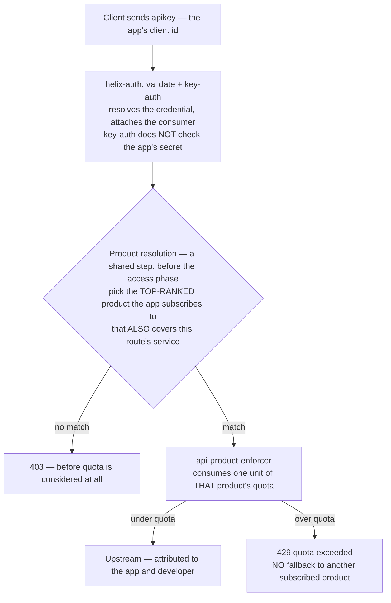

# Solution 01 — API Products: sell tiers you can actually enforce

**Bundle APIs into products with quotas. One partner's runaway retry loop
exhausts their own budget and nobody else's.**

| | |
|---|---|
| **Setup time** | ~20 minutes |
| **Difficulty** | 🟢 Beginner |
| **Needs** | A fresh org (its default **test** environment) · a developer with **two** apps · Redis if the gateway runs more than one node. Upstream is public jsonplaceholder — no backend of your own. |
| **Plugins** | `helix-auth` (validate / key-auth) · `api-product-enforcer` · `request-id` · `cors` |
| **Build it with** | 🤖 **[the Helix Agent](helix-agent-prompt.md)** — recommended · or import [`gateway/api-spec.yaml`](gateway/api-spec.yaml) + [`products.json`](gateway/products.json) |
| **Assets** | ✅ [Agent prompt](helix-agent-prompt.md) · ✅ [Architecture](architecture.md) · ✅ [Business need](business-need.md) · ✅ [Spec + products](gateway/) · ✅ [Tests](tests/) · ✅ [Validation](validation/) · ✅ [Manifest](solution.yaml) |

---

## The problem

> *"On Black Friday our checkout API was down for 22 minutes. It wasn't traffic — it
> was one integration partner whose retry loop had no backoff. They sent 40,000
> requests a minute at an endpoint sized for 3,000. Every other customer got 503s.
> We found out from Twitter.*
>
> *And the part that stings: we sell an 'Enterprise' tier that promises higher
> throughput. There is no technical difference between it and the free tier. It's a
> line in a contract."*

Three symptoms, one root cause:

1. **The noisy neighbour.** One badly behaved app consumes capacity provisioned for
   everyone. Blast radius: 100% of your consumers.
2. **The undifferentiated plan.** Sales sold "Enterprise" with a throughput promise.
   Engineering had no mechanism to make that promise real, so the tiers differ only
   in price.
3. **The invisible ceiling.** Nobody — not the customer, not support, not on-call —
   knows the actual per-caller limit, because the limit only exists as the point
   where the backend falls over.

**Root cause:** every caller shares one undifferentiated pool, and the gateway has
no idea *who* is calling or *what they bought*.

## Business need

Full version: [`business-need.md`](business-need.md).

| Dimension | Without product quota | With this solution |
|---|---|---|
| **Availability** | One app's bug is an outage for every consumer. Blast radius = 100%. | Blast radius = the offending app. |
| **Revenue protection** | Checkout traffic competes with batch and free-tier traffic for one pool. | Committed accounts get the throughput they pay for. |
| **Commercial** | "Enterprise tier" is a contract line with no enforcement, so there's no reason to upgrade. | The tier is a real, enforced difference. The quota becomes an upgrade trigger. |
| **Infra cost** | Provisioned for the worst-behaved caller's peak. | Provisioned for the sum of committed quotas. |
| **Attribution** | "Which partner caused this?" takes a log hunt. | Every request is attributed to an app and a developer. |

**The mechanism:** an unbounded worst case forces you to provision for a caller who
might do anything. A bounded one lets you provision for the sum of what you sold.

## The model — read this before configuring anything

This is where most people go wrong, because the mental model from other gateways
does not transfer.

| Concept | In Helix | Underneath |
|---|---|---|
| **Developer** | The organisation or person consuming your API | a Consumer |
| **App** | One integration belonging to a developer, with its own key/secret | a Credential |
| **Product** | A bundle of APIs plus a quota — the thing you sell | a product document |
| **Subscription** | An app subscribes to products, each with a **rank** | a `{productId: rank}` map |

**Quota is attached to the Product and counted per App.** Not per IP. Not per
developer. And never on `consumer_name` — that's the generic-gateway reflex, and it
meters the wrong thing here.

A developer with three apps gets **three independent buckets** by default. That's
usually what you want: their staging integration misbehaving shouldn't spend their
production budget. To pool a developer's apps into one bucket, set
`quota_key_scope: developer` on the product.

Two keys on the *same* app always share one bucket. This matters for testing — see
§ *Testing*.

## How a request flows



**One product is evaluated per request, and there is no fallback.** If the
top-ranked product's window is exhausted, the request 429s — it does not spill into
a second product the app also subscribes to. Rank is a routing decision, not a chain
of budgets.

### Tier design that works

| Product | `limit` | `interval_unit` | Who it's for |
|---|---|---|---|
| Free | 60 | minute | Evaluation — low enough that production use is impossible |
| Pro | 1000 | minute | Normal production, ~2× a healthy integration's p95 |
| Enterprise | 10000 | minute | Committed accounts, backed by a contractual number |
| Internal | −1 | — | First-party services: unmetered, still authenticated and attributed |

`limit: -1` means unlimited — the enforcer marks the request absorbed and skips the
counter entirely.

Two design notes worth more than the numbers:

- **Free must be unusable for production.** If it's generous enough to build on,
  nobody upgrades and you've given the product away.
- **Pick the window with intent.** A per-minute window **absorbs** bursts; a
  per-second window **shapes** them. Contracts written in requests/*day* are the
  worst of both: one app can spend the whole day's budget in 40 seconds and then go
  dark until midnight.

Then **add up the committed quotas across the tiers you've actually sold and compare
that with what your upstream can take.** Provisioning for the sum of committed
quotas is the cost saving here — but only if that sum is below your capacity. If it
isn't, you've oversold, and the quota surfaces that as 429s instead of an outage.
Better, but still worth knowing.

## Build it with the Helix Agent

Recommended path, and it works on a **fresh org**. The whole build is **one
prompt** — [`helix-agent-prompt.md`](helix-agent-prompt.md). Paste it as a single
message and replace the `<<...>>` values.

It goes all the way: the API and its routes, key-based identity, the two tier
products with their quotas, then a developer, two apps and the loop that makes the
429 appear. It **deploys**, because step 3 cannot hand you working keys otherwise.

**If the run dies mid-way, paste the three steps one at a time instead.** This
build asks for more in a single turn than most — two products and two apps — and
on 2026-09-30 the whole prompt in one message ended the stream four times running,
while each step pasted on its own completed cleanly. That is a limit on the turn,
not on the wording: the steps are identical either way.
[AGENT-GUIDE.md](../../AGENT-GUIDE.md) carries the standing rules it assumes.

> **Check that the quota is the limiter.** The classic wrong turn here is a
> generic rate-limit plugin — `limit-count`, often keyed on a consumer name —
> sitting alongside or instead of the product quota. It looks right, meters the
> wrong thing, and silently coexists with the quota you actually sell. Read the
> stored revision back: identity and the product enforcer, and **no second
> limiter**. Then confirm each product has a `quota` object, because a product
> without one is a 403 rather than "unlimited".
>
> **And check the enforcer is actually there.** It is usually present; in a handful
> of runs it simply was not. Nothing errors when it is missing: the quota exists,
> nothing reads it, and every call succeeds. Two plugin names is the whole check,
> and they may sit on the API or on each route — either is fine here.
>
> On the agent's normal model this prompt got it right unprompted — no
> `limit-count` anywhere, both products carrying a quota at `scope: app`. On a
> small free-tier model the same prompt added `limit-count` to both routes. Neither
> run is a guarantee for yours; the check is cheap, do it anyway.

### Why the prompt is worded the way it is

It names no plugin and no field. Ask for an outcome and the agent reads the real
schemas your org ships; ask for fields and it pattern-matches them from another
gateway's documentation. Three phrasings are doing real work:

- **"Sell this API in two tiers."** Tiers are what products *are* on this
  platform, so naming the commercial shape is what gets you products with quotas
  rather than a rate-limit plugin bolted onto a route. Rate limiting here **is**
  the product quota; there is no separate limiter to reach for.
- **"Per product."** This names the thing the limit hangs off, and it is the
  phrase that most reliably produces the product enforcer rather than a quota
  sitting on a product that nothing reads. It does not need to say "per app":
  quota counts against the credential by **default**, and the stored quotas come
  back `scope: app` whether or not the prompt asks for it. Say `per developer`
  instead only if you want a developer's apps pooled into one bucket.
- **"Two separate apps."** Two keys on the *same* app share a bucket, so a demo
  built that way shows both keys throttling together and looks like a broken
  quota when it is a correct one.

### What the agent decides for you

| | The prompt says | The agent chose |
|---|---|---|
| Key header | nothing | an `apikey` header |
| Error policy | nothing | `fail_close` on the enforcer, and nothing else in its block |
| Counting scope | nothing | `scope: app` on both product quotas — the platform default, and what the isolation demo needs |
| Placement | nothing | usually identity and the enforcer **API-wide**, which is what this solution ships — but sometimes on each route instead. Across five organisations it went API-wide in four and per-route in one. **Both are correct here**, because every route is metered either way |
| Extras | nothing | `request-id` and `cors`; on a weaker model, sometimes an `OPTIONS` route |

All of that is correct here. The window is the one worth a follow-up if your
contracts are written differently — see [tier design](#tier-design-that-works),
and the first entry under [Variations](#variations).

## Variations

Follow-ups for the same session, once the build above is standing. Same register
as the prompt — say what you want to be true, not which fields to set.

**Pool a developer's apps into one bucket**
```text
Count the quota per developer rather than per app, and tell me what that changes
about blast radius when one of their apps misbehaves.
```

**Point at my real upstream**
```text
Point this at <<https://my-backend.internal>> instead and keep the tiers as they
are. My backend's paths differ from the route paths, so rewrite them on the way
through.
```

**More tiers**
```text
Add an Enterprise tier at 10000 a minute, and an Internal tier that is unlimited
but still authenticated and attributed, so I can see its traffic.
```

**Require a token instead of a static key**
```text
Callers should exchange a client id and secret for a short-lived token instead of
sending a static key, and the tier limits should still apply behind it.
```
That's [solution 02](../02-oauth-jwt/) composed with this one.

## When the agent goes wrong

**Read the stored revision before you trust any of it.** Driven against a small
free-tier model, this prompt added `limit-count` to both routes — the wrong turn
the platform is most prone to, from a prompt that asked for nothing of the kind.
On the agent's normal model it did not. Which model is serving decides more here
than the prompt does.

| Symptom | Cause |
|---|---|
| Everything works, every call 200s, **and no 429 ever comes** | `api-product-enforcer` was never added. Identity resolves, the products exist with their quotas, the apps are subscribed — and nothing enforces any of it. This is the quietest failure in the solution: there is no error, the demo looks finished, and the quota you are selling is decorative. Check the API carries the enforcer before you believe any limit. |
| A `limit-count` on the routes, or anything keyed on a consumer name | The generic rate-limit reflex. Rate limiting here is the product quota, counted per app. Tell it to remove the limiter and enforce the tiers through the products instead. |
| Everything 403s | The app isn't subscribed to a product covering this API, the route has no `service_id`, or a bare key check replaced identity that resolves a subscription. Ask for `get_app` and check the products map is non-empty. |
| Everything 401s | You're sending the app's secret where its key (client id) belongs. |
| No 429 ever arrives | First check the enforcer is on the API at all (row 1). Then: the quota is higher than you think, or the quota backend is counting per node — see [the quota backend](#the-quota-backend-is-not-in-this-file). |
| Both apps 429 together | They aren't two separate apps, or they share a product. Two keys on one app share a bucket. |
| A product exists but every call 403s | It has no `quota` object. That is a 403, not "unlimited" — unlimited is `-1`. |
| Identity in the service spec, or on each route | Either is fine, and you will see both — this solution meters every route, so the two are equivalent. It only matters if you later add a route that must stay reachable without a key, such as a token endpoint ([solution 02](../02-oauth-jwt/)); then it has to be per-route. |

## Install it directly

```bash
export ORG=<ORG_ID>
export TOKEN=<control-plane bearer token>      # short-lived
export BASE=https://<YOUR_GATEWAY_HOST>/api
H=(-H "authorization: Bearer $TOKEN" -H 'content-type: application/json')

# 1. Import gateway/api-spec.yaml (OpenAPI import, or Agent Mode). It carries
#    helix-auth + api-product-enforcer. Bind the upstream
#    https://jsonplaceholder.typicode.com (swap in your own later). CONFIRM THE
#    ROUTE HAS A service_id — without one the enforcer 403s regardless of
#    subscription (import assigns one automatically).

# 2. Create the products, then deploy each one to the environment.
jq -c '.products[]' gateway/products.json | while read -r p; do
  curl -s "${H[@]}" -X POST "$BASE/orgs/$ORG/products" -d "$p" | jq -r '.id // .message'
done
curl -s "${H[@]}" -X POST "$BASE/orgs/$ORG/envs/<TEST_ENV_ID>/products/<PRODUCT_ID>/deploy"   # test env

# 3. Create a developer, then TWO apps, each subscribing to one product
#    (products is a {productId: rank} map). Keep both app keys.

# 4. If the gateway runs more than one node, set quota_policy to redis in
#    plugin_attr.api-product-enforcer in the gateway's config.yaml. This is NOT
#    in the route config and nothing here will remind you.

# 5. Prove it — including isolation
GATEWAY=https://<YOUR_GATEWAY_HOST> \
FREE_KEY=<free app client id> PRO_KEY=<pro app client id> FREE_LIMIT=5 \
./gateway/verify.sh          # defaults to /posts
```

> Revisions must be **INACTIVE** to accept a spec change. If it's live: undeploy
> first, or clone the revision so you keep a rollback target.

## Configuration

Source of truth: [`gateway/api-spec.yaml`](gateway/api-spec.yaml) and
[`gateway/products.json`](gateway/products.json). Two API-wide blocks carry the
solution:

```yaml
# identity — resolves the app AND its product subscriptions
helix-auth:
  mode: validate
  validate_auth_type: key-auth
  apikey:
    source: header
    key: apikey

# enforcement — meters against the resolved product's quota
api-product-enforcer:
  error_policy: fail_close
```

That's the entire enforcer configuration. **It accepts only `error_policy` and
`ctx_namespace`.** If you're reaching for a `policy: redis` or a `redis_host` here,
stop — see the next section.

`error_policy: fail_close` means a quota-backend outage returns 503. Switching to
`fail_open` is a deliberate commercial decision: you're choosing to serve unmetered
traffic during an incident rather than serve errors. Both are defensible. Pick one
knowingly.

## The quota backend is not in this file

**This is the single most common way the solution is deployed wrong, and nothing in
the route config hints at it.**

`api-product-enforcer` takes no backend configuration. The `local`-vs-`redis`
choice and the connection settings live in `plugin_attr.api-product-enforcer` in
the **gateway's `config.yaml`**.

The default is `local`, which counts in each node's own memory. So on a
three-node gateway, a product with a 1,000/min quota serves roughly **3,000/min** —
each node independently believes it's under the limit.

You will not notice this in a single-node test environment. You will notice it in
production, as a quota that seems not to work, and you'll spend the afternoon
inspecting the route config where the answer isn't.

**More than one node → `quota_policy` must be `redis`.**

## What the caller actually sees

Be honest with partners about this, because it's the part that surprises them:

```http
HTTP/1.1 429 Too Many Requests
content-type: application/json

{"error":"quota exceeded"}
```

**`api-product-enforcer` emits no `X-RateLimit-*` headers and no `Retry-After`.** A
client cannot read its remaining quota off a response. Two consequences to design
around:

- **Publish the retry contract in your docs**, since the response can't carry it.
  Tell integrators the window length and tell them to back off exponentially *with
  jitter*. Without jitter, every client retries at the same instant at the top of
  each window and you've built a thundering herd on a schedule.
- **Surface remaining quota in the portal and analytics**, not in headers. See
  [solution 04](../04-analytics/) for the queries.

If you genuinely need budget headers on the response today, that's a `limit-count`
with `show_limit_quota_header: true` — a *different* limiter with a different key.
Don't try to make the product enforcer do it.

## Testing

```bash
GATEWAY=https://<YOUR_GATEWAY_HOST> \
FREE_KEY=<free app client id> PRO_KEY=<pro app client id> FREE_LIMIT=5 \
./gateway/verify.sh          # defaults to /posts
```

Exit 0 means all five held:

| # | Case | Expected |
|---|---|---|
| 1 | No key | `401` |
| 2 | Unknown key | `401` |
| 3 | Valid Free key | `200` |
| 4 | Past the window | `429` `{"error":"quota exceeded"}` |
| 5 | **A second app on a different product, at that same moment** | still `200` |

**Case 5 is the whole point.** Cases 1–4 only prove a rate limit exists — any
limiter does that. Case 5 proves the limit is scoped to the *offending app* rather
than to your API, which is the entire business case. Don't skip it.

The two keys **must come from two separate apps.** Quota is counted per app, so two
keys on one app share a bucket and correct isolation will look broken.
`verify.sh` refuses to run if you pass the same key twice.

Full plan, including the boundary case at exactly the limit and the fail-close
behaviour:
[`tests/test-plan.yaml`](tests/test-plan.yaml).

## Gotchas

Each of these has cost somebody an afternoon.

- **The quota backend isn't on the route.** On more than one node, `quota_policy`
  must be `redis` in `plugin_attr.api-product-enforcer`. Default `local` counts per
  node, so an N-node cluster serves ~N× the quota you sold. See § above.
- **The route needs a `service_id`.** No service id → 403, before quota is even
  considered. Nothing in the plugin config suggests this.
- **A product with no `quota` object is a 403**, not "unlimited". Unlimited is
  `limit: -1`.
- **Use `helix-auth`, not raw `key-auth`.** `key-auth` authenticates but resolves no
  product subscription, so the enforcer 403s every request with nothing in context
  to enforce against. The symptom looks like a subscription problem and is actually a
  plugin choice.
- **Never key a rate limit on `consumer_name`.** Per-caller metering here is the
  product quota, counted on the credential. Rate limiting here is the product
  quota; there is no separate limiter in this design.
- **`fail_close` is the default**, so a quota-backend outage returns 503. If
  unmetered traffic beats errors for your business, set `fail_open` deliberately —
  and know you're choosing to over-serve during an incident.
- **Key-auth validate does not check the app's secret.** The value in the `apikey`
  header is the credential **key** (client id). For proof of possession, use the
  client-credentials flow — [solution 02](../02-oauth-jwt/).
- **Two keys on one app share one bucket.** A test using two keys from one app will
  look like the quota is broken.
- **Only the top-ranked covering product is evaluated.** If a 429 arrives sooner
  than you expect, check which product actually won — the app may be subscribed to
  something you forgot about at a higher rank.
- **Use `filter_func`, not `vars`,** for conditional route matching — `vars` is
  typed incompatibly between the control plane and the gateway and fails at deploy.
- **Confirm `api-product-enforcer` exists in your org** with `get_plugin_config`
  before designing around it.

## When to use it

Use it when:

- **You sell tiers** and want them to be a real technical difference rather than a
  price difference.
- **One caller can hurt everyone**, and you want the blast radius to be that caller.
- **You're provisioning for a worst case you can't bound.** Bound it, then provision
  for the sum of what you sold.
- **You want per-app attribution** for chargeback, incident response or upgrade
  conversations.
- **You're building toward a marketplace.** The product is the unit a partner
  subscribes to; without it there's nothing to list.

Don't use it when:

- **You need budget headers on the response.** The enforcer doesn't emit them. Use
  `limit-count` if the header is a hard requirement, and accept that it's a
  different key.
- **You need burst shaping at sub-second resolution.** Quota counts requests in a
  window. Shaping concurrency or smoothing arrival rate is a different control —
  `limit-conn` for concurrency, and see the tweak knobs in the agent prompt.
- **The limit should be per end user rather than per app.** Quota counts per
  credential (or per developer). It has no notion of your application's users.
- **There's no commercial model at all** and you just want a global ceiling. A plain
  `limit-count` is simpler and you don't need products.
- **You can't identify callers yet.** Start with [solution 02](../02-oauth-jwt/) —
  metering requires identity.

## Limitations

- **No budget headers.** No `X-RateLimit-*`, no `Retry-After`. The retry contract
  lives in your documentation; remaining quota comes from the portal, not the
  response.
- **One product per request, no fallback.** The top-ranked covering product is
  evaluated; when its window is spent the request 429s rather than spilling into
  another subscribed product.
- **Per-app counting by default.** Two keys on one app share a bucket. Use
  `quota_key_scope: developer` to pool a developer's apps.
- **Multi-node correctness depends on `quota_policy: redis`** in `plugin_attr`,
  which is invisible from this route config.
- **The quota is a request count, not a cost.** A cheap read and an expensive report
  consume one unit each. If cost varies wildly per endpoint, split into separate
  products per endpoint group.
- **`fail_close` trades availability for accuracy** during a quota-backend outage.
  Whichever you choose, you're choosing.
- **No per-end-user metering.** The unit is the app.

Full list: [`solution.yaml`](solution.yaml) § `limitations`.

## Validation status

**Validated against a gateway — imported, dry-run, deployed, and passed `verify.sh` including the isolation check.**

| Stage | Status | Provenance |
|---|---|---|
| Configuration generated | **YES** | [`gateway/api-spec.yaml`](gateway/api-spec.yaml), [`gateway/products.json`](gateway/products.json) |
| Local validation | **PASS** | [`validation/local-validation.yaml`](validation/local-validation.yaml) |
| Gateway dry-run | **PASS** | Non-destructive validation on a gateway. |
| Gateway deployed | **DEPLOYED** | Two products, two apps on different products, ACTIVE. |
| Functional tests | **PASS (5/5)** | `gateway/verify.sh` exit 0 — **including isolation** (case 5). |
| Agent path | **PASS, model-dependent** | Driven live 2026-09-30 on the agent's normal model, one step per turn: identity, both tier products with `scope: app` quotas, the enforcer at `fail_close`, no `limit-count`, then a developer and two separately-subscribed apps. A small free-tier model reached for `limit-count` instead. |

Overall: **READY.** Confirmed live: the quota is exact and isolation holds; the
429 body is `{"error":"quota exceeded"}` with **no** `Retry-After` and **no**
`X-RateLimit-*` headers; a product without a `quota` object is rejected at
creation; an app whose product doesn't cover the API gets 403. Two quirks worth
knowing: that 429 is JSON but carries `content-type: text/plain`, and the window
is a fixed calendar minute, so a boundary-straddling burst can briefly serve 2×.
The multi-node `quota_policy` pitfall cannot be exercised on one node — verify it
on your own cluster. Full record:
[`validation/gateway-validation.yaml`](validation/gateway-validation.yaml).

## Related solutions

- **[02 — OAuth 2.0 with JWT](../02-oauth-jwt/)** — metering requires identity.
  Start there if you can't yet name your callers, or swap the static key for a token
  flow.
- **[03 — SOAP to REST](../03-soap-to-rest/)** — put a quota on a mediated legacy
  system and it becomes a tiered product.
- **[04 — Analytics](../04-analytics/)** — which apps are approaching their quota,
  who hit 429 and how often. The upgrade-conversation queries.
