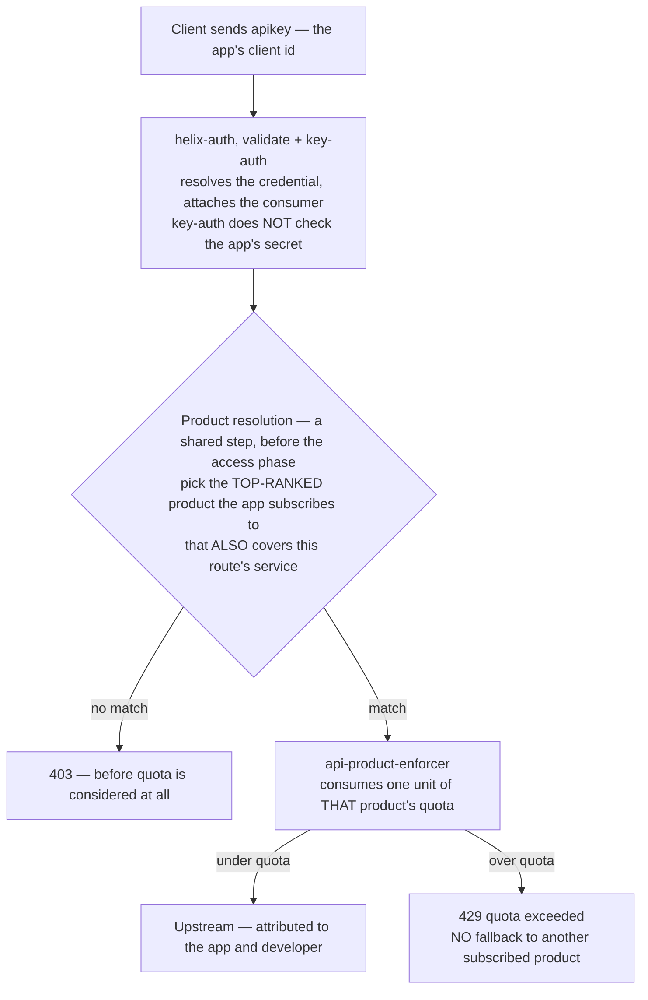

# Architecture — API Products with enforced quota

[Overview](README.md) · [Business need](business-need.md) · **Architecture** ·
[Guides](guides.md) · [Examples](examples.md) · [Agent prompt](helix-agent-prompt.md) ·
[Tests](tests.md) · [Configuration reference](configuration-reference.md) ·
[API reference](api-reference.md)

---

The gateway becomes the **policy enforcement point for a commercial model**.
It works out which app is calling, which product that app bought, and
whether that product's budget for the current window still has room. Your
backend doesn't change at all, and has no idea tiers exist.

The key idea: the quota is attached to **the thing you sell** — a product —
not a route, an IP address, or a service. Read this page before you
configure anything; the mental model here doesn't carry over from other
gateways.

For the full field-by-field plugin schemas behind everything below, see
[docs.digitalapi.ai — Traffic plugins](https://docs.digitalapi.ai/api-gateway/plugin-reference/plugins-traffic).

## The model

| Concept | In Helix | Underneath |
|---|---|---|
| **Developer** | The organisation or person consuming your API | a Consumer |
| **App** | One integration belonging to a developer, with its own key/secret | a Credential |
| **Product** | A bundle of APIs plus a quota — the thing you sell | a product document |
| **Subscription** | An app subscribes to products, each with a **rank** | a `{productId: rank}` map |

**The quota is attached to the Product and counted per App.** Not per IP
address, not per developer, and never on `consumer_name` — that's the reflex
from other gateways, and here it meters the wrong thing.

A developer with three apps gets **three independent buckets** by default —
usually what you want, since their staging integration misbehaving shouldn't
spend their production budget. To pool a developer's apps into one bucket
instead, set `quota_key_scope: developer` on the product. Two keys on the
*same* app always share one bucket — see [Tests](tests.md).

## How a request flows

**One product is checked per request, and there's no fallback.** If the
top-ranked product's window is used up, the request gets a 429 — it doesn't
spill over into a second product the app also subscribes to. Rank decides
which product gets checked; it isn't a chain of budgets to work through.

## Reading a rejection

Four different codes, worth telling apart — they look similar in a dashboard
but mean very different things:

| Status | Meaning | Where to look |
|---|---|---|
| **401** | The gateway doesn't know who you are | The `apikey` header — is it the credential's *key*, not its secret? |
| **403** | It knows who you are, but no product covers this route — or the route has no `service_id` | The app's subscription map; the route's service id |
| **429** | It knows who you are, found your product, and your window is spent | Nothing is wrong — this is the system working as designed |
| **503** | The quota backend is unreachable and `error_policy` is `fail_close` | `plugin_attr.api-product-enforcer` |
| **200, uncounted** | The resolved product has `limit: -1` | Still authenticated and attributed, just never throttled |

## Execution order

Plugins run in **priority order**, not the order they're written in the
document:

| Order | Step | Produces | Needs |
|---|---|---|---|
| 1 | `helix-auth` (validate, key-auth) | the resolved credential and its product subscriptions | the `apikey` header |
| 2 | product resolution *(a shared platform step)* | the single product this request will be metered against | step 1's subscriptions + the route's `service_id` |
| 3 | `api-product-enforcer` | a used-up quota unit, or a 429 | step 2's resolved product |
| — | `request-id` | `X-Request-Id` | — |
| — | analytics *(platform-wide)* | per-request telemetry, attributed to the app | step 1's identity |

**Step 3 only works if step 1 produced a subscription.** This is the whole
reason `helix-auth` matters instead of plain `key-auth`: `key-auth` finishes
step 1's authentication, but not the subscription lookup — so step 2 finds
nothing, and step 3 returns 403 on every request. The config looks right; the
enforcer just has nothing to check against. It's also why analytics can
report quota usage *per app* instead of per IP address — see
[solution 04](../04-analytics/).

## Tier design that works

| Product | `limit` | `interval_unit` | Who it's for |
|---|---|---|---|
| Free | 60 | minute | Evaluation — low enough that production use is impossible |
| Pro | 1000 | minute | Normal production, ~2× a healthy integration's p95 |
| Enterprise | 10000 | minute | Committed accounts, backed by a contractual number |
| Internal | −1 | — | First-party services: unmetered, still authenticated and attributed |

Two rules generalise, and matter more than the numbers:

- **Free must be unusable for production.** Generous enough to build on, and
  nobody upgrades.
- **Pick the window with intent.** A per-minute window *absorbs* bursts; a
  per-second window *shapes* them. Requests-per-*day* is the worst of both —
  one app can spend the whole day's budget in 40 seconds, then go dark until
  midnight.

## Where the quota is actually counted

`api-product-enforcer` accepts exactly two fields: `error_policy` and
`ctx_namespace` — it does **not** accept a backend setting. The
`local`-vs-`redis` choice lives in the gateway's own `config.yaml`, not the
route, and the default (`local`) counts separately per node. Full detail,
including why this is the most common way this solution gets deployed wrong:
[Configuration reference](configuration-reference.md).

## Native vs. custom code

Everything here is native configuration. **No custom code is needed, and
writing any would actively make things worse.**

| Requirement | How it's met | Why not write custom code |
|---|---|---|
| Identify the caller | `helix-auth` validate/key-auth | Credential storage lives in the control plane already. |
| Work out which product applies | the platform's shared product-resolution step | Rank order, service coverage, and subscription state are platform state, not something a request carries. |
| Count and enforce | `api-product-enforcer` | Distributed counting with correct window behaviour is genuinely hard — a custom counter is where off-by-one-window bugs and race conditions live. |
| Attribute a disputed 429 | `request-id` + platform analytics | — |

The temptation to write custom code here usually takes one of two forms, and
both are mistakes: **a custom limiter keyed on something clever** (now two
systems count, and disagree under load), or **custom logic that falls back
to a second product when the first is spent** (which breaks the commercial
model — a tier whose limit can be worked around isn't really a limit).

## When to use this

Use it when you sell tiers and want them to be a real difference, one caller
can hurt everyone, you're provisioning for a worst case you can't predict, or
you need per-app attribution for chargeback, incidents, or upgrade
conversations.

Don't use it when you need budget headers on the response (the enforcer
sends none — see [Configuration reference](configuration-reference.md)),
sub-second burst shaping (`limit-conn` handles concurrency, this doesn't),
per-end-user limits (the unit here is the app, not your users), or when you
can't identify callers yet — start with [solution 02](../02-oauth-jwt/).

## Prerequisites

- The API exists, is deployed, and **the route has a `service_id`.** Without
  one, the enforcer returns 403 no matter what the app is subscribed to.
- `helix-auth` and `api-product-enforcer` exist in your org — confirm with
  `get_plugin_config`.
- Products are created **and deployed to the environment.** Creating them
  isn't enough.
- A developer with **two apps**, each subscribed to a different product, so
  you can prove isolation instead of just proving a limit exists.
- If the gateway runs more than one node: `quota_policy: redis`.

## The two rows worth extra attention

**A product with no `quota` object is a 403, not "unlimited."** People assume
no limit means no limit; it actually means no configuration, and under
`fail_close` that's a rejection. Unlimited is written as `limit: -1`.

**`fail_open`/`fail_close` is a business decision wearing a config field.**
`fail_close` protects the accuracy of your metering, at the cost of
availability during a backend incident. `fail_open` protects availability, at
the cost of serving traffic you can't account for. Whichever you pick, pick
it on purpose.
