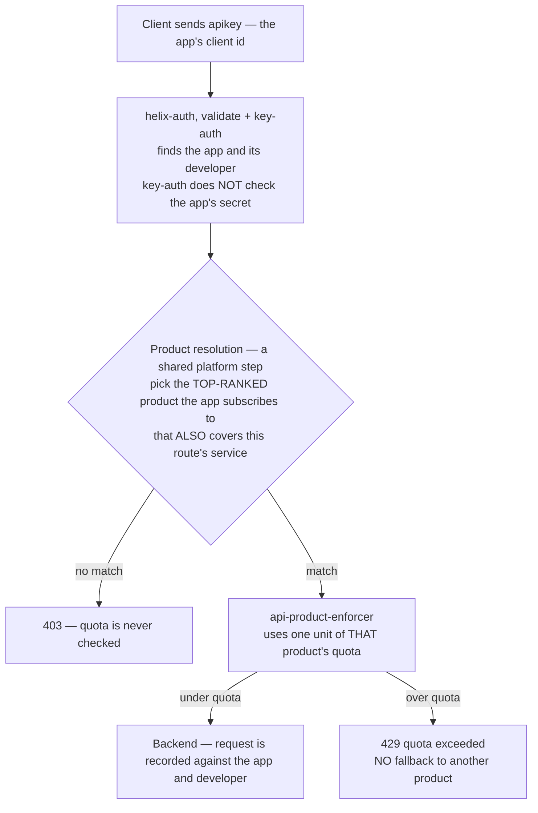

# Architecture — API Products with enforced quota

> [Overview](README.md) · [Business need](business-need.md) · **Architecture** · [Guides](guides.md) · [Agent prompt](helix-agent-prompt.md) · [Tests](tests.md) · [API reference](api-reference.md)

---

## What the gateway does here

The gateway becomes the place where your pricing plan is enforced. For every
request it answers three questions:

1. Which app is calling?
2. Which product did that app buy?
3. Does that product still have budget left in the current time window?

Your backend does not change at all. It never learns that plans exist.

The key idea is simple: **the quota belongs to the product you sell**. It is
not attached to a URL, an IP address, or a backend service. If you have used
other gateways, please read this page before you configure anything. The way
this platform thinks about quotas is different.

For the full list of fields on every plugin mentioned here, see
[docs.digitalapi.ai — Traffic plugins](https://docs.digitalapi.ai/api-gateway/plugin-reference/plugins-traffic).

## The model

Four words come up on every page of this solution. Here is what each one means.

| Word | What it means in Helix | Name used inside the platform |
|---|---|---|
| **Developer** | The company or person using your API | a Consumer |
| **App** | One integration owned by a developer. It has its own key and secret. | a Credential |
| **Product** | A set of APIs plus a quota. This is what you sell. | a product document |
| **Subscription** | An app signs up to one or more products. Each has a **rank** (an order of preference). | a `{productId: rank}` map |

**The quota is attached to the Product and counted per App.** It is not
counted per IP address and not per developer. On other gateways it is common
to count on the consumer name. Here that would count the wrong thing.

A developer with three apps gets **three separate budgets**. This is usually
what you want. If their test app misbehaves, it should not use up their
production app's budget. If you would rather pool all of a developer's apps
into one budget, set `quota_key_scope: developer` on the product. Two keys on
the *same* app always share one budget. See [Tests](tests.md).

## How a request flows

**Only one product is checked per request, and there is no fallback.** If
the top-ranked product's budget is used up, the request gets a 429. It does
not move on to a second product the app also subscribes to. Rank decides
*which* product is checked. It is not a list of budgets to work through.

## Reading a rejection

The gateway can reject a request with several different codes. They look
similar on a dashboard but mean very different things.

| Status | What it means | Where to look |
|---|---|---|
| **401** | The gateway does not know who is calling | The `apikey` header. Is it the app's *key*, not its secret? |
| **403** | It knows who is calling, but no product covers this route. Or the route has no `service_id`. | The app's subscriptions, and the route's service id |
| **429** | It knows who is calling, found the product, and the budget is used up | Nothing is wrong. This is the system working as designed. |
| **503** | The quota store cannot be reached and `error_policy` is `fail_close` | `plugin_attr.api-product-enforcer` |
| **200, not counted** | The product has `limit: -1` (unlimited) | The app is still identified and recorded, just never limited |

## Execution order

Plugins run in **priority order**, not in the order they appear in the file.
For this solution the order is:

| Order | Step | What it produces | What it needs |
|---|---|---|---|
| 1 | `helix-auth` (validate, key-auth) | the app and its product subscriptions | the `apikey` header |
| 2 | product resolution *(a shared platform step)* | the one product this request counts against | step 1's subscriptions and the route's `service_id` |
| 3 | `api-product-enforcer` | one unit of quota used, or a 429 | step 2's product |
| — | `request-id` | an `X-Request-Id` header | — |
| — | analytics *(platform-wide)* | a record of the request, tied to the app | step 1's identity |

**Step 3 only works if step 1 found a subscription.** This is why the
solution uses `helix-auth` and not a plain `key-auth` plugin. Plain
`key-auth` can identify the app, but it does not look up the app's
subscriptions. So step 2 finds nothing, and step 3 returns 403 on every
request. The configuration looks correct, but the enforcer has nothing to
check against. The same identity step is what lets analytics report usage
*per app* rather than per IP address. See [solution 04](../04-analytics/).

## Tier design that works

Example numbers for a first set of plans:

| Product | `limit` | `interval_unit` | Who it is for |
|---|---|---|---|
| Free | 60 | minute | Trying the API out. Too low to run production on. |
| Pro | 1000 | minute | Normal production use. Roughly twice what a healthy integration needs at its busiest. |
| Enterprise | 10000 | minute | Large accounts, matching a number written in the contract |
| Internal | −1 | — | Your own services. Unlimited, but still identified and recorded. |

Two rules matter more than the exact numbers:

- **Free must not be enough for production.** If it is, nobody upgrades.
- **Choose the time window on purpose.** A per-minute window lets short bursts
  through. A per-second window smooths them out. A per-day window is the worst
  choice: one app can use the whole day's budget in under a minute and then be
  blocked until midnight.

## Where the quota is actually counted

`api-product-enforcer` accepts exactly two fields: `error_policy` and
`ctx_namespace`. It does **not** have a field for where the count is stored.
That choice, `local` or `redis`, lives in the gateway's own `config.yaml`, not
on the route. The default, `local`, keeps a separate count on each gateway
node. So on three nodes, every app gets roughly three times the quota you
sold. This is the most common way this solution is set up wrong. Full detail:
[Guides → Troubleshooting](guides.md#troubleshooting).

## No custom code needed

Everything in this solution is standard configuration. **No custom code is
needed, and writing any would make things worse.**

| What you need | How it is done | Why not write code for it |
|---|---|---|
| Identify the caller | `helix-auth` validate/key-auth | The control plane already stores every app's credentials. |
| Work out which product applies | the platform's shared product-resolution step | Rank, coverage, and subscription state live in the platform, not in the request. |
| Count and enforce | `api-product-enforcer` | Counting correctly across many nodes and time windows is hard to get right. Custom counters are where subtle bugs live. |
| Trace a disputed 429 | `request-id` plus platform analytics | — |

Custom code here usually takes one of two forms, and both cause problems. A
**custom limiter keyed on something clever** means two systems are counting,
and they will disagree under load. **Logic that falls back to a second
product when the first is used up** breaks the pricing model, because a limit
you can work around is not a limit.

## When to use this

Use this solution when:

- you sell plans and want the difference between them to be real,
- one caller can hurt everyone else,
- you are sizing your servers for a worst case you cannot predict, or
- you need to know which app made each request, for billing, incidents, or
  upgrade conversations.

Do not use it when:

- you need remaining-budget headers on the response. The enforcer sends none.
  See the [Configuration reference](guides.md#configuration-reference).
- you need to smooth out bursts faster than one second. `limit-conn` limits
  concurrent connections; this does not.
- you need limits per end user. The unit here is the app, not the people
  using it.
- you cannot identify callers yet. Start with [solution 02](../02-oauth-jwt/).

## Prerequisites

- The API exists, is deployed, and **the route has a `service_id`.** Without
  one, the enforcer returns 403 no matter what the app subscribes to.
- `helix-auth` and `api-product-enforcer` are available in your org. Confirm
  with `get_plugin_config`.
- Products are created **and deployed to the environment.** Creating them is
  not enough.
- A developer with **two apps**, each subscribed to a different product. This
  lets you prove that one app's limit does not affect the other, rather than
  only proving that a limit exists.
- If the gateway runs on more than one node: `quota_policy: redis`.

## Two settings worth extra attention

**A product with no `quota` section returns 403. It does not mean unlimited.**
It is easy to assume that no limit means no limit. Here it means no
configuration, and under `fail_close` that is a rejection. To make a product
unlimited, write `limit: -1`.

**`fail_open` or `fail_close` is a business decision, not just a setting.**
It controls what happens if the quota store goes down. `fail_close` rejects
requests, so your usage counts stay accurate but callers see errors.
`fail_open` lets requests through, so callers are fine but you cannot account
for that traffic. Either choice can be right. Make it on purpose.
