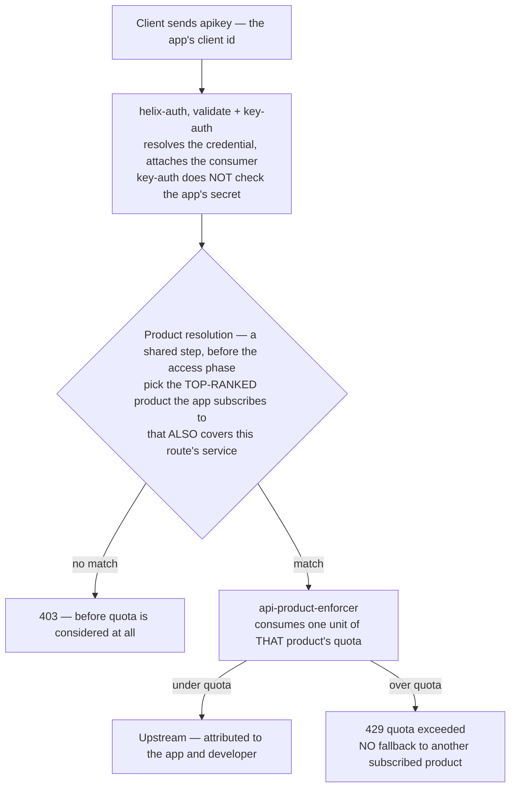

# Solution 01 — API Products: sell tiers you can actually enforce

**Overview** · [Business need](business-need.md) · [How it works](how-it-works.md) · [Install](install.md) · [Configuration](configuration.md) · [Test & verify](testing.md) · [Changelog](changelog.md)

---

**Bundle APIs into products with quotas. One partner's runaway retry loop
exhausts their own budget and nobody else's.**

<!-- facts:begin -->

| | |
|---|---|
| **Setup time** | ~20 minutes |
| **Difficulty** | Beginner |
| **Needs** | A fresh org (its default test environment) · a developer with two apps · Redis if the gateway runs more than one node. Upstream is public jsonplaceholder — no backend of your own |
| **Plugins** | `api-product-enforcer` · `cors` · `helix-auth` · `request-id` |
| **Build it with** | **[the Agent](install.md)** — recommended · or import [`gateway/api-spec.yaml`](gateway/api-spec.yaml) |

<!-- facts:end -->

## The problem

> *"On Black Friday our checkout API was down for 22 minutes. It wasn't traffic — it
> was one integration partner whose retry loop had no backoff. They sent 40,000
> requests a minute at an endpoint sized for 3,000. Every other customer got 503s.
> We found out from Twitter.*
>
> *And the part that stings: we sell an 'Enterprise' tier that promises higher
> throughput. There is no technical difference between it and the free tier. It's a
> line in a contract."*

Three symptoms, one root cause:

1. **The noisy neighbour.** One badly behaved app consumes capacity provisioned for
   everyone. Blast radius: 100% of your consumers.
2. **The undifferentiated plan.** Sales sold "Enterprise" with a throughput promise.
   Engineering had no mechanism to make that promise real, so the tiers differ only
   in price.
3. **The invisible ceiling.** Nobody — not the customer, not support, not on-call —
   knows the actual per-caller limit, because the limit only exists as the point
   where the backend falls over.

**Root cause:** every caller shares one undifferentiated pool, and the gateway has
no idea *who* is calling or *what they bought*.

## Business need

Full version: [`business-need.md`](business-need.md).

| Dimension | Without product quota | With this solution |
|---|---|---|
| **Availability** | One app's bug is an outage for every consumer. Blast radius = 100%. | Blast radius = the offending app. |
| **Revenue protection** | Checkout traffic competes with batch and free-tier traffic for one pool. | Committed accounts get the throughput they pay for. |
| **Commercial** | "Enterprise tier" is a contract line with no enforcement, so there's no reason to upgrade. | The tier is a real, enforced difference. The quota becomes an upgrade trigger. |
| **Infra cost** | Provisioned for the worst-behaved caller's peak. | Provisioned for the sum of committed quotas. |
| **Attribution** | "Which partner caused this?" takes a log hunt. | Every request is attributed to an app and a developer. |

**The mechanism:** an unbounded worst case forces you to provision for a caller who
might do anything. A bounded one lets you provision for the sum of what you sold.

## How a request flows

The full walkthrough is on **[How it works](how-it-works.md)**.

## Gotchas

- **The per-IP `limit-count` needs `real-ip` in front of it.** If the gateway sits
  behind a load balancer or proxy and `real-ip` isn't configured, every caller
  presents the balancer's address. The per-IP ceiling then collapses into a single
  global cap on that endpoint — a self-inflicted outage waiting for a traffic
  spike. Nothing in the spec can detect your topology; you have to know it.

Each of these has cost somebody an afternoon.

- **The quota backend isn't on the route.** On more than one node, `quota_policy`
  must be `redis` in `plugin_attr.api-product-enforcer`. Default `local` counts per
  node, so an N-node cluster serves ~N× the quota you sold. See § above.
- **The route needs a `service_id`.** No service id → 403, before quota is even
  considered. Nothing in the plugin config suggests this.
- **A product with no `quota` object is a 403**, not "unlimited". Unlimited is
  `limit: -1`.
- **Use `helix-auth`, not raw `key-auth`.** `key-auth` authenticates but resolves no
  product subscription, so the enforcer 403s every request with nothing in context
  to enforce against. The symptom looks like a subscription problem and is actually a
  plugin choice.
- **Never key a rate limit on `consumer_name`.** Per-caller metering here is the
  product quota, counted on the credential. Rate limiting here is the product
  quota; there is no separate limiter in this design.
- **`fail_close` is the default**, so a quota-backend outage returns 503. If
  unmetered traffic beats errors for your business, set `fail_open` deliberately —
  and know you're choosing to over-serve during an incident.
- **Key-auth validate does not check the app's secret.** The value in the `apikey`
  header is the credential **key** (client id). For proof of possession, use the
  client-credentials flow — [solution 02](../02-oauth-jwt/).
- **Two keys on one app share one bucket.** A test using two keys from one app will
  look like the quota is broken.
- **Only the top-ranked covering product is evaluated.** If a 429 arrives sooner
  than you expect, check which product actually won — the app may be subscribed to
  something you forgot about at a higher rank.
- **Use `filter_func`, not `vars`,** for conditional route matching — `vars` is
  typed incompatibly between the control plane and the gateway and fails at deploy.
- **Confirm `api-product-enforcer` exists in your org** with `get_plugin_config`
  before designing around it.

## When to use it

Use it when:

- **You sell tiers** and want them to be a real technical difference rather than a
  price difference.
- **One caller can hurt everyone**, and you want the blast radius to be that caller.
- **You're provisioning for a worst case you can't bound.** Bound it, then provision
  for the sum of what you sold.
- **You want per-app attribution** for chargeback, incident response or upgrade
  conversations.
- **You're building toward a marketplace.** The product is the unit a partner
  subscribes to; without it there's nothing to list.

Don't use it when:

- **You need budget headers on the response.** The enforcer doesn't emit them. Use
  `limit-count` if the header is a hard requirement, and accept that it's a
  different key.
- **You need burst shaping at sub-second resolution.** Quota counts requests in a
  window. Shaping concurrency or smoothing arrival rate is a different control —
  `limit-conn` for concurrency, and see the tweak knobs in the agent prompt.
- **The limit should be per end user rather than per app.** Quota counts per
  credential (or per developer). It has no notion of your application's users.
- **There's no commercial model at all** and you just want a global ceiling. A plain
  `limit-count` is simpler and you don't need products.
- **You can't identify callers yet.** Start with [solution 02](../02-oauth-jwt/) —
  metering requires identity.

## Limitations

- **No budget headers.** No `X-RateLimit-*`, no `Retry-After`. The retry contract
  lives in your documentation; remaining quota comes from the portal, not the
  response.
- **One product per request, no fallback.** The top-ranked covering product is
  evaluated; when its window is spent the request 429s rather than spilling into
  another subscribed product.
- **Per-app counting by default.** Two keys on one app share a bucket. Use
  `quota_key_scope: developer` to pool a developer's apps.
- **Multi-node correctness depends on `quota_policy: redis`** in `plugin_attr`,
  which is invisible from this route config.
- **The quota is a request count, not a cost.** A cheap read and an expensive report
  consume one unit each. If cost varies wildly per endpoint, split into separate
  products per endpoint group.
- **`fail_close` trades availability for accuracy** during a quota-backend outage.
  Whichever you choose, you're choosing.
- **No per-end-user metering.** The unit is the app.

Full list: [`solution.yaml`](solution.yaml) § `limitations`.

## Validation status

**Validated against a gateway — imported, dry-run, deployed, and passed `verify.sh` including the isolation check.**

| Stage | Status | Provenance |
|---|---|---|
| Configuration generated | **YES** | [`gateway/api-spec.yaml`](gateway/api-spec.yaml), [`gateway/products.json`](gateway/products.json) |
| Local validation | **PASS** | [`validation/local-validation.yaml`](validation/local-validation.yaml) |
| Gateway dry-run | **PASS** | Non-destructive validation on a gateway. |
| Gateway deployed | **DEPLOYED** | Two products, two apps on different products, ACTIVE. |
| Functional tests | **PASS (5/5)** | `gateway/verify.sh` exit 0 — **including isolation** (case 5). |

Overall: **READY.** Confirmed live: quota is exact (a Free app at 5/min served
exactly five 200s then 429 in a clean window); isolation holds (a second app on a
different product kept getting 200s while the first was throttled); the 429 body is
`{"error":"quota exceeded"}` with **no** `Retry-After` and **no** `X-RateLimit-*`
headers; a product without a `quota` object is rejected at creation; and an app
whose product doesn't cover the API gets 403. Two observations worth knowing: the
429 is JSON but carries `content-type: text/plain`, and the quota window is a fixed
calendar minute (a boundary-straddling burst can briefly serve 2×). The multi-node
`quota_policy` pitfall could not be exercised on a single-node test — verify it on
your own cluster. Full record:
[`validation/gateway-validation.yaml`](validation/gateway-validation.yaml).

## Related solutions

- **[02 — OAuth 2.0 with JWT](../02-oauth-jwt/)** — metering requires identity.
  Start there if you can't yet name your callers, or swap the static key for a token
  flow.
- **[03 — SOAP to REST](../03-soap-to-rest/)** — put a quota on a mediated legacy
  system and it becomes a tiered product.
- **[04 — Analytics](../04-analytics/)** — which apps are approaching their quota,
  who hit 429 and how often. The upgrade-conversation queries.
