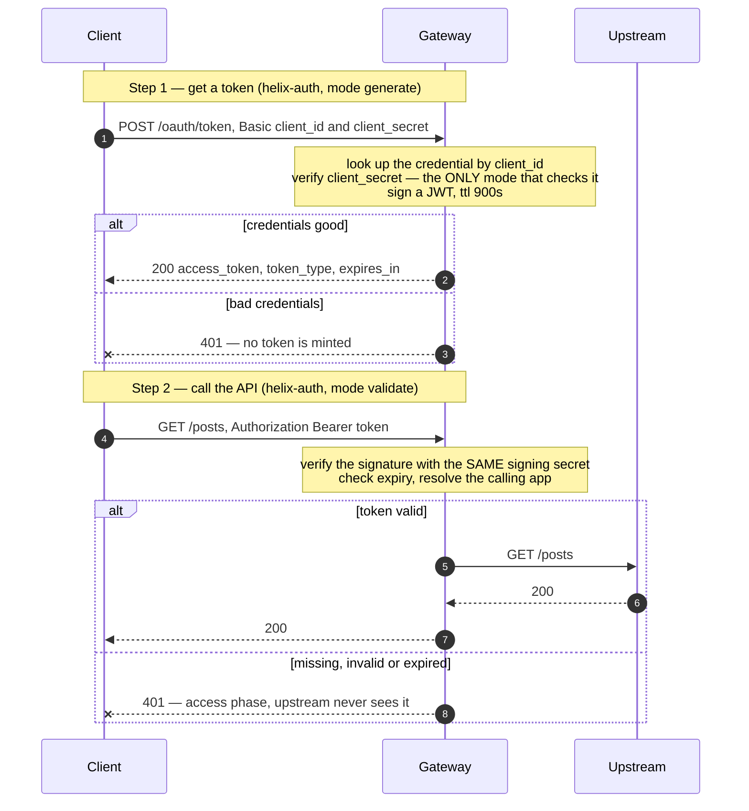

# Solution 02 — OAuth 2.0 with JWT, without touching the backend

**Overview** · [Business need](business-need.md) · [How it works](how-it-works.md) · [Install](install.md) · [Configuration](configuration.md) · [Test & verify](testing.md) · [Changelog](changelog.md)

---

**The gateway issues the token and verifies it. Your service never learns that
authentication happened.**

<!-- facts:begin -->

| | |
|---|---|
| **Setup time** | ~15 minutes |
| **Difficulty** | Beginner |
| **Needs** | A fresh org (its default test environment) · a real signing-secret value to paste into the spec (used literally — see below) · one developer + app to test with. The upstream is public jsonplaceholder, so no backend of your own |
| **Plugins** | `helix-auth` · `request-id` · `cors` |
| **Build it with** | **[the Agent](install.md)** — recommended · or import [`gateway/api-spec.yaml`](gateway/api-spec.yaml) |

<!-- facts:end -->

## The problem

> *"Our partner API has been public since 2019. Everybody knows it needs auth.
> The problem isn't agreement — it's that the service is a shared monolith on a
> quarterly release train, the team that owns it has a roadmap through Q3, and
> 'add OAuth' means a six-week release plus a coordinated migration for eleven
> partners. So it stays public, and we put it on the risk register instead."*

Three things are true at once, which is why this sits still for years:

1. **The API needs authentication.** Anyone with the URL is a caller.
2. **The backend cannot ship it soon.** Auth is cross-cutting, so it touches
   every handler, and the release train is full.
3. **Static API keys aren't enough.** They're long-lived, get emailed, get
   committed, and a leaked one is a leak until somebody notices. Partners with a
   security review will ask for OAuth by name.

**Root cause:** authentication is being treated as application logic when it's
edge logic. Nothing about verifying a caller's identity requires knowledge of
your domain model, so nothing about it needs to live in your domain code.

## Business need

The full argument, with outcomes and success criteria: **[Business need](business-need.md)**.

| Dimension | Public / static-key API | With gateway-issued JWTs |
|---|---|---|
| **Time to ship auth** | A backend release cycle, plus coordinated partner migration | A configuration change and a revision deploy |
| **Credential exposure window** | A static key is valid until someone revokes it — often years | A token is valid for minutes; the long-lived secret never travels on API calls |
| **Backend blast radius** | Every handler touched; auth bugs become application bugs | Zero backend change; a bad token never reaches your code |
| **Partner security review** | "We use an API key in a header" | Standards-based OAuth 2.0 client credentials |
| **Revocation** | Find every place the key was configured | Disable the app; the next token request fails and existing tokens expire on their own |

The mechanism that matters commercially: **the credential that can be replayed
forever stops travelling on every request.** The long-lived secret is used once
per token lifetime against one endpoint; everything else carries something that
expires on its own.

## How a request flows

The important structural detail: validation happens in the **access phase**, so a
rejected request costs you nothing downstream. Your backend doesn't see it, your
database doesn't see it, and it doesn't consume a connection from your pool.

## Gotchas

Each of these has cost somebody an afternoon.

- **The signing secret must be identical on the issue route and every validate
  route.** A mismatch means every freshly issued token is rejected with an
  opaque 401 — the config looks correct on both sides, and the failure gives you
  no hint that it's about a *shared* value.
- **There is no environment lookup — the secret is a literal.** This build uses
  whatever string sits in `signing_secret`, verbatim. Ship
  `<YOUR_JWT_SIGNING_SECRET>` unreplaced and that placeholder *is* your HMAC key,
  published in this repo for anyone to forge tokens with. Replace it before you
  deploy, and keep the filled-in spec out of git.
- **Never apply `validate` API-wide over the token endpoint.** See §
  *Configuration*. Every request 401s, including the one that issues tokens.
- **`authorization` must be in `cors.allow_headers`.** Otherwise browser clients
  fail at preflight and you get a CORS error, not a 401 — which sends people
  debugging the wrong layer for an hour.
- **`generate` is the only mode that checks the app's secret.** `key-auth`
  validate resolves on the credential *key* alone. If you need proof of
  possession, you need this flow, not a static key.
- **The `client_id` is the credential key, not the secret.** Sending the secret
  where the id belongs is the most common cause of "401 on the token endpoint
  with credentials I'm certain are right".
- **Confirm `helix-auth`'s schema in your own org** with `get_plugin_config`
  before deploying. Builds differ, and field names are not worth guessing.
- **`request-id` on the token route is deliberate.** Auth failures are exactly
  the thing you'll be asked to investigate, and the token exchange is half the
  flow.

## When to use it

Use it when:

- Your API needs authentication and the backend can't ship it on your timeline.
- Partners are asking for OAuth 2.0 by name, or a security review is.
- You're handing out static keys today and want to shrink the exposure window
  without asking every integrator to re-plumb their client.
- You want authentication and *attribution* in one step — see
  [solution 04](../04-analytics/), which depends on identity being resolved here.

Don't use it when:

- **An identity provider already issues tokens to these callers.** Use
  `jwt-auth` against that issuer instead. See § *Who issues the token*.
- **You need end-user identity, not app identity.** Client credentials
  authenticates the *application*. Delegated user access is the authorization
  code flow, and this is not it.
- **You need fine-grained scopes and per-scope route policy.** This solution
  proves who is calling. Deciding what they may do is authorization — a separate
  layer.
- **The caller genuinely cannot store a secret** — a public single-page app or a
  mobile client. Client credentials assumes a confidential client.

## Limitations

- **Client credentials authenticates apps, not users.** No end-user identity is
  established, and no consent is involved.
- **No scopes in this configuration.** The token proves identity; it doesn't
  carry per-route permissions. Add authorization on top.
- **No token revocation list.** A token is valid until it expires; disabling an
  app stops *new* tokens. This is why the TTL is the security control — it's the
  only bound on a leaked token's usefulness.
- **No refresh tokens.** Client credentials doesn't use them: the client already
  holds the long-lived secret, so it re-exchanges instead.
- **Symmetric signing.** One shared secret signs and verifies. If a third party
  needs to verify your tokens independently, that requires asymmetric keys.
- **Every 401 looks alike.** Correct, and awkward. See § *What the caller
  actually sees*.

Full list: [`solution.yaml`](solution.yaml) § `limitations`.

## Validation status

**Validated against a gateway — imported, dry-run, deployed, and passed `verify.sh`.**

| Stage | Status | Provenance |
|---|---|---|
| Configuration generated | **YES** | [`gateway/api-spec.yaml`](gateway/api-spec.yaml) |
| Local validation | **PASS** | Structural review — [`validation/local-validation.yaml`](validation/local-validation.yaml) |
| Gateway dry-run | **PASS** | Non-destructive; a missing upstream binding is reported here, before any deploy. |
| Gateway deployed | **DEPLOYED** | Revision ACTIVE in a test environment; `service_id` auto-assigned on import. |
| Functional tests | **PASS (6/6)** | `gateway/verify.sh` exit 0 — including the wrong-secret and forged-token cases. |

Overall: **READY.** The token flow works exactly as documented — three-segment
HS256 JWT, `expires_in` matching `token_ttl`, the client secret genuinely checked,
forged and prefix-less tokens rejected. Full record, including the two repo
corrections this run produced (the `<ENV:...>` finding and the `jwt-auth`
plugin-naming fix), is in
[`validation/gateway-validation.yaml`](validation/gateway-validation.yaml).

**One thing you must do:** replace `<YOUR_JWT_SIGNING_SECRET>` with a real secret.
It is used *literally* as the HMAC key on this build — `<ENV:...>` syntax is not
resolved — so shipping the placeholder makes your signing key a public constant.

## Related resources

- **[03 — SOAP to REST](../03-soap-to-rest/)** — puts this exact auth layer in
  front of a mediated SOAP backend. The two compose directly.
- **[01 — API Products](../01-api-products/)** — once you know *who* is calling,
  meter them. Add `api-product-enforcer` behind this `helix-auth` block.
- **[04 — Analytics](../04-analytics/)** — analytics attributes calls to an app
  only because this solution resolved identity first.

**Reference** — [Platform model](../../guides/platform-model.md) · [Vocabulary](../../guides/vocabulary.md) · [Placeholders](../../guides/placeholders.md) · [Validation status](../../guides/validation-status.md) · [Prerequisites](../../guides/prerequisites.md)
