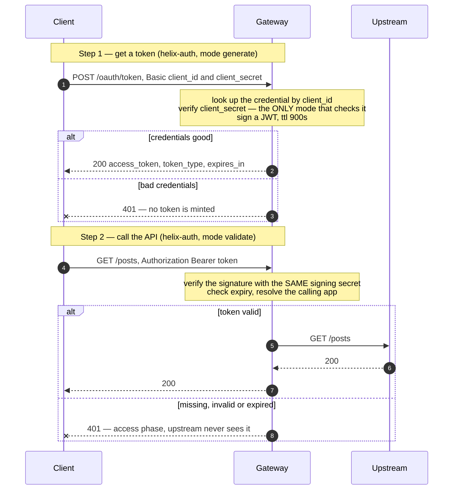

# Solution 02 — OAuth 2.0 with JWT, without touching the backend

**The gateway issues the token and verifies it. Your service never learns that
authentication happened.**

| | |
|---|---|
| **Setup time** | ~15 minutes |
| **Difficulty** | 🟢 Beginner |
| **Needs** | A fresh org (its default **test** environment) · a real signing-secret value to paste into the spec (used literally — see below) · one developer + app to test with. The upstream is public jsonplaceholder, so no backend of your own. |
| **Plugins** | `helix-auth` (generate + validate) · `request-id` · `cors` |
| **Build it with** | 🤖 **[the Helix Agent](helix-agent-prompt.md)** — recommended · or import [`gateway/api-spec.yaml`](gateway/api-spec.yaml) |
| **Assets** | ✅ [Agent prompt](helix-agent-prompt.md) · ✅ [Architecture](architecture.md) · ✅ [Business need](business-need.md) · ✅ [Spec](gateway/) · ✅ [Tests](tests/) · ✅ [Validation](validation/) · ✅ [Manifest](solution.yaml) |

---

## The problem

> *"Our partner API has been public since 2019. Everybody knows it needs auth.
> The problem isn't agreement — it's that the service is a shared monolith on a
> quarterly release train, the team that owns it has a roadmap through Q3, and
> 'add OAuth' means a six-week release plus a coordinated migration for eleven
> partners. So it stays public, and we put it on the risk register instead."*

Three things are true at once, which is why this sits still for years:

1. **The API needs authentication.** Anyone with the URL is a caller.
2. **The backend cannot ship it soon.** Auth is cross-cutting, so it touches
   every handler, and the release train is full.
3. **Static API keys aren't enough.** They're long-lived, get emailed, get
   committed, and a leaked one is a leak until somebody notices. Partners with a
   security review will ask for OAuth by name.

**Root cause:** authentication is being treated as application logic when it's
edge logic. Nothing about verifying a caller's identity requires knowledge of
your domain model, so nothing about it needs to live in your domain code.

## Business need

Full version: [`business-need.md`](business-need.md).

| Dimension | Public / static-key API | With gateway-issued JWTs |
|---|---|---|
| **Time to ship auth** | A backend release cycle, plus coordinated partner migration | A configuration change and a revision deploy |
| **Credential exposure window** | A static key is valid until someone revokes it — often years | A token is valid for minutes; the long-lived secret never travels on API calls |
| **Backend blast radius** | Every handler touched; auth bugs become application bugs | Zero backend change; a bad token never reaches your code |
| **Partner security review** | "We use an API key in a header" | Standards-based OAuth 2.0 client credentials |
| **Revocation** | Find every place the key was configured | Disable the app; the next token request fails and existing tokens expire on their own |

The mechanism that matters commercially: **the credential that can be replayed
forever stops travelling on every request.** The long-lived secret is used once
per token lifetime against one endpoint; everything else carries something that
expires on its own. You haven't eliminated the risk of a leaked credential — you
have bounded it, from *indefinite* to the number you chose.

No ROI figure is claimed anywhere in this package. The six weeks in the quote
above is the reasoning teams give, not a measurement; what is quantified is the
mechanism — the exposure window and the token traffic that buys it. Use your own
release cadence and your own credential inventory.

## Who issues the token — decide this first

This is the fork in the road, and picking wrong means building the wrong half of
the flow.

| Your situation | Use | Why |
|---|---|---|
| **You have no identity provider**, and you want partners to exchange a client id and secret for a token | **`helix-auth` generate + validate** — this solution | The gateway *is* the issuer. It holds the signing secret, verifies the app's credentials, and mints the JWT. |
| **Keycloak / Auth0 / Entra ID / Okta already issues tokens** to your partners | **`openid-connect`** with `discovery` + `bearer_only` — see [solution 05](../05-okta-jwt/). Drop the `/oauth/token` route. **Not `helix-auth`:** it has no JWKS URL, issuer or audience field and its schema is `additionalProperties: false`, so it cannot verify a token it did not mint. | The gateway is a *verifier only*. It must not mint tokens a separate IdP is authoritative for. |

`helix-auth` `generate` and `helix-auth` `validate` (jwt-auth) are not
alternatives to each other — they sit on opposite sides of the same boundary.
Verifying your own gateway-issued tokens against an external issuer, or issuing
tokens when an IdP already exists, produces a system with two sources of truth
about identity. (Note: `jwt-auth` is a `validate_auth_type` value of `helix-auth`,
not a standalone plugin on this build.)

Everything below is the first row.

## How a request flows


```mermaid
sequenceDiagram
    autonumber
    participant C as Client
    participant GW as Gateway
    participant UP as Upstream

    Note over C,GW: Step 1 — get a token (helix-auth, mode generate)
    C->>GW: POST /oauth/token, Basic client_id and client_secret
    Note over GW: look up the credential by client_id<br/>verify client_secret — the ONLY mode that checks it<br/>sign a JWT, ttl 900s
    alt credentials good
        GW-->>C: 200 access_token, token_type, expires_in
    else bad credentials
        GW--xC: 401 — no token is minted
    end

    Note over C,GW: Step 2 — call the API (helix-auth, mode validate)
    C->>GW: GET /posts, Authorization Bearer token
    Note over GW: verify the signature with the SAME signing secret<br/>check expiry, resolve the calling app
    alt token valid
        GW->>UP: GET /posts
        UP-->>GW: 200
        GW-->>C: 200
    else missing, invalid or expired
        GW--xC: 401 — access phase, upstream never sees it
    end
```

The important structural detail: validation happens in the **access phase**, so a
rejected request costs you nothing downstream. Your backend doesn't see it, your
database doesn't see it, and it doesn't consume a connection from your pool.

## Build it with the Helix Agent

Recommended path, about fifteen minutes. The whole build is **one prompt** —
[`helix-agent-prompt.md`](helix-agent-prompt.md). Paste it as a single message and
replace the `<<...>>` values.

It goes all the way: the API and its routes, the token endpoint, validation on the
protected routes, then a developer, a product, an app and its credentials. Unlike
the other prompts in this library **it deploys** — step 3 cannot hand you working
credentials otherwise. The agent may pause between steps to show you what it
stored; that pause is worth using.
[AGENT-GUIDE.md](../../AGENT-GUIDE.md) carries the standing rules it assumes.

> **Check the signing secret before anything else.** The agent may write
> `<ENV:JWT_SIGNING_SECRET>` or similar — it did in half the runs that got that
> far, on more than one model. This build resolves no such indirection: the string is
> used **verbatim** as the HMAC key. Both sides then match, every test passes, and
> your tokens are forgeable by anyone who has read this page. Tell the agent to
> replace it with a real high-entropy value in all four places, and keep the
> filled-in spec out of version control.
>
> **Then check what was stored, not what the agent said.** Each of the three
> `/posts` routes should carry `helix-auth` in validate mode; `/oauth/token`
> should carry it in *generate* mode and nothing else that demands a token; and
> **`helix-auth` must not be in the service spec** — an API-wide block covers the
> token endpoint too, and then nobody can obtain a first token. (`request-id` and
> `cors` API-wide are fine; this solution ships them that way.) Across thirteen
> runs on 2026-09-27 and 2026-09-29 the agent's exit status tracked nothing
> useful: runs reported success having stored routes with no plugins at all — an
> API that accepts every caller — while runs that reported an error had stored the
> config correctly.

### Why the prompt is worded the way it is

It names no plugin, no field and no secret, and that is the point. Ask for an
outcome and the agent reads the real `helix-auth` schema your org ships; ask for
fields and it pattern-matches them from some other gateway's documentation.
Three choices in it are doing real work:

- **Protection arrives in step 2, not step 1.** *"Update the previous 3 routes to
  validate the token generated by this endpoint"* ties the issuer and the
  validators together in one sentence, which is the thing that actually has to be
  true — the same signing secret on both sides, and no validation on the token
  route itself. Asking for protection in step 1 and the token endpoint afterwards
  invites the agent to hoist the auth block to the whole API, which covers
  `/oauth/token` and leaves a caller with no token unable to get one.
- **Step 3 asks for a product, not just a developer and an app.** An app
  subscribes to APIs *through* a product. Ask for the app alone and you get
  credentials subscribed to nothing, and every call comes back 403.
- **It stays out of the gateway's internals.** No plugin names, no `plugins` map,
  no serialisation instructions. Every one of those the prompt used to carry has
  been removed and the result got better, not worse.

### What the agent decides for you

Everything the prompt doesn't pin down, the agent picks — and on a clean run it
picks reasonably, but not identically to this package's spec. Observed:

| | The prompt says | The agent chose |
|---|---|---|
| Token lifetime | nothing | **3600s**, against this package's 900s |
| Signing secret | nothing | a real high-entropy value, identical on all four routes |
| Metering | nothing | `api-product-enforcer` on the protected routes, because step 3 asked for a product |
| Token endpoint | nothing | `limit-count` on `/oauth/token`, unasked |
| Correlation | nothing | `request-id`, API-wide |

The lifetime is the one worth a follow-up. It is the only bound on a leaked
token's usefulness — see [choosing a token lifetime](#choosing-a-token-lifetime)
— so if 900s is what you want, say so rather than accepting an hour by default.
The first entry under [Variations](#variations) is that follow-up.

## Variations

Follow-ups for the same session, once the build above is standing. Same register
as the prompt — say what you want to be true, not which fields to set.

**Pin the token lifetime**
```text
Set the token lifetime to 900 seconds, and tell me what that does to token
endpoint traffic at 50 calls/min.
```

**An external identity provider already issues the tokens**
```text
Our tokens come from <<Keycloak>>, not the gateway — it issues them and we just
need to accept them. Drop /oauth/token and verify the incoming tokens against
that issuer instead. Reject unauthenticated callers outright rather than
redirecting them to a login page, since these are API clients.
```
This is a different solution, not a setting: [solution 05](../05-okta-jwt/). The
gateway can only verify tokens it minted itself, so an external issuer needs a
different plugin entirely.

**Point at my real upstream**
```text
Point this at <<https://my-backend.internal>> instead, and keep everything else
as it is. My backend's paths differ from the route paths, so rewrite them on the
way through.
```

**Meter the callers as well as identify them**
```text
Now meter these callers. I sell a free tier and a paid tier — create a product
for each with its own quota, and enforce it per app on the protected routes.
```
Quota here is counted per app by the product, so it needs no separate rate-limit
plugin. That's [solution 01](../01-api-products/).

## When the agent goes wrong

**The model matters more than the prompt.** Driven on 2026-09-29 against a
small free-tier model, this prompt stored a working configuration in 1 run of 3:
one run lost its entire write, one stored four routes with **no plugins at all**
while still creating a developer, a product and an app against them, and the run
that worked wrote `<ENV:JWT_SIGNING_SECRET>` as the signing secret — a string this
build uses *verbatim*, so the HMAC key was a publicly known constant. The same
prompt on the agent's normal model produced correct configuration with a real
high-entropy secret.

So: if the agent starts producing the rows below, the fix is usually not a better
prompt. **Read the stored revision before you trust any of it** — the plugins on
each route, and the service spec — because an API that authenticates nobody is
reported exactly like one that works.

| Symptom | Cause |
|---|---|
| The routes exist and every one has **no plugins**, at exit 0 | The agent wrapped them in `x-helix-gateway` inside the live route object, which a live route silently discards. Seen repeatedly on a small model, *including when the prompt explicitly forbade that wrapper* — so re-prompting often does not fix it. Ask it to rewrite the routes with a plain top-level `plugins` map and read the revision back again; if it will not, import the spec instead. |
| `stream closed with reason: error`, and the write vanished | The tool argument was too deeply nested and never reached the control plane. Measured across eight runs: every argument carrying an `x-helix-gateway` wrapper was one level deeper than one without, and only the shallower shape survived. Ask for the routes again without the wrapper, or split the token route into its own request. |
| The signing secret reads `<ENV:JWT_SIGNING_SECRET>` or `${...}` | The agent reached for an indirection this build does not have. The string is used **verbatim** as the HMAC key, so the API works and its tokens are forgeable by anyone who has read the spec. Tell it to put a real high-entropy value in all four places. |
| Every protected call returns 403 with a valid token | The app is subscribed to no product. Step 3 asks for the product for this reason; if the agent skipped it, ask again explicitly. |
| Every call 401s, including with a fresh token | The signing secret differs between the issue and validate routes. |
| Every call 401s including `/oauth/token` | `validate` reached the service spec, or was applied API-wide. Move it to the three protected routes only. |
| The token endpoint 401s on credentials you're sure are right | You're sending the app's secret where its client id belongs. |
| The agent reaches for a `jwt-auth` plugin | Reply: `jwt-auth` is a `validate_auth_type` of `helix-auth`, not a plugin. |
| The agent writes `<ENV:JWT_SIGNING_SECRET>` | Reply: this build uses `signing_secret` verbatim — put a real secret and keep it out of git. |
| Deploy fails: `Only INACTIVE revisions can be updated` | You are re-running against an API whose revision is already live. Clone it (keeping the live one as a rollback target) or undeploy, then apply. |

## Install it directly

If you'd rather not go through the agent:

```bash
export ORG=<ORG_ID>
export TOKEN=<control-plane bearer token>      # short-lived
export BASE=https://<YOUR_GATEWAY_HOST>/api
H=(-H "authorization: Bearer $TOKEN" -H 'content-type: application/json')

# 1. Replace <YOUR_JWT_SIGNING_SECRET> in the spec with a real, high-entropy
#    secret. On this build it is used LITERALLY as the HMAC key — <ENV:...>
#    is not resolved. Use the SAME value on the token route and every protected
#    route. Do not commit the filled-in spec.

# 2. Import gateway/api-spec.yaml (OpenAPI import in the portal, or Agent Mode)
#    and bind the upstream https://jsonplaceholder.typicode.com to the service
#    (swap in your own backend later). Importing assigns service_id automatically.

# 3. Deploy the revision to the "test" environment (a free-trial org's default).

# 4. Create a developer and an app. The control plane issues the app's
#    client_id (the credential key) and client_secret. Keep both.

# 5. Prove it
GATEWAY=https://<YOUR_GATEWAY_HOST> \
CLIENT_ID=<CLIENT_ID> CLIENT_SECRET=<CLIENT_SECRET> EXPECT_TTL=900 \
./gateway/verify.sh          # defaults to /posts and /oauth/token
```

> An **ACTIVE** revision will not accept edits — you'll get `Only INACTIVE
> revisions can be updated`. Clone the revision (keeping the live one as a
> rollback target) or undeploy first.

## Configuration

Source of truth: [`gateway/api-spec.yaml`](gateway/api-spec.yaml). Two blocks
carry the whole solution.

On the token endpoint:

```yaml
helix-auth:
  mode: generate
  token_ttl: 900
  signing_secret: "<YOUR_JWT_SIGNING_SECRET>"
```

On every protected route:

```yaml
helix-auth:
  mode: validate
  validate_auth_type: jwt-auth
  signing_secret: "<YOUR_JWT_SIGNING_SECRET>"
```

**Note what isn't there.** `validate` is applied per route, not at the document
root. Applying it API-wide would protect `/oauth/token` too — and then no caller
could ever obtain a first token, because getting one would require already having
one. The symptom is an API where literally every request returns 401, including
the one that's supposed to fix that.

## Choosing a token lifetime

`token_ttl` is the only number in this solution with a real trade-off, so choose
it rather than inheriting a default. The table is on the
[business need](business-need.md) page: shorter means a leaked token is worthless
sooner and your token endpoint works harder, and past an hour or so you have
reinvented the static API key with extra steps. This spec ships **900s**.

The thing to tell integrators: **cache the token and reuse it until shortly
before it expires.** Refresh at around 80% of the lifetime. A client that
requests a fresh token per API call turns your token endpoint into your busiest
route and doubles the latency of everything.

## What the caller actually sees

Be precise about this in your developer docs, because it's what integrators hit.

Successful exchange:

```http
POST /oauth/token
Authorization: Basic <base64(client_id:client_secret)>

HTTP/1.1 200 OK
content-type: application/json

{"access_token":"eyJhbGciOiJIUzI1NiIs...","token_type":"Bearer","expires_in":900}
```

Every rejection on a protected route is a **401**:

```http
HTTP/1.1 401 Unauthorized
```

**All four failure causes look the same to the caller** — no token, malformed
header, expired token, bad signature. That is correct security behaviour (a
verbose error tells an attacker which half of their guess was right) and it is
genuinely awkward for integrators. Two consequences to design around:

- **Document the causes**, since the response won't distinguish them. "A 401
  means one of: no `Authorization` header, no `Bearer ` prefix, an expired token,
  or a token this gateway didn't sign."
- **Use the correlation id for support.** `X-Request-Id` is stamped on every
  call including the token exchange, so when a partner reports "it just returns
  401" you have something to search on.

## Testing

```bash
GATEWAY=https://<YOUR_GATEWAY_HOST> \
CLIENT_ID=<CLIENT_ID> CLIENT_SECRET=<CLIENT_SECRET> ./gateway/verify.sh
```

Exit 0 means all six cases held:

| # | Case | Expected |
|---|---|---|
| 1 | No token on a protected route | `401` |
| 2 | Valid client credentials at the token endpoint | `200` + a three-segment JWT |
| 3 | Valid Bearer token on a protected route | `200` |
| 4 | Forged token (valid shape, wrong signature) | `401` |
| 5 | **Correct client_id, wrong client_secret** | `401` |
| 6 | Token sent without the `Bearer ` prefix | `401` |

**Case 5 is the one to not skip.** It's what separates a real credentials flow
from a static-key flow in a token's clothing. If a wrong secret still gets you a
token, the secret isn't being checked and the whole design is decorative.

Case 4 matters for the same reason in the other direction: if a garbage token
returns 200, the route isn't validating at all — it's just passing traffic
through while looking configured.

Full plan including expiry (which needs a wait, so it's a manual case):
[`tests/test-plan.yaml`](tests/test-plan.yaml).

**Done looks like this**, beyond the six cases: no request to a protected route
succeeds without a gateway-issued token; every request is attributable to a named
app, and you can produce last hour's traffic broken down by app; onboarding a
partner needs no engineer to email anything; and the backend service's code is
unchanged, with its team never on the critical path.

## Gotchas

Each of these has cost somebody an afternoon.

- **The signing secret must be identical on the issue route and every validate
  route.** A mismatch means every freshly issued token is rejected with an
  opaque 401 — the config looks correct on both sides, and the failure gives you
  no hint that it's about a *shared* value.
- **The signing secret is a literal, not a reference.** This build resolves
  neither `<ENV:...>` nor `${...}` — the string in `signing_secret` *is* the HMAC
  key. Replace the placeholder with a real, high-entropy value before you deploy,
  and keep the filled-in spec out of version control. Ship the placeholder and
  your signing key is a public constant.
- **Never apply `validate` API-wide over the token endpoint.** See §
  *Configuration*. Every request 401s, including the one that issues tokens.
- **`authorization` must be in `cors.allow_headers`.** Otherwise browser clients
  fail at preflight and you get a CORS error, not a 401 — which sends people
  debugging the wrong layer for an hour.
- **`generate` is the only mode that checks the app's secret.** `key-auth`
  validate resolves on the credential *key* alone. If you need proof of
  possession, you need this flow, not a static key.
- **The `client_id` is the credential key, not the secret.** Sending the secret
  where the id belongs is the most common cause of "401 on the token endpoint
  with credentials I'm certain are right".
- **Confirm `helix-auth`'s schema in your own org** with `get_plugin_config`
  before deploying. Builds differ, and field names are not worth guessing.
- **`request-id` on the token route is deliberate.** Auth failures are exactly
  the thing you'll be asked to investigate, and the token exchange is half the
  flow.

## When to use it

Use it when:

- Your API needs authentication and the backend can't ship it on your timeline.
- Partners are asking for OAuth 2.0 by name, or a security review is.
- You're handing out static keys today and want to shrink the exposure window
  without asking every integrator to re-plumb their client.
- You want authentication and *attribution* in one step — see
  [solution 04](../04-analytics/), which depends on identity being resolved here.

Don't use it when:

- **An identity provider already issues tokens to these callers.** Use
  `jwt-auth` against that issuer instead. See § *Who issues the token*.
- **You need end-user identity, not app identity.** Client credentials
  authenticates the *application*. Delegated user access is the authorization
  code flow, and this is not it.
- **You need fine-grained scopes and per-scope route policy.** This solution
  proves who is calling. Deciding what they may do is authorization — a separate
  layer.
- **The caller genuinely cannot store a secret** — a public single-page app or a
  mobile client. Client credentials assumes a confidential client.

## Limitations

- **Client credentials authenticates apps, not users.** No end-user identity is
  established, and no consent is involved.
- **No scopes in this configuration.** The token proves identity; it doesn't
  carry per-route permissions. Add authorization on top.
- **No token revocation list.** A token is valid until it expires; disabling an
  app stops *new* tokens. This is why the TTL is the security control — it's the
  only bound on a leaked token's usefulness.
- **No refresh tokens.** Client credentials doesn't use them: the client already
  holds the long-lived secret, so it re-exchanges instead.
- **Symmetric signing.** One shared secret signs and verifies. If a third party
  needs to verify your tokens independently, that requires asymmetric keys.
- **Every 401 looks alike.** Correct, and awkward. See § *What the caller
  actually sees*.
- **It doesn't retire the keys already in the wild.** Existing static keys stay
  dangerous until you turn them off. Migrating partners is real work — less than
  a backend release, but not zero.

Full list: [`solution.yaml`](solution.yaml) § `limitations`.

## Validation status

**Validated against a gateway — imported, dry-run, deployed, and passed `verify.sh`.**

| Stage | Status | Provenance |
|---|---|---|
| Configuration generated | **YES** | [`gateway/api-spec.yaml`](gateway/api-spec.yaml) |
| Local validation | **PASS** | Structural review — [`validation/local-validation.yaml`](validation/local-validation.yaml) |
| Gateway dry-run | **PASS** | Non-destructive; a missing upstream binding is reported here, before any deploy. |
| Gateway deployed | **DEPLOYED** | Revision ACTIVE in a test environment; `service_id` auto-assigned on import. |
| Functional tests | **PASS (6/6)** | `gateway/verify.sh` exit 0 — including the wrong-secret and forged-token cases. |
| Agent path | **MODEL-DEPENDENT** | Driven live 2026-09-29. On the agent's normal model the prompt built and deployed the whole solution, credentials included. On a small free-tier model it stored an unauthenticated API more often than not. Either way the signing secret needs checking. See § *When the agent goes wrong*. |

Overall: **READY** — for the specification, which is what those rows cover and
what `verify.sh` exercises. Importing
[`gateway/api-spec.yaml`](gateway/api-spec.yaml) gets you this configuration
deterministically; the agent path is the weaker one today, and § *When the agent
goes wrong* opens with why.

**One thing you must do:** replace `<YOUR_JWT_SIGNING_SECRET>` with a real secret.
It is used *literally* as the HMAC key — `<ENV:...>` is not resolved — so shipping
the placeholder makes your signing key a public constant.

## Related solutions

- **[03 — SOAP to REST](../03-soap-to-rest/)** — puts this exact auth layer in
  front of a mediated SOAP backend. The two compose directly.
- **[01 — API Products](../01-api-products/)** — once you know *who* is calling,
  meter them. Add `api-product-enforcer` behind this `helix-auth` block.
- **[04 — Analytics](../04-analytics/)** — analytics attributes calls to an app
  only because this solution resolved identity first.
