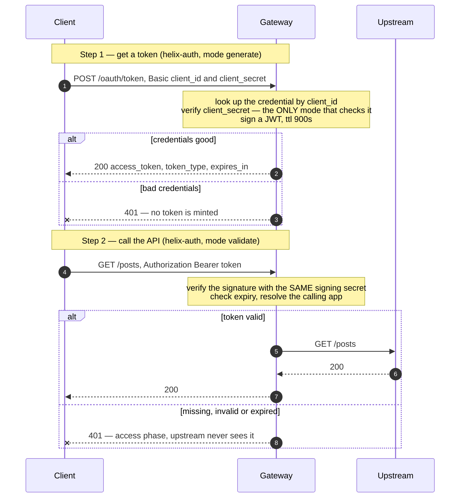

# Architecture — OAuth 2.0 with gateway-issued JWTs

> [Overview](README.md) · [Business need](business-need.md) · **Architecture** · [Guides](guides.md) · [Agent prompt](helix-agent-prompt.md) · [Tests](tests.md) · [API reference](api-reference.md)

---

## What the gateway does here

The gateway takes on two jobs that used to belong to your application:

1. **It issues tokens.** An app sends its client id and secret to
   `POST /oauth/token`. The gateway checks both and, if they match, signs a token.
2. **It checks tokens.** On every other route, the gateway checks the token's
   signature and expiry before the request goes anywhere.

Your backend stays a plain HTTP service with no idea that authentication exists.

For the full list of fields on every plugin mentioned here, see the
[product documentation](https://docs.digitalapi.ai/api-gateway).

## The model

| Word | What it means here |
|---|---|
| **Developer** | The company or person using your API |
| **App** | One integration owned by a developer. The platform gives it a **client id** (its key) and a **client secret**. |
| **Product** | A set of APIs an app can subscribe to. An app reaches an API *through* a product. |
| **Token** | A signed JWT the gateway issues. It proves which app is calling, until it expires. |
| **Signing secret** | The value the gateway signs tokens with and checks them against. The same value must be on the token route and every protected route. |

Both jobs are done by one plugin, `helix-auth`, in two modes: `generate` on the
token route and `validate` on the protected routes. `jwt-auth` is a setting of
`helix-auth` (its `validate_auth_type`), not a separate plugin.

## How a request flows

**The token route is deliberately not protected.** A caller arriving there has no
token yet. If it were protected, getting a token would require already having one.
This is why token checking is set on each protected route, not across the whole
API.

**A rejected request costs your backend nothing.** The check runs in the
gateway's **access phase**, before the request is forwarded. A call with a bad
token never opens a connection to your service, never reaches your database, and
never shows up in your application logs.

## Reading a rejection

| Status | What it means | Where to look |
|---|---|---|
| **401** on a protected route | The gateway could not confirm who is calling: no `Authorization` header, no `Bearer ` prefix, an expired token, or a token this gateway didn't sign | The client's token. All four look the same to the caller, on purpose. |
| **401** on `/oauth/token` | Unknown client id, or the secret doesn't match. No token is issued. | Is the app sending its client id where the id goes, and its secret where the secret goes? |
| **401** on every call, even with a token issued seconds ago | The signing secret differs between the token route and the protected route | The `signing_secret` values in the spec |
| **403** with a valid token | The gateway knows who is calling, but the app is not subscribed to a product that covers this API | The app's products |

All four caller-side 401s are deliberately identical. A detailed error would tell
an attacker which part of their guess was right. The cost is that integrators
can't tell the causes apart on their own, so **list the four causes in your
developer docs** and give them the `X-Request-Id` header value to quote in support
tickets.

## Execution order

Plugins run by **priority**, not in the order they appear in the file. On a
protected route:

| Order | Plugin | Phase | Produces | Needs |
|---|---|---|---|---|
| 1 | `helix-auth` (validate) | access | the calling app | the `Authorization` header and the signing secret |
| 2 | *(any authorization or metering plugin you add)* | access | — | the app from step 1 |
| — | `request-id` | rewrite / log | an `X-Request-Id` header | — |
| — | analytics (platform-wide) | log | a record of the request | the app from step 1 |

**Anything that needs to know who is calling must run after `helix-auth`.** You
don't arrange that by ordering the file; it follows from plugin priorities. It is
why [solution 01](../01-api-products/)'s quota works when it sits behind this
block, and why analytics can report traffic per app rather than per IP address
([solution 04](../04-analytics/)).

## Who issues the token — decide this first

This is the fork in the road. Picking wrong means building the wrong half of the
flow.

| Your situation | Use | Why |
|---|---|---|
| **You have no identity provider**, and partners exchange a client id and secret for a token | **`helix-auth` generate + validate** — this solution | The gateway *is* the issuer. It holds the signing secret, checks the app's credentials, and signs the token. |
| **Keycloak, Auth0, Entra ID or Okta already issues tokens** to your partners | **`openid-connect`** — see [solution 05](../05-okta-jwt/). Drop the `/oauth/token` route. | The gateway only checks tokens; the identity provider stays in charge. `helix-auth` cannot do this: it has no field for the provider's public keys, issuer or audience, and accepts no extra fields. |

These are not two ways of doing the same thing. Running both means two systems
each believe they are in charge of identity, and you find out during an incident.

## Where the signing secret lives

The signing secret is written into the spec, in four places: on `POST
/oauth/token` (where it signs) and on each of the three `/posts` routes (where it
checks). Two things follow:

- **All four must be the same value.** If they differ, every newly issued token is
  rejected, and nothing in either plugin block hints that the value is shared.
- **It is used exactly as written.** The gateway does not look up `<ENV:...>` or
  `${...}`; whatever text is in `signing_secret` *is* the key. Replace the
  placeholder with a long random value before you deploy, and keep the filled-in
  spec out of version control.

**Changing the secret needs planning.** Tokens signed with the old value stop
working the moment the new one is live. With a 900-second token lifetime, a
careless change means up to fifteen minutes of 401s for callers holding old
tokens. Change it during a quiet period, and tell partners in advance.

If a third party needs to check your tokens on its own, a shared secret can't do
it: anyone who can check a token can also sign one. That needs public/private key
signing and is out of scope here.

## No custom code needed

| What you need | How it is done | Why not write code for it |
|---|---|---|
| Check client credentials | `helix-auth` mode `generate` | Credentials are already stored by the platform. Custom code would need its own credential store. |
| Sign a JWT | `helix-auth` mode `generate` | Signing is easy to write and easy to write insecurely. Safe comparison, correct expiry handling and fixed algorithms are handled here. |
| Check a JWT | `helix-auth` mode `validate`, `validate_auth_type: jwt-auth` | Hand-written token checks are where the well-known JWT security bugs come from. |
| Reject before the backend | the access phase | A custom filter would run in the same phase with more ways to be wrong. |
| Trace an auth failure | `request-id` | — |

The one thing this solution deliberately does *not* attempt: **scopes and
per-route permissions.** That is authorization — deciding *what* a caller may do —
and it is specific to your application. Keep it as a separate layer.

## When to use this

Use it when:

- **The backend can't ship authentication on your timeline.** This is the common
  case and the whole point.
- **Partners ask for OAuth 2.0 by name**, or a security questionnaire does.
- **You hand out static keys today.** Integrators still hold an id and a secret, so
  they don't have to change how they store credentials.
- **You need to know who is calling, not just block strangers.** Identity found
  here is what makes per-app analytics and per-app quotas possible.
- **Several services need the same sign-in.** Set it up once at the edge rather
  than once per codebase.

Do not use it when:

- **An identity provider already issues tokens to these callers.** Use
  [solution 05](../05-okta-jwt/). Running a second token issuer creates two
  sources of truth about identity.
- **You need end-user identity.** Client credentials identifies the
  *application*. If the question is "may this person see this record", you need
  the authorization code flow and an authorization layer.
- **The client can't keep a secret** — a browser app or a mobile app. A secret
  shipped inside a public app isn't secret.
- **You need per-scope route rules.** This solution establishes *who*; it says
  nothing about *what they may do*.
- **Tokens must be revocable instantly.** There's no revocation list; a token
  works until it expires. Shorten the lifetime, or accept the window.

## Prerequisites

- The API is imported and deployed, with an upstream bound to it.
- `<YOUR_JWT_SIGNING_SECRET>` has been replaced with a long random value — the
  **same** value on the token route and every protected route.
- `helix-auth` is available in your org. Confirm its fields with
  `get_plugin_config` before you deploy; builds differ.
- At least one developer with one app, subscribed to a product that includes this
  API, so you have a client id and secret to exchange.

## Limitations

- **It identifies apps, not people.** No end-user identity is established and no
  consent is involved.
- **No scopes in this configuration.** The token proves who is calling; it carries
  no per-route permissions. Add authorization on top.
- **No revocation list.** Disabling an app stops *new* tokens. Tokens already
  issued work until they expire, which is why the token lifetime is the security
  control.
- **No refresh tokens.** Client credentials doesn't use them: the app already
  holds the long-lived secret, so it simply asks for a new token.
- **One shared signing secret.** Anyone who can check a token can also sign one,
  so a third party can't verify your tokens independently.
- **Every 401 looks the same.** Correct for security, awkward for integrators —
  document the causes.
- **It doesn't switch off the keys already out there.** Existing static keys stay
  a risk until you turn them off. Moving partners over is real work — less than a
  backend release, but not zero.
