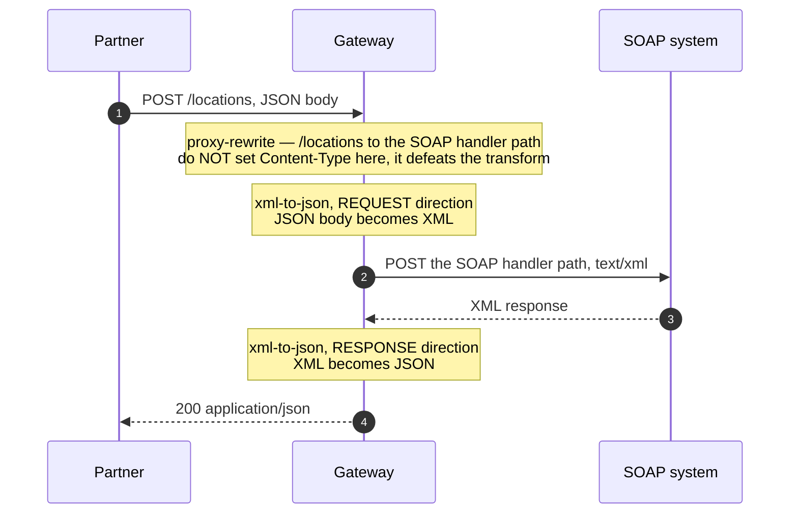

# Architecture — SOAP/XML backend served as REST/JSON

> [Overview](README.md) · [Business need](business-need.md) · **Architecture** · [Guides](guides.md) · [Agent prompt](helix-agent-prompt.md) · [Tests](tests.md) · [API reference](api-reference.md)

---

## What the gateway does here

The gateway sits between partners and your SOAP system as a **translator**. On
every call it does three things:

1. Changes the path, from the route the partner called (`/locations`) to the path
   your SOAP handler answers on.
2. Converts the partner's JSON body into XML.
3. Converts the XML answer back into JSON on the way out.

One call in means exactly one call to the SOAP system. This is not combining
several backend calls, and it is not a new service in front of your old one. Only
the format changes.

For the full list of fields on every plugin mentioned here, see the
[product documentation](https://docs.digitalapi.ai/api-gateway).

## How a request flows

**Nothing checks who is calling.** This package is the translation only, so every
request that reaches the gateway reaches your SOAP system. Sign-in is
[solution 02](../02-oauth-jwt/). When you add it, it runs in the gateway's
**access phase**, before both plugins above, so a rejected call costs no
conversion work and never opens a connection to your backend.

## The one thing everybody gets wrong

**`xml-to-json` does not convert the request unless you ask it to, and it only
converts the response when the client asks for JSON.** All three points below
were confirmed against a live gateway.

1. **`transform_request` is off by default.** An empty `xml-to-json: {}` block
   converts the *response* only. The partner's JSON request reaches your SOAP
   handler *as JSON*, and the handler rejects it. You must set
   `transform_request: true`.
2. **The response conversion depends on the `Accept` header.** It only runs when
   the client sends `Accept: application/json`. Without it, the XML comes back
   unchanged, as `text/xml`. Your integrators must send the header — tell them.
3. **`proxy-rewrite` must not set `Content-Type`.** It runs before `xml-to-json`.
   If it changes the content type to `text/xml` first, the request body no longer
   looks like JSON to the converter (which looks for `application/json` by
   default), and the request is silently never converted. Change the path in
   `proxy-rewrite`; let the converter own the content type.

**Don't add `json-to-xml`.** Despite the name, it is not the request-side partner
of `xml-to-json`. It is a separate plugin for the opposite job: turning a JSON
*backend response* into XML for clients that want XML. Adding it here doesn't
help, and can convert a body twice.

## Execution order

Plugins run by **priority**, not in the order they appear in the file.

| Order | Plugin | Phase | Does | Needs |
|---|---|---|---|---|
| 1 | `proxy-rewrite` (priority 1008) | rewrite | Changes `/locations` to your SOAP handler path. **Path only.** | nothing |
| 2 | `xml-to-json` (priority 997), request direction | request body | JSON → XML | the body still labelled `application/json` when it runs |
| 3 | *(the call to your SOAP system)* | — | — | — |
| 4 | `xml-to-json`, response direction | response body | XML → JSON | the backend returning XML, and the client having sent `Accept: application/json` |
| — | `request-id` | rewrite / log | Adds an `X-Request-Id` header | nothing |
| — | analytics (platform-wide) | log | A record of the request | nothing — but without sign-in, calls can't be tied to an app |

**Steps 1 and 2 are where it goes wrong.** Because `proxy-rewrite` runs first,
anything it does to the content type is what the converter sees. Setting
`Content-Type` there looks helpful — the SOAP handler does want `text/xml` — and it
switches off the request conversion. The converter sets the right content type
itself.

## Why the JSON shape is derived, not designed

The gateway translates a format; it does not design an API. So the JSON partners
receive is a mechanical copy of the XML your handler produced:

| XML | Becomes | Not |
|---|---|---|
| `<Locations><Site>…</Site></Locations>` | `{"Locations":{"Site":[…]}}` | `{"locations":[…]}` |
| `<ns2:SiteName>` | a key carrying the prefix, or flattened, depending on settings | `siteName` |
| One `<Site>` element | possibly an object | reliably a one-item list |
| Two `<Site>` elements | a list | — |
| `<Site id="1">` | depends on settings; the attribute may be dropped | a normal field |

The single-item case deserves attention because of *when* it causes trouble. XML
has no idea of a list: one `<Site>` and two `<Site>`s are different documents, so
the converter can't always tell "one item" from "a list of one". Partner code
written against a multi-result example breaks on the single-result case — usually
in production, on their side.

Two consequences:

- **Publish example payloads for both the single-result and multi-result cases.**
  Not one representative example. Both.
- **Your system's internal element names are now your public contract.** Renaming
  them later breaks every partner. Decide now whether you're happy to publish them.

If you need a clean, hand-designed REST contract, translation alone won't give it
to you. You need a response-shaping layer on top, or a real facade service — a
bigger decision.

## No custom code needed

| What you need | How it is done | Why not write code for it |
|---|---|---|
| JSON → XML on the request | `xml-to-json`, request direction | A hand-written converter is easy to start and hard to finish — namespaces, encoding, escaping, CDATA. |
| XML → JSON on the response | `xml-to-json`, response direction | The same, plus size limits. |
| Change the path | `proxy-rewrite` | — |
| Match a partner's call to the backend's answer | `request-id` | — |

Custom logic *would* be justified for things deliberately left out of this
package: reshaping the converted JSON into a designed contract (renaming keys,
forcing single items into lists); building a full SOAP envelope with WS-Security
headers; or mapping one REST call onto several SOAP operations. Keep those as
separate layers.

## Where the pieces live

| Piece | Where it lives | Why |
|---|---|---|
| Your SOAP host (`<SOAP_UPSTREAM_URL>`) | The upstream bound to the API when you deploy — **not** in the spec | The host differs per environment. |
| The handler path (`<SOAP_HANDLER_PATH>`) | `proxy-rewrite.uri` in [`example/api-spec.yaml`](example/api-spec.yaml) | The path is part of the translation design and belongs with the route. |
| Conversion settings | `xml-to-json` in the spec: `transform_request: true`, `transform_response: true` | Confirm the other fields your build offers with `get_plugin_config`. |

## When to use this

Use it when:

- **A SOAP system of record is correct, stable and not being rewritten.** That
  describes most of them, and "it has never lost a transaction" is a real argument
  for leaving it alone.
- **Partners want JSON, and the number of partners is growing.**
- **You're on adapter number two or three**, and can see where this is heading.
- **You want to open up a legacy system without exposing it directly** — the
  translation, sign-in and usage limits all sit in one layer you control.
- **One partner call maps to one backend operation.** That is the shape this fits.

Do not use it when:

- **The public contract must be clean and stable whatever the backend does.** The
  JSON here is derived from the XML.
- **The SOAP side is genuinely complex** — WS-Security, SOAP headers, attachments,
  MTOM, stateful sessions. This translates message bodies only.
- **One partner call needs several backend calls**, or results merged. That is a
  different pattern.
- **The backend is being replaced soon.** A translation layer you'll delete may not
  be worth setting up — though it can bridge the migration.
- **The handler is so slow that the format isn't the problem.** If calls take ten
  seconds, translation makes the API usable, not good.

## Prerequisites

- Your SOAP service is reachable from the gateway, and you know the handler path
  and whether it needs a `SOAPAction` header.
- `xml-to-json` is available in your org, and you've checked its fields with
  `get_plugin_config`. The whole solution rests on this plugin.
- You know the element names the handler reads, so partners' JSON field names can
  match them.

## Reading a failure

| What happens | Result | Reached the SOAP handler? |
|---|---|---|
| Handler unreachable | **502** (bad gateway) | Attempted |
| Handler slower than the gateway timeout | **504** (gateway timeout) | Yes, but the answer came too late |
| Handler rejects the content type | **415** | Yes — check whether it needs `SOAPAction`, **not** a `Content-Type` setting on `proxy-rewrite` |
| Missing `SOAPAction` (where required) | **500**, often with an unhelpful envelope | Yes |
| Request field names don't match what the handler reads | 200 with an empty result, or 500 | Yes |
| A second conversion plugin added | often a 500 — the body was converted twice | Yes |
| Response not converted | **200 with an XML body and a JSON content type** | Yes |

The last row is the dangerous one, because it looks like success: status 200, a
content type that says JSON, and the partner's parser is what finds out. That is
why [`example/verify.sh`](example/verify.sh) checks that the body contains no XML
markup rather than trusting the header. See [Tests](tests.md).

## Limitations

- **The JSON shape is derived, not designed.** Element names, casing and structure
  come from the XML, and become part of your public contract once partners use
  them.
- **XML has no lists.** One-item collections may come out as objects rather than
  lists.
- **Namespaces and attributes need explicit settings**, and may be flattened or
  dropped by default.
- **Message bodies only.** WS-Security, SOAP headers, attachments and MTOM are not
  covered.
- **No check on the converted request.** A partner can send JSON that becomes XML
  the handler rejects; the error shows up as a 500 from the handler, not a 400 from
  the gateway. Add `request-validation` if you want a clean rejection at the edge.
- **One call in, one call out.** Fanning out to several SOAP operations, or merging
  results, is a different pattern.
- **It doesn't make a slow handler fast.** If the SOAP system takes eight seconds,
  so does the API.
- **Two conversions per call add some time.** Small, but not zero, and it grows
  with payload size.
- **`xml-to-json`'s fields vary by build.** Confirm with `get_plugin_config` rather
  than trusting the field names here.
- **No sign-in.** The route is open until you add [solution 02](../02-oauth-jwt/).
