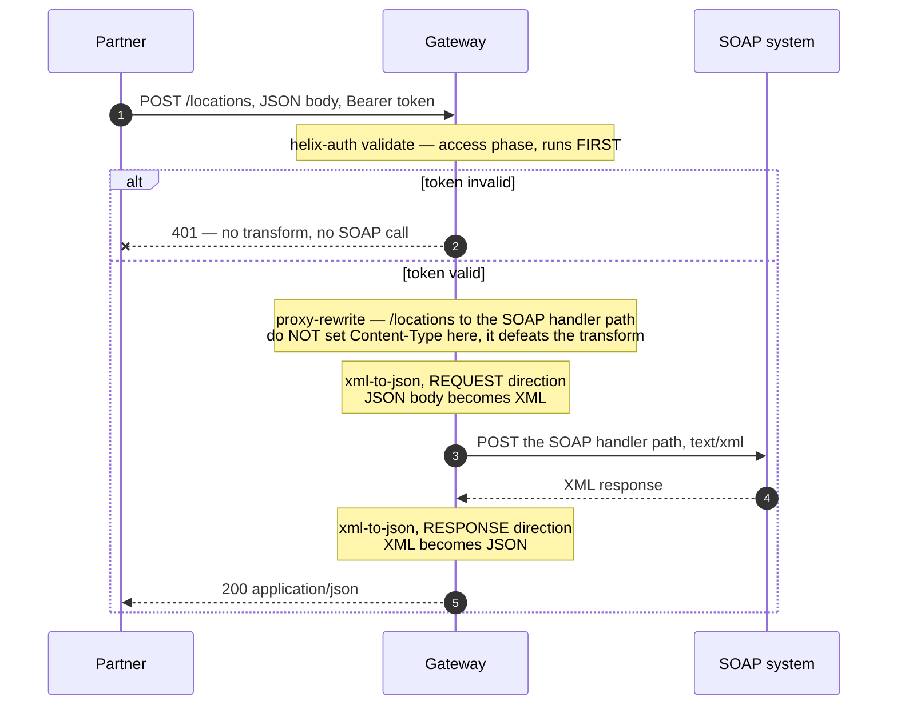

# Solution 03 — Serve a SOAP backend as REST/JSON

**Overview** · [Business need](business-need.md) · [How it works](how-it-works.md) · [Install](install.md) · [Configuration](configuration.md) · [Test & verify](testing.md) · [Changelog](changelog.md)

---

**Partners send JSON. A twenty-year-old system answers. Neither knows about the
other.**

> **Validated end to end against a real SOAP backend.** The subtlety that matters:
> `xml-to-json` is not "bidirectional by default", and a `Content-Type` override on
> `proxy-rewrite` defeats it — this page reflects the working config. The short
> version is in *The one thing everybody gets wrong*, below.

> **You supply the SOAP backend.** Unlike the other solutions, this one can't run
> on a public sample upstream — SOAP→REST needs a SOAP service. Replace
> `<SOAP_UPSTREAM_URL>` with your backend and `<SOAP_HANDLER_PATH>` with the path
> its handler answers on (e.g. `/Service.asmx`, `/soap/endpoint`).

<!-- facts:begin -->

| | |
|---|---|
| **Setup time** | ~25 minutes |
| **Difficulty** | Intermediate |
| **Needs** | Your own SOAP endpoint reachable from the gateway (this is a SOAP use case — a REST placeholder like jsonplaceholder can't stand in) and its handler path · a real signing-secret value (literal — see solution 02) · one developer + app · `xml-to-json` in your org · a test environment |
| **Plugins** | `cors` · `helix-auth` · `proxy-rewrite` · `request-id` · `xml-to-json` |
| **Build it with** | **[the Agent](install.md)** — recommended · or import [`gateway/api-spec.yaml`](gateway/api-spec.yaml) |

<!-- facts:end -->

## The problem

> *"Our system of record is SOAP. It has been SOAP since 2004, it is correct, it
> is fast, and it has never lost a transaction. Every fintech partner who wants to
> integrate asks for JSON and OAuth, and every one of them is a project: write an
> adapter service, deploy it, monitor it, keep it in step with the WSDL. We now
> have four adapters, two of which nobody owns. The alternative is rewriting the
> system of record, which nobody will sign off, correctly."*

Three bad options, which is why this sits still:

1. **Rewrite the backend.** A quarter of engineering, a migration, and a real risk
   of losing behaviour nobody documented. Nobody signs this off, and they're right
   not to.
2. **Write an adapter per partner.** Now you have N services to run, each one a
   thin translation layer with its own deployment, monitoring, on-call rotation
   and drift. The fourth one is where you notice the pattern.
3. **Make partners speak SOAP.** Hand them a WSDL and ask them to construct
   envelopes. Some will. Most will quietly deprioritise the integration, and
   you'll never be told that's what happened.

**Root cause:** protocol translation is being treated as application work. It
isn't — it's a mediation concern, and mediation is what an edge is for. The
mismatch is between the *wire format* your backend speaks and the one your
partners speak. Nothing about resolving it requires knowing what a location is.

## Business need

Full version: [`business-need.md`](business-need.md).

| Dimension | Adapter-per-partner | Mediated at the edge |
|---|---|---|
| **New services to operate** | One per integration pattern, each with deploys and on-call | Zero |
| **Time to onboard a partner** | An adapter project | Create an app; they call the existing endpoint |
| **Backend risk** | None from the adapter, but the rewrite alternative is severe | None. The SOAP service is byte-for-byte unchanged |
| **Where the translation lives** | N codebases, drifting | One configuration block |
| **Auth** | Implemented per adapter, subtly differently each time | Once, at the edge — see [solution 02](../02-oauth-jwt/) |
| **Observability** | Per-adapter, if someone built it | Every call captured, attributed per app — [solution 04](../04-analytics/) |

The structural argument: **the number of things you operate stops growing with the
number of partners you onboard.** That's not a performance claim, it's a topology
claim, and it's the one that compounds.

## How a request flows

The full walkthrough is on **[How it works](how-it-works.md)**.

## Gotchas

- **`xml-to-json` needs `transform_request: true`, and the response needs
  `Accept: application/json`.** The defaults do neither the way you'd expect
  (verified). `json-to-xml` is a *separate* plugin for the opposite job (JSON
  upstream → XML for XML-wanting clients), not the request-side counterpart. See
  § *The one thing everybody gets wrong*.
- **Your handler may require a `SOAPAction` header.** Many classic SOAP 1.1 and
  `.asmx` endpoints return a 500 with an unhelpful envelope without it. Add it in
  `proxy-rewrite.headers.set`. Check what your handler wants rather than assuming
  it wants nothing.
- **Single-element collections may not be arrays.** XML can't distinguish one item
  from a list of one. Test both cases explicitly, and warn integrators.
- **Namespaced or attribute-heavy envelopes need configuration.** The empty
  `xml-to-json` block takes defaults, which often flatten namespaces or drop
  attributes. Confirm the fields available in your build.
- **Confirm `xml-to-json` exists in your org before designing around it.** Builds
  differ, and this plugin is the one the whole solution rests on.
- **A 500 from a handler that works under curl is almost never the handler.**
  Suspect, in order: double conversion, a missing `SOAPAction`, or request field
  names that don't match the elements the handler reads.
- **Legacy handlers are often slow.** SOAP systems built for batch use can take
  seconds. Check the gateway timeout before you conclude the upstream is down —
  the symptom is a 504 that looks like an outage.
- **Element names leak into your public contract.** Your partner-facing JSON now
  contains the internal element names of a 2004 system. Renaming them later is a
  breaking change for partners, so decide now whether you're happy publishing them.
- **The signing secret must match** on `/oauth/token` and `/locations`. See
  [solution 02](../02-oauth-jwt/) § *Gotchas*.

## When to use it

Use it when:

- **A SOAP system of record is correct and stable and you have no mandate to
  rewrite it.** That's most of them.
- **Partners want JSON**, and the number of partners is growing.
- **You're on adapter number two or three** and can see where this goes.
- **You want to expose a legacy system without exposing the legacy system** — auth,
  mediation and metering all land at the edge.

Don't use it when:

- **You need a hand-designed REST contract.** The JSON shape here is *derived*
  from the XML. If the public contract must be clean and stable independent of
  the backend's element names, you need a response-shaping layer, and possibly a
  real facade service.
- **The SOAP operation is genuinely complex** — multi-part MIME, WS-Security
  headers, attachments, stateful sessions. Mediation handles body translation, not
  the whole WS-* stack.
- **One partner call needs several backend calls.** That's composition, not
  mediation.
- **The backend is being replaced anyway.** If a REST service ships next quarter,
  a facade you'll delete may not be worth the configuration.

## Limitations

- **The JSON shape is derived, not designed.** Element names, casing and structure
  come from the XML. Publishing them makes them part of your public contract.
- **XML has no arrays.** One-element collections may transform to objects rather
  than lists. Design your client guidance around this.
- **Namespaces and attributes need explicit configuration** and may be flattened
  or dropped by default.
- **Body translation only.** WS-Security, SOAP headers, attachments and MTOM are
  not addressed.
- **No schema validation of the transformed request.** A partner can send JSON
  that converts to XML the handler rejects; the error surfaces as a 500 from the
  handler rather than a 400 from the gateway. Add `request-validation` if you want
  a clean rejection at the edge.
- **`xml-to-json`'s schema varies by build**, and the empty block here takes
  defaults. Confirm with `get_plugin_config`.
- **Latency is added.** Two conversions per request. Small, but not zero, and it
  compounds on large payloads.

Full list: [`solution.yaml`](solution.yaml) § `limitations`.

## Validation status

**Validated end to end against a real SOAP backend.** The configuration here
passes `verify.sh` including the case-4 no-XML-markup proof (JSON→XML→backend→XML→JSON
round-trip).

| Stage | Status | Provenance |
|---|---|---|
| Configuration generated | **YES** | [`gateway/api-spec.yaml`](gateway/api-spec.yaml) (corrected) |
| Local validation | **PASS** | [`validation/local-validation.yaml`](validation/local-validation.yaml) |
| Gateway dry-run | **PASS** | Non-destructive validation on a gateway. |
| Gateway deployed | **DEPLOYED** | Deployed against a real SOAP backend; the ACTIVE-revision 409 and clone/undeploy flow were exercised for real. |
| Functional tests | **PASS (5/5)** | `gateway/verify.sh` exit 0 — request JSON→XML and response XML→JSON both proven round-trip. |

Overall: **READY (post-fix).** What the run corrected, and now works:

- `transform_request: true` is now set — the empty block never converted the request.
- The `Content-Type: text/xml` override was removed from `proxy-rewrite` — it ran
  before the transform and hid the JSON body from it.
- `verify.sh` now sends `Accept: application/json` — the response transform is
  content-negotiated and did nothing without it.

Full account: [`validation/gateway-validation.yaml`](validation/gateway-validation.yaml).

## Related solutions

- **[02 — OAuth 2.0 with JWT](../02-oauth-jwt/)** — the auth layer used here,
  covered properly: token lifetimes, the signing-secret trap, the external-issuer
  fork.
- **[01 — API Products](../01-api-products/)** — meter the partners now calling
  your legacy system, and sell tiers. Add `api-product-enforcer` behind the
  `helix-auth` block.
- **[04 — Analytics](../04-analytics/)** — find out which partner is calling the
  legacy system how often, which is usually the first question asked after this
  goes live.
