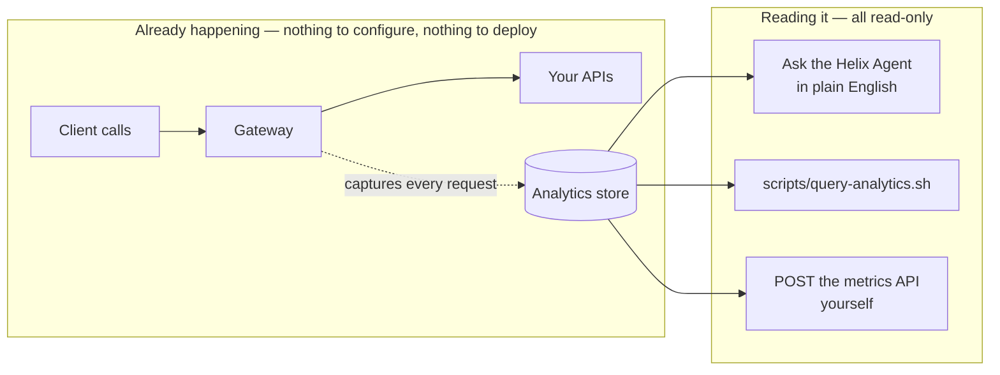

# Solution 04 — Analytics: read what your gateway already captured

**Every request through every API is captured automatically. You add nothing to
your APIs. This is how you pull the answers — requests in the last hour by API,
product, or app; your slowest and fastest APIs; error rates — out of the analytics
API.**

| | |
|---|---|
| **Setup time** | ~5 minutes (nothing to deploy) |
| **Difficulty** | 🟢 Beginner |
| **Needs** | APIs that already receive traffic · a control-plane bearer token (the portal uses the same one) |
| **Changes to your APIs** | **None.** Analytics is global; there is no plugin or config to add. |
| **Run it** | 🤖 [ask the agent](helix-agent-prompt.md) — it charts it for you · 📊 [`scripts/query-analytics.sh`](scripts/query-analytics.sh) — CLI · 📖 [`charts.md`](charts.md) — raw queries |
| **Assets** | ✅ [Agent prompt](helix-agent-prompt.md) · ✅ [Query catalogue](charts.md) · ✅ [Query script](scripts/query-analytics.sh) · ✅ [Architecture](architecture.md) · ✅ [Business need](business-need.md) · ✅ [Manifest](solution.yaml) |

---

## The point

You don't turn analytics on — it's **already recording every request**. You just
read it, three ways: **ask the agent in plain English** and it pulls the numbers and
draws a chart ([agent prompt](helix-agent-prompt.md)); run
[`scripts/query-analytics.sh`](scripts/query-analytics.sh) from the CLI; or POST the
[metrics-API queries](charts.md) yourself. Nothing is built or configured on your
APIs, and it's all read-only. Verified against a live gateway.



## The questions it answers

All for a chosen window (the last hour by default):

- **How many requests did each API get?** — and each **product**, and each **app**.
- **Which of my APIs is slowest / fastest?** — by average response time.
- **Where are the errors?** — counts by API and status code (4xx vs 5xx), who got 429s.
- **What's the traffic shape over time?** — per-hour (or per-minute/day) buckets.
- **What's driving data transfer / egress?** — bytes by API.

## Read it with the Helix Agent

Recommended path — no queries to hand-write. Ask in plain English and the agent
pulls the numbers and **renders a chart in the chat** (it calls its `get_metrics`
tool for you; read-only, nothing added to your APIs). The full set of questions is
[`helix-agent-prompt.md`](helix-agent-prompt.md) — paste any one of them. Start
here:

```text
Show me requests to all my APIs in the last hour, broken down by API and sorted
busiest first.
```

### Keep the ask inside what analytics supports

The agent maps your words onto the metrics API, so a question it cannot answer
comes back empty or quietly approximated rather than as an error:

| Ask for… | Not… | Because |
|---|---|---|
| **average / min / max** response time | p95 / p99 / percentiles | The metric supports AVG, MIN, MAX and SUM only. `MAX` is the tail signal. |
| a **count of 429s** | "percent of quota used" | There is no quota-usage metric; you can count rejections, not headroom. |
| an **aggregate slice** (by API, app, status, time) | "show me *that one* request" | Single-request lookup is a log-side join on `X-Request-Id`, not an analytics query. |
| grouping by **`route_id`** | expecting one row per URL | A templated route collapses to one row under `route_id`; `api_path` gives one row per concrete id. |

[AGENT-GUIDE.md](../../AGENT-GUIDE.md) carries the general pattern.

### Follow-ups in the same session

Each of these refines the previous answer rather than starting again:

```text
Filter that to just the {{api_name}} and re-draw it.
```
```text
Same chart, but for the last 7 days by day instead of the last hour.
```
```text
Now show average and max response time side by side for those APIs.
```
```text
Which apps sent the most requests to that API this week?
```

### When a result looks wrong

- **A breakdown comes back "unattributed".** That API doesn't resolve identity, so
  analytics has no app or developer to attribute the rows to — a property of the
  API, not of the query. See § *What makes the numbers useful*.
- **An empty result.** Either there was no traffic in the window, or you are
  outside the retention period. Widen the range and ask again.
- **You asked for a percentile and got an average.** Ask for `max` as the tail
  signal instead, or use a tracing stack for true percentiles.

## Run it from the CLI

Prefer a script? [`scripts/query-analytics.sh`](scripts/query-analytics.sh) prints the
headline views for the last hour — same metrics API, no agent:

```bash
CP=https://<YOUR_CONTROL_PLANE_HOST> \
ORG=<YOUR_ORG_ID> \
TOKEN=<control-plane bearer token> \
./scripts/query-analytics.sh
```

Sample output (last hour):

```
Requests by API
  orders-api                                 17
  checkout-api                                9
  partners-api                                9

Requests by app
  (unattributed)                             18
  partner-b-prod                              9
  partner-c-batch                             8

Slowest APIs (AVG response time, ms)
  reporting-api                             812.0
  orders-api                                41.0
  checkout-api                              28.0

Requests by status code
  200                                        30
  429                                         4
  401                                         1
```

Filter to one API with `API_NAME=<name>`, or widen the window with
`WINDOW_HOURS=24`. The full catalogue — every metric, dimension, filter, and the
exact request bodies — is in [`charts.md`](charts.md).

## Getting a token

The analytics API uses a control-plane bearer token, the same one the portal uses.
Get it from the portal (browser DevTools → any request's `Authorization` header),
or from your own login flow. Everything here only **reads** — it changes nothing.

## What analytics can and can't tell you

**Can:** requests, response time, sizes, and rates — grouped and filtered by
`api_name`, `product_name`, `app_name`, `developer`, `route_id`, `route_name`,
`api_path`, `request_method`, `response_status_code`, `env_name`, `upstream_path`.

**Can't** (don't build a report on these):

- **No percentiles** — average / min / max only. `MAX` is your tail signal.
- **No quota-usage metric** — you can count 429s, not "% of a limit used."
- **No per-request lookup** — `X-Request-Id` isn't a dimension; match a single
  request in your own logs.
- **No request/response bodies** — metadata only, by design.
- **No unbounded history** — retention is finite and bounds how far back a window
  can reach. Confirm yours before relying on a long-range report; a query past it
  returns empty rather than an error.

## What makes the numbers useful

You add nothing for analytics, but two things about how an API is *already* built
shape its rows:

- **Per-app / per-developer / per-product breakdowns need the API to resolve
  identity.** An API that authenticates callers attributes rows to an app; an
  anonymous one lands in the "unattributed" bucket. (That's how the API is built —
  see [solution 02](../02-oauth-jwt/) / [solution 01](../01-api-products/) — not
  something you do for analytics.)
- **Group route-level views by `route_id`, not `api_path`** — `route_id` collapses
  a templated route to one row; `api_path` gives one row per concrete id.

## Validation status

**Validated against a live gateway.** Every query in [`charts.md`](charts.md) and
[`scripts/query-analytics.sh`](scripts/query-analytics.sh) was run against the real
analytics API and returned the expected shapes — requests by API/app/product,
slowest/fastest by response time, and errors by status. Point the script at your
own org and token to see your data.

**Agent-mode run: PASS** (2026-09-21). The first everyday prompt in this
package — "requests to all my APIs, broken down by API, busiest first," widened
to 7 days — was run against the hosted agent on the default model, against a
live org. It called `get_analytics_metadata` then a single `get_metrics` with
`metricType: REQUESTS_COUNT`, `dimensions: [api_name]`, `aggregation: SUM`,
`chartType: bar` — exactly the shape the prompt is written to elicit — and
returned a ranked breakdown matching traffic that session had actually
generated. No config is written by this prompt, so the live-route
plugin-placement defects that affect other packages don't apply here.

## Related solutions

- **[02 — OAuth 2.0 with JWT](../02-oauth-jwt/)** — resolve identity on an API so
  its analytics attributes per app instead of landing in the unattributed bucket.
- **[01 — API Products](../01-api-products/)** — per-product rows and the 429
  counts come from having products with quotas.
