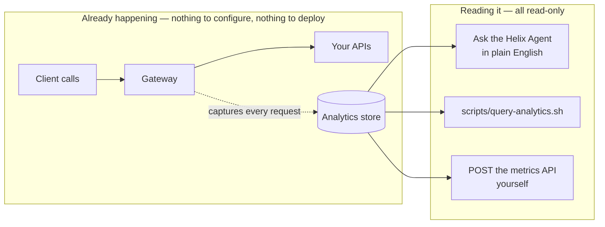

# Architecture — how analytics is captured, and how you read it

> [Overview](README.md) · [Business need](business-need.md) · **Architecture** · [Guides](guides.md) · [Agent prompt](helix-agent-prompt.md) · [Tests](tests.md) · [API reference](api-reference.md)

---

## What the gateway does here

This solution adds nothing to your APIs. Analytics is part of the platform: the
gateway records every request as it passes through, and your job is only to read
what's already there. So the "architecture" is two things — where the data comes
from, and the shape of the API you read it with.

For the full product documentation, see
[docs.digitalapi.ai/api-gateway](https://docs.digitalapi.ai/api-gateway).

## How a request is captured



For each call, the gateway records one row: the API and route, the app, developer
and product (when the API identifies its callers), the status code, the response
time, the request and response sizes, and more.

Recording happens in the gateway's **log phase**, after the response has been
sent, so it never slows a request down or changes what the caller gets. There is no
"turn on analytics" step, and no analytics block to add to a spec.

## The read API

One endpoint, one request shape:

```
POST /api/orgs/{orgId}/analytics/metrics/{metric}
{ startTime, endTime, dimensions[], filters[], aggregation, timeUnit, pageRequest }
```

| Part | What it is | Values |
|---|---|---|
| **metric** (in the path) | What to measure | `requests-count`, `requests-per-second`, `response-time`, `upstream-response-time`, `request-size`, `response-size`, `total-transfer-size` |
| **aggregation** | How to combine values — time and size metrics only; counts and rates take none | `AVG`, `MIN`, `MAX`, `SUM` |
| **dimensions** | What to group by | `env_name`, `app_id`, `app_name`, `product_name`, `api_name`, `route_id`, `route_name`, `api_path`, `request_method`, `response_status_code`, `upstream_path`, `developer` |
| **filters** | What to include — `{column, operator, value[]}`, all combined with AND | operators `EQ`, `NEQ`, `GT`, `GTE`, `LT`, `LTE`, `IN`, `LIKE`, `NOT_LIKE` |
| **pageRequest.sort** | Sort on `value` for a top-N list (busiest, slowest) | `ASC`, `DESC` |
| **timeUnit** | Turn a total into a series over time | `SECONDS`, `MINUTES`, `HOURS`, `DAYS` |

The exact request for each everyday question is in the
[query catalogue](charts.md); [`scripts/query-analytics.sh`](scripts/query-analytics.sh)
runs the headline set.

## What analytics can and can't tell you

**Can:** request counts, response time, sizes and rates — grouped and filtered by
any of the dimensions above.

**Can't** — don't build a report on these:

- **No percentiles.** Average, minimum and maximum only; `MAX` is your worst-case
  signal. True p95/p99 needs a tracing or metrics pipeline.
- **No quota-usage metric.** You can count 429s (rejections for being over a usage
  limit), but not "app X is at 80% of its limit". That lives on the product side.
- **No single-request lookup.** `X-Request-Id` is not a dimension. Narrow
  analytics to a slice, then match the id in your own logs.
- **No request or response bodies.** Analytics records who, which route, status,
  timing and size — never the content, by design.
- **No unlimited history.** Data is kept for a limited time, which limits how far
  back a query can reach. Confirm yours before relying on a long-range report: a
  query past it returns empty rather than an error.
- **No per-hop tracing inside your backend.** Analytics measures at the edge;
  `upstream-response-time` separates your backend's share of the time, but not the
  steps within it.

## Two things about attribution

You configure nothing for analytics, but two things about how an API is *already*
built decide how useful its rows are:

- **Identity → attribution.** An API that identifies its callers (`helix-auth`)
  produces rows with `app_name`, `developer` and `product_name` filled in. An
  anonymous API's traffic lands in an **unattributed** bucket. Adding identity is
  [solution 02](../02-oauth-jwt/) or [solution 01](../01-api-products/) — a
  decision about the API, not about analytics.
- **Templated routes → one row per route.** Group by `route_id` and a route like
  `/orders/{id}` is one row; group by `api_path` and it splits into one row per
  concrete id.

## No custom code needed

There is nothing to build. You don't run a telemetry pipeline, add a logger, or
write code. Custom tooling *would* be justified only for things the metrics API
deliberately doesn't do — percentiles, tracing inside your backend, or keeping data
longer than the platform does (export it) — and those are out of scope here.

## When to use this

Use it when you want to see request volume, response times or errors across your
APIs, products or apps — for incident triage, capacity planning, or a quick "who's
calling what" — and you want it now, read-only, with nothing to install.

Do not use it when you need **percentile response times**, **per-request traces**,
or **alerts on thresholds**. Those need a tracing, metrics or alerting stack, fed by
different data. The metrics API answers questions about totals and groups, not
those.

## Prerequisites

- APIs that already receive traffic — the queries read whatever exists.
- A control-plane bearer token, the same one the portal uses. Every call here only
  reads.
- For per-app, per-developer or per-product rows: APIs that identify their callers.
