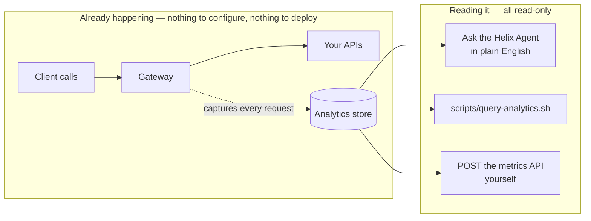

# Solution 04 — Analytics: read what your gateway already captured

**Overview** · [Business need](business-need.md) · [How it works](how-it-works.md) · [Install](install.md) · [Query catalogue](charts.md) · [Changelog](changelog.md)

---

**Every request through every API is captured automatically. You add nothing to
your APIs. This is how you pull the answers — requests in the last hour by API,
product, or app; your slowest and fastest APIs; error rates — out of the analytics
API.**

<!-- facts:begin -->

| | |
|---|---|
| **Setup time** | ~5 minutes (nothing to deploy) |
| **Difficulty** | Beginner |
| **Needs** | APIs that already receive traffic · a control-plane bearer token (the portal uses the same one) |
| **Plugins** | None — this one deploys nothing |
| **Build it with** | **[the Agent](install.md)** — recommended |

<!-- facts:end -->

## The point

You don't turn analytics on — it's **already recording every request**. You just
read it, three ways: **ask the agent in plain English** and it pulls the numbers and
draws a chart ([agent prompt](helix-agent-prompt.md)); run
[`scripts/query-analytics.sh`](scripts/query-analytics.sh) from the CLI; or POST the
[metrics-API queries](charts.md) yourself. Nothing is built or configured on your
APIs, and it's all read-only. Verified against a live gateway.

## The questions it answers

All for a chosen window (the last hour by default):

- **How many requests did each API get?** — and each **product**, and each **app**.
- **Which of my APIs is slowest / fastest?** — by average response time.
- **Where are the errors?** — counts by API and status code (4xx vs 5xx), who got 429s.
- **What's the traffic shape over time?** — per-hour (or per-minute/day) buckets.
- **What's driving data transfer / egress?** — bytes by API.

## What analytics can and can't tell you

**Can:** requests, response time, sizes, and rates — grouped and filtered by
`api_name`, `product_name`, `app_name`, `developer`, `route_id`, `route_name`,
`api_path`, `request_method`, `response_status_code`, `env_name`, `upstream_path`.

**Can't** (don't build a report on these):

- **No percentiles** — average / min / max only. `MAX` is your tail signal.
- **No quota-usage metric** — you can count 429s, not "% of a limit used."
- **No per-request lookup** — `X-Request-Id` isn't a dimension; match a single
  request in your own logs.
- **No request/response bodies** — metadata only, by design.

## Validation status

**Validated against a live gateway.** Every query in [`charts.md`](charts.md) and
[`scripts/query-analytics.sh`](scripts/query-analytics.sh) was run against the real
analytics API and returned the expected shapes — requests by API/app/product,
slowest/fastest by response time, and errors by status. See
[`validation/`](validation/). Point the script at your own org and token to see
your data.

## Related solutions

- **[02 — OAuth 2.0 with JWT](../02-oauth-jwt/)** — resolve identity on an API so
  its analytics attributes per app instead of landing in the unattributed bucket.
- **[01 — API Products](../01-api-products/)** — per-product rows and the 429
  counts come from having products with quotas.
