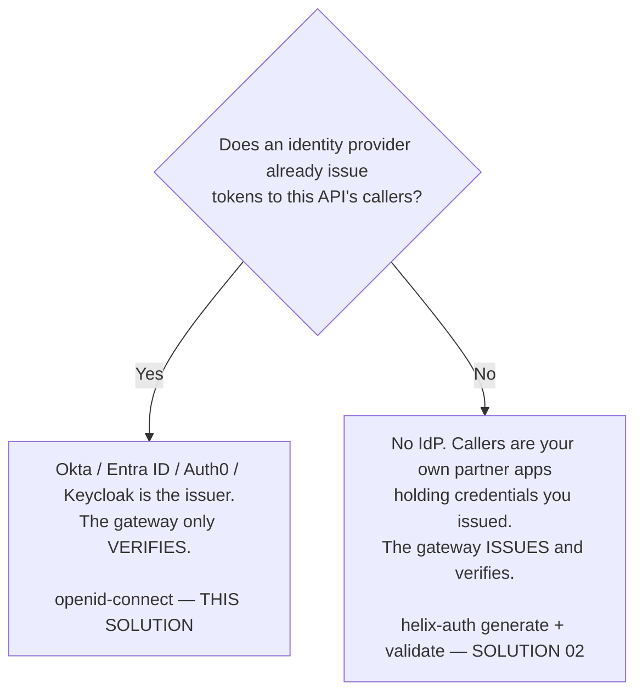
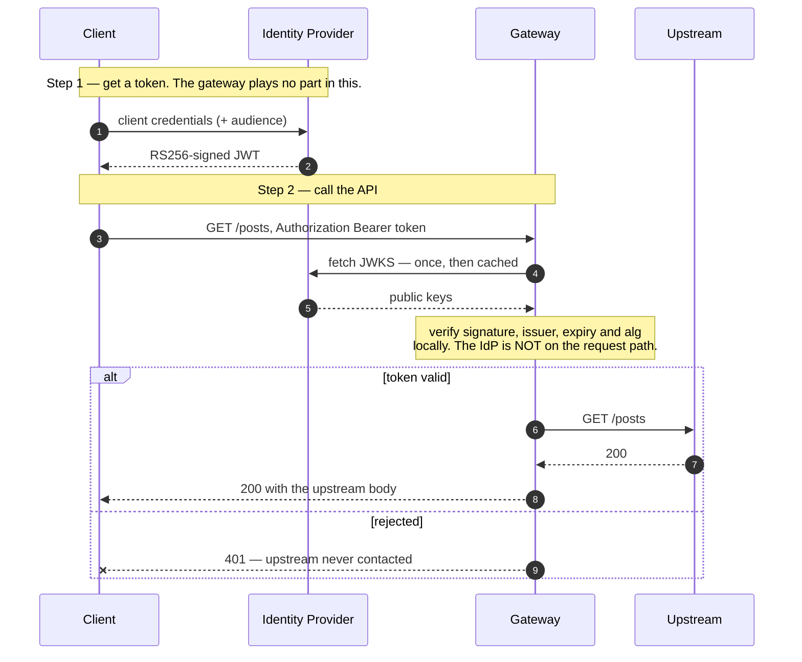

# Solution 05 — OAuth with Okta: verify the token, don't issue it

**Okta already mints your tokens. The gateway's only job is to verify them — and
four of the plugin's defaults are wrong for an API.**

| | |
|---|---|
| **Setup time** | ~20 minutes |
| **Difficulty** | 🟢 Beginner, *if* your build has the plugin — check that first |
| **Needs** | An org whose build includes **`openid-connect`** (not all do — see below) · an Okta tenant with an authorization server and an application · one upstream. The upstream here is public jsonplaceholder, so no backend of your own. |
| **Plugins** | `openid-connect` · `request-id` · `cors` |
| **Build it with** | 🤖 **[the Helix Agent](helix-agent-prompt.md)** — recommended · or import [`gateway/api-spec.yaml`](gateway/api-spec.yaml) |
| **Assets** | ✅ [Agent prompt](helix-agent-prompt.md) · ✅ [Architecture](architecture.md) · ✅ [Business need](business-need.md) · ✅ [Spec](gateway/) · ✅ [Tests](tests/) · ✅ [Validation](validation/) · ✅ [Manifest](solution.yaml) |

---

## The problem

> *"We already run Okta. Every employee, every partner, every service account is
> in there. But our APIs don't check Okta tokens — they check an API key we
> emailed someone in 2021. Security keeps asking when the APIs will 'join SSO'
> and the answer is always 'after the next release'."*

Three things are true at once, which is why this sits still for years:

1. **The identity provider is not the problem.** Okta is already deployed,
   already the system of record, already issuing tokens to anything that asks.
2. **The APIs are the problem.** Each service would need JWKS fetching, key
   caching, signature verification, issuer and expiry checks — written once per
   language, and wrong in a different way in each one.
3. **Nobody wants to be the team that writes crypto.** So it gets deferred, and
   the static key stays.

**Root cause:** token verification is being treated as application logic. It is
edge logic. The gateway is already parsing every request's headers; checking a
signature is a configuration line, not a project.

## Business need

Bring APIs under the identity provider the organisation has already bought and
already governs, without a release in any backend service. What that buys:

- **Deprovisioning actually works.** Disable a service account in Okta and its
  access ends when its current token expires. With an emailed static key,
  deprovisioning means finding every place the key was pasted.
- **One place to answer "who can call this".** Access is an Okta assignment, not
  a spreadsheet of keys.
- **Token lifetime replaces key lifetime.** A leaked bearer token is useful for
  minutes. A leaked static key is useful until someone notices.

Quantified in [business-need.md](business-need.md). No ROI figures are invented
here.

## Who issues the token — decide this first

This is the fork, and getting it wrong wastes the build.



**These are not two styles of the same thing.** They sit on opposite sides of
the issuer boundary, and they do not share a plugin.

### `helix-auth` cannot do this, and it is worth knowing why

`helix-auth` verifies tokens **it** minted, with a shared HMAC secret. Its
schema — read live from `GET /orgs/{orgId}/plugin-schemas` — is
`additionalProperties: false` over exactly `mode`, `validate_auth_type`,
`signing_secret`, `private_key`, `algorithm`, `token_ttl`, `payload`, `apikey`,
`client_id_claim`, `ctx_namespace`, `base64_secret`, `base64_private_key` and
`_meta`.

There is no JWKS URL, no issuer, no audience and no public-key field — and
because `additionalProperties` is `false`, you cannot add one. There is no
configuration of `helix-auth` that verifies an Okta token. `openid-connect` is
the plugin that verifies somebody else's tokens.

### Check the plugin exists in your org before you start

Builds vary, and this one matters more than usual:

```bash
GET /api/orgs/{orgId}/plugin-schemas?page=1&size=300
```

On the free-trial build the **entire Authentication category is `helix-auth`
alone** — `openid-connect` is not present, and neither is `forward-auth`, `opa`
or `authz-keycloak`. If your org is on that build, this solution cannot be
deployed there, and no amount of spec editing changes it. Confirm first.

## How a request flows



The important structural detail: **Okta is not on the request path.** The gateway
fetches the signing keys once, caches them, and verifies locally. Okta being slow
or briefly down does not make your API slow or down — until the key cache expires
and needs refreshing.

The second: **the auth block sits at the document root**, not per route. Solution
02 must scope its auth per route because `POST /oauth/token` has to stay reachable
without a token. Here there is no token endpoint — Okta issues, off-gateway — so
one root-level block covers every route and there is no hole to leave open.

## Build it with the Helix Agent

Recommended path, and it works on a **fresh org** — the agent *creates* the API on
a public upstream so you get real data immediately. Run it in steps; a single
mega-prompt pushes the default agent model into an oversized tool call. Full
prompt with all the constraints: [`helix-agent-prompt.md`](helix-agent-prompt.md).

**Step 1 — create the API and verify Okta's tokens on it**

```text
First, confirm the openid-connect plugin exists in this org and show me its
schema. If it is not present, stop and tell me — do not substitute another plugin.

Then create a new REST API called "Partner Posts API" and protect it with access
tokens issued by Okta. The gateway must only VERIFY these tokens; it must not
issue any. Do not use helix-auth — it verifies tokens it minted itself and has no
JWKS, issuer or audience field.

Upstream: <<UPSTREAM_URL>> (public, so it returns real data; I'll swap in my own
later). Routes, paths matching the upstream so no path rewrite: GET /posts,
GET /posts/{postId}, POST /posts.

Apply openid-connect at the API level, not per route — every route here needs a
token and there is no token endpoint to leave open.

Configure it with:
  discovery: <<OKTA_DISCOVERY_URL>>
  client_id: <<OKTA_CLIENT_ID>>
  client_secret: <<OKTA_CLIENT_SECRET>>
  bearer_only: true and unauth_action: deny  (this is an API — an unauthenticated
    call must get 401, NOT a 302 redirect to Okta's login page, which is what the
    default does. bearer_only also cannot be omitted: the deploy is rejected
    without it, asking for session.secret)
  use_jwks: true   (REQUIRED. Without it the plugin does not verify the JWT
    against the JWKS at all — it falls back to token introspection, the IdP has no
    introspection endpoint, and EVERY token gets a 401. It is not in the published
    plugin schema; add it anyway, it is accepted and persisted.)
  ssl_verify: true            (the default is false)
  accept_unsupported_alg: false and accept_none_alg: false  (the first defaults
    to true, which ignores the signature for unsupported algorithms)
  token_signing_alg_values_expected: RS256
  claim_validator.issuer.valid_issuers: [ <<OKTA_ISSUER_URL>> ]
  claim_validator.audience.required: true
  jwk_expires_in: 3600        (the default 86400 makes an Okta key rotation a
    day-long outage)
  set_id_token_header: false and set_userinfo_header: false  (both default true
    and are for browser flows; userinfo adds a round trip to Okta per request)

Also add request-id, and cors with authorization in the allowed headers.

We are editing a LIVE route object, not authoring an OpenAPI document — so do not
follow the spec-generator examples for plugin placement. Each route object in
routeSpec takes "plugins" as a TOP-LEVEL key, and inside it each plugin is
keyed by its own NAME:
  { "name": ..., "uri": ..., "methods": [...], "service_id": ...,
    "plugins": { "<plugin-name>": { <that plugin's own fields> } } }
Do not promote a plugin's fields into the plugins map: "plugins":
{"response_status": 202, "content_type": ...} is four broken plugins, not one
working one — the plugin name level is mandatory.
There must be no "x-helix-gateway" key anywhere in a route object: a live route
silently discards that wrapper, the write still reports success, and the route
deploys with no plugins at all.

Show me the spec, then call get_revision and show me
the stored routeSpec so I can see the plugins landed. Do not deploy yet.
```

**Step 2 — check it, then dry-run**

```text
Before deploying: re-read the openid-connect schema from this org and tell me,
field by field, whether every value I asked for is a real field with a legal
value. Call out anything you had to guess or drop.

use_jwks will NOT be in that schema. Keep it anyway — confirm it is still present
in the spec you are about to deploy, and do not "clean it up".

Then bind the upstream and run a dry-run deploy. Report exactly what it returns.
Do not deploy the revision — stop after the dry-run.
```

The agent fetches the real `openid-connect` schema from your org, proposes the
spec, and stops. See [AGENT-GUIDE.md](../../AGENT-GUIDE.md) for why the prompt is
shaped this way and what to do when the agent takes a wrong turn.

## Install it directly

1. Import [`gateway/api-spec.yaml`](gateway/api-spec.yaml).
2. Bind an upstream on the revision, per environment.
3. Replace the four `<OKTA_...>` placeholders with real values (see below).
4. Dry-run the deploy, then deploy the revision.
5. Run [`gateway/verify.sh`](gateway/verify.sh).

## Configuration

Four values, all literal. **This build does not resolve `<ENV:...>` or `${...}`** —
whatever string sits in the field is used verbatim. Fill them in and keep the
completed spec out of version control.

### `use_jwks: true` is required, and is not in the plugin schema

Omit it and **every token is rejected**, including a valid one, with
`error_description="no endpoint URI for introspection"`. Without it the plugin
does not verify the JWT against the JWKS at all — it falls back to asking the IdP
to introspect the token, and neither Auth0 nor an Okta org authorization server
publishes an introspection endpoint.

The field is absent from all 49 properties `GET /orgs/{orgId}/plugin-schemas`
returns. It is accepted because `openid-connect` does not set
`additionalProperties: false`, and it is persisted on the revision. **Do not
delete it because a schema dump doesn't list it.**

| Placeholder | Where it comes from |
|---|---|
| `<OKTA_DISCOVERY_URL>` | `https://<your-okta-domain>/oauth2/<authServerId>/.well-known/openid-configuration` — or `https://<your-okta-domain>/.well-known/openid-configuration` for the org authorization server |
| `<OKTA_ISSUER_URL>` | the `issuer` value **that discovery document reports**. Fetch it and copy it; do not retype it |
| `<OKTA_CLIENT_ID>` | the Okta application's client id |
| `<OKTA_CLIENT_SECRET>` | its client secret — schema-required even though local JWKS verification never uses it |

### The four defaults you must change

The plugin's defaults are tuned for browser login. For an API, four of them are
actively wrong, and each one fails in a way that does not look like a
configuration error.

| Field | Default | Why it's wrong here | Set to |
|---|---|---|---|
| `bearer_only` | `false` | The deploy is **rejected** — `property "session.secret" is required when "bearer_only" is false`. It is also what makes an unauthenticated call return 401 rather than a 302 redirect to the IdP login page. Checked at deploy, not import | `true` |
| `unauth_action` | `auth` | Says the same thing as `bearer_only` in newer vocabulary. **Redundant** while `bearer_only: true` is set — tested: no-token still returns 401, not 302. Set for clarity, not necessity | `deny` |
| `ssl_verify` | `false` | The gateway fetches Okta's signing keys — the entire root of trust — over TLS **without verifying Okta's certificate** | `true` |
| `accept_unsupported_alg` | `true` | Documented as *"Ignore ID token signature to accept unsupported signature algorithm"* | `false` |
| `claim_validator` | *(absent)* | Nothing beyond the signature is checked. Any correctly signed token from any issuer that plugin can reach is accepted | pin `issuer.valid_issuers` |

And one more that is not wrong, only slow to hurt: `jwk_expires_in` defaults to
`86400`. If Okta rotates a signing key, a day-long cache can reject freshly
issued, perfectly valid tokens until it expires. The spec sets `3600`.

## What the caller actually sees

All of the following were **executed against a deployed route** — see
[Validation status](#validation-status) for exactly which configuration proved which.

| Situation | Response |
|---|---|
| No `Authorization` header | `401` (**not** a redirect) |
| **`Bearer` prefix missing** | **`400`** — rejected at header parse, before the plugin |
| Not a JWT at all | `401` |
| Signature doesn't verify | `401` |
| `alg: none` | `401` |
| Token expired | `401` |
| `iss` from a different tenant | `401` |
| `iss` missing the issuer's trailing slash | `401` |
| `iss` claim absent | `401` |
| **`aud` claim absent** | **`403`** — note the different code |
| **`aud` present but a completely unrelated API** | **`200` — accepted.** See Gotchas |
| Valid token | `200`, upstream's body untouched |

Most failures are the same opaque `401`, which is correct — distinguishing them
would tell an attacker which part they got right — and genuinely hard for
integrators to self-diagnose. Tell them to send you the `X-Request-Id`.

**There are three rejection codes here, not one.** `401` for a bad, absent,
expired or wrong-issuer token; **`403`** when the `aud` claim is missing or
`required_scopes` isn't satisfied; and **`400`** when the `Authorization` value
carries no recognised scheme — that one is rejected at header parse, before
`openid-connect` runs at all. Alerting or client error handling that keys only on
`401` will miss two of the three.

And a **wrong** `aud` is not a failure at all: it returns `200`. See Gotchas.

The 401 also carries `www-authenticate: Bearer realm="apisix"`, which names the
underlying runtime. `realm` is a settable field on the plugin if you would rather
it didn't.

The upstream receives `X-Access-Token`. It does **not** receive `X-ID-Token` or
`X-Userinfo`: those default to on and are for browser flows, and
`set_userinfo_header` in particular adds a userinfo round trip to Okta on every
single request.

## Testing

[`gateway/verify.sh`](gateway/verify.sh) — seven cases, exits 0 only if all hold.

```bash
GATEWAY=https://<YOUR_GATEWAY_HOST> \
OKTA_TOKEN_URL=https://<your-okta-domain>/oauth2/<authServerId>/v1/token \
OKTA_CLIENT_ID=<CLIENT_ID> \
OKTA_CLIENT_SECRET=<CLIENT_SECRET> \
OKTA_SCOPE=<scope> \
./gateway/verify.sh
```

If your authorization server needs an `audience` parameter to issue a **JWT**
rather than an opaque token — Auth0 always does, and Okta custom authorization
servers usually do — set `TOKEN_AUDIENCE` too.

Two cases carry most of the value:

- **Case 1, no token → 401.** Specifically asserts it is *not* a 302. This is what
  proves you configured the plugin for an API and not for a browser.
- **Case 7, wrong issuer → 401.** Supply `OTHER_ISSUER_TOKEN` from a second
  authorization server. Without it you have proved that signatures are checked,
  not that *your* issuer is required.

The script paces itself between requests: environments commonly apply their own
rate limit, and a burst of test cases can return `429` that reads like a failure.

Full matrix in [tests/test-plan.yaml](tests/test-plan.yaml).

## Gotchas

- **The audience is not checked against a value — this was tested, and a token
  for a different API was accepted.** `claim_validator.audience` offers only
  `required` (the claim must be *present*), `claim` (which claim to read) and
  `match_with_client_id` (it must equal or contain the client id). There is **no
  field for an arbitrary expected audience**.

  Against a deployed route, a correctly signed, unexpired token whose `aud` was
  `https://totally-unrelated-api.example.com/` returned **`200`**. A token with
  **no** `aud` at all returned `403`. So `required: true` buys you "some audience
  claim exists" and nothing more.

  IdP *access* tokens carry `aud` = the API's audience URI, not the client id, so
  `match_with_client_id` does not apply to them either. **Pin
  `issuer.valid_issuers` and add `required_scopes`** — those are the controls that
  actually run. If several APIs in one tenant must be told apart, the scope is what
  distinguishes them, not the audience.
- **`valid_issuers` must match the discovery document character for character.**
  Tested: the same token, with the issuer's **trailing slash removed**, went from
  `200` to `401`. The IdP tested reports its issuer *with* a trailing slash. Fetch
  the discovery document and copy the `issuer` value; do not retype it.
- **`client_secret` is required but unused.** It is one of three required fields,
  yet local JWKS verification never touches it. It is used only if you switch to
  `introspection_endpoint`. Supply a real one anyway.
- **Opaque tokens can't work this way.** If your authorization server issues
  opaque access tokens rather than JWTs, there is no signature to verify locally
  and you must use `introspection_endpoint` — which puts Okta on the request path
  and changes the latency and availability story completely.
- **Key rotation is a cliff, not a slope.** The symptom is "every token started
  401ing at once and nothing on our side changed".
- **The 401 names the underlying runtime.** It carries
  `www-authenticate: Bearer realm="apisix"`. `realm` is a settable field on the
  plugin — set it if you would rather not advertise that.
- **Your environment may rate-limit before your auth does.** The environment used
  for testing applied its own 10-requests-per-minute cap, returning `429`. A test
  script that fires cases back to back will get 429s and misread them as failures.
  `verify.sh` paces itself; hand-run cases may not.

## When to use it

- An IdP already issues tokens to this API's callers.
- You want APIs governed by the same joiner/mover/leaver process as everything else.
- You need to retire static API keys without a backend release.
- Callers are services or partner apps that can do client credentials against Okta.

Not this solution if: no IdP exists and you'd be deploying Okta *for* this
(solution 02 is smaller), or your authorization server issues opaque tokens.

## Limitations

- **Authentication, not authorization.** The token proves the caller is who Okta
  says. It carries no per-route permissions in this configuration.
  `required_scopes` is the next step and is deliberately not used here.
- **No per-caller metering.** Okta-issued tokens do not resolve an app credential,
  so `api-product-enforcer` has nothing to meter. Quotas need solution 01's model.
- **The audience is not enforced by value.** Verified against a deployed route: a
  token minted for an unrelated API was accepted with `200`. `required: true` only
  asserts the claim is present. If you need to scope a token to one API among
  several in the same tenant, use `required_scopes` — the audience will not do it.
- **Token lifetime is Okta's decision, not yours.** There is no `token_ttl` here.
  That is the trade you make by not being the issuer.
- **No revocation on the request path.** Disabling an app in Okta stops *new*
  tokens; already-issued ones remain valid until they expire, unless you take on
  `introspection_endpoint` and its cost.
- **`openid-connect` is not on every build.** Confirm before designing around it.

## Validation status

| Stage | Status |
|---|---|
| Configuration generated | **YES** |
| Local validation | **PASS** — every plugin block checked against the org's live schema |
| Gateway dry-run | **PASS** |
| Gateway deployed | **DEPLOYED** |
| Functional tests | **PASS (7/7)** — this spec, deployed verbatim, exercised with a real IdP token |

Overall: **READY WITH WARNINGS.** It works, and it rejects everything it should.
The warning is the audience — not enforced by value, a property of the plugin
rather than of this spec. See [Gotchas](#gotchas).

Valid token → `200`; no token → `401`; forged signature, `alg:none` → `401`;
no auth scheme → `400`. Separately confirmed: a wrong `valid_issuers` rejects a
genuine token, `required_scopes` gates on granted scope, and a missing `aud`
returns `403`. Full record in [`validation/`](validation/).

**The IdP exercised was Auth0, not Okta** — same OIDC mechanism and an identical
configuration, but no Okta tenant was tested.

## Related solutions

- **[02 — OAuth 2.0 with JWT](../02-oauth-jwt/)** — the mirror image: the gateway
  *issues* the tokens with `helix-auth`. Read the fork above and pick one; you do
  not want both on the same route.
- **[01 — API Products](../01-api-products/)** — per-app quotas. Note the seam:
  metering keys off an app credential, which an Okta-issued token does not carry.
- **[04 — Analytics](../04-analytics/)** — every call is captured regardless of
  which auth plugin resolved it.
