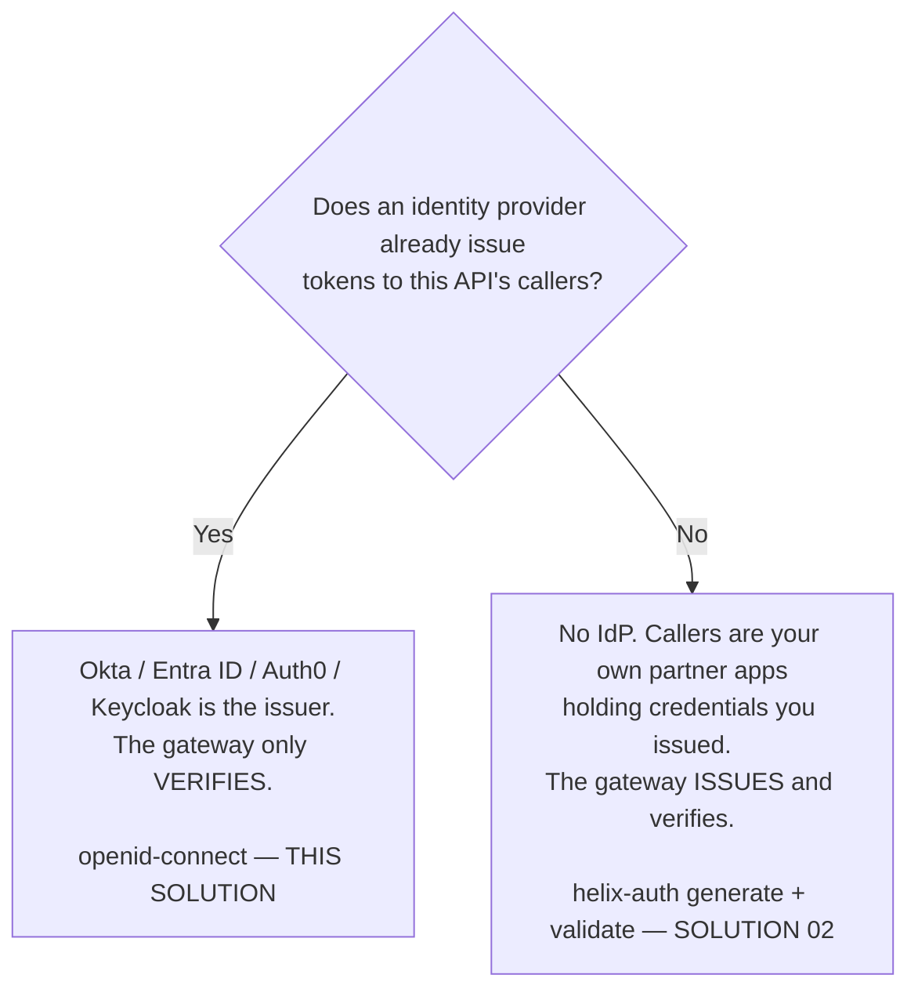
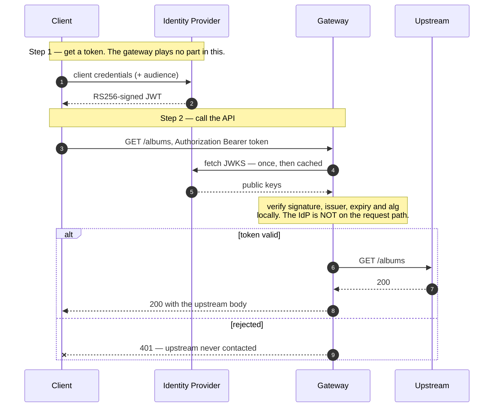

# Solution 05 — OAuth with Okta: verify the token, don't issue it

**Okta already mints your tokens. The gateway's only job is to verify them — and
four of the plugin's defaults are wrong for an API.**

| | |
|---|---|
| **Setup time** | ~20 minutes |
| **Difficulty** | 🟢 Beginner, *if* your build has the plugin — check that first |
| **Needs** | An org whose build includes **`openid-connect`** (not all do — see below) · an Okta tenant with an authorization server and an application · one upstream. The upstream here is public jsonplaceholder, so no backend of your own. |
| **Plugins** | `openid-connect` · `request-id` · `cors` |
| **Build it with** | 🤖 **[the Helix Agent](helix-agent-prompt.md)** — recommended · or import [`example/api-spec.yaml`](example/api-spec.yaml) |
| **Assets** | ✅ [Agent prompt](helix-agent-prompt.md) · ✅ [Architecture](architecture.md) · ✅ [Business need](business-need.md) · ✅ [Spec](example/) · ✅ [Tests](tests/) · ✅ [Manifest](solution.yaml) |

---

## The problem

> *"We already run Okta. Every employee, every partner, every service account is
> in there. But our APIs don't check Okta tokens — they check an API key we
> emailed someone in 2021. Security keeps asking when the APIs will 'join SSO'
> and the answer is always 'after the next release'."*

Three things are true at once, which is why this sits still for years:

1. **The identity provider is not the problem.** Okta is already deployed,
   already the system of record, already issuing tokens to anything that asks.
2. **The APIs are the problem.** Each service would need JWKS fetching, key
   caching, signature verification, issuer and expiry checks — written once per
   language, and wrong in a different way in each one.
3. **Nobody wants to be the team that writes crypto.** So it gets deferred, and
   the static key stays.

**Root cause:** token verification is being treated as application logic. It is
edge logic. The gateway is already parsing every request's headers; checking a
signature is a configuration line, not a project.

## Business need

The thirty-second version: [`business-need.md`](business-need.md).

| | Static keys, checked per service | Okta tokens, verified at the edge |
|---|---|---|
| **Who authenticates the caller** | each service, separately | the gateway, once |
| **Credential** | a static key with no expiry | an Okta token measured in minutes |
| **Deprovisioning** | find every copy of the key | disable the app in Okta |
| **Adding a caller** | issue and email a key | an Okta assignment |
| **Access review evidence** | a spreadsheet | the Okta review that already runs |
| **Rotating a signing key** | not a concept | Okta's schedule, absorbed by the gateway |
| **Code changed to adopt it** | every service | none |
| **Where auth bugs live** | N services, N implementations | one configuration block |

The mechanism that matters commercially: **the credential stops being a secret
you distribute and starts being a token the identity provider mints on demand.**
You cannot lose track of a token that expires in an hour, and you do not have to
find every copy of a thing that was never copied.

What this does **not** buy you:

- **Authorization.** The token proves identity, not which caller may do what.
  That is `required_scopes` or a policy engine, and a separate piece of work.
- **Metering.** An Okta-issued token resolves no app credential, so per-caller
  quotas don't follow from it. That is [solution 01](../01-api-products/)'s model,
  and the two do not compose for free.
- **Revocation before expiry.** Disabling a caller in Okta stops *new* tokens; the
  one it holds stays valid until it expires. Closing that gap means introspection,
  which puts Okta on the request path.
- **End-user identity**, if your callers use client credentials — that grant
  authenticates an application, not a person.

No ROI figure is claimed anywhere in this package. What is quantified is the
mechanism — credential lifetime, number of implementations, deprovisioning path.

## Who issues the token — decide this first

This is the fork, and getting it wrong wastes the build.


```mermaid
flowchart TD
    Q{"Does an identity provider already issue<br/>tokens to this API's callers?"}
    Q -->|Yes| V["Okta / Entra ID / Auth0 / Keycloak is the issuer.<br/>The gateway only VERIFIES.<br/><br/>openid-connect — THIS SOLUTION"]
    Q -->|No| I["No IdP. Callers are your own partner apps<br/>holding credentials you issued.<br/>The gateway ISSUES and verifies.<br/><br/>helix-auth generate + validate — SOLUTION 02"]
```

**These are not two styles of the same thing.** They sit on opposite sides of
the issuer boundary, and they do not share a plugin.

### `helix-auth` cannot do this, and it is worth knowing why

`helix-auth` verifies tokens **it** minted, with a shared HMAC secret. Its
schema — read live from `GET /orgs/{orgId}/plugin-schemas` — is
`additionalProperties: false` over exactly `mode`, `validate_auth_type`,
`signing_secret`, `private_key`, `algorithm`, `token_ttl`, `payload`, `apikey`,
`client_id_claim`, `ctx_namespace`, `base64_secret`, `base64_private_key` and
`_meta`.

There is no JWKS URL, no issuer, no audience and no public-key field — and
because `additionalProperties` is `false`, you cannot add one. There is no
configuration of `helix-auth` that verifies an Okta token. `openid-connect` is
the plugin that verifies somebody else's tokens.

### Check the plugin exists in your org before you start

Builds vary, and this one matters more than usual:

```bash
GET /api/orgs/{orgId}/plugin-schemas?page=1&size=300
```

On the free-trial build the **entire Authentication category is `helix-auth`
alone** — `openid-connect` is not present, and neither is `forward-auth`, `opa`
or `authz-keycloak`. If your org is on that build, this solution cannot be
deployed there, and no amount of spec editing changes it. Confirm first.

## How a request flows


```mermaid
sequenceDiagram
    autonumber
    participant C as Client
    participant IDP as Identity Provider
    participant GW as Gateway
    participant UP as Upstream

    Note over C,IDP: Step 1 — get a token. The gateway plays no part in this.
    C->>IDP: client credentials (+ audience)
    IDP-->>C: RS256-signed JWT

    Note over C,GW: Step 2 — call the API
    C->>GW: GET /albums, Authorization Bearer token
    GW->>IDP: fetch JWKS — once, then cached
    IDP-->>GW: public keys
    Note over GW: verify signature, issuer, expiry and alg<br/>locally. The IdP is NOT on the request path.

    alt token valid
        GW->>UP: GET /albums
        UP-->>GW: 200
        GW-->>C: 200 with the upstream body
    else rejected
        GW--xC: 401 — upstream never contacted
    end
```

The important structural detail: **Okta is not on the request path.** The gateway
fetches the signing keys once, caches them, and verifies locally. Okta being slow
or briefly down does not make your API slow or down — until the key cache expires
and needs refreshing.

The second: **the auth block sits at the document root**, not per route. Solution
02 must scope its auth per route because `POST /oauth/token` has to stay reachable
without a token. Here there is no token endpoint — Okta issues, off-gateway — so
one root-level block covers every route and there is no hole to leave open.

## Build it with the Helix Agent

Recommended path, about twenty minutes. The whole build is **one prompt** —
[`helix-agent-prompt.md`](helix-agent-prompt.md). Paste it as a single message and
replace the `{{...}}` values with your Okta authorization server's discovery URL
and the client id and secret of an Okta application.

It builds the API, its two routes and token verification on all of them. There
is no developer, product or app step, unlike [solution 02](../02-oauth-jwt/):
Okta issues the tokens, so the gateway holds no credential to hand out. Get a
token from Okta and call the API with it.
[AGENT-GUIDE.md](../../AGENT-GUIDE.md) carries the standing rules the prompt
assumes.

> **The agent puts your secrets in as placeholders unless told not to.** Left to
> itself it writes the client id and secret as `<ENV:...>`-style references
> rather than the values you gave it. This build resolves no such reference — the
> string is used verbatim, so the stored config holds a placeholder, not your
> application. That is what *"use the literal
> values for the configuration"* in the prompt is for; keep it. Do not commit the
> filled-in prompt or anything the agent writes from it.
>
> **Check what was stored, not what the agent said.** Read the revision back and
> confirm `openid-connect` is on every route or API-wide, carrying your real
> `client_id` and `client_secret`, `bearer_only: true`, your
> issuer in `claim_validator.issuer.valid_issuers` and `ssl_verify: true`. Then
> call it with **no token** first: a `401` is right; a `302` means it was
> configured for browser login.
>
> **Then add `use_jwks: true` yourself if it is missing — it usually will be.**
> The agent does not reliably store it: the field is absent from the published
> schema, and of two runs of this prompt on 2026-10-06 one left it out. Without
> it every real token gets a `401` — after an import, a dry-run and a deploy that
> all succeed. Ask the agent to add `use_jwks: true` to the `openid-connect`
> config and read the revision back. See [Configuration](#configuration).

### Why the prompt is worded the way it is

It asks for outcomes and names no plugin and no field: the agent reads the
`openid-connect` schema your org actually ships. Each sentence is there because
leaving it out produced something that deploys and is wrong:

- **"Use the literal values for the configuration."** Without it the agent swaps the
  client id and secret you supplied for `<ENV:...>` placeholders, without asking.
  This build uses that string verbatim, so what is stored is not your
  application. Said once, it embeds the values you gave it — confirmed on the
  2026-10-06 run.
- **"Refuse … never redirect it to a login page."** The plugin's defaults are for
  browser sign-in, where an unauthenticated visitor is sent to Okta. An API client
  receiving a `302` to an HTML login page fails in a way that looks like anything
  but an auth error. This is what leads to `bearer_only` — which the deploy
  rejects without, so it cannot quietly go missing.
- **"Verify each token locally against Okta's published jwks."** This is the
  outcome `use_jwks: true` delivers. The agent does not reliably turn it into the
  field — see the callout above — so it is the one setting to check and add by
  hand. The prompt still states the outcome; naming a field the agent cannot find
  in the schema is a workaround for an agent defect, not part of the solution.
- **The issuer, the algorithm and the certificate, as outcomes.** Each is a default
  that is wrong for an API and fails silently: without an issuer pin any correctly
  signed token from any issuer is accepted, and `ssl_verify` defaults to fetching
  the root of trust unverified. See [the four defaults you must
  change](#the-four-defaults-you-must-change).
- **No plugin-availability check.** `openid-connect` is not on every build — see
  [Check the plugin exists](#check-the-plugin-exists-in-your-org-before-you-start).
  Confirm it before you paste the prompt; an agent on a build without it may reach
  for `helix-auth`, which cannot verify Okta's tokens.
- **Verification arrives in step 2, not step 1.** The same shape as 02: the routes
  exist first, then policy is attached to them. Here there is no token endpoint to
  leave open, so the agent may put verification API-wide or on each route; both
  are correct.

What the prompt no longer carries: the `plugins`-map and `x-helix-gateway`
instructions, the `jwk_expires_in`, `set_userinfo_header` and
`claim_validator.audience` lines, and a second step asking the agent to re-audit
its own fields. See [Validation status](#validation-status) for what has been run.

## Variations

Follow-ups for the same session, once the build above is standing. Same register
as the prompt — say what you want to be true.

**Require a scope, not just a valid token**
```text
Only accept tokens that carry the "{{required_scope}}" scope, and tell me what a
token without it now returns.
```
This is also the only way to tell apart two APIs in the same Okta tenant — the
audience is not checked by value. See [Gotchas](#gotchas).

**Point at my real upstream**
```text
Point this at {{upstream_url}} instead, and leave the token verification exactly
as it is.
```

**My authorization server issues opaque tokens, not JWTs**
```text
This Okta authorization server issues opaque access tokens, so there is no
signature to verify locally. Change verification to ask Okta about each token
instead, and tell me what that does to latency and what happens when Okta is
unreachable.
```

**Use the org authorization server instead of a custom one**
```text
Switch to the org authorization server, whose discovery document is
{{okta_org_discovery_url}}, and pin the issuer to the one that document reports.
```

**Meter the callers as well**
```text
I want to sell access to this API in tiers and enforce the limits per caller.
```
Read [solution 01](../01-api-products/) first: its quota counts per app credential,
and an Okta-issued token resolves none. Expect the agent to have to tell you this.

## When the agent goes wrong

**Read the stored revision before you trust any of it.** Several of the failures
below deploy cleanly and report success, and the first sign is a caller's 401 —
or worse, a caller's 200.

| Symptom | Cause |
|---|---|
| Every token 401s, though the spec deployed cleanly | `use_jwks` was dropped. Reply: it's absent from the schema but accepted and persisted — put it back and redeploy. |
| The API redirects instead of refusing | `bearer_only` / `unauth_action` are at their defaults. Always test with no token first. |
| A token from a *different* authorization server returns 200 | No issuer pin. Ask for tokens to be accepted only from the issuer the discovery document reports. |
| The proposed config has `discovery`, `client_id`, `client_secret` and nothing else | The hardening was dropped. Ask the agent to compare what it stored, field by field, against the outcomes in the prompt. |
| The agent reaches for `helix-auth` | Reply: it has no JWKS URL, issuer or audience field and its schema is `additionalProperties: false`, so it cannot verify Okta's tokens. If `openid-connect` isn't in this org, stop — see [Check the plugin exists](#check-the-plugin-exists-in-your-org-before-you-start). |
| The agent proposes `jwt-auth` as a standalone plugin | It isn't one here — only a `validate_auth_type` of `helix-auth`, and it means a token *this* gateway signed. |
| The agent invents an `audience` field with an expected value | There isn't one. `claim_validator.audience` has `required`, `claim` and `match_with_client_id`. |
| The routes exist with **no plugins**, at exit 0 | The agent wrapped them in `x-helix-gateway` inside the live route object, which a live route silently discards. Ask for a plain top-level `plugins` map and read the revision back again; if it will not, import the spec. |
| Deploy fails: `Only INACTIVE revisions can be updated` | The revision is already live. Clone it or undeploy, then apply. |

## Install it directly

1. Import [`example/api-spec.yaml`](example/api-spec.yaml).
2. Bind an upstream on the revision, per environment.
3. Replace the four `<OKTA_...>` placeholders with real values (see below).
4. Dry-run the deploy, then deploy the revision.
5. Run [`example/verify.sh`](example/verify.sh).

## Configuration

Four values, all literal. **This build does not resolve `<ENV:...>` or `${...}`** —
whatever string sits in the field is used verbatim. Fill them in and keep the
completed spec out of version control.

### `use_jwks: true` is required, and is not in the plugin schema

Omit it and **every token is rejected**, including a valid one, with
`error_description="no endpoint URI for introspection"`. Without it the plugin
does not verify the JWT against the JWKS at all — it falls back to asking the IdP
to introspect the token, and neither Auth0 nor an Okta org authorization server
publishes an introspection endpoint.

The field is absent from all 49 properties `GET /orgs/{orgId}/plugin-schemas`
returns. It is accepted because `openid-connect` does not set
`additionalProperties: false`, and it is persisted on the revision. **Do not
delete it because a schema dump doesn't list it.**

| Placeholder | Where it comes from |
|---|---|
| `<OKTA_DISCOVERY_URL>` | `https://<your-okta-domain>/oauth2/<authServerId>/.well-known/openid-configuration` — or `https://<your-okta-domain>/.well-known/openid-configuration` for the org authorization server |
| `<OKTA_ISSUER_URL>` | the `issuer` value **that discovery document reports**. Fetch it and copy it; do not retype it |
| `<OKTA_CLIENT_ID>` | the Okta application's client id |
| `<OKTA_CLIENT_SECRET>` | its client secret — schema-required even though local JWKS verification never uses it |

### The four defaults you must change

The plugin's defaults are tuned for browser login. For an API, four of them are
actively wrong, and each one fails in a way that does not look like a
configuration error.

| Field | Default | Why it's wrong here | Set to |
|---|---|---|---|
| `bearer_only` | `false` | The deploy is **rejected** — `property "session.secret" is required when "bearer_only" is false`. It is also what makes an unauthenticated call return 401 rather than a 302 redirect to the IdP login page. Checked at deploy, not import | `true` |
| `unauth_action` | `auth` | Says the same thing as `bearer_only` in newer vocabulary. **Redundant** while `bearer_only: true` is set — tested: no-token still returns 401, not 302. Set for clarity, not necessity | `deny` |
| `ssl_verify` | `false` | The gateway fetches Okta's signing keys — the entire root of trust — over TLS **without verifying Okta's certificate** | `true` |
| `accept_unsupported_alg` | `true` | Documented as *"Ignore ID token signature to accept unsupported signature algorithm"* | `false` |
| `claim_validator` | *(absent)* | Nothing beyond the signature is checked. Any correctly signed token from any issuer that plugin can reach is accepted | pin `issuer.valid_issuers` |

And one more that is not wrong, only slow to hurt: `jwk_expires_in` defaults to
`86400`. If Okta rotates a signing key, a day-long cache can reject freshly
issued, perfectly valid tokens until it expires. The spec sets `3600`.

## What the caller actually sees

All of the following were **executed against a deployed route** — see
[Validation status](#validation-status) for exactly which configuration proved which.

| Situation | Response |
|---|---|
| No `Authorization` header | `401` (**not** a redirect) |
| **`Bearer` prefix missing** | **`400`** — rejected at header parse, before the plugin |
| Not a JWT at all | `401` |
| Signature doesn't verify | `401` |
| `alg: none` | `401` |
| Token expired | `401` |
| `iss` from a different tenant | `401` |
| `iss` missing the issuer's trailing slash | `401` |
| `iss` claim absent | `401` |
| **`aud` claim absent** | **`403`** — note the different code |
| **`aud` present but a completely unrelated API** | **`200` — accepted.** See Gotchas |
| Valid token | `200`, upstream's body untouched |

Most failures are the same opaque `401`, which is correct — distinguishing them
would tell an attacker which part they got right — and genuinely hard for
integrators to self-diagnose. Tell them to send you the `X-Request-Id`.

**There are three rejection codes here, not one.** `401` for a bad, absent,
expired or wrong-issuer token; **`403`** when the `aud` claim is missing or
`required_scopes` isn't satisfied; and **`400`** when the `Authorization` value
carries no recognised scheme — that one is rejected at header parse, before
`openid-connect` runs at all. Alerting or client error handling that keys only on
`401` will miss two of the three.

And a **wrong** `aud` is not a failure at all: it returns `200`. See Gotchas.

The 401 also carries `www-authenticate: Bearer realm="apisix"`, which names the
underlying runtime. `realm` is a settable field on the plugin if you would rather
it didn't.

The upstream receives `X-Access-Token`. It does **not** receive `X-ID-Token` or
`X-Userinfo`: those default to on and are for browser flows, and
`set_userinfo_header` in particular adds a userinfo round trip to Okta on every
single request.

## Testing

[`example/verify.sh`](example/verify.sh) — seven cases, exits 0 only if all hold.

```bash
GATEWAY=https://<YOUR_GATEWAY_HOST> \
OKTA_TOKEN_URL=https://<your-okta-domain>/oauth2/<authServerId>/v1/token \
OKTA_CLIENT_ID=<CLIENT_ID> \
OKTA_CLIENT_SECRET=<CLIENT_SECRET> \
OKTA_SCOPE=<scope> \
./example/verify.sh
```

If your authorization server needs an `audience` parameter to issue a **JWT**
rather than an opaque token — Auth0 always does, and Okta custom authorization
servers usually do — set `TOKEN_AUDIENCE` too.

Two cases carry most of the value:

- **Case 1, no token → 401.** Specifically asserts it is *not* a 302. This is what
  proves you configured the plugin for an API and not for a browser.
- **Case 7, wrong issuer → 401.** Supply `OTHER_ISSUER_TOKEN` from a second
  authorization server. Without it you have proved that signatures are checked,
  not that *your* issuer is required.

The script paces itself between requests: environments commonly apply their own
rate limit, and a burst of test cases can return `429` that reads like a failure.

Full matrix in [tests/test-plan.yaml](tests/test-plan.yaml).

## Gotchas

- **The audience is not checked against a value — this was tested, and a token
  for a different API was accepted.** `claim_validator.audience` offers only
  `required` (the claim must be *present*), `claim` (which claim to read) and
  `match_with_client_id` (it must equal or contain the client id). There is **no
  field for an arbitrary expected audience**.

  Against a deployed route, a correctly signed, unexpired token whose `aud` was
  `https://totally-unrelated-api.example.com/` returned **`200`**. A token with
  **no** `aud` at all returned `403`. So `required: true` buys you "some audience
  claim exists" and nothing more.

  IdP *access* tokens carry `aud` = the API's audience URI, not the client id, so
  `match_with_client_id` does not apply to them either. **Pin
  `issuer.valid_issuers` and add `required_scopes`** — those are the controls that
  actually run. If several APIs in one tenant must be told apart, the scope is what
  distinguishes them, not the audience.
- **`valid_issuers` must match the discovery document character for character.**
  Tested: the same token, with the issuer's **trailing slash removed**, went from
  `200` to `401`. The IdP tested reports its issuer *with* a trailing slash. Fetch
  the discovery document and copy the `issuer` value; do not retype it.
- **`client_secret` is required but unused.** It is one of three required fields,
  yet local JWKS verification never touches it. It is used only if you switch to
  `introspection_endpoint`. Supply a real one anyway.
- **Opaque tokens can't work this way.** If your authorization server issues
  opaque access tokens rather than JWTs, there is no signature to verify locally
  and you must use `introspection_endpoint` — which puts Okta on the request path
  and changes the latency and availability story completely.
- **Key rotation is a cliff, not a slope.** The symptom is "every token started
  401ing at once and nothing on our side changed".
- **The 401 names the underlying runtime.** It carries
  `www-authenticate: Bearer realm="apisix"`. `realm` is a settable field on the
  plugin — set it if you would rather not advertise that.
- **Your environment may rate-limit before your auth does.** The environment used
  for testing applied its own 10-requests-per-minute cap, returning `429`. A test
  script that fires cases back to back will get 429s and misread them as failures.
  `verify.sh` paces itself; hand-run cases may not.

## When to use it

- An IdP already issues tokens to this API's callers.
- You want APIs governed by the same joiner/mover/leaver process as everything else.
- You need to retire static API keys without a backend release.
- Callers are services or partner apps that can do client credentials against Okta.

Not this solution if: no IdP exists and you'd be deploying Okta *for* this
(solution 02 is smaller), or your authorization server issues opaque tokens.

## Limitations

- **Authentication, not authorization.** The token proves the caller is who Okta
  says. It carries no per-route permissions in this configuration.
  `required_scopes` is the next step and is deliberately not used here.
- **No per-caller metering.** Okta-issued tokens do not resolve an app credential,
  so `api-product-enforcer` has nothing to meter. Quotas need solution 01's model.
- **The audience is not enforced by value.** Verified against a deployed route: a
  token minted for an unrelated API was accepted with `200`. `required: true` only
  asserts the claim is present. If you need to scope a token to one API among
  several in the same tenant, use `required_scopes` — the audience will not do it.
- **Token lifetime is Okta's decision, not yours.** There is no `token_ttl` here.
  That is the trade you make by not being the issuer.
- **No revocation on the request path.** Disabling an app in Okta stops *new*
  tokens; already-issued ones remain valid until they expire, unless you take on
  `introspection_endpoint` and its cost.
- **`openid-connect` is not on every build.** Confirm before designing around it.

## Validation status

| Stage | Status |
|---|---|
| Configuration generated | **YES** |
| Local validation | **PASS** — every plugin block checked against the org's live schema |
| Gateway dry-run | **PASS on 1.0.0** — the `/posts` routes. Not re-run on 1.1.0 |
| Gateway deployed | **DEPLOYED on 1.0.0** — not re-run on 1.1.0 |
| Functional tests | **PASS (7/7) on 1.0.0** — that spec, deployed verbatim, exercised with a real IdP token. 1.1.0 moved the routes to `GET`/`POST /albums` and dropped `GET /posts/{postId}`; the `openid-connect` block is unchanged, and `verify.sh` has not been run against it |
| Agent-mode run | **PASS WITH ONE MANUAL FIX** (2026-10-06, operator-reported, Auth0 tenant) — every other field stored as asked, credentials as literals; `use_jwks: true` missing from 1 of 2 revisions and must be checked and added by hand. The earlier field-by-field prompt passed on 2026-09-21 |

Overall: **READY WITH WARNINGS.** It works, and it rejects everything it should.
The warning is the audience — not enforced by value, a property of the plugin
rather than of this spec. See [Gotchas](#gotchas).

Valid token → `200`; no token → `401`; forged signature, `alg:none` → `401`;
no auth scheme → `400`. Separately confirmed: a wrong `valid_issuers` rejects a
genuine token, `required_scopes` gates on granted scope, and a missing `aud`
returns `403`.

**The IdP exercised was Auth0, not Okta** — same OIDC mechanism and an identical
configuration, but no Okta tenant was tested.

## Related solutions

- **[02 — OAuth 2.0 with JWT](../02-oauth-jwt/)** — the mirror image: the gateway
  *issues* the tokens with `helix-auth`. Read the fork above and pick one; you do
  not want both on the same route.
- **[01 — API Products](../01-api-products/)** — per-app quotas. Note the seam:
  metering keys off an app credential, which an Okta-issued token does not carry.
- **[04 — Analytics](../04-analytics/)** — every call is captured regardless of
  which auth plugin resolved it.
