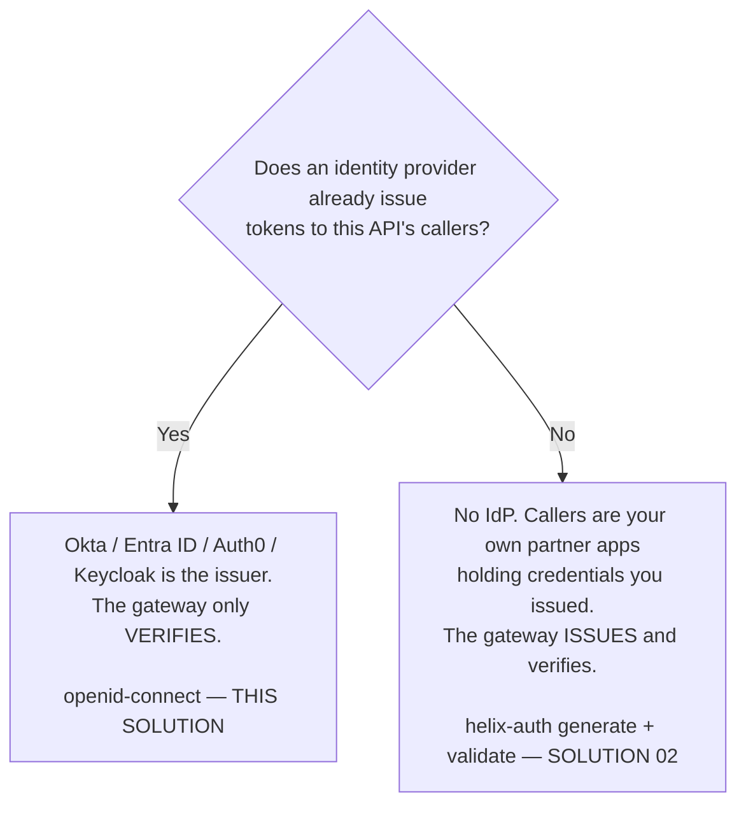
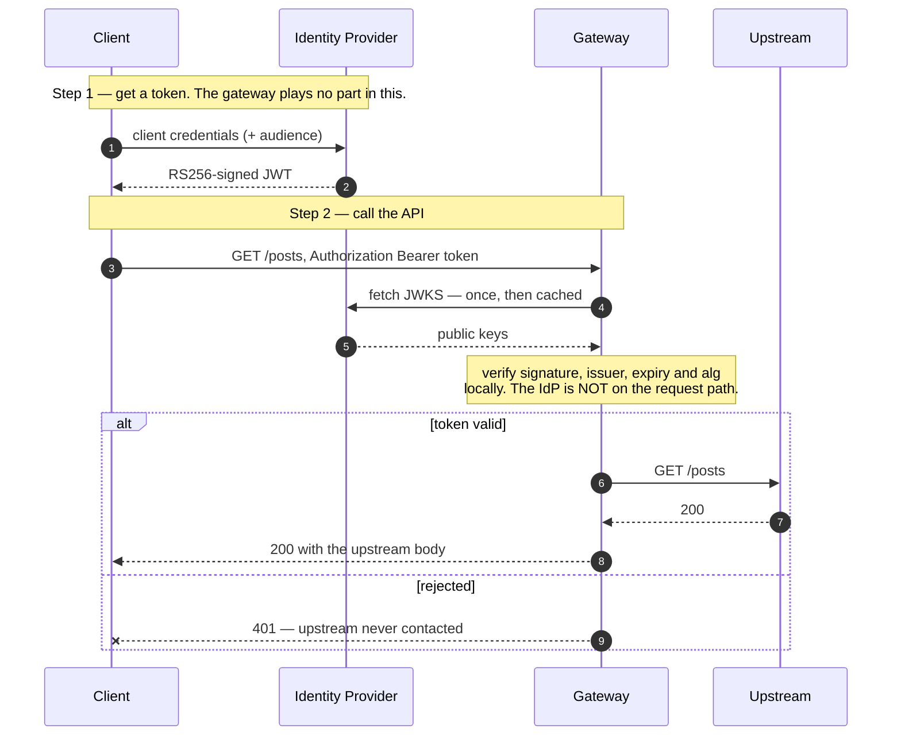

# Architecture — checking Okta-issued tokens at the gateway

> [Overview](README.md) · [Business need](business-need.md) · **Architecture** · [Guides](guides.md) · [Agent prompt](helix-agent-prompt.md) · [Tests](tests.md) · [API reference](api-reference.md)

---

## What the gateway does here

The gateway takes on exactly one job: it **checks** tokens. It never issues them.
Okta keeps the private signing key, the list of users and apps, the rules for who
gets a token, and how long each token lasts. The gateway keeps a cached copy of
Okta's *public* keys and a setting that says which issuer it trusts.

For every request it answers four questions:

1. Is there a token, sent the right way (`Authorization: Bearer <token>`)?
2. Was it signed by Okta's key?
3. Did it come from the issuer this API trusts?
4. Has it expired?

Any "no" ends the request at the gateway. Your backend does not change, and never
sees a request that failed.

The plugin that does this is **`openid-connect`**. It is not available in every
org. Check that yours has it before you start. See [Prerequisites](#prerequisites).

For the full list of fields on every plugin, see
[docs.digitalapi.ai/api-gateway](https://docs.digitalapi.ai/api-gateway).

## The words used on this page

| Word | What it means |
|---|---|
| **Issuer** | The service that creates and signs tokens. Here, an Okta authorization server. |
| **Access token** | A signed, short-lived JWT the caller gets from Okta and sends on every request. |
| **Discovery document** | A public file at a well-known URL where Okta lists its issuer name and where its public keys live. |
| **JWKS** | Okta's published set of public keys. The gateway uses them to check signatures. |
| **Introspection** | The other way to check a token: ask the issuer about every token. Not used here. |

## Who issues the token — decide this first

This is the fork, and choosing the wrong side wastes the build.



**These are not two styles of the same thing.** They sit on opposite sides of the
issuer boundary and do not share a plugin. One more branch sits under "Yes": if
your authorization server issues **opaque** tokens rather than JWTs, there is no
signature to check locally. You would need `openid-connect` with
`introspection_endpoint` instead, which puts Okta back on the request path. That
is a different design with different speed and availability, and is not what this
package builds.

### Why `helix-auth` cannot do this

`helix-auth` checks tokens **it** created, using a shared secret it also signs
with. Its schema, read live from your org's plugin list, allows exactly these
fields and no others (`additionalProperties: false`): `mode`, `validate_auth_type`,
`signing_secret`, `private_key`, `algorithm`, `token_ttl`, `payload`, `apikey`,
`client_id_claim`, `ctx_namespace`, `base64_secret`, `base64_private_key` and
`_meta`.

There is no field for a JWKS URL, an issuer or an audience, and none can be added.
To check an Okta token you need the public half of a key pair you never hold,
fetched from a URL and rotated on Okta's schedule. No configuration of
`helix-auth` does that. `openid-connect` is the plugin that checks somebody
else's tokens.

## How a request flows



**Okta is not on the request path.** The gateway fetches Okta's public keys once,
caches them for `jwk_expires_in` seconds, and checks every token itself. A slow or
briefly unavailable Okta does not make your API slow or unavailable, until the
cache expires and the keys need fetching again.

**Getting a token never touches the gateway.** Login rules, MFA, lockout, grant
types and token lifetime all stay in Okta, the system that already owns them.

### Local checking is not the default — `use_jwks: true` turns it on

`openid-connect` can check a token in two ways: against the issuer's published
keys (local), or by asking the issuer about each token (introspection). It only
checks locally when **`use_jwks: true`** is set. Without it, the plugin tries to
introspect. Neither Auth0 nor an Okta org authorization server publishes an
introspection endpoint, so there is nothing to ask, and **every token is
rejected**, valid ones included, with this header:

```
www-authenticate: Bearer realm="…", error="invalid_token",
                  error_description="no endpoint URI for introspection"
```

`use_jwks` is **not** among the fields your org's plugin schema lists. It is
accepted anyway, because `openid-connect` does not forbid extra fields, and it is
saved on the revision. Do not delete it because a schema listing doesn't show it.

### One block for the whole API

The `openid-connect` block sits at the **top of the spec**, so it covers every
route. [Solution 02](../02-oauth-jwt/) has to attach its check route by route,
because its token endpoint must stay reachable without a token. Here there is no
token endpoint (Okta issues tokens elsewhere), so one API-wide block leaves no
route unprotected by accident.

## Reading a rejection

There are **three** rejection codes, not one. Error handling or alerts that only
look for 401 will miss two of them.

| Status | What it means | Where to look |
|---|---|---|
| **401** | The token is missing, not a JWT, badly signed, unsigned (`alg: none`), expired, or from the wrong issuer | Most of these look identical on purpose. Ask the caller for the `X-Request-Id`. |
| **403** | The token checked out, but its `aud` claim is missing, or `required_scopes` is set and the token lacks a scope | The token's claims |
| **400** | The `Authorization` value has no recognised scheme (the `Bearer ` prefix is missing). Rejected before the plugin runs. | The caller's header format |
| **200 with a wrong `aud`** | Accepted. The audience is only checked for presence, not value. | See [Settings worth extra attention](#settings-worth-extra-attention) |
| **302** to Okta's login page | The plugin is set up for browser sign-in, not for an API | `bearer_only: true` (and `unauth_action: deny`) |

Two operator-side patterns are worth alerting on. A sudden, uniform rise in 401s
usually means Okta rotated its signing key while the gateway still had the old
keys cached. And a 302 means the plugin is configured for a browser.

The 401 carries `www-authenticate: Bearer realm="…"`, and the default realm names
the underlying gateway software. `realm` is a field you can set if you would
rather it didn't.

## Execution order

Plugins run **phase first, then by priority within a phase**, not in the order
they appear in the file.

| Phase | Plugin | Priority | What it produces | What it needs |
|---|---|---|---|---|
| rewrite | `request-id` | 12015 | an `X-Request-Id` header | — |
| access | `openid-connect` | 2599 | a checked identity; `X-Access-Token` sent upstream | the `Authorization` header |
| header filter | `cors` | 4000 | CORS response headers | — |

`openid-connect` runs in the access phase, so a rejected request is refused before
the upstream is contacted. No plugin here reads a value another plugin produces,
so there is no ordering dependency to get wrong. (Contrast
[solution 01](../01-api-products/), where the quota check depends on the identity
step running first.)

## Where the secrets live

Three of the four values you fill in are not secret: the discovery URL, the issuer
URL and the client id. Only `client_secret` is sensitive, and **local checking
never uses it**. The plugin requires it (with `client_id` and `discovery`), and it
is used only on the introspection path.

The control plane stores `client_secret` encrypted. It is still a plain value in
the spec you import: the gateway does **not** resolve `<ENV:...>` or `${...}`, so
whatever string is in the field is used exactly as written. Replace the
placeholder before you deploy and keep the completed spec out of version control.

Okta's private signing key never appears anywhere in this setup. That is the main
security gain over [solution 02](../02-oauth-jwt/)'s shared secret, where anything
that can check a token can also sign one.

## No custom code needed

| What you need | How it is done | Why not write code for it |
|---|---|---|
| Check locally instead of asking Okta | `use_jwks: true` | Not the default. Without it every token is rejected. |
| Check an RS256 signature | `openid-connect` | Per-service token code is exactly what this solution removes |
| Fetch and cache Okta's public keys | `discovery`, cached for `jwk_expires_in` | Hand-written key caching is where key-rotation outages come from |
| Refuse tokens from other issuers | `claim_validator.issuer.valid_issuers` | — |
| Refuse unsigned tokens | `accept_none_alg: false`, `accept_unsupported_alg: false`, `token_signing_alg_values_expected: RS256` | — |
| Answer API callers with 401, not a login redirect | `bearer_only: true`, `unauth_action: deny` | — |

**What this deliberately does not try:** pinning the audience to one value. The
plugin has no field for an expected audience. Rather than suggest a check that
isn't running, this solution pins the issuer and says so.

## When to use this

Use it when:

- an identity provider already issues tokens to this API's callers,
- you want APIs covered by the same joiner/mover/leaver process as everything else,
- you need to retire static API keys without a backend release, or
- callers are services or partner apps that can get tokens from Okta themselves.

Do not use it when:

- no identity provider exists and you would be deploying Okta just for this.
  [Solution 02](../02-oauth-jwt/) is smaller.
- your authorization server issues opaque tokens. There is nothing to check
  locally.
- you need to tell apart several APIs in one Okta tenant by audience. The audience
  is not checked by value; use `required_scopes`.
- you need per-app quotas. A token Okta issued does not identify a gateway app, so
  [solution 01](../01-api-products/)'s quota has nothing to count against.

## Prerequisites

- **An org that includes `openid-connect`.** Check first:
  `GET /api/orgs/{orgId}/plugin-schemas?page=1&size=300`. On the free-trial build
  the whole Authentication category is `helix-auth` alone, so this solution cannot
  be deployed there, and no spec edit changes that.
- An Okta tenant with an authorization server that issues **JWT** access tokens.
- An Okta application allowed to use the grant your callers will use (for
  services, client credentials).
- An upstream bound to the revision for the environment you deploy to.

## Settings worth extra attention

**The audience is not checked against a value.** `claim_validator.audience` has
only `required` (the claim must be present), `claim` (which claim to read) and
`match_with_client_id` (it must equal the client id). There is no field for an
expected audience. Tested against a deployed route: a correctly signed token whose
`aud` named a completely unrelated API returned **200**. A token with no `aud` at
all returned 403. Access tokens carry the API's audience in `aud`, not the client
id, so `match_with_client_id` does not help either. **Pin the issuer and add
`required_scopes`** — those are the checks that actually run.

**The issuer must match character for character.** Tested: the same token, with
the issuer's trailing slash removed from `valid_issuers`, went from 200 to 401.
Copy the `issuer` value out of the discovery document; do not retype it.

**A key rotation is a cliff, not a slope.** If Okta rotates its signing key, the
gateway keeps rejecting new, valid tokens until its cached keys expire.
`jwk_expires_in` defaults to 86400 (a day); this spec sets 3600. The symptom is
"every token started failing at once and nothing on our side changed".

**Revocation waits for expiry.** Disabling an app in Okta stops *new* tokens. A
token already issued stays valid until it expires, unless you switch to
introspection and accept its cost.
