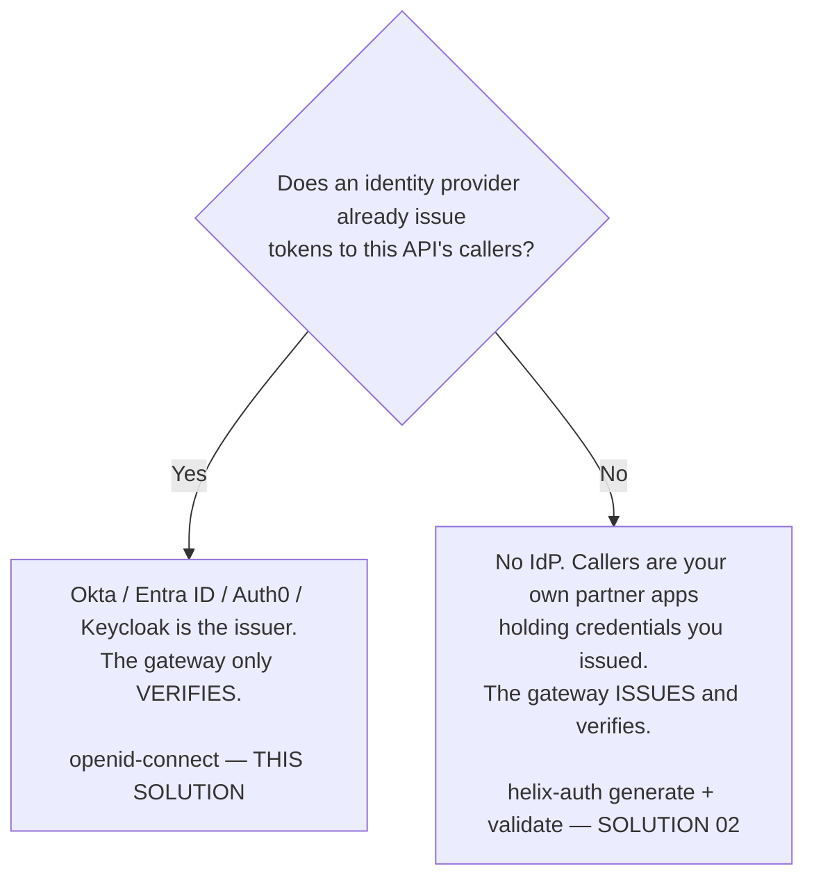

# How it works — Solution 05 — OAuth with Okta: verify the token, don't issue it

[Overview](readme.md) · [Business need](business-need.md) · **How it works** · [Install](install.md) · [Configuration](configuration.md) · [Test & verify](testing.md) · [Changelog](changelog.md)

---

## Who issues the token — decide this first

This is the fork, and getting it wrong wastes the build.



**These are not two styles of the same thing.** They sit on opposite sides of
the issuer boundary, and they do not share a plugin.

### `helix-auth` cannot do this, and it is worth knowing why

`helix-auth` verifies tokens **it** minted, with a shared HMAC secret. Its
schema — read live from `GET /orgs/{orgId}/plugin-schemas` — is
`additionalProperties: false` over exactly `mode`, `validate_auth_type`,
`signing_secret`, `private_key`, `algorithm`, `token_ttl`, `payload`, `apikey`,
`client_id_claim`, `ctx_namespace`, `base64_secret`, `base64_private_key` and
`_meta`.

There is no JWKS URL, no issuer, no audience and no public-key field — and
because `additionalProperties` is `false`, you cannot add one. There is no
configuration of `helix-auth` that verifies an Okta token. `openid-connect` is
the plugin that verifies somebody else's tokens.

### Check the plugin exists in your org before you start

Builds vary, and this one matters more than usual:

```bash
GET /api/orgs/{orgId}/plugin-schemas?page=1&size=300
```

On the free-trial build the **entire Authentication category is `helix-auth`
alone** — `openid-connect` is not present, and neither is `forward-auth`, `opa`
or `authz-keycloak`. If your org is on that build, this solution cannot be
deployed there, and no amount of spec editing changes it. Confirm first.

## The two flows

### Flow 1 — obtaining a token (the gateway is absent)

```
┌──────────┐                                   ┌──────────────┐
│  CLIENT  │                                   │     OKTA     │
└────┬─────┘                                   └──────┬───────┘
     │  POST /oauth2/<authServerId>/v1/token          │
     │  Authorization: Basic base64(id:secret)        │
     │  grant_type=client_credentials                 │
     ├───────────────────────────────────────────────►│
     │                                                │ verify the app
     │                                                │ sign with the
     │                                                │ current private key
     │  ◄─────────────────────────────────────────────┤
     │  { access_token: <RS256 JWT>, expires_in }      │
```

Nothing in this exchange touches the gateway. That is not an implementation
detail — it is the entire architectural claim. Credential handling, MFA policy,
lockout, grant types and token lifetime all stay in the system that already owns
them.

### Flow 2 — calling the API

```
┌──────────┐            ┌────────────────────────┐          ┌──────────┐
│  CLIENT  │            │        GATEWAY         │          │ UPSTREAM │
└────┬─────┘            └───────────┬────────────┘          └────┬─────┘
     │  GET /posts                  │                            │
     │  authorization: Bearer <jwt> │                            │
     ├─────────────────────────────►│                            │
     │                              │ ACCESS PHASE               │
     │                              │ openid-connect (2599)      │
     │                              │  ├ JWKS in cache?          │
     │                              │  │   no → fetch once from  │
     │                              │  │        Okta, cache      │
     │                              │  │        (jwk_expires_in) │
     │                              │  ├ RS256 signature valid?  │
     │                              │  ├ iss ∈ valid_issuers?    │
     │                              │  ├ exp in the future?      │
     │                              │  └ aud claim present?      │
     │                              │                            │
     │  ◄─── 401 ───────────────────┤ any check fails            │
     │                              │                            │
     │                              │ pass → request-id (12015)  │
     │                              ├───────────────────────────►│
     │                              │  X-Request-Id              │
     │                              │  X-Access-Token            │
     │  ◄───────────────────────────┼────────────────────────────┤
     │           200                │                            │
```

**This local-verification mode is not the default, and selecting it is one line.**
`openid-connect` decides between two mechanisms: verify the JWT itself against the
issuer's published keys, or call the issuer and ask (*introspection*). It picks the
first only when `use_jwks: true` is set. Left out, it introspects — and neither
Auth0 nor an Okta org authorization server publishes an introspection endpoint, so
there is nothing to call and every token is rejected:

```
www-authenticate: Bearer realm="apisix", error="invalid_token",
                  error_description="no endpoint URI for introspection"
```

The field is absent from the plugin schema this build publishes. It is accepted
and persisted regardless. Verified by deploying with and without it.

The structural consequence: **the IdP is off the request path.** After the first
JWKS fetch, verification is local arithmetic. An Okta outage does not take the
API down — until the key cache expires and a refresh is required, which is why
`jwk_expires_in` is a availability knob as much as a security one.

## Execution order

Execution is **priority-ordered, not document-ordered**. The YAML `plugins` map
is unordered and nothing may be inferred from how it is written.

| Order | Plugin | Priority | Phase | Produces | Consumes |
|---|---|---|---|---|---|
| 1 | `openid-connect` | 2599 | access | verified identity; `X-Access-Token` upstream | the `Authorization` header |
| 2 | `request-id` | 12015 | rewrite | `X-Request-Id` | — |
| 3 | `cors` | 4000 | header filter | CORS response headers | — |

`openid-connect` runs in the access phase, so a rejected request is refused
before the upstream is contacted. Nothing here consumes a `ctx.*` value another
plugin produces, so there is no ordering dependency to get wrong — unlike
solution 01, where `api-product-enforcer` must run after `helix-auth`.

## Who issues the token — the design decision

```
Is there an identity provider that already issues tokens
to the callers of this API?
        │
        ├── YES ──► it is the issuer; the gateway verifies
        │            │
        │            ├── does it issue JWTs?  ──► openid-connect + discovery
        │            │                             (local JWKS verification)
        │            │                             ── THIS SOLUTION ──
        │            │
        │            └── opaque tokens only? ──► openid-connect +
        │                                        introspection_endpoint
        │                                        (Okta on the request path)
        │
        └── NO ───► the gateway issues and verifies
                     helix-auth generate + validate  ── solution 02 ──
```

### Why `helix-auth` is not an option

Read live from `GET /orgs/{orgId}/plugin-schemas`, `helix-auth`'s schema is
`additionalProperties: false` over `mode`, `validate_auth_type`,
`signing_secret`, `private_key`, `algorithm`, `token_ttl`, `payload`, `apikey`,
`client_id_claim`, `ctx_namespace`, `base64_secret`, `base64_private_key`,
`_meta`.

It verifies with `signing_secret` — a symmetric HMAC key it also signs with. To
verify Okta you need the *public half of an asymmetric pair you never possess*,
fetched from a URL, rotated on Okta's schedule. There is no field for a JWKS URL,
none for an issuer, none for an audience, and `additionalProperties: false`
forecloses adding one. This is a categorical mismatch, not a gap in the docs.

## Native vs custom

| Requirement | How it's met | Why not custom |
|---|---|---|
| **Verify locally instead of asking the IdP** | **`use_jwks: true`** | Not the default. Without it the plugin introspects — see below |
| Verify an RS256 JWT | `openid-connect` signature verification | Per-service crypto is the thing this solution exists to delete |
| Fetch and cache Okta's public keys | `discovery` → `jwks_uri`, cached for `jwk_expires_in` | Hand-rolled JWKS caching is where key-rotation outages come from |
| Reject tokens from other issuers | `claim_validator.issuer.valid_issuers` | — |
| Refuse unsigned tokens | `accept_none_alg: false`, `accept_unsupported_alg: false`, `token_signing_alg_values_expected: RS256` | — |
| Answer API clients with 401 rather than a login redirect | `unauth_action: deny`, `bearer_only: true` | — |

**What this deliberately does not attempt:** pinning the audience to a specific
value. The plugin offers `claim_validator.audience.required` and
`.match_with_client_id` and nothing else — there is no expected-value field.
Rather than imply a check that isn't happening, this solution pins the issuer and
documents the limit.

## Where the secrets live

Three of the four values are not secret: the discovery URL, the issuer URL and
the client id are all safe to hold in configuration. Only `client_secret` is
sensitive, and the notable thing about it is that **local JWKS verification never
uses it** — it is schema-required (one of `client_id`, `client_secret`,
`discovery`) and exercised only on the introspection path.

The control plane stores it encrypted (`encrypt_fields` on the plugin schema
lists `client_secret`). It is still a literal in the spec you import: this build
does **not** resolve `<ENV:...>` or `${...}`, so the placeholder must be replaced
before deploy and the completed spec kept out of version control.

Okta's private signing key never appears anywhere in this system. That is the
main security improvement over solution 02's shared symmetric secret, where
anyone able to verify is also able to sign.

## Prerequisites

- An org whose build includes `openid-connect`. **Verify this first** — on the
  free-trial build the entire Authentication category is `helix-auth` alone.
- An Okta tenant with an authorization server that issues **JWT** access tokens.
- An Okta application permitted the grant your callers will use.
- An upstream bound on the revision for the target environment.

## Failure behaviour

| Condition | Result | Reaches upstream? |
|---|---|---|
| No `Authorization` header | 401 | No |
| `Bearer` prefix missing | 401 | No |
| Signature does not verify | 401 | No |
| `alg: none` | 401 | No |
| `exp` in the past | 401 | No |
| `iss` not in `valid_issuers` | 401 | No |
| `aud` claim absent | 401 | No |
| Valid token | 200 | Yes |
| Okta unreachable, JWKS cached | 200 | Yes |
| Okta unreachable, JWKS cache expired | 401 | No |
| `unauth_action` left at `auth` | **302 to Okta's login page** | No |

The first eight are caller-side and correctly indistinguishable. The last three
are operator-side and are the ones worth alerting on: a sudden uniform 401 rate
usually means a key rotation met a stale cache, and a 302 means the plugin is
still configured for a browser.
