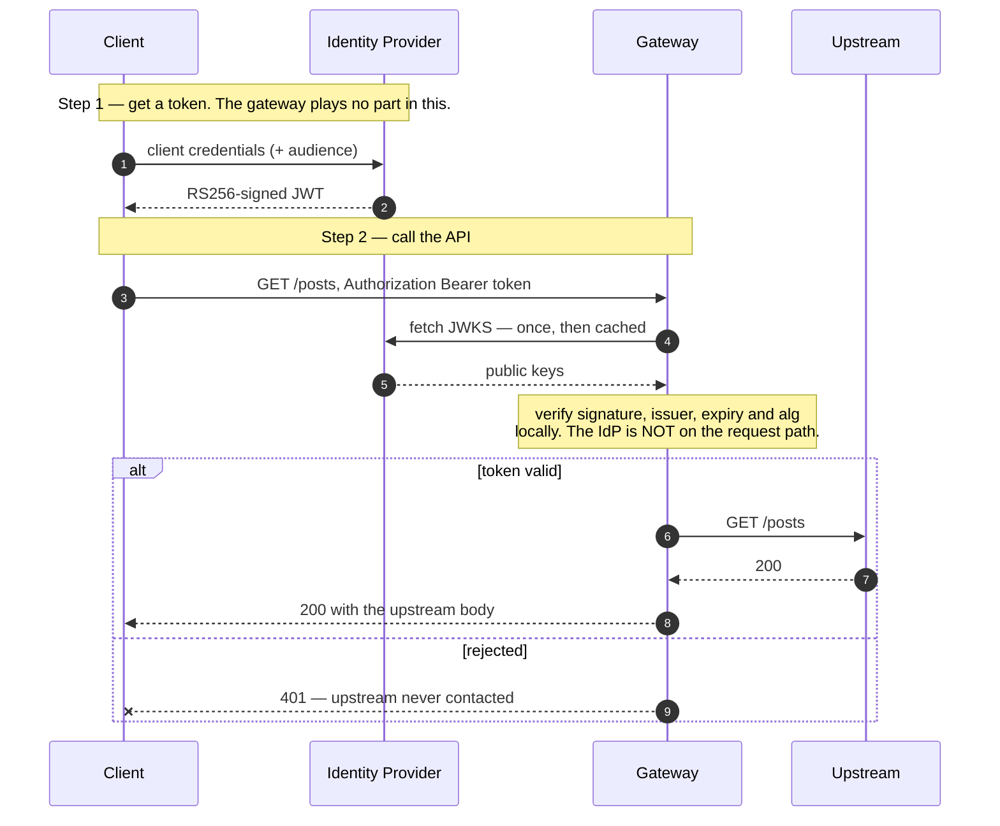

# Solution 05 — OAuth with Okta: verify the token, don't issue it

**Overview** · [Business need](business-need.md) · [How it works](how-it-works.md) · [Install](install.md) · [Configuration](configuration.md) · [Test & verify](testing.md) · [Changelog](changelog.md)

---

**Okta already mints your tokens. The gateway's only job is to verify them — and
four of the plugin's defaults are wrong for an API.**

<!-- facts:begin -->

| | |
|---|---|
| **Setup time** | ~20 minutes |
| **Difficulty** | Beginner |
| **Needs** | An org whose build includes `openid-connect` (not all do — see below) · an Okta tenant with an authorization server and an application · one upstream. The upstream here is public jsonplaceholder, so no backend of your own |
| **Plugins** | `cors` · `openid-connect` · `request-id` |
| **Build it with** | **[the Agent](install.md)** — recommended · or import [`gateway/api-spec.yaml`](gateway/api-spec.yaml) |

<!-- facts:end -->

## The problem

> *"We already run Okta. Every employee, every partner, every service account is
> in there. But our APIs don't check Okta tokens — they check an API key we
> emailed someone in 2021. Security keeps asking when the APIs will 'join SSO'
> and the answer is always 'after the next release'."*

Three things are true at once, which is why this sits still for years:

1. **The identity provider is not the problem.** Okta is already deployed,
   already the system of record, already issuing tokens to anything that asks.
2. **The APIs are the problem.** Each service would need JWKS fetching, key
   caching, signature verification, issuer and expiry checks — written once per
   language, and wrong in a different way in each one.
3. **Nobody wants to be the team that writes crypto.** So it gets deferred, and
   the static key stays.

**Root cause:** token verification is being treated as application logic. It is
edge logic. The gateway is already parsing every request's headers; checking a
signature is a configuration line, not a project.

## Business need

Bring APIs under the identity provider the organisation has already bought and
already governs, without a release in any backend service. What that buys:

- **Deprovisioning actually works.** Disable a service account in Okta and its
  access ends when its current token expires. With an emailed static key,
  deprovisioning means finding every place the key was pasted.
- **One place to answer "who can call this".** Access is an Okta assignment, not
  a spreadsheet of keys.
- **Token lifetime replaces key lifetime.** A leaked bearer token is useful for
  minutes. A leaked static key is useful until someone notices.

Quantified in [business-need.md](business-need.md). No ROI figures are invented
here.

## How a request flows

The important structural detail: **Okta is not on the request path.** The gateway
fetches the signing keys once, caches them, and verifies locally. Okta being slow
or briefly down does not make your API slow or down — until the key cache expires
and needs refreshing.

The second: **the auth block sits at the document root**, not per route. Solution
02 must scope its auth per route because `POST /oauth/token` has to stay reachable
without a token. Here there is no token endpoint — Okta issues, off-gateway — so
one root-level block covers every route and there is no hole to leave open.

## Gotchas

- **The audience is not checked against a value — this was tested, and a token
  for a different API was accepted.** `claim_validator.audience` offers only
  `required` (the claim must be *present*), `claim` (which claim to read) and
  `match_with_client_id` (it must equal or contain the client id). There is **no
  field for an arbitrary expected audience**.

  Against a deployed route, a correctly signed, unexpired token whose `aud` was
  `https://totally-unrelated-api.example.com/` returned **`200`**. A token with
  **no** `aud` at all returned `403`. So `required: true` buys you "some audience
  claim exists" and nothing more.

  IdP *access* tokens carry `aud` = the API's audience URI, not the client id, so
  `match_with_client_id` does not apply to them either. **Pin
  `issuer.valid_issuers` and add `required_scopes`** — those are the controls that
  actually run. If several APIs in one tenant must be told apart, the scope is what
  distinguishes them, not the audience.
- **`valid_issuers` must match the discovery document character for character.**
  Tested: the same token, with the issuer's **trailing slash removed**, went from
  `200` to `401`. The IdP tested reports its issuer *with* a trailing slash. Fetch
  the discovery document and copy the `issuer` value; do not retype it.
- **`client_secret` is required but unused.** It is one of three required fields,
  yet local JWKS verification never touches it. It is used only if you switch to
  `introspection_endpoint`. Supply a real one anyway.
- **Opaque tokens can't work this way.** If your authorization server issues
  opaque access tokens rather than JWTs, there is no signature to verify locally
  and you must use `introspection_endpoint` — which puts Okta on the request path
  and changes the latency and availability story completely.
- **Key rotation is a cliff, not a slope.** The symptom is "every token started
  401ing at once and nothing on our side changed".
- **The 401 names the underlying runtime.** It carries
  `www-authenticate: Bearer realm="apisix"`. `realm` is a settable field on the
  plugin — set it if you would rather not advertise that.
- **Your environment may rate-limit before your auth does.** The environment used
  for testing applied its own 10-requests-per-minute cap, returning `429`. A test
  script that fires cases back to back will get 429s and misread them as failures.
  `verify.sh` paces itself; hand-run cases may not.

## When to use it

- An IdP already issues tokens to this API's callers.
- You want APIs governed by the same joiner/mover/leaver process as everything else.
- You need to retire static API keys without a backend release.
- Callers are services or partner apps that can do client credentials against Okta.

Not this solution if: no IdP exists and you'd be deploying Okta *for* this
(solution 02 is smaller), or your authorization server issues opaque tokens.

## Limitations

- **Authentication, not authorization.** The token proves the caller is who Okta
  says. It carries no per-route permissions in this configuration.
  `required_scopes` is the next step and is deliberately not used here.
- **No per-caller metering.** Okta-issued tokens do not resolve an app credential,
  so `api-product-enforcer` has nothing to meter. Quotas need solution 01's model.
- **The audience is not enforced by value.** Verified against a deployed route: a
  token minted for an unrelated API was accepted with `200`. `required: true` only
  asserts the claim is present. If you need to scope a token to one API among
  several in the same tenant, use `required_scopes` — the audience will not do it.
- **Token lifetime is Okta's decision, not yours.** There is no `token_ttl` here.
  That is the trade you make by not being the issuer.
- **No revocation on the request path.** Disabling an app in Okta stops *new*
  tokens; already-issued ones remain valid until they expire, unless you take on
  `introspection_endpoint` and its cost.
- **`openid-connect` is not on every build.** Confirm before designing around it.

## Validation status

| Stage | Status |
|---|---|
| Configuration generated | **YES** |
| Local validation | **PASS** — every plugin block checked against the org's live schema |
| Gateway dry-run | **PASS** |
| Gateway deployed | **DEPLOYED** |
| Functional tests | **PASS (7/7)** — this spec, deployed verbatim, exercised with a real IdP token |

Overall: **READY WITH WARNINGS.** It works, and it rejects everything it should.
The warning is the audience — not enforced by value, a property of the plugin
rather than of this spec. See [Gotchas](#gotchas).

Valid token → `200`; no token → `401`; forged signature, `alg:none` → `401`;
no auth scheme → `400`. Separately confirmed: a wrong `valid_issuers` rejects a
genuine token, `required_scopes` gates on granted scope, and a missing `aud`
returns `403`. Full record in [`validation/`](validation/).

**The IdP exercised was Auth0, not Okta** — same OIDC mechanism and an identical
configuration, but no Okta tenant was tested.

## Related solutions

- **[02 — OAuth 2.0 with JWT](../02-oauth-jwt/)** — the mirror image: the gateway
  *issues* the tokens with `helix-auth`. Read the fork above and pick one; you do
  not want both on the same route.
- **[01 — API Products](../01-api-products/)** — per-app quotas. Note the seam:
  metering keys off an app credential, which an Okta-issued token does not carry.
- **[04 — Analytics](../04-analytics/)** — every call is captured regardless of
  which auth plugin resolved it.
