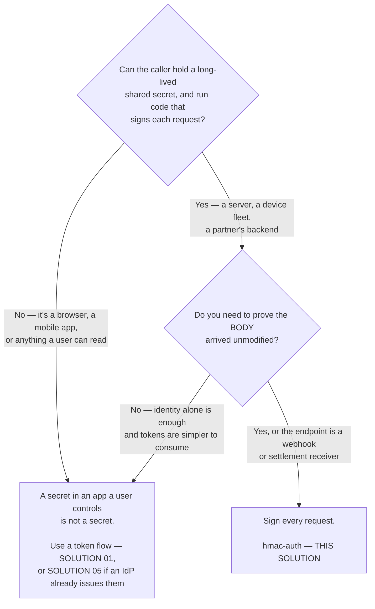
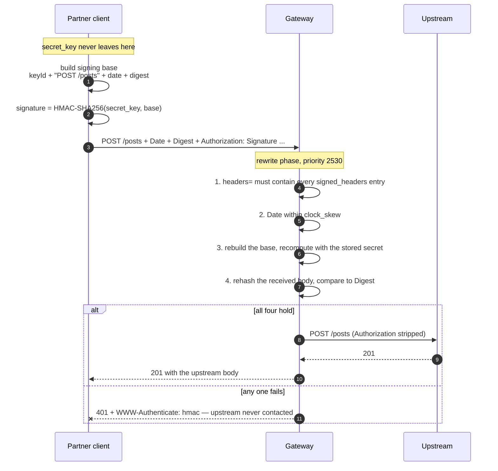

# Solution 06 — Signed requests: prove who is calling without sending a secret

**A bearer token is a password in a header: whoever captures it becomes you. An
HMAC signature proves the caller holds a shared secret without that secret ever
crossing the wire — and binds the proof to one request's method, path and body.**

| | |
|---|---|
| **Setup time** | ~20 minutes |
| **Difficulty** | 🟢 Beginner. One API, one product, one app, a public upstream |
| **Needs** | An org whose build includes **`hmac-auth`** · one upstream. The upstream here is the public jsonplaceholder, so no backend of your own. |
| **Plugins** | `hmac-auth` · `request-id` |
| **Build it with** | 🤖 **[the Agent](helix-agent-prompt.md)** — recommended · or import [`gateway/api-spec.yaml`](gateway/api-spec.yaml) |
| **Assets** | ✅ [Agent prompt](helix-agent-prompt.md) · ✅ [Architecture](architecture.md) · ✅ [Business need](business-need.md) · ✅ [Spec](gateway/) · ✅ [Products](gateway/products.json) · ✅ [Tests](tests/) · ✅ [Validation](validation/) · ✅ [Manifest](solution.yaml) |

---

## The problem

> *"Our payment partner posts settlement files to us. We gave them an API key
> three years ago. It's in their runbook, their CI, and — we found out in March —
> a Jira ticket. Rotating it means a coordinated release on their side, so we
> haven't. And even if the key were safe, it tells us nothing about the payload:
> if something rewrites the amount in transit, the key still checks out."*

Two separate failures, and a bearer credential of any kind — static key, JWT,
opaque token — has both:

1. **It travels on every request.** Anything that sees one request sees the
   credential: a proxy log, a misconfigured TLS terminator, a screenshot in a
   support ticket. Capture it once and you can impersonate the caller until
   somebody rotates it.
2. **It says nothing about the request it arrived on.** The token authenticates
   the *caller*. It does not authenticate the *message*. A body modified between
   the client and you still arrives with a perfectly valid credential attached.

**Root cause:** bearer credentials answer "who are you?" by *showing the secret*.
That conflates possession of a secret with authorship of a request, and once you
notice the conflation, both failures are the same failure.

A signature answers the same question by *proving possession without disclosure*,
and it proves it **about a specific request**. The secret stays on both ends and
never moves.

## Business need

Accept traffic from partners, devices and webhook senders in a way that survives
the credential being observed, and that detects a payload altered in transit —
without a client-side release to rotate anything, and without the backend
learning about authentication at all.

- **A captured request is worth one request.** The signature covers that method,
  that path, that body, and a timestamp. Replaying it after `clock_skew` seconds
  fails; altering any part of it fails immediately.
- **The secret is never transmitted, so it cannot be captured in transit.** The
  exposure surface shrinks from "every request, forever" to "the two places the
  secret is stored".
- **Per-partner blast radius.** One app per integration means one `key_id` and
  one `secret_key` per integration, rotated independently.
- **It is what the other side already built.** Stripe, GitHub, Shopify, Slack and
  Twilio all sign their webhooks. Partners integrating with you have written this
  client before.

Quantified in [business-need.md](business-need.md). No ROI figures are invented here.

## Signature or token — decide this first



**Signing costs the caller more than a token does**, and that is the honest
trade: they must canonicalise the request, hash the body and compute an HMAC on
every call, and get all three byte-exact. Ask for it when the payload matters or
the credential cannot be allowed to travel. Do not ask a browser for it — a
secret shipped to a user's device is not a secret, and no amount of signing fixes
that.

### Check the plugin exists in your org before you start

Builds vary, and the control plane hides plugins it does not support:

```bash
GET /api/orgs/{orgId}/plugin-schemas?page=1&size=300
```

`hmac-auth` must be in the result. On the build this package was validated
against it is present, alongside `helix-auth`, `basic-auth`, `ldap-auth` and
`openid-connect`. Note what is **not** there: `key-auth` and `jwt-auth`. Those
are switched off rather than merely hidden — importing a spec that names one
returns `400` with `key-auth is not an allowed plugin`, which at least tells you
plainly what happened. `hmac-auth` is not in that category — but confirm it in
*your* org rather than trusting this sentence.

## How a request flows



The secret is used on both ends and transmitted by neither. The gateway is not
checking a credential against a list; it is **recomputing the same function over
the same inputs** and comparing the results.

## How a signature is built

This is the part integrators get wrong, so it is written out exactly.

### The signing base

Join these with `\n`, **and terminate with a final `\n`**:

1. the `keyId`, alone on the first line
2. then, **in the order they appear in your `headers` field**, one line per entry:
   - `@request-target` → `<METHOD> <path-and-query>`, method **uppercase**
   - any other name → `<name>: <header value>`

```text
demo-key\n
POST /posts\n
date: Wed, 16 Sep 2026 11:12:37 GMT\n
digest: SHA-256=bSNUn7HvRElwnpOx6RaAXbApBPNta7M0chZgmYaCEFI=\n
```

Then `signature = base64(HMAC-SHA256(secret_key, base))`.

### The headers you send

```text
Authorization: Signature keyId="<key_id>",algorithm="hmac-sha256",
               headers="@request-target date digest",signature="<base64>"
Date:   <RFC 1123, GMT>
Digest: SHA-256=<base64(sha256(raw request body))>
```

`headers` is a space-separated list naming what the base covers, in order. `Date`
is required whenever `clock_skew` is non-zero (default 300). `Digest` is required
when `validate_request_body` is on, and is computed over the **raw body bytes** —
re-serialising the body between signing and sending invalidates it.

### It is not draft-cavage, despite the header shape

The `Authorization: Signature keyId=…` envelope is cavage's. The string that gets
signed is not. **Off-the-shelf HTTP Signatures libraries will not interoperate** —
they produce signatures this rejects with a bare 401.

| | draft-cavage | here |
|---|---|---|
| `keyId` in the signing base | not included | **first line** |
| Terminating newline | none | **required** |
| Request target | `(request-target): post /path` | `@request-target` → `POST /path` |

Each difference alone changes the signature. Write the ~15 lines from the worked
example below instead of reaching for a library.

### Worked example

```bash
BODY='{"title":"order-created","body":"sku-1","userId":1}'
DATE=$(LC_ALL=C date -u '+%a, %d %b %Y %H:%M:%S GMT')
DIGEST="SHA-256=$(printf '%s' "$BODY" | openssl dgst -sha256 -binary | openssl base64 -A)"

# printf is piped straight into openssl on purpose: the signing base ends with a
# newline, and $( ) strips trailing newlines. Capturing the base in a variable
# first signs a different string, and every request 401s.
SIGNATURE=$(printf '%s\nPOST /posts\ndate: %s\ndigest: %s\n' \
              "$KEY_ID" "$DATE" "$DIGEST" \
            | openssl dgst -sha256 -hmac "$SECRET_KEY" -binary | openssl base64 -A)

curl -i -X POST "https://<YOUR_GATEWAY_HOST>/posts" \
  -H 'Content-Type: application/json' \
  -H "Date: $DATE" -H "Digest: $DIGEST" \
  -H "Authorization: Signature keyId=\"$KEY_ID\",algorithm=\"hmac-sha256\",headers=\"@request-target date digest\",signature=\"$SIGNATURE\"" \
  -d "$BODY"
```

[`gateway/verify.sh`](gateway/verify.sh) contains the same construction as a
reusable shell function, handling both the with-digest and no-digest signed sets.

## Build it with the Agent

See [helix-agent-prompt.md](helix-agent-prompt.md) for the step-by-step prompts,
verified on the default agent model.

## Install it directly

```text
1. Import gateway/api-spec.yaml (OpenAPI import in the portal, or Agent Mode)
   and bind the upstream https://jsonplaceholder.typicode.com to the service
   (swap in your own backend later). Importing assigns service_id automatically.
   There is NOTHING to fill in first — this spec contains no secret and no
   placeholder, because hmac-auth's route schema has no secret field.

2. Deploy the revision to the "test" environment (a free-trial org's default).

3. Create the product from gateway/products.json. authMethods MUST be
   ["hmac-auth"] — it defaults to ["helix-auth"], and an app under a product that
   does not name hmac-auth is rejected.

4. Create a developer, then an app subscribed to that product, with
   plugins: {"hmac-auth": {}} — an empty config object. The control plane
   generates key_id and secret_key and returns them ONCE. Store them now.

5. Prove it
   GATEWAY=https://<YOUR_GATEWAY_HOST> KEY_ID=... SECRET_KEY=... \
     ./gateway/verify.sh
```

## Getting a credential

The spec has no secret in it and cannot have one: `hmac-auth`'s route
configuration accepts `allowed_algorithms`, `clock_skew`, `signed_headers`,
`validate_request_body`, `hide_credentials`, `anonymous_consumer` and `realm` —
and no secret field of any kind. The secret lives on the **app credential**.

The chain is: **product → developer → app → credential**. An app can only exist
under a product, and creating the app is what mints the pair:

```json
{ "name": "settlement-partner", "products": {"<PRODUCT_ID>": 1},
  "plugins": {"hmac-auth": {}} }
```

An **empty** `{"hmac-auth": {}}` is the instruction to generate both values. They
come back once, in the create response, and `secret_key` is stored encrypted —
there is no endpoint that will show it to you again. Supply your own `key_id` and
`secret_key` there instead if you must match a secret a partner already holds.
Rotating regenerates both; you cannot rotate one and keep the other.

**One app per integration.** Two partners sharing a credential cannot be
distinguished in logs and cannot be rotated independently.

## Configuration

Two routes, two different signed sets, and that is the point.

| Route | `signed_headers` | `validate_request_body` | Why |
|---|---|---|---|
| `POST /posts` | `@request-target`, `date`, `digest` | `true` | There is a body, so the signature must cover it |
| `GET /posts/{postId}` | `@request-target`, `date` | `false` | No body. Requiring a digest of the empty string is ceremony, not security |

`hmac-auth` is therefore **per route, not at the document root** — a single root
block cannot express both. The cost is real: **a route added later with no
`x-helix-gateway` block is unauthenticated.** If you would rather fail safe, hoist
the `POST` block to the root and have bodyless callers send the digest of the
empty string, which is the constant
`SHA-256=47DEQpj8HBSa+/TImW+5JCeuQeRkm5NMpJWZG3hSuFU=`.

### `signed_headers` is the field that makes this secure

Everything else on the route is tuning. This one is load-bearing.

**Omit it and the *client* decides what its own signature covers.** A signature
over a base consisting of nothing but the `keyId` is valid, and that single
signature then authenticates **any body, any path, indefinitely** — `clock_skew`
does not even apply, because with no `date` in the signed set there is no `Date`
header to check.

`validate_request_body` does not save you. It compares `Digest` to the body it
received — but if `digest` is not in the signing base, the caller supplies the
body *and* the matching `Digest`, and both checks pass.

With `signed_headers` set, a request whose `headers` field omits any required
name is rejected *before the signature is checked*.

## What the caller actually sees

Every rejection is `401` with `WWW-Authenticate: hmac realm="partner-events"`.
The body depends on **where** the failure happened, and the split is not obvious:

| Failure | Body |
|---|---|
| No `Authorization` header | `{"message":"client request can't be validated: missing Authorization header"}` |
| Header does not start with `Signature` | `…: Authorization header does not start with 'Signature'` |
| `keyId` or `signature` field absent | `…: keyId or signature missing` |
| **Bad signature, bad digest, clock skew, unknown `key_id`, weak signed set** | **`{"message":"client request can't be validated"}`** — and nothing more |

Parsing failures are explained; **validation failures are not**. That is correct
security behaviour — the second group must not tell an attacker which check
failed — and it is genuinely hard for an honest integrator to self-diagnose. The
detail exists only in the gateway error log:

| Log line (from the plugin) | Cause |
|---|---|
| `Invalid signature` | The base does not match. Check the trailing newline and the `keyId` line first |
| `Invalid digest` | `Digest` disagrees with the body — or something re-encoded the body (see Gotchas) |
| `Clock skew exceeded` / `Date header missing` | `Date` absent, malformed, or outside `clock_skew` |
| `expected header "x" missing in signing` | The caller signed a weaker set than `signed_headers` requires |
| `Invalid key_id` | No credential with that `key_id` — wrong app, or wrong environment |
| `Invalid algorithm` | The `algorithm` field is outside `allowed_algorithms` |

Give integrators the `X-Request-Id` from the response and the correlation is a
single log lookup. That is why `request-id` is in this spec.

## Testing

[`gateway/verify.sh`](gateway/verify.sh) exits 0 only if all eight hold:

| # | Case | Expect |
|---|---|---|
| 1 | No signature | 401 |
| 2 | Correct signature | 201 |
| 3 | Body tampered after signing | 401 |
| 4 | `Date` 20 minutes old | 401 |
| 5 | Correct `key_id`, wrong secret | 401 |
| 6 | Caller signs a weaker set than required | 401 |
| 7 | **Byte-identical replay** | **201 — accepted again** |
| 8 | Signed `GET` on the read route | 200 |

**Case 6 is the one that matters.** Delete `signed_headers` from the route and it
passes — everything else still passes too, and the API is wide open. It is the
only case that tests your *configuration* rather than the plugin.

**Case 7 is expected to succeed.** See Limitations; it is asserted rather than
described so that a build which ever changes this behaviour is noticed.

Full plan, including two manual cases (a cavage client, and removing
`signed_headers`), in [tests/test-plan.yaml](tests/test-plan.yaml).

## Gotchas

- **The trailing newline on the signing base is load-bearing**, and `$(...)`
  strips trailing newlines. Pipe `printf` straight into `openssl`; never capture
  the base in a variable first. This is the single most common cause of "my
  signature is definitely right and I get 401".
- **Off-the-shelf draft-cavage libraries do not interoperate.** Three deliberate
  differences, each sufficient on its own. See the table above.
- **`request-validation` cannot share a route with `validate_request_body`.** It
  runs earlier in the same phase (priority 2800 vs 2530) and re-encodes the parsed
  JSON with `set_body_data`, deliberately, as a defence against parser-differential
  attacks. `hmac-auth` then hashes the re-encoded bytes while your client hashed
  what it sent; key order and whitespace differ, so the digests match only by
  coincidence. Symptom: a bare 401 with `Invalid digest` in the log. Validate the
  schema behind the gateway instead, or accept the signature without body binding.
- **`Date` is a forbidden header in browsers.** `fetch` and `XHR` refuse to set
  it, so this scheme cannot be driven from browser JavaScript as written. That is
  a feature — see the decision tree — but it surprises people building an admin UI.
- **A header named in `headers=` that is not actually sent is silently skipped**
  from the signing base rather than erroring. `signed_headers` catches the cases
  you require; anything else you list is on you.
- **`@request-target` includes the query string.** A signature for
  `/posts?page=1` does not verify against `/posts?page=2`, and any proxy that
  normalises, reorders or appends query parameters between the client and the
  gateway breaks every signature it touches.
- **Clock drift is a real outage.** `clock_skew` is 300 seconds here. A device
  fleet without NTP will produce 401s that look like credential problems.
- **`hmac-sha1` is in the plugin's default `allowed_algorithms`.** This spec
  narrows it to SHA-256 and SHA-512 explicitly. Leaving the default in place lets
  a caller choose the weakest option.

## When to use it

**Use it when** the caller is a server, a device or a partner backend; when the
payload's integrity matters (payments, settlement, telemetry, webhooks); when the
credential must survive being logged; or when the other side has already built a
signing client for someone else's API.

**Use a token instead** ([01](../01-oauth-jwt/), [05](../05-okta-jwt/)) when the
caller is a browser or mobile app, when an IdP already owns identity, or when you
need short-lived credentials and per-user identity rather than per-integration.

**They do not compose on one route.** `hmac-auth` and `helix-auth` are both
authentication plugins that resolve a consumer; putting both on a route is not a
supported configuration in this package and is not covered by its validation.

## Limitations

- **This is authentication, not authorization.** The signature proves who called
  and that the message is intact. It carries no scopes and no per-route
  permissions.
- **Replay is possible inside `clock_skew`.** There is no nonce field and no
  replay cache — the plugin schema has neither. A captured request is valid until
  its `Date` ages out. To close it: make the operation idempotent upstream (an
  event id the backend de-duplicates on is the usual answer) and shrink
  `clock_skew` to the smallest value your callers' clocks tolerate. Demonstrated
  as test case 7 rather than left as a caveat.
- **Symmetric secrets.** Both ends hold the same value, so the gateway can forge
  a caller's signature as easily as verify it. Non-repudiation would need
  asymmetric keys, which this plugin does not do.
- **No expiry on the credential.** A `secret_key` is valid until somebody rotates
  it. Unlike a token's TTL, nothing bounds it automatically.
- **Rotation is not zero-downtime.** Rotating regenerates `key_id` and
  `secret_key` together and the old pair stops working immediately. Two apps and a
  cutover window is the workaround; the plugin has no concept of a previous secret.
- **The integration cost lands on the caller.** Every partner writes and debugs
  canonicalisation. Budget for the support load, and send them the worked example
  above rather than a link to the RFC.
- **Whether quota composes with this is untested.** `hmac-auth` attaches a
  consumer, and `api-product-enforcer` reads `credential_id` from it, so
  [solution 03](../03-api-products/)'s metering *should* work on a signed route.
  This package does not put the enforcer on the route and did not test the
  combination — treat it as plausible, not proven.

## Validation status

**Imported and dry-run against a gateway. Not deployed, so no request has been
sent through this configuration.**

| Stage | Status | Provenance |
|---|---|---|
| Configuration generated | **YES** | [`gateway/api-spec.yaml`](gateway/api-spec.yaml) |
| Local validation | **PASS** | [`validation/local-validation.yaml`](validation/local-validation.yaml) |
| Gateway dry-run | **PASS** | `{"success":true,"message":"Dry-run validation successful"}` after a clean import |
| Gateway deployed | **NOT RUN** | — |
| Functional tests | **NOT EXECUTED** | `gateway/verify.sh` is written but needs a deployed route and an app credential |

Overall: **READY WITH WARNINGS.** The configuration is accepted by a gateway and
the plugin fields are confirmed against the live schema. The client signing
implementation in `verify.sh` was cross-checked against an independent
reimplementation of the plugin's signature construction — which establishes that
the client is correct, not that the deployed route behaves as described. Run
`verify.sh` in your own environment before relying on it.
[`validation/gateway-validation.yaml`](validation/gateway-validation.yaml) has
the detail.

## Related solutions

- **[01 — OAuth 2.0 with JWT](../01-oauth-jwt/)** — the token alternative, for
  callers that can hold one. The gateway issues and verifies.
- **[05 — OAuth with Okta](../05-okta-jwt/)** — tokens again, when an external
  IdP is the issuer.
- **[03 — API Products](../03-api-products/)** — per-app quotas. The product this
  solution creates for its credential is the same object 03 meters on.
- **[07 — HTTP to Kafka](../07-http-to-kafka/)** — an ingest endpoint with no
  service behind it. Unauthenticated as shipped; this solution is how you close
  it, and that package documents what it costs.
