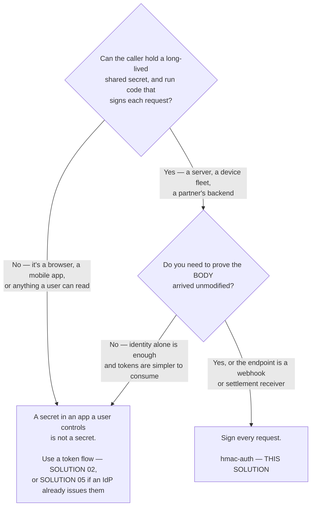
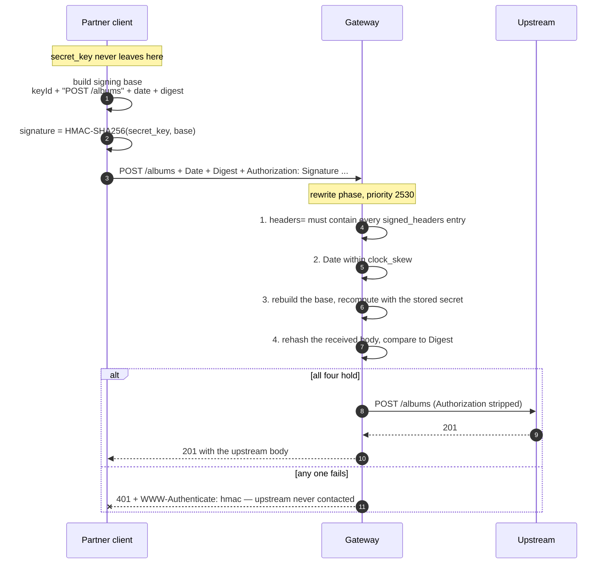

# Solution 06 — Signed requests: prove who is calling without sending a secret

**A bearer token is a password in a header: whoever captures it becomes you. An
HMAC signature proves the caller holds a shared secret without that secret ever
crossing the wire — and binds the proof to one request's method, path and body.**

| | |
|---|---|
| **Setup time** | ~20 minutes |
| **Difficulty** | 🟢 Beginner. One API, one product, one app, a public upstream |
| **Needs** | An org whose build includes **`hmac-auth`** · one upstream. The upstream here is the public jsonplaceholder, so no backend of your own. |
| **Plugins** | `hmac-auth` · `request-id` |
| **Build it with** | 🤖 **[the Helix Agent](helix-agent-prompt.md)** — recommended · or import [`example/api-spec.yaml`](example/api-spec.yaml) |
| **Assets** | ✅ [Agent prompt](helix-agent-prompt.md) · ✅ [Architecture](architecture.md) · ✅ [Business need](business-need.md) · ✅ [Spec](example/) · ✅ [Products](example/products.json) · ✅ [Tests](tests/) · ✅ [Manifest](solution.yaml) |

---

## The problem

> *"Our payment partner posts settlement files to us. We gave them an API key
> three years ago. It's in their runbook, their CI, and — we found out in March —
> a Jira ticket. Rotating it means a coordinated release on their side, so we
> haven't. And even if the key were safe, it tells us nothing about the payload:
> if something rewrites the amount in transit, the key still checks out."*

Two separate failures, and a bearer credential of any kind — static key, JWT,
opaque token — has both:

1. **It travels on every request.** Anything that sees one request sees the
   credential: a proxy log, a misconfigured TLS terminator, a screenshot in a
   support ticket. Capture it once and you can impersonate the caller until
   somebody rotates it.
2. **It says nothing about the request it arrived on.** The token authenticates
   the *caller*. It does not authenticate the *message*. A body modified between
   the client and you still arrives with a perfectly valid credential attached.

**Root cause:** bearer credentials answer "who are you?" by *showing the secret*.
That conflates possession of a secret with authorship of a request, and once you
notice the conflation, both failures are the same failure.

A signature answers the same question by *proving possession without disclosure*,
and it proves it **about a specific request**. The secret stays on both ends and
never moves.

## Business need

The thirty-second version: [`business-need.md`](business-need.md).

| | Bearer credential | Signed request |
|---|---|---|
| **Secret on the wire** | Every request | Never |
| **A captured request yields** | The credential — reusable forever | One signature — valid for that request, until `clock_skew` |
| **Payload integrity** | Not addressed | Bound by the signature |
| **Detects a modified body** | No | Yes, before the upstream is contacted |
| **Backend code changed** | — | None. It never learns about authentication |
| **What one leak exposes** | Every request that credential can make | One request, for at most `clock_skew` seconds |
| **Per-partner isolation** | Often one shared key | One app, one `key_id`/`secret_key`, rotated alone |
| **Cost to the caller** | Send a header | Canonicalise, hash, HMAC on every call |

The mechanism that matters commercially: a bearer token answers *"I am allowed to
call this API"*; a signature answers *"I, holder of this secret, composed **this
exact request** at **this time**"*. The second is strictly stronger, and it is the
one an auditor is actually asking for. Three things follow: interception stops
being credential theft, tampering is detected at the edge before anything acts on
it, and the exposure window collapses to `clock_skew` seconds — without a token
TTL to trade against re-authentication, because there is none.

What this does **not** buy you:

- **Authorization.** Who called and that the message is intact — not what they
  may do.
- **Replay protection inside the window.** A captured request replays until its
  `Date` falls outside `clock_skew`. The plugin has no nonce; closing it needs
  idempotency upstream.
- **Non-repudiation.** The secret is symmetric, so the verifier can forge what it
  verifies.
- **A browser story.** A secret shipped to a device a user controls is not a
  secret — use [02](../02-oauth-jwt/) or [05](../05-okta-jwt/).
- **Credential expiry**, or a free ride for the caller. A `secret_key` is valid
  until rotated, and the partner carries the canonicalisation and debugging cost —
  budget for the support load on the first two or three integrations.

No ROI figure is claimed anywhere in this package. What is quantified is the
mechanism — what crosses the wire, and for how long a capture is useful.

## Signature or token — decide this first


```mermaid
flowchart TD
    Q{"Can the caller hold a long-lived<br/>shared secret, and run code that<br/>signs each request?"}
    Q -->|"No — it's a browser, a mobile app,<br/>or anything a user can read"| T["A secret in an app a user controls<br/>is not a secret.<br/><br/>Use a token flow — SOLUTION 02,<br/>or SOLUTION 05 if an IdP already issues them"]
    Q -->|"Yes — a server, a device fleet,<br/>a partner's backend"| S{"Do you need to prove the BODY<br/>arrived unmodified?"}
    S -->|"Yes, or the endpoint is a webhook<br/>or settlement receiver"| H["Sign every request.<br/><br/>hmac-auth — THIS SOLUTION"]
    S -->|"No — identity alone is enough<br/>and tokens are simpler to consume"| T
```

**Signing costs the caller more than a token does**, and that is the honest
trade: they must canonicalise the request, hash the body and compute an HMAC on
every call, and get all three byte-exact. Ask for it when the payload matters or
the credential cannot be allowed to travel. Do not ask a browser for it — a
secret shipped to a user's device is not a secret, and no amount of signing fixes
that.

### Check the plugin exists in your org before you start

Builds vary, and the control plane hides plugins it does not support:

```bash
GET /api/orgs/{orgId}/plugin-schemas?page=1&size=300
```

`hmac-auth` must be in the result. On the build this package was validated
against it is present, alongside `helix-auth`, `basic-auth`, `ldap-auth` and
`openid-connect`. Note what is **not** there: `key-auth` and `jwt-auth`. Those
are switched off rather than merely hidden — importing a spec that names one
returns `400` with `key-auth is not an allowed plugin`, which at least tells you
plainly what happened. `hmac-auth` is not in that category — but confirm it in
*your* org rather than trusting this sentence.

## How a request flows


```mermaid
sequenceDiagram
    autonumber
    participant C as Partner client
    participant GW as Gateway
    participant UP as Upstream

    Note over C: secret_key never leaves here
    C->>C: build signing base<br/>keyId + "POST /albums" + date + digest
    C->>C: signature = HMAC-SHA256(secret_key, base)
    C->>GW: POST /albums + Date + Digest + Authorization: Signature ...

    Note over GW: rewrite phase, priority 2530
    GW->>GW: 1. headers= must contain every signed_headers entry
    GW->>GW: 2. Date within clock_skew
    GW->>GW: 3. rebuild the base, recompute with the stored secret
    GW->>GW: 4. rehash the received body, compare to Digest

    alt all four hold
        GW->>UP: POST /albums (Authorization stripped)
        UP-->>GW: 201
        GW-->>C: 201 with the upstream body
    else any one fails
        GW--xC: 401 + WWW-Authenticate: hmac — upstream never contacted
    end
```

The secret is used on both ends and transmitted by neither. The gateway is not
checking a credential against a list; it is **recomputing the same function over
the same inputs** and comparing the results.

## How a signature is built

This is the part integrators get wrong, so it is written out exactly.

### The signing base

Join these with `\n`, **and terminate with a final `\n`**:

1. the `keyId`, alone on the first line
2. then, **in the order they appear in your `headers` field**, one line per entry:
   - `@request-target` → `<METHOD> <path-and-query>`, method **uppercase**
   - any other name → `<name>: <header value>`

```text
demo-key\n
POST /albums\n
date: Wed, 16 Sep 2026 11:12:37 GMT\n
digest: SHA-256=bSNUn7HvRElwnpOx6RaAXbApBPNta7M0chZgmYaCEFI=\n
```

Then `signature = base64(HMAC-SHA256(secret_key, base))`.

### The headers you send

```text
Authorization: Signature keyId="<key_id>",algorithm="hmac-sha256",
               headers="@request-target date digest",signature="<base64>"
Date:   <RFC 1123, GMT>
Digest: SHA-256=<base64(sha256(raw request body))>
```

`headers` is a space-separated list naming what the base covers, in order. `Date`
is required whenever `clock_skew` is non-zero (default 300). `Digest` is required
when `validate_request_body` is on, and is computed over the **raw body bytes** —
re-serialising the body between signing and sending invalidates it.

### It is not draft-cavage, despite the header shape

The `Authorization: Signature keyId=…` envelope is cavage's. The string that gets
signed is not. **Off-the-shelf HTTP Signatures libraries will not interoperate** —
they produce signatures this rejects with a bare 401.

| | draft-cavage | here |
|---|---|---|
| `keyId` in the signing base | not included | **first line** |
| Terminating newline | none | **required** |
| Request target | `(request-target): post /path` | `@request-target` → `POST /path` |

Each difference alone changes the signature. Write the ~15 lines from the worked
example below instead of reaching for a library.

### Worked example

```bash
BODY='{"title":"order-created","userId":1}'
DATE=$(LC_ALL=C date -u '+%a, %d %b %Y %H:%M:%S GMT')
DIGEST="SHA-256=$(printf '%s' "$BODY" | openssl dgst -sha256 -binary | openssl base64 -A)"

# printf is piped straight into openssl on purpose: the signing base ends with a
# newline, and $( ) strips trailing newlines. Capturing the base in a variable
# first signs a different string, and every request 401s.
SIGNATURE=$(printf '%s\nPOST /albums\ndate: %s\ndigest: %s\n' \
              "$KEY_ID" "$DATE" "$DIGEST" \
            | openssl dgst -sha256 -hmac "$SECRET_KEY" -binary | openssl base64 -A)

curl -i -X POST "https://<YOUR_GATEWAY_HOST>/albums" \
  -H 'Content-Type: application/json' \
  -H "Date: $DATE" -H "Digest: $DIGEST" \
  -H "Authorization: Signature keyId=\"$KEY_ID\",algorithm=\"hmac-sha256\",headers=\"@request-target date digest\",signature=\"$SIGNATURE\"" \
  -d "$BODY"
```

[`example/verify.sh`](example/verify.sh) contains the same construction as a
reusable shell function, handling both the with-digest and no-digest signed sets.

## Build it with the Helix Agent

Recommended path, about twenty minutes. The whole build is **one prompt** —
[`helix-agent-prompt.md`](helix-agent-prompt.md). Paste it as a single message and
replace the `{{...}}` values.

It goes all the way: the API and its two routes, signing on both, then a
developer, a product and an app whose key id and secret you sign with. Then send
one signed request using the [worked example](#worked-example) — or ask for a
script, the last entry under [Variations](#variations).
[AGENT-GUIDE.md](../../AGENT-GUIDE.md) carries the standing rules the prompt
assumes.

> **This prompt has not been driven against a live agent in its current wording.**
> The two-step, field-by-field prompt it replaces was, on 2026-09-21 — see
> [Validation status](#validation-status). The spec-import path below is the
> deterministic one; if you take the agent path, the checks in this callout are
> how you find out whether it worked.
>
> **Check what was stored, not what the agent said.** Read the revision back.
> Each route should carry `hmac-auth` with **`signed_headers` set** —
> `@request-target`, `date`, `digest` on `POST /albums` with
> `validate_request_body: true`; `@request-target`, `date` on the `GET`. A route
> with `hmac-auth` and no `signed_headers` validates, deploys and accepts signed
> requests, and is wide open. The product's `authMethods` should name `hmac-auth`.

### Why the prompt is worded the way it is

It names no plugin, no field and no secret. Ask for an outcome and the agent reads
the real `hmac-auth` schema your org ships. One sentence in it is a guard, phrased
as an outcome, and it is the reason the package is secure at all:

- **"Each route decides what the signature must cover, not the caller."** This is
  `signed_headers`, and it has no default. Omitted, the *client* chooses what its
  own signature covers — a signature over nothing but its `keyId` then
  authenticates any body on any path, indefinitely. It is the most damaging wrong
  turn in this package and nothing about it looks wrong: it imports, dry-runs,
  deploys and accepts properly signed requests. See [Configuration](#configuration).
- **"Called @request-target, not (request-target)."** The one name the prompt
  spells out, because the agent gets it wrong unprompted. `(request-target)` is
  the draft-cavage spelling; this plugin treats it as an ordinary header name,
  finds no such header, and **leaves it out of the signing base**. The route then
  rejects correct clients *and* accepts a signature that covers neither method nor
  path — verified on an agent-built route, where one `GET` signature returned 200
  on two different paths. It deploys cleanly.
- **`/albums/:albumId`, not `/albums/{albumId}`.** The gateway's route syntax is
  `/:param`. Spec import rewrites `{albumId}` for you; a route the agent writes
  directly is not rewritten, never matches, and returns `404 Route Not Found`.
- **The two routes get different lists, spelled out.** `GET` has no body, so it has
  no digest to bind. Said once for both routes, an agent hoists one block API-wide
  and every bodyless `GET` must then send the digest of an empty string or 401.
- **"Rejected if the body doesn't match its digest."** That is
  `validate_request_body`. Without it the `Digest` header is signed but never
  compared to the body that actually arrived.
- **"An app that signs its requests"**, in step 3. The product's `authMethods`
  defaults to `["helix-auth"]`, and an app under a product that doesn't name
  `hmac-auth` is refused with an unhelpful error about an unsupported auth plugin.
  Stating what the app is for is what leads the agent to the right product.
- **Step 3 asks for a product, not just a developer and an app** — the same reason
  as [02](../02-oauth-jwt/): an app subscribes to an API *through* a product, and
  here creating the app is also what mints the key id and secret.

What the prompt no longer carries, and why: `clock_skew`, `allowed_algorithms`,
`hide_credentials`, `realm` and `request-id` by name; the warning against
`request-validation` (nothing here asks for body validation, so nothing invites
it — it lives in the failure table below); "no secret on the route"; the
`plugins`-map and `x-helix-gateway` instructions; and a signing script. On
[01](../01-api-products/) and [02](../02-oauth-jwt/), removing guards of that
kind made the result better rather than worse. That is a reading applied here,
**not a measurement on this package** — check the revision.

### What the agent decides for you

Whatever the prompt leaves open, the agent picks. Compare what it stored against
this package's spec, which is what was deployed and tested:

| | The prompt says | This package's spec |
|---|---|---|
| Clock skew | 5 minutes | `clock_skew: 300` |
| Algorithms | nothing | `hmac-sha256`, `hmac-sha512` |
| Signature headers forwarded upstream | nothing | stripped — `hide_credentials: true` |
| `WWW-Authenticate` realm | nothing | `partner-events` |
| Correlation id | nothing | `request-id`, API-wide, `X-Request-Id` |
| Product quota | nothing | 10,000 per hour — not enforced; there is no `api-product-enforcer` on the routes |

None of these decides whether the routes are secure; `signed_headers` does.

## Variations

Follow-ups for the same session, once the build above is standing. Same register
as the prompt — say what you want to be true.

**Tighter replay window**
```text
Cut the allowed clock skew to 60 seconds on both routes. Our callers are servers
with NTP, so a one-minute window is realistic.
```

**Fail safe instead of per route**
```text
Make signing API-wide with the POST route's rules, so any route I add later is
signed by default. Tell me the exact Digest header my GET callers must now send
for an empty body.
```
The answer should be `SHA-256=47DEQpj8HBSa+/TImW+5JCeuQeRkm5NMpJWZG3hSuFU=`.

**Meter the partners as well**
```text
Enforce the product's quota per app on both routes. If the quota can't identify
the app from a signed request, tell me rather than working around it.
```
Tested, and it composes — see [Limitations](#limitations).

**Let unsigned reads through, attributed**
```text
Allow unsigned GET /albums/{albumId} calls, attributed to {{anonymous_consumer_name}},
while POST /albums stays strictly signed.
```

**Prove it with a script**
```text
Write me a bash script that signs and sends requests with the app's key id and
secret, showing in order: no signature → 401; a correct signature → 201; the same
headers with a modified body → 401; a Date 20 minutes old → 401; a signature that
leaves the digest out of what it covers → 401.
```
Check the script pipes `printf` straight into `openssl` — `$( )` strips the
signing base's trailing newline, and every request then 401s with a signature that
looks right. See [the signing base](#the-signing-base).

## When the agent goes wrong

**Read the stored revision before you trust any of it.** The most dangerous
failure here — no `signed_headers` — succeeds at every step the agent shows you.

| Symptom | Cause |
|---|---|
| A correctly signed request 401s, but one listing `(request-target)` is accepted | `signed_headers` says `(request-target)`, the draft-cavage spelling. It is skipped when the gateway builds the base, so the path is not signed at all. Change every entry to `@request-target` and check a signature for one path is rejected on another. |
| The read route returns `404 Route Not Found` | It was written as `/albums/{albumId}`. Live routes take `/albums/:albumId`. |
| A request signed over only `keyId` is accepted | `signed_headers` was dropped. The client is choosing what it signs. Ask for each route to fix what the signature must cover, and read it back. |
| A signature that looks correct always 401s | The signing base lost its trailing newline — `$( )` strips it. Pipe `printf` straight into `openssl`. |
| Every bodyless GET 401s | `hmac-auth` was hoisted to the API level, so the GET now requires a digest. |
| A modified body is accepted | `validate_request_body` is off on `POST /albums`, or `digest` is missing from its `signed_headers`. |
| The digest stops matching after a "hardening" change | `request-validation` landed on the route. It runs earlier in the same phase and re-encodes the body before `hmac-auth` hashes it. |
| App creation fails on an unsupported auth plugin | The product's `authMethods` is still the `["helix-auth"]` default. |
| The agent invents a `secret_key` or `signing_secret` field on the route | There is none — the route schema has no secret field. The app credential carries it. |
| The routes exist with **no plugins**, at exit 0 | The agent wrapped them in `x-helix-gateway` inside the live route object, which a live route silently discards. Ask for a plain top-level `plugins` map and read the revision back; if it will not, import the spec. |
| `"stream closed with reason: error"` mid-run | Seen on 2026-09-21: the config had landed correctly before the session died on a later step. Read the revision back to see what actually landed, then resume from there. |
| You need the secret again | It's returned once and stored encrypted. Rotate instead. |

## Install it directly

```text
1. Import example/api-spec.yaml (OpenAPI import in the portal, or Agent Mode)
   and bind the upstream https://jsonplaceholder.typicode.com to the service
   (swap in your own backend later). Importing assigns service_id automatically.
   There is NOTHING to fill in first — this spec contains no secret and no
   placeholder, because hmac-auth's route schema has no secret field.

2. Deploy the revision to the "test" environment (a free-trial org's default).

3. Create the product from example/products.json. authMethods MUST be
   ["hmac-auth"] — it defaults to ["helix-auth"], and an app under a product that
   does not name hmac-auth is rejected.

4. Create a developer, then an app subscribed to that product, with
   plugins: {"hmac-auth": {}} — an empty config object. The control plane
   generates key_id and secret_key and returns them ONCE. Store them now.

5. Prove it
   GATEWAY=https://<YOUR_GATEWAY_HOST> KEY_ID=... SECRET_KEY=... \
     ./example/verify.sh
```

## Getting a credential

The spec has no secret in it and cannot have one: `hmac-auth`'s route
configuration accepts `allowed_algorithms`, `clock_skew`, `signed_headers`,
`validate_request_body`, `hide_credentials`, `anonymous_consumer` and `realm` —
and no secret field of any kind. The secret lives on the **app credential**.

The chain is: **product → developer → app → credential**. An app can only exist
under a product, and creating the app is what mints the pair:

```json
{ "name": "settlement-partner", "products": {"<PRODUCT_ID>": 1},
  "plugins": {"hmac-auth": {}} }
```

An **empty** `{"hmac-auth": {}}` is the instruction to generate both values. They
come back once, in the create response, and `secret_key` is stored encrypted —
there is no endpoint that will show it to you again. Supply your own `key_id` and
`secret_key` there instead if you must match a secret a partner already holds.
Rotating regenerates both; you cannot rotate one and keep the other.

**One app per integration.** Two partners sharing a credential cannot be
distinguished in logs and cannot be rotated independently.

## Configuration

Two routes, two different signed sets, and that is the point.

| Route | `signed_headers` | `validate_request_body` | Why |
|---|---|---|---|
| `POST /albums` | `@request-target`, `date`, `digest` | `true` | There is a body, so the signature must cover it |
| `GET /albums/{albumId}` | `@request-target`, `date` | `false` | No body. Requiring a digest of the empty string is ceremony, not security |

`hmac-auth` is therefore **per route, not at the document root** — a single root
block cannot express both. The cost is real: **a route added later with no
`x-helix-gateway` block is unauthenticated.** If you would rather fail safe, hoist
the `POST` block to the root and have bodyless callers send the digest of the
empty string, which is the constant
`SHA-256=47DEQpj8HBSa+/TImW+5JCeuQeRkm5NMpJWZG3hSuFU=`.

### `signed_headers` is the field that makes this secure

Everything else on the route is tuning. This one is load-bearing.

**Omit it and the *client* decides what its own signature covers.** A signature
over a base consisting of nothing but the `keyId` is valid, and that single
signature then authenticates **any body, any path, indefinitely** — `clock_skew`
does not even apply, because with no `date` in the signed set there is no `Date`
header to check.

`validate_request_body` does not save you. It compares `Digest` to the body it
received — but if `digest` is not in the signing base, the caller supplies the
body *and* the matching `Digest`, and both checks pass.

With `signed_headers` set, a request whose `headers` field omits any required
name is rejected *before the signature is checked*.

## What the caller actually sees

Every rejection is `401` with `WWW-Authenticate: hmac realm="partner-events"`.
The body depends on **where** the failure happened, and the split is not obvious:

| Failure | Body |
|---|---|
| No `Authorization` header | `{"message":"client request can't be validated: missing Authorization header"}` |
| Header does not start with `Signature` | `…: Authorization header does not start with 'Signature'` |
| **Everything else** — `keyId`/`signature` field absent, bad signature, bad digest, clock skew, unknown `key_id`, weak signed set | **`{"message":"client request can't be validated"}`** — and nothing more |

Exactly **two** failures are explained, and they are the two raised while *parsing*
the header. Everything raised while *validating* is collapsed, including
`keyId or signature missing` — which reads like a parsing error but is raised
after parsing succeeds, and so is opaque like the rest. (Verified by request
against a deployed route.) That is correct
security behaviour — the second group must not tell an attacker which check
failed — and it is genuinely hard for an honest integrator to self-diagnose. The
detail exists only in the gateway error log:

| Log line (from the plugin) | Cause |
|---|---|
| `Invalid signature` | The base does not match. Check the trailing newline and the `keyId` line first |
| `Invalid digest` | `Digest` disagrees with the body — or something re-encoded the body (see Gotchas) |
| `Clock skew exceeded` / `Date header missing` | `Date` absent, malformed, or outside `clock_skew` |
| `expected header "x" missing in signing` | The caller signed a weaker set than `signed_headers` requires |
| `Invalid key_id` | No credential with that `key_id` — wrong app, or wrong environment |
| `Invalid algorithm` | The `algorithm` field is outside `allowed_algorithms` |

Give integrators the `X-Request-Id` from the response and the correlation is a
single log lookup. That is why `request-id` is in this spec.

## Testing

[`example/verify.sh`](example/verify.sh) exits 0 only if all eight hold:

| # | Case | Expect |
|---|---|---|
| 1 | No signature | 401 |
| 2 | Correct signature | 201 |
| 3 | Body tampered after signing | 401 |
| 4 | `Date` 20 minutes old | 401 |
| 5 | Correct `key_id`, wrong secret | 401 |
| 6 | Caller signs a weaker set than required | 401 |
| 7 | **Byte-identical replay** | **201 — accepted again** |
| 8 | Signed `GET` on the read route | 200 |

**Case 6 is the one that matters.** Delete `signed_headers` from the route and it
passes — everything else still passes too, and the API is wide open. It is the
only case that tests your *configuration* rather than the plugin.

**Case 7 is expected to succeed.** See Limitations; it is asserted rather than
described so that a build which ever changes this behaviour is noticed.

Full plan, including two manual cases (a cavage client, and removing
`signed_headers`), in [tests/test-plan.yaml](tests/test-plan.yaml).

## Gotchas

- **The trailing newline on the signing base is load-bearing**, and `$(...)`
  strips trailing newlines. Pipe `printf` straight into `openssl`; never capture
  the base in a variable first. This is the single most common cause of "my
  signature is definitely right and I get 401".
- **`validate_request_body` checks the digest matches the body — not that there
  is a body.** A `POST` with no body and the empty-body digest
  (`SHA-256=47DEQpj8HBSa+/TImW+5JCeuQeRkm5NMpJWZG3hSuFU=`) passes and reaches the
  upstream; a digest for a body that was not sent is rejected. Requiring a body is
  schema validation, and `request-validation` breaks the digest here (below).
- **A bodyless `GET` needs no `Digest`** unless the route's `signed_headers` lists
  `digest` — or the caller lists it in `headers=`, which makes the gateway expect
  one. Copying the `POST` signing code to a `GET` is the usual way that happens.
- **Off-the-shelf draft-cavage libraries do not interoperate.** Three deliberate
  differences, each sufficient on its own. See the table above.
- **`request-validation` cannot share a route with `validate_request_body`.** It
  runs earlier in the same phase (priority 2800 vs 2530) and re-encodes the parsed
  JSON with `set_body_data`, deliberately, as a defence against parser-differential
  attacks. `hmac-auth` then hashes the re-encoded bytes while your client hashed
  what it sent; key order and whitespace differ, so the digests match only by
  coincidence. Symptom: a bare 401 with `Invalid digest` in the log. Validate the
  schema behind the gateway instead, or accept the signature without body binding.
- **`Date` is a forbidden header in browsers.** `fetch` and `XHR` refuse to set
  it, so this scheme cannot be driven from browser JavaScript as written. That is
  a feature — see the decision tree — but it surprises people building an admin UI.
- **A header named in `headers=` that is not actually sent is silently skipped**
  from the signing base rather than erroring. `signed_headers` catches the cases
  you require; anything else you list is on you.
- **`@request-target` includes the query string.** A signature for
  `/albums?page=1` does not verify against `/albums?page=2`, and any proxy that
  normalises, reorders or appends query parameters between the client and the
  gateway breaks every signature it touches.
- **Clock drift is a real outage.** `clock_skew` is 300 seconds here. A device
  fleet without NTP will produce 401s that look like credential problems.
- **`hmac-sha1` is in the plugin's default `allowed_algorithms`.** This spec
  narrows it to SHA-256 and SHA-512 explicitly. Leaving the default in place lets
  a caller choose the weakest option.

## When to use it

**Use it when** the caller is a server, a device or a partner backend; when the
payload's integrity matters (payments, settlement, telemetry, webhooks); when the
credential must survive being logged; or when the other side has already built a
signing client for someone else's API.

**Use a token instead** ([02](../02-oauth-jwt/), [05](../05-okta-jwt/)) when the
caller is a browser or mobile app, when an IdP already owns identity, or when you
need short-lived credentials and per-user identity rather than per-integration.

**They do not compose on one route.** `hmac-auth` and `helix-auth` are both
authentication plugins that resolve a consumer; putting both on a route is not a
supported configuration in this package and is not covered by its validation.

## Limitations

- **This is authentication, not authorization.** The signature proves who called
  and that the message is intact. It carries no scopes and no per-route
  permissions.
- **Replay is possible inside `clock_skew`.** There is no nonce field and no
  replay cache — the plugin schema has neither. A captured request is valid until
  its `Date` ages out. To close it: make the operation idempotent upstream (an
  event id the backend de-duplicates on is the usual answer) and shrink
  `clock_skew` to the smallest value your callers' clocks tolerate. Demonstrated
  as test case 7 rather than left as a caveat.
- **Symmetric secrets.** Both ends hold the same value, so the gateway can forge
  a caller's signature as easily as verify it. Non-repudiation would need
  asymmetric keys, which this plugin does not do.
- **No expiry on the credential.** A `secret_key` is valid until somebody rotates
  it. Unlike a token's TTL, nothing bounds it automatically.
- **Rotation is not zero-downtime.** Rotating regenerates `key_id` and
  `secret_key` together and the old pair stops working immediately. Two apps and a
  cutover window is the workaround; the plugin has no concept of a previous secret.
- **The integration cost lands on the caller.** Every partner writes and debugs
  canonicalisation. Budget for the support load, and send them the worked example
  above rather than a link to the RFC.
- **Quota composes — this was tested, and it works.** Adding
  `api-product-enforcer` to a signed route meters it per app exactly as
  [solution 01](../01-api-products/) describes: with a 3/minute product quota,
  three signed requests returned 201 and the next three returned
  `429 {"error":"quota exceeded"}`. The enforcer resolves the consumer and its
  `credential_id` from `hmac-auth` without any extra configuration. This package
  still ships without the enforcer, because metering is solution 01's subject —
  but you can add it, and nothing about signing gets in the way.

## Validation status

**Validated against a gateway — imported, dry-run, deployed, and passed
`verify.sh` 8/8.**

| Stage | Status | Provenance |
|---|---|---|
| Configuration generated | **YES** | [`example/api-spec.yaml`](example/api-spec.yaml) |
| Local validation | **PASS** | Structural review of the spec and tests |
| Gateway dry-run | **PASS on 1.0.0** | `{"success":true,"message":"Dry-run validation successful"}` — the `/posts` routes. Not re-run on 1.1.0 |
| Gateway deployed | **DEPLOYED on 1.0.0** | Revision ACTIVE on a temporary test API, since torn down. 1.1.0 not imported |
| Functional tests | **PASS (8/8), twice** | 1.0.0: `example/verify.sh` exit 0 against this spec, imported. 2026-10-07: the 1.1.0 `verify.sh`, unmodified, exit 0 against `POST /albums` and `GET /albums/:albumId` on a second gateway — an **agent-built** route with the same `signed_headers` and `validate_request_body`, not this spec imported |
| Agent-mode run | **PASS (config) for the previous prompt**, run ended on a tool-call defect (2026-09-21) | That prompt was two steps naming every field; **the current outcome-worded prompt has not been driven yet** |

Overall: **READY.** Every claim was exercised against a deployed route with a real app credential: the signing base is the one the gateway builds, the digest binds the body, `clock_skew`/`signed_headers` are enforced, a wrong secret is rejected, `@request-target` binds the path, and the replay case passed by being **accepted** — the documented limitation, demonstrated.

**The agent-mode run itself didn't finish cleanly:** correct config, confirmed by reading the revision back, but the session then hit `"stream closed with reason: error"` — see [When the agent goes wrong](#when-the-agent-goes-wrong).

## Related solutions

- **[02 — OAuth 2.0 with JWT](../02-oauth-jwt/)** — the token alternative, for
  callers that can hold one. The gateway issues and verifies.
- **[05 — OAuth with Okta](../05-okta-jwt/)** — tokens again, when an external
  IdP is the issuer.
- **[01 — API Products](../01-api-products/)** — per-app quotas. The product this
  solution creates for its credential is the same object 01 meters on.
- **[07 — HTTP to Kafka](../07-http-to-kafka/)** — an ingest endpoint with no
  service behind it. Unauthenticated as shipped; this solution is how you close
  it, and that package documents what it costs.
