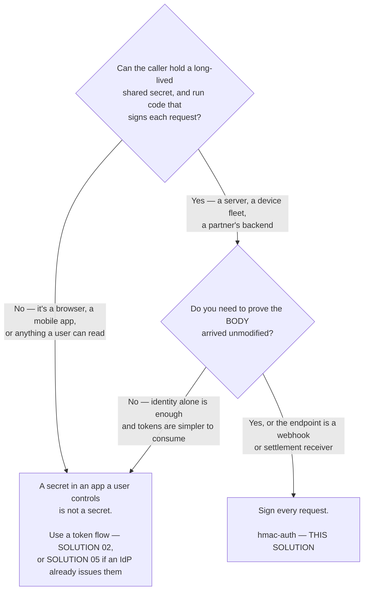
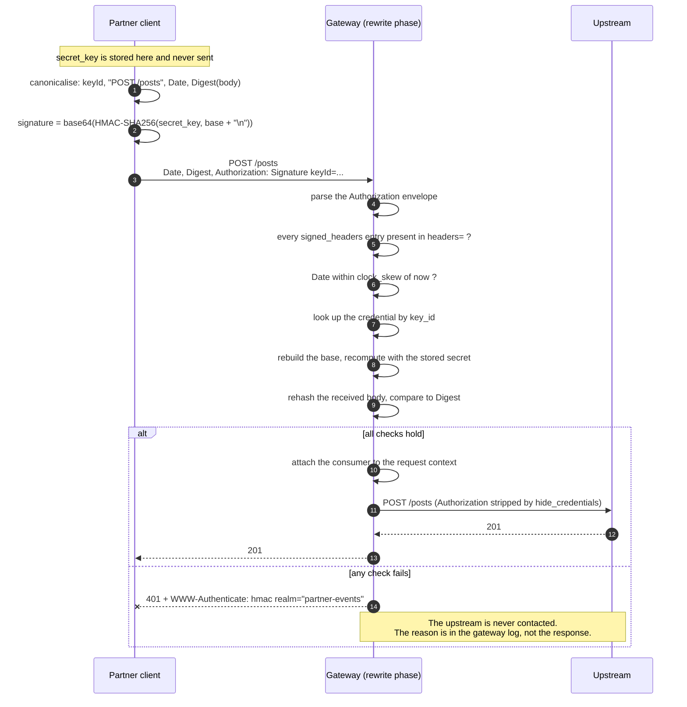
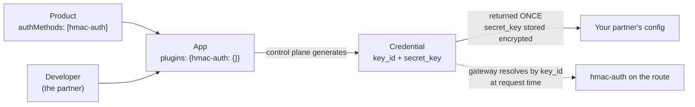

# Architecture — HMAC request signing at the edge

> [Overview](README.md) · [Business need](business-need.md) · **Architecture** · [Guides](guides.md) · [Agent prompt](helix-agent-prompt.md) · [Tests](tests.md) · [API reference](api-reference.md)

---

## What the gateway does here

The gateway holds a copy of each caller's secret and **recomputes the caller's
signature** from the request it received. It does not look a credential up in a
list and compare it. The check is that two separate calculations over the same
inputs agree. Everything else on this page follows from that.

For every signed request, the gateway checks:

1. Does the signature cover everything this route requires (`signed_headers`)?
2. Is the `Date` within 300 seconds of now (`clock_skew`)?
3. Does the signature match, using the secret stored for this `key_id`?
4. On the write route: does the body match the `Digest` header?

Any "no" ends the request at the gateway with HTTP 401 (not authenticated). Your
backend does not change, and never sees a request that failed.

For the full list of fields on every plugin, see
[docs.digitalapi.ai/api-gateway](https://docs.digitalapi.ai/api-gateway).

## The words used on this page

| Word | What it means |
|---|---|
| **App** | One integration owned by a developer (a partner). Its credential holds the `key_id` and `secret_key`. |
| **`key_id`** | The public name of the credential. Sent with every request. |
| **`secret_key`** | The shared secret. Stored at the caller and in the control plane. **Never sent.** |
| **Signing base** | The exact text the caller builds from the request and signs. |
| **Signature** | `base64(HMAC-SHA256(secret_key, signing base))`. Sent in the `Authorization` header. |
| **Digest** | A fingerprint of the request body: `SHA-256=<base64 of the body's SHA-256>`. |
| **`signed_headers`** | The parts of the request each signature **must** cover on this route. |

## Signature or token — decide this first



**Signing costs the caller more than a token does**, and that is the honest
trade. On every call the caller must build the signing base, hash the body and
compute an HMAC, and get all three exactly right. Ask for it when the payload
matters or the credential must not travel. Do not ask a browser for it: a secret
shipped to a user's device is not a secret, and no amount of signing fixes that.

## How a request flows



The secret is used at both ends and sent by neither.

## How a signature is built

This is the part callers most often get wrong, so it is written out exactly.

**The signing base.** Join these lines with `\n`, **and end with a final `\n`**:

1. the `keyId`, alone on the first line
2. then, **in the order they appear in the `headers` field**, one line per entry:
   - `@request-target` becomes `<METHOD> <path-and-query>`, method in **uppercase**
   - any other name becomes `<name>: <header value>`

```text
demo-key\n
POST /posts\n
date: Wed, 16 Sep 2026 11:12:37 GMT\n
digest: SHA-256=bSNUn7HvRElwnpOx6RaAXbApBPNta7M0chZgmYaCEFI=\n
```

Then `signature = base64(HMAC-SHA256(secret_key, base))`.

**The headers the caller sends:**

```text
Authorization: Signature keyId="<key_id>",algorithm="hmac-sha256",
               headers="@request-target date digest",signature="<base64>"
Date:   <RFC 1123, GMT>
Digest: SHA-256=<base64(sha256(raw request body))>
```

`headers` is a space-separated list naming what the base covers, in order. `Date`
is required whenever `clock_skew` is above zero. `Digest` is required when
`validate_request_body` is on, and is calculated over the **raw body bytes**:
re-serialising the body between signing and sending breaks it.

**It is not draft-cavage, despite the header shape.** The `Authorization:
Signature keyId=…` envelope looks like the draft-cavage "HTTP Signatures"
standard. The text that gets signed is not the same, so **off-the-shelf HTTP
Signatures libraries will not work** with it. They produce signatures this rejects
with a plain 401.

| | draft-cavage | here |
|---|---|---|
| `keyId` in the signing base | not included | **first line** |
| Final newline | none | **required** |
| Request target | `(request-target): post /path` | `@request-target` → `POST /path` |

Each difference on its own changes the signature. Send callers the worked example
in [Guides](guides.md#see-it-work) instead of pointing them at a library.

## Reading a rejection

Every rejection is `401` with `WWW-Authenticate: hmac realm="partner-events"`. The
body depends on **where** the failure happened:

| Failure | Body |
|---|---|
| No `Authorization` header | `{"message":"client request can't be validated: missing Authorization header"}` |
| Header does not start with `Signature` | `…: Authorization header does not start with 'Signature'` |
| **Everything else** — `keyId` or `signature` field missing, bad signature, bad digest, clock skew, unknown `key_id`, weaker signed set than required | **`{"message":"client request can't be validated"}`** and nothing more |

Exactly **two** failures are explained: the two found while *reading* the header.
Everything found while *checking* it gets the same short message. That includes
"`keyId` or `signature` missing", which sounds like a header-reading error but is
found later, so it gets the short message too. This was confirmed by request
against a deployed route. It is correct security behaviour: an attacker must not
learn which check failed. It also makes failures hard for an honest caller to
diagnose. The detail is only in the gateway's error log:

| Log line | Cause |
|---|---|
| `Invalid signature` | The base does not match. Check the final newline and the `keyId` line first |
| `Invalid digest` | `Digest` disagrees with the body, or something re-encoded the body |
| `Clock skew exceeded` / `Date header missing` | `Date` missing, malformed, or outside `clock_skew` |
| `expected header "x" missing in signing` | The caller signed less than `signed_headers` requires |
| `Invalid key_id` | No credential with that `key_id`: wrong app, or wrong environment |
| `Invalid algorithm` | The `algorithm` is not in `allowed_algorithms` |

Ask the caller for the `X-Request-Id` from the response; it turns the search into
a single log lookup. That is why `request-id` is in this spec.

## Execution order

Plugins run **phase first, then by priority within a phase**, not in the order
they appear in the file.

| Plugin | Phase | Priority | What it does |
|---|---|---|---|
| `hmac-auth` | rewrite | 2530 | Checks the signature before anything in the access phase, and before the upstream |
| `request-id` | rewrite | — | API-wide; adds the `X-Request-Id` correlation id |

Two things follow:

- **Rejection happens early.** A bad signature is refused in the rewrite phase, so
  nothing appears in your backend logs. No downstream log line is expected, not a
  symptom.
- **`hmac-auth` reads the request body** when `validate_request_body` is on. A
  plugin later in the chain that relies on the body having been read, such as a
  logger with `include_req_body`, depends on that. See
  [solution 07](../07-http-to-kafka/).

**One plugin cannot sit on the same route: `request-validation`.** It also runs in
the rewrite phase, at priority 2800, ahead of `hmac-auth`. It re-encodes the JSON
body (on purpose, to block parser tricks). `hmac-auth` then hashes the re-encoded
bytes while the caller hashed what it actually sent. Key order and whitespace
differ, so the digests match only by chance. Symptom: a plain 401, with
`Invalid digest` in the log. Pick one:

| You want | Do this |
|---|---|
| Body integrity (the point of signing) | `hmac-auth` with `validate_request_body`. Check the schema behind the gateway. |
| Schema rejection at the edge | `request-validation`, and accept that the signature cannot cover the body. |

## Where the secret lives

Nowhere in this package, and nowhere in the spec. Not by care, but because there
is no place to put it: `hmac-auth`'s route settings are exactly
`allowed_algorithms`, `clock_skew`, `signed_headers`, `validate_request_body`,
`hide_credentials`, `anonymous_consumer`, `realm` and `_meta`. **There is no
secret field.**

The secret is on the **app credential**, which the control plane owns:



- **The product's `authMethods` must name `hmac-auth`.** It defaults to
  `helix-auth`, and an app under a product that doesn't name `hmac-auth` is
  rejected.
- **`{"hmac-auth": {}}`, an empty config, tells the control plane to generate both
  values.** Supply your own instead if you must match a secret a partner already
  holds.
- **`secret_key` is returned once**, in the create response, and stored encrypted.
  Nothing shows it again.
- **Rotation replaces both values at once.** There is no grace period for the old
  secret, so rotation is a cutover.
- **One app per integration.** Two partners sharing a credential can't be told
  apart in logs or rotated separately.

Compare [solution 02](../02-oauth-jwt/), where `signing_secret` is a plain value
in the spec and shipping the placeholder publishes your signing key. That mistake
cannot happen here.

## Route shaping

What there is to sign differs per route, so the signed set is set per route:

| Route | `signed_headers` | `validate_request_body` | Why |
|---|---|---|---|
| `POST /posts` | `@request-target`, `date`, `digest` | `true` | There is a body, so the signature must cover it |
| `GET /posts/{postId}` | `@request-target`, `date` | `false` | No body. Requiring a digest of nothing adds work, not security |

`hmac-auth` is therefore attached **per route, not API-wide**. One API-wide block
can't say both. The cost: **a route added later without its own `hmac-auth` block
is unauthenticated.** If you would rather fail safe, move the `POST` block to the
top of the spec and have callers of bodyless routes send the digest of an empty
body, which is always `SHA-256=47DEQpj8HBSa+/TImW+5JCeuQeRkm5NMpJWZG3hSuFU=`.

`@request-target` **includes the query string.** A signature for `/posts?page=1`
does not match `/posts?page=2`, and anything between the caller and the gateway
that reorders, normalises or adds query parameters breaks every signature it
touches. It also binds the path: a signature for `GET /posts/1` returns 200 there
and 401 on `/posts/2` (tested).

### `signed_headers` is the setting that makes this secure

Everything else on the route is tuning. This one carries the security.

**Leave it out and the *caller* decides what its own signature covers.** A
signature over nothing but the `keyId` is then valid, and that one signature
works for **any body, any path, for as long as the credential lives**. Even
`clock_skew` stops applying, because with no `date` in the signed set there is no
`Date` to check.

`validate_request_body` does not save you. It compares `Digest` to the body, but
if `digest` is not in the signing base, the caller supplies both the body *and*
the matching `Digest`, and both checks pass.

With `signed_headers` set, a request whose `headers` field leaves out any required
name is refused *before the signature is checked*.

## No custom code needed

`hmac-auth` is a standard plugin. The only build work is on the **caller's** side,
and that is unavoidable: signing is, by definition, something the caller does.

Deliberately not built:

- **A replay cache using `lua-callout`.** It would close the replay window, but it
  needs shared storage with its own consistency problems. Making the operation
  safe to repeat upstream is the cheaper answer for most endpoints.
- **`request-validation` alongside it.** Incompatible, as above.
- **Custom header parsing.** The envelope is fixed by the plugin.

## When to use this

Use it when:

- the caller is a server, a device or a partner's backend,
- the payload's integrity matters (payments, settlement, telemetry, webhooks),
- the credential must survive being logged, or
- the other side has already built a signing client for someone else's API.

Use a token instead ([02](../02-oauth-jwt/), [05](../05-okta-jwt/)) when the
caller is a browser or mobile app, when an identity provider already owns
identity, or when you need short-lived credentials or per-user identity.

**Signing and `helix-auth` don't combine on one route.** Both are authentication
plugins that resolve a caller; putting both on a route is not a supported setup in
this package and was not tested.

## Prerequisites

- **An org that includes `hmac-auth`.** Confirm with
  `GET /api/orgs/{orgId}/plugin-schemas?page=1&size=300`. On the build this
  package was checked against it is present, alongside `helix-auth`,
  `basic-auth`, `ldap-auth` and `openid-connect`. `key-auth` and `jwt-auth` are not
  there: they are switched off, and importing a spec that names one returns 400
  with `key-auth is not an allowed plugin`. `hmac-auth` is not in that group, but
  confirm it in *your* org.
- An upstream bound to the revision. The spec points at a public test service so
  it works on a fresh org.
- A product with `authMethods: ["hmac-auth"]`, a developer, and one app per
  integration.
- Callers whose clocks are within `clock_skew` (300 seconds here) of real time. A
  device fleet without time sync will produce 401s that look like credential
  problems.

## Limits worth knowing

- **Authentication and integrity, not authorization.** The signature proves who
  called and that the message is intact. It carries no scopes or per-route
  permissions.
- **A copied request can be replayed within `clock_skew`.** The plugin has no
  nonce field and no replay cache. A captured request stays valid until its `Date`
  is more than 300 seconds old. To close it, make the operation safe to repeat
  upstream (an event id the backend de-duplicates on is the usual answer) and
  shrink `clock_skew` as far as your callers' clocks allow. A test case shows this
  happening rather than just stating it. See [Tests](tests.md).
- **The secret is shared**, so the gateway could forge a caller's signature as
  easily as check it. Proving which end sent a message would need asymmetric keys,
  which this plugin does not do.
- **A `secret_key` does not expire.** It is valid until someone rotates it.
- **Rotation is a hard cutover.** The old pair stops working immediately. Two apps
  and a changeover window is the workaround.
- **The integration work lands on the caller.** Budget for support on the first
  few integrations, and send them the worked example rather than a link to a
  standard.
- **Quota does combine with signing (tested).** Adding `api-product-enforcer` to a
  signed route meters it per app exactly as [solution 01](../01-api-products/)
  describes: with a 3-a-minute quota, three signed requests returned 201 and the
  next three returned `429 {"error":"quota exceeded"}`. It works without extra
  setup. This package leaves it off because metering is solution 01's subject.
