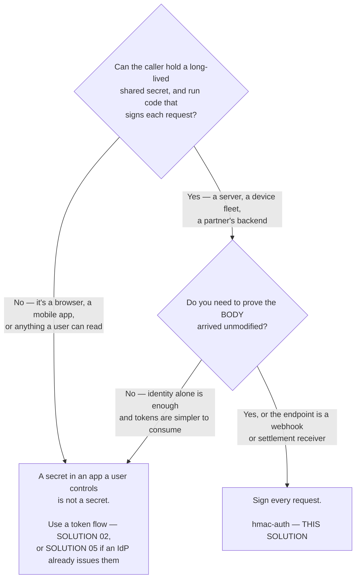
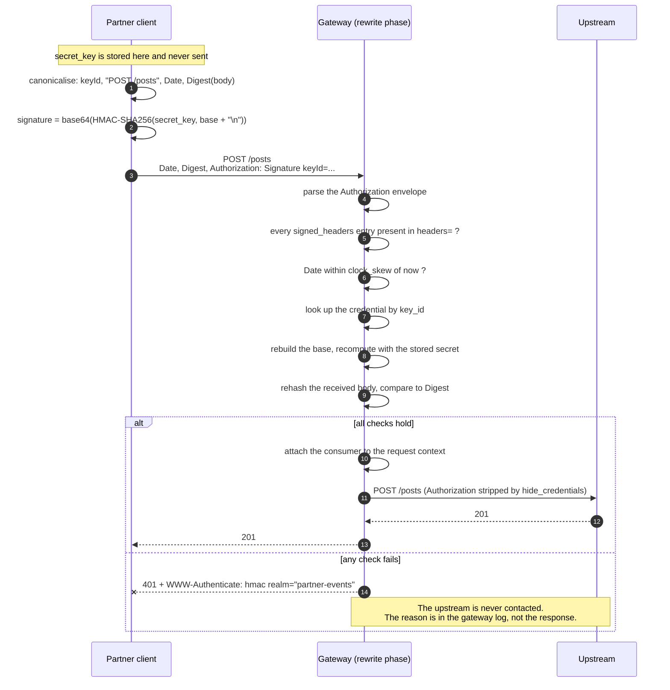
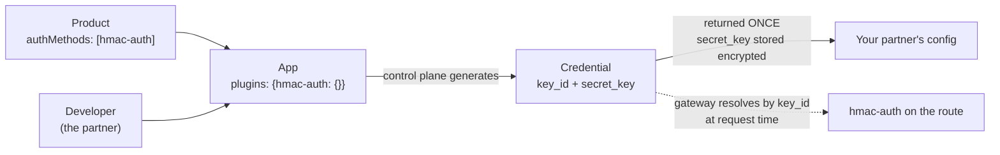

# How it works — Solution 06 — Signed requests: prove who is calling without sending a secret

[Overview](readme.md) · [Business need](business-need.md) · **How it works** · [Install](install.md) · [Configuration](configuration.md) · [Test & verify](testing.md) · [Changelog](changelog.md)

---

## Signature or token — decide this first



**Signing costs the caller more than a token does**, and that is the honest
trade: they must canonicalise the request, hash the body and compute an HMAC on
every call, and get all three byte-exact. Ask for it when the payload matters or
the credential cannot be allowed to travel. Do not ask a browser for it — a
secret shipped to a user's device is not a secret, and no amount of signing fixes
that.

### Check the plugin exists in your org before you start

Builds vary, and the control plane hides plugins it does not support:

```bash
GET /api/orgs/{orgId}/plugin-schemas?page=1&size=300
```

`hmac-auth` must be in the result. On the build this package was validated
against it is present, alongside `helix-auth`, `basic-auth`, `ldap-auth` and
`openid-connect`. Note what is **not** there: `key-auth` and `jwt-auth`. Those
are switched off rather than merely hidden — importing a spec that names one
returns `400` with `key-auth is not an allowed plugin`, which at least tells you
plainly what happened. `hmac-auth` is not in that category — but confirm it in
*your* org rather than trusting this sentence.

## How a signature is built

This is the part integrators get wrong, so it is written out exactly.

### The signing base

Join these with `\n`, **and terminate with a final `\n`**:

1. the `keyId`, alone on the first line
2. then, **in the order they appear in your `headers` field**, one line per entry:
   - `@request-target` → `<METHOD> <path-and-query>`, method **uppercase**
   - any other name → `<name>: <header value>`

```text
demo-key\n
POST /posts\n
date: Wed, 16 Sep 2026 11:12:37 GMT\n
digest: SHA-256=bSNUn7HvRElwnpOx6RaAXbApBPNta7M0chZgmYaCEFI=\n
```

Then `signature = base64(HMAC-SHA256(secret_key, base))`.

### The headers you send

```text
Authorization: Signature keyId="<key_id>",algorithm="hmac-sha256",
               headers="@request-target date digest",signature="<base64>"
Date:   <RFC 1123, GMT>
Digest: SHA-256=<base64(sha256(raw request body))>
```

`headers` is a space-separated list naming what the base covers, in order. `Date`
is required whenever `clock_skew` is non-zero (default 300). `Digest` is required
when `validate_request_body` is on, and is computed over the **raw body bytes** —
re-serialising the body between signing and sending invalidates it.

### It is not draft-cavage, despite the header shape

The `Authorization: Signature keyId=…` envelope is cavage's. The string that gets
signed is not. **Off-the-shelf HTTP Signatures libraries will not interoperate** —
they produce signatures this rejects with a bare 401.

| | draft-cavage | here |
|---|---|---|
| `keyId` in the signing base | not included | **first line** |
| Terminating newline | none | **required** |
| Request target | `(request-target): post /path` | `@request-target` → `POST /path` |

Each difference alone changes the signature. Write the ~15 lines from the worked
example below instead of reaching for a library.

### Worked example

```bash
BODY='{"title":"order-created","body":"sku-1","userId":1}'
DATE=$(LC_ALL=C date -u '+%a, %d %b %Y %H:%M:%S GMT')
DIGEST="SHA-256=$(printf '%s' "$BODY" | openssl dgst -sha256 -binary | openssl base64 -A)"

# printf is piped straight into openssl on purpose: the signing base ends with a
# newline, and $( ) strips trailing newlines. Capturing the base in a variable
# first signs a different string, and every request 401s.
SIGNATURE=$(printf '%s\nPOST /posts\ndate: %s\ndigest: %s\n' \
              "$KEY_ID" "$DATE" "$DIGEST" \
            | openssl dgst -sha256 -hmac "$SECRET_KEY" -binary | openssl base64 -A)

curl -i -X POST "https://<YOUR_GATEWAY_HOST>/posts" \
  -H 'Content-Type: application/json' \
  -H "Date: $DATE" -H "Digest: $DIGEST" \
  -H "Authorization: Signature keyId=\"$KEY_ID\",algorithm=\"hmac-sha256\",headers=\"@request-target date digest\",signature=\"$SIGNATURE\"" \
  -d "$BODY"
```

[`gateway/verify.sh`](gateway/verify.sh) contains the same construction as a
reusable shell function, handling both the with-digest and no-digest signed sets.

## The flow



## Execution order

Order here is **phase first, then priority within a phase** — not the order
plugins appear in the document. Listing them differently changes nothing.

| Plugin | Phase | Priority | Runs |
|---|---|---|---|
| `hmac-auth` | rewrite | 2530 | Before anything in the access phase, and before the upstream |
| `request-id` | rewrite | — | Service-scoped; produces the correlation id |

Two consequences worth knowing:

- **Rejection happens early.** A bad signature is refused in the rewrite phase, so
  the upstream is never contacted and nothing appears in your backend logs. Absence
  of a log line downstream is expected, not a symptom.
- **`hmac-auth` reads the request body** when `validate_request_body` is on. That
  matters beyond this solution: a plugin later in the chain that expects the body
  to have been read — a logger with `include_req_body`, for instance — depends on
  *something* having read it in the rewrite phase. See
  [solution 07](../07-http-to-kafka/), where that dependency is the whole design.

### The plugin that cannot sit next to it

`request-validation` also runs in the rewrite phase, at priority **2800** — ahead
of `hmac-auth`. It re-encodes the parsed JSON body with `set_body_data`,
deliberately, as a defence against parser-differential attacks.

`hmac-auth` then hashes the **re-encoded** bytes while the client hashed what it
actually sent. Key order and whitespace differ, so the two digests agree only by
coincidence. Symptom: a bare 401, with `Invalid digest` in the gateway log.

They are mutually exclusive on a route. Pick one:

| You want | Do this |
|---|---|
| Body integrity (the point of signing) | `hmac-auth` with `validate_request_body`. Validate the schema behind the gateway |
| Schema rejection at the edge | `request-validation`, and accept that the signature cannot cover the body |

## Why signing, structurally

A bearer credential and a signature answer the same question with different
mechanics, and the difference is not about strength of algorithm:

| | Bearer credential | Signature |
|---|---|---|
| How possession is proven | By **disclosing** the secret | By **computing a function** of it |
| What the proof covers | Nothing — it is the same string every time | This method, path, body and timestamp |
| Reusable by an observer | Yes, indefinitely | Only as a replay of that exact request, until `clock_skew` |
| Verifier could forge it | Yes (it holds the credential) | Yes (symmetric secret) — so, no non-repudiation |

The last row is the honest limit: this is symmetric. It gives integrity and
authentication, not proof of origin against the verifier.

## Where the secret lives

Nowhere in this repository, and nowhere in the specification — by construction,
not by discipline.

`hmac-auth`'s route schema is exactly `allowed_algorithms`, `clock_skew`,
`signed_headers`, `validate_request_body`, `hide_credentials`,
`anonymous_consumer`, `realm` and `_meta`. **There is no secret field.** There is
nothing to accidentally commit.

The secret is on the **app credential**, which the control plane owns:



- `authMethods` on the product **must** name `hmac-auth`; it defaults to
  `helix-auth`, and an app under a product that does not name it is rejected.
- `{"hmac-auth": {}}` — an empty config — is the instruction to generate both
  values. Supply them explicitly instead to match a secret a partner already holds.
- `secret_key` is an encrypted field. It is returned in the create response and
  never again.
- Rotation regenerates both values together. There is no previous-secret grace
  period, so rotation is a cutover.

Contrast [solution 02](../02-oauth-jwt/), where `signing_secret` is a **literal in
the spec** and shipping the placeholder publishes your signing key. That failure
mode does not exist here.

## Route shaping

The signed set is a property of the route, not of the API, because what there is
to sign differs per route:

| Route | `signed_headers` | `validate_request_body` |
|---|---|---|
| `POST /posts` | `@request-target`, `date`, `digest` | `true` |
| `GET /posts/{postId}` | `@request-target`, `date` | `false` |

`hmac-auth` is therefore applied **per route**. The trade is explicit: a route
added later without an `x-helix-gateway` block is unauthenticated. The fail-safe
alternative is a single root-level block with the `POST` configuration, at the
cost of making bodyless callers send `SHA-256=47DEQpj8HBSa+/TImW+5JCeuQeRkm5NMpJWZG3hSuFU=`
— the digest of the empty string.

`@request-target` expands to `<METHOD> <request_uri>`, and `request_uri`
**includes the query string**. Any intermediary that normalises, reorders or
appends query parameters invalidates every signature it touches.

## Native vs custom

No custom code. `hmac-auth` is a stock plugin; the only implementation work is on
the **client** side, and that is unavoidable — signing is by definition something
the caller does.

What was deliberately *not* built:

- **A nonce cache via `lua-callout`.** It would close the replay window, and it
  needs shared storage with a consistency story of its own. Out of scope here;
  idempotency upstream is the cheaper answer for most endpoints.
- **`request-validation` alongside it.** Incompatible, as above.
- **Custom header parsing.** The envelope is fixed by the plugin.

## Prerequisites

- An org whose build includes `hmac-auth` — confirm with
  `GET /api/orgs/{orgId}/plugin-schemas?page=1&size=300`.
- An upstream bound to the service. The spec ships pointed at public
  jsonplaceholder so it works on a fresh org.
- A product with `authMethods: ["hmac-auth"]`, a developer, and one app per
  integration.
- Callers with a clock accurate to within `clock_skew` (300s here). A device fleet
  without NTP will generate 401s that look like credential failures.

## Failure behaviour

| Condition | Result |
|---|---|
| No `Authorization` header | 401, with the reason in the body |
| Malformed envelope | 401, with the reason in the body |
| Bad signature, bad digest, stale `Date`, unknown `key_id`, weak signed set | 401, body says only `client request can't be validated` |
| Signature valid, request replayed inside `clock_skew` | **Accepted.** No nonce exists |
| Upstream down | Normal upstream failure — authentication already succeeded |

The split between explained and unexplained 401s is deliberate: parsing errors
help an honest integrator, validation errors must not help an attacker
distinguish which check failed. The detail is in the gateway log, correlated by
the `X-Request-Id` the response carries.

## The request path, step by step

The secret is used on both ends and transmitted by neither. The gateway is not
checking a credential against a list; it is **recomputing the same function over
the same inputs** and comparing the results.
