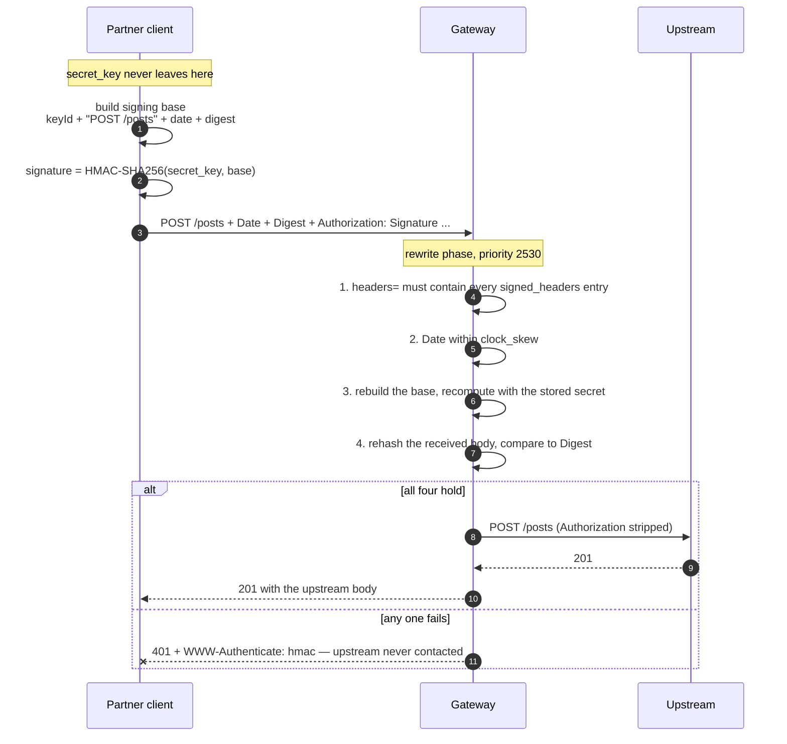

# Solution 06 — Signed requests: prove who is calling without sending a secret

**Overview** · [Business need](business-need.md) · [How it works](how-it-works.md) · [Install](install.md) · [Configuration](configuration.md) · [Test & verify](testing.md) · [Changelog](changelog.md)

---

**A bearer token is a password in a header: whoever captures it becomes you. An
HMAC signature proves the caller holds a shared secret without that secret ever
crossing the wire — and binds the proof to one request's method, path and body.**

<!-- facts:begin -->

| | |
|---|---|
| **Setup time** | ~20 minutes |
| **Difficulty** | Beginner |
| **Needs** | An org whose build includes `hmac-auth` · one upstream. The upstream here is the public jsonplaceholder, so no backend of your own |
| **Plugins** | `hmac-auth` · `request-id` |
| **Build it with** | **[the Agent](install.md)** — recommended · or import [`gateway/api-spec.yaml`](gateway/api-spec.yaml) |

<!-- facts:end -->

## The problem

> *"Our payment partner posts settlement files to us. We gave them an API key
> three years ago. It's in their runbook, their CI, and — we found out in March —
> a Jira ticket. Rotating it means a coordinated release on their side, so we
> haven't. And even if the key were safe, it tells us nothing about the payload:
> if something rewrites the amount in transit, the key still checks out."*

Two separate failures, and a bearer credential of any kind — static key, JWT,
opaque token — has both:

1. **It travels on every request.** Anything that sees one request sees the
   credential: a proxy log, a misconfigured TLS terminator, a screenshot in a
   support ticket. Capture it once and you can impersonate the caller until
   somebody rotates it.
2. **It says nothing about the request it arrived on.** The token authenticates
   the *caller*. It does not authenticate the *message*. A body modified between
   the client and you still arrives with a perfectly valid credential attached.

**Root cause:** bearer credentials answer "who are you?" by *showing the secret*.
That conflates possession of a secret with authorship of a request, and once you
notice the conflation, both failures are the same failure.

A signature answers the same question by *proving possession without disclosure*,
and it proves it **about a specific request**. The secret stays on both ends and
never moves.

## Business need

Accept traffic from partners, devices and webhook senders in a way that survives
the credential being observed, and that detects a payload altered in transit —
without a client-side release to rotate anything, and without the backend
learning about authentication at all.

- **A captured request is worth one request.** The signature covers that method,
  that path, that body, and a timestamp. Replaying it after `clock_skew` seconds
  fails; altering any part of it fails immediately.
- **The secret is never transmitted, so it cannot be captured in transit.** The
  exposure surface shrinks from "every request, forever" to "the two places the
  secret is stored".
- **Per-partner blast radius.** One app per integration means one `key_id` and
  one `secret_key` per integration, rotated independently.
- **It is what the other side already built.** Stripe, GitHub, Shopify, Slack and
  Twilio all sign their webhooks. Partners integrating with you have written this
  client before.

Quantified in [business-need.md](business-need.md). No ROI figures are invented here.

## How a request flows

The full walkthrough is on **[How it works](how-it-works.md)**.

## Gotchas

- **The trailing newline on the signing base is load-bearing**, and `$(...)`
  strips trailing newlines. Pipe `printf` straight into `openssl`; never capture
  the base in a variable first. This is the single most common cause of "my
  signature is definitely right and I get 401".
- **Off-the-shelf draft-cavage libraries do not interoperate.** Three deliberate
  differences, each sufficient on its own. See the table above.
- **`request-validation` cannot share a route with `validate_request_body`.** It
  runs earlier in the same phase (priority 2800 vs 2530) and re-encodes the parsed
  JSON with `set_body_data`, deliberately, as a defence against parser-differential
  attacks. `hmac-auth` then hashes the re-encoded bytes while your client hashed
  what it sent; key order and whitespace differ, so the digests match only by
  coincidence. Symptom: a bare 401 with `Invalid digest` in the log. Validate the
  schema behind the gateway instead, or accept the signature without body binding.
- **`Date` is a forbidden header in browsers.** `fetch` and `XHR` refuse to set
  it, so this scheme cannot be driven from browser JavaScript as written. That is
  a feature — see the decision tree — but it surprises people building an admin UI.
- **A header named in `headers=` that is not actually sent is silently skipped**
  from the signing base rather than erroring. `signed_headers` catches the cases
  you require; anything else you list is on you.
- **`@request-target` includes the query string.** A signature for
  `/posts?page=1` does not verify against `/posts?page=2`, and any proxy that
  normalises, reorders or appends query parameters between the client and the
  gateway breaks every signature it touches.
- **Clock drift is a real outage.** `clock_skew` is 300 seconds here. A device
  fleet without NTP will produce 401s that look like credential problems.
- **`hmac-sha1` is in the plugin's default `allowed_algorithms`.** This spec
  narrows it to SHA-256 and SHA-512 explicitly. Leaving the default in place lets
  a caller choose the weakest option.

## When to use it

**Use it when** the caller is a server, a device or a partner backend; when the
payload's integrity matters (payments, settlement, telemetry, webhooks); when the
credential must survive being logged; or when the other side has already built a
signing client for someone else's API.

**Use a token instead** ([02](../02-oauth-jwt/), [05](../05-okta-jwt/)) when the
caller is a browser or mobile app, when an IdP already owns identity, or when you
need short-lived credentials and per-user identity rather than per-integration.

**They do not compose on one route.** `hmac-auth` and `helix-auth` are both
authentication plugins that resolve a consumer; putting both on a route is not a
supported configuration in this package and is not covered by its validation.

## Limitations

- **This is authentication, not authorization.** The signature proves who called
  and that the message is intact. It carries no scopes and no per-route
  permissions.
- **Replay is possible inside `clock_skew`.** There is no nonce field and no
  replay cache — the plugin schema has neither. A captured request is valid until
  its `Date` ages out. To close it: make the operation idempotent upstream (an
  event id the backend de-duplicates on is the usual answer) and shrink
  `clock_skew` to the smallest value your callers' clocks tolerate. Demonstrated
  as test case 7 rather than left as a caveat.
- **Symmetric secrets.** Both ends hold the same value, so the gateway can forge
  a caller's signature as easily as verify it. Non-repudiation would need
  asymmetric keys, which this plugin does not do.
- **No expiry on the credential.** A `secret_key` is valid until somebody rotates
  it. Unlike a token's TTL, nothing bounds it automatically.
- **Rotation is not zero-downtime.** Rotating regenerates `key_id` and
  `secret_key` together and the old pair stops working immediately. Two apps and a
  cutover window is the workaround; the plugin has no concept of a previous secret.
- **The integration cost lands on the caller.** Every partner writes and debugs
  canonicalisation. Budget for the support load, and send them the worked example
  above rather than a link to the RFC.
- **Quota composes — this was tested, and it works.** Adding
  `api-product-enforcer` to a signed route meters it per app exactly as
  [solution 01](../01-api-products/) describes: with a 3/minute product quota,
  three signed requests returned 201 and the next three returned
  `429 {"error":"quota exceeded"}`. The enforcer resolves the consumer and its
  `credential_id` from `hmac-auth` without any extra configuration. This package
  still ships without the enforcer, because metering is solution 01's subject —
  but you can add it, and nothing about signing gets in the way.

## Validation status

**Validated against a gateway — imported, dry-run, deployed, and passed
`verify.sh` 8/8.**

| Stage | Status | Provenance |
|---|---|---|
| Configuration generated | **YES** | [`gateway/api-spec.yaml`](gateway/api-spec.yaml) |
| Local validation | **PASS** | [`validation/local-validation.yaml`](validation/local-validation.yaml) |
| Gateway dry-run | **PASS** | `{"success":true,"message":"Dry-run validation successful"}` |
| Gateway deployed | **DEPLOYED** | Revision ACTIVE on a temporary test API, since torn down |
| Functional tests | **PASS (8/8)** | `gateway/verify.sh` exit 0 — including the weak-signed-set and replay cases |

Overall: **READY.** Every claim in this package was exercised against a deployed
route with a real app credential: the signing base is the one the gateway builds,
the digest binds the body, `clock_skew` and `signed_headers` are both enforced, a
wrong secret is rejected, and `@request-target` binds the path (a signature for
`/posts/1` returns 401 against `/posts/2`). The replay case passed by being
**accepted** — which is the documented limitation, demonstrated.
[`validation/gateway-validation.yaml`](validation/gateway-validation.yaml) has
the detail.

## Related solutions

- **[02 — OAuth 2.0 with JWT](../02-oauth-jwt/)** — the token alternative, for
  callers that can hold one. The gateway issues and verifies.
- **[05 — OAuth with Okta](../05-okta-jwt/)** — tokens again, when an external
  IdP is the issuer.
- **[01 — API Products](../01-api-products/)** — per-app quotas. The product this
  solution creates for its credential is the same object 01 meters on.
- **[07 — HTTP to Kafka](../07-http-to-kafka/)** — an ingest endpoint with no
  service behind it. Unauthenticated as shipped; this solution is how you close
  it, and that package documents what it costs.
