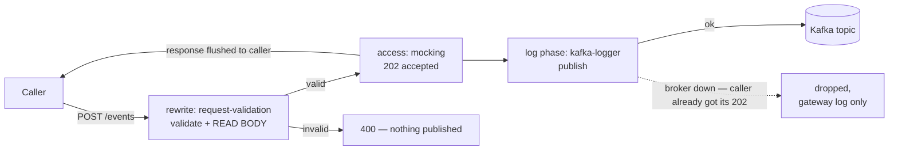
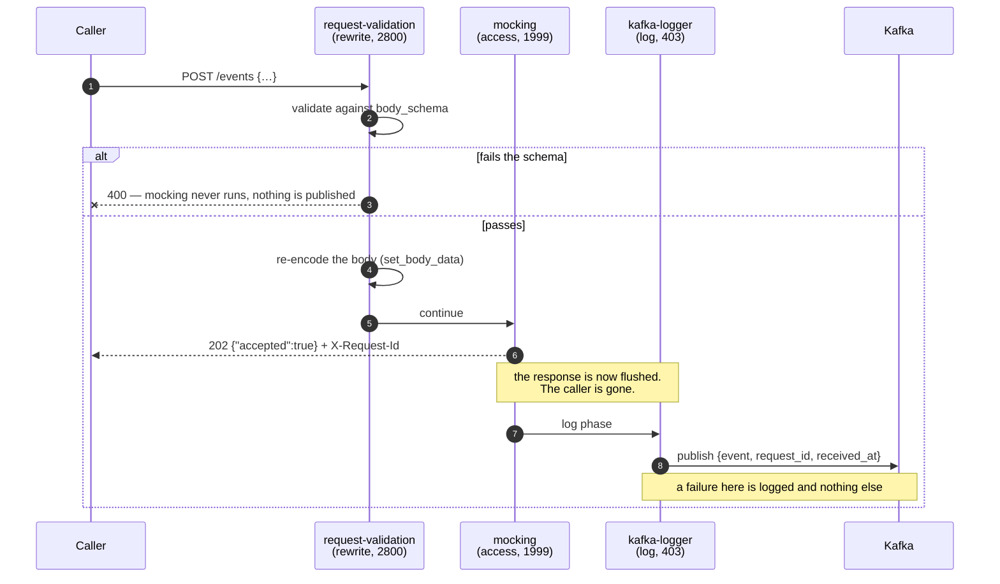

# Solution 07 — HTTP to Kafka: accept events at the edge, publish them without an ingest service

**The service you were going to write does three things: authenticate, validate,
produce. The gateway already does the first two. This solution has it do the
third — and is honest about what you give up.**

| | |
|---|---|
| **Setup time** | ~20 minutes, once you have a broker |
| **Difficulty** | 🟡 Intermediate — needs a Kafka broker reachable from the gateway |
| **Needs** | An org whose build includes **`kafka-logger`**, **`mocking`** and **`request-validation`** · a Kafka broker · a topic browser to verify with. [Kafka quickstart](https://kafka.apache.org/quickstart) · [Kafka UI](https://github.com/provectus/kafka-ui) or [Redpanda Console](https://github.com/redpanda-data/console) |
| **Plugins** | `request-validation` · `mocking` · `kafka-logger` · `request-id` |
| **Build it with** | 🤖 **[the Agent](helix-agent-prompt.md)** — recommended · or import [`gateway/api-spec.yaml`](gateway/api-spec.yaml) |
| **Assets** | ✅ [Agent prompt](helix-agent-prompt.md) · ✅ [Architecture](architecture.md) · ✅ [Business need](business-need.md) · ✅ [Spec](gateway/) · ✅ [Tests](tests/) · ✅ [Validation](validation/) · ✅ [Manifest](solution.yaml) |

---

## The problem

> *"Our partners want to POST us events — order updates, delivery scans, device
> telemetry. Downstream everything is already Kafka. In between there is a
> service that has been on the roadmap for three quarters: it authenticates the
> caller, checks the payload isn't garbage, and calls `producer.send()`. That's
> it. That's the whole service. And it needs a repo, a pipeline, a Dockerfile, an
> on-call rotation, autoscaling, and a service owner."*

The service is almost entirely ceremony:

1. **Authenticate** — the gateway is already doing this for every other API.
2. **Validate** — a JSON Schema check the gateway can do from the same OpenAPI
   document that documents the endpoint.
3. **Produce** — three lines, wrapped in a deployable.

**Root cause:** an ingest endpoint with no business logic is being treated as a
service because "something has to call Kafka". It does — but the gateway is
already on the request path, already parsing the body, and already able to reach
the broker.

## Business need

Open an event-ingest endpoint to partners without adding a deployable to your
estate, and without the endpoint's availability becoming another service's
availability.

- **No new deployable.** No repo, pipeline, image, autoscaling policy, dashboard
  or on-call rotation for code that would have been a `producer.send()`.
- **Time-to-first-event is a config change.** A second event type is another
  route, not another sprint.
- **One fewer hop to be down.** The gateway is already on the path and already in
  someone's availability budget.
- **Malformed events stop at the edge**, so consumers are not each re-validating
  the same payload defensively.

Quantified in [business-need.md](business-need.md). No ROI figures are invented here.

## Read this before you build it

**A `202` means the gateway accepted the event. It does not mean Kafka has it.**

`kafka-logger` publishes from the **log phase** — after the response has already
been flushed to the caller. If the produce fails, there is nobody left to tell.
This is **at-most-once** delivery, and no configuration on this route changes
that.



Decide whether that is acceptable **for this data**, before anything else:

| If losing an occasional event is… | Then |
|---|---|
| Acceptable — analytics, audit trails, telemetry, activity feeds | This solution, as written |
| Not acceptable — payments, orders, anything a customer can notice | See *When not to use this* below. Three alternatives, each with its cost |

This is the honest limitation of the shape, and it is stated here rather than in
a footnote because it is the only thing that decides whether the rest applies.

## How a request flows



### What each plugin is actually for

| Plugin | Phase | Priority | Job |
|---|---|---|---|
| `request-validation` | **rewrite** | 2800 | Reject malformed events before anything else runs |
| `mocking` | **access** | 1999 | Return the 202 and short-circuit — no upstream is contacted |
| `kafka-logger` | **access** (skipped) + **log** | 403 | Publish, after the response has been flushed |

`mocking` genuinely does short-circuit the access phase, so `kafka-logger`'s
access handler — the one `include_req_body` uses to read the body — never runs.

**It does not matter.** `$request_body` in `log_format` resolves correctly
regardless. This was tested directly against a deployed route: the event is
published in full with `request-validation` **removed**, and again with
`include_req_body` set to **false**. Neither is load-bearing for the body.

> An earlier version of this package claimed the opposite — that removing
> `request-validation` would silently empty every message. The reasoning was
> plausible and wrong, and running it disproved it. If you have seen that claim
> repeated elsewhere, this is the correction.

So `request-validation` earns its place for the ordinary reason: it rejects
malformed events at the edge. Paired with `kafka-logger`'s `_meta.filter` on
`status == 202`, a rejected event is neither acknowledged nor published.

One side effect is worth knowing, because it bites later: `request-validation`
**re-encodes** the body with `set_body_data` as a defence against
parser-differential attacks. You can see it — key order in the published `event`
is the re-encoded order, not the order your client sent. That is precisely why it
cannot share a route with `hmac-auth`. See *Adding authentication*.

### Correlating a request with its message — use the right variable

`log_format` must use **`$apisix_request_id`**, not `$request_id`. They are
different values and only one matches what the caller was given:

| Variable | Value | Matches `X-Request-Id`? |
|---|---|---|
| `$request_id` | nginx's own id — 32 hex chars, no dashes | **No. Never.** |
| `$apisix_request_id` | seeded from `$request_id`, then overwritten by the `request-id` plugin with the UUID it returns to the caller | **Yes** |
| `$http_x_request_id` | reads the request header the plugin set | Yes — but hard-codes the header name |

Confirmed by posting one event and comparing all three against the returned
header. The first version of this spec used `$request_id`, which meant the
correlation field did not correlate — the whole point of having it.

## Adding authentication

**The route as shipped is unauthenticated.** That is deliberate — it is the
smallest thing that demonstrates the mechanism — and it is not what you should
run. Anyone who learns the URL can put anything on your topic.

Close it with **[solution 06](../06-hmac-auth/)**, and note what it costs:

> `hmac-auth`'s `validate_request_body` and `request-validation` **cannot share a
> route.** `request-validation` re-encodes the parsed JSON with `set_body_data`
> (deliberately, against parser-differential attacks) before `hmac-auth` hashes
> it, so the client's `Digest` and the gateway's disagree on key order and
> whitespace. Symptom: a bare 401 with `Invalid digest` in the log.

So when you add signing, **drop `request-validation`**. You trade edge schema
validation for body integrity; validate the shape in your consumer, where an
invalid event is a poison-message problem you have to handle anyway. The
published event stays complete either way — that was tested.

If you only need to know *who* is calling and do not need the signature to cover
the body, `helix-auth` in `validate` mode is the lighter option and does not
touch the body at all — then `request-validation` can stay.

## Build it with the Agent

See [helix-agent-prompt.md](helix-agent-prompt.md) for the step-by-step prompts,
verified on the default agent model.

**One limitation is specific to this solution.** The agent path installs the
route and all three plugins, but it cannot carry a property-level `body_schema` —
the nesting depth reproducibly corrupts the agent's own tool-call arguments, so
nothing gets written at all. The prompt therefore ships a required-only schema,
which still rejects events missing `event_id`, `event_type` or `occurred_at` but
does not constrain their types. For the full schema in
[`gateway/api-spec.yaml`](gateway/api-spec.yaml), import the spec as below — that
path is unaffected. The failure and the evidence are documented under *Known
failure modes* in the prompt.

## Install it directly

```text
1. Replace <YOUR_KAFKA_BROKER> in gateway/api-spec.yaml with a broker hostname
   the GATEWAY can reach — not one only your laptop can reach — and set
   kafka_topic to your topic. Neither value is a secret.

2. CREATE THE TOPIC EXPLICITLY. Do not rely on auto-creation: the message that
   triggers topic creation is dropped, and the caller still gets its 202.

3. Import gateway/api-spec.yaml and bind any upstream to the service. The /events
   route never reaches it — mocking short-circuits first — but a revision will not
   deploy without a binding.

4. Deploy the revision to the "test" environment (a free-trial org's default).

5. Prove the edge contract
   GATEWAY=https://<YOUR_GATEWAY_HOST> ./gateway/verify.sh

6. Prove the Kafka leg in your topic browser — see below. Step 5 cannot do it.
```

## Verifying the Kafka leg

`verify.sh` deliberately does not try to check Kafka. It cannot: the publish
happens after the response is flushed, so nothing in any response reflects it. A
script that inferred delivery from a 202 would be making exactly the assumption
this solution warns against.

Instead, `verify.sh` prints the `event_id` and `X-Request-Id` of the event it
posted. Take them to your topic browser:

```text
1. Open the configured topic in Kafka UI (or Redpanda Console, or
   kafka-console-consumer.sh --from-beginning).
2. Look at the newest messages. Find the one whose request_id matches the
   X-Request-Id that verify.sh printed.
3. Confirm its "event" field contains the JSON you posted.
```

**Step 3 is the real assertion.** A message with an *empty* `event` field is the
failure this design is most likely to hit, and it looks like success from every
other angle — see *Why `request-validation` is not optional*.

Matching on `request_id` rather than eyeballing the newest message is the point of
having `request-id` on the API. On a busy topic, timestamps cannot distinguish two
events posted in the same second, and `received_at` is the gateway's clock.

## Configuration

| Field | Value here | Why |
|---|---|---|
| `producer_type` | `sync` | A real broker round trip, so a rejection is logged rather than vanishing into a ring buffer. Also removes the async producer's 1-second linger |
| `required_acks` | `-1` | All in-sync replicas. The default is `1` — leader only — which loses the event if the leader fails before replicating |
| `max_retry_count` | `3` | The default is **0**: a failed batch is dropped, not retried |
| `batch_max_size` | `1` | Publish per event rather than per batch. Costs ordering — see Limitations |
| `_meta.filter` | `status == 202` | Without it, a 400 is published too, and rejected events reach the topic by the back door |
| `with_mock_header` | `false` | Defaults to **true**, stamping every response with a header naming the mocking plugin and the gateway version |

## Testing

[`gateway/verify.sh`](gateway/verify.sh) exits 0 only if all four hold:

| # | Case | Expect |
|---|---|---|
| 1 | Valid event | 202 `{"accepted":true}` from the gateway itself |
| 2 | Correlation | `X-Request-Id` on the 202 |
| 3 | Event missing required fields | 400, nothing published |
| 4 | Response headers | No `x-mock-by` |

Four further cases are **manual**, because no response can establish them. Three
were run against a real broker and passed: the message is on the topic with its
body complete; a rejected event is *not* on the topic; and with the broker
unreachable the caller still gets 202 while the event is lost. The fourth — a
topic that does not exist yet losing the message that creates it — was not run.
All four in [tests/test-plan.yaml](tests/test-plan.yaml).

**Run the broker-down case once**, in front of whoever is deciding whether this
shape suits the data. It is the fastest way to make the limitation concrete.

## When to use it

**Use it when** losing an occasional event is acceptable — analytics, audit
trails, activity feeds, telemetry, click streams, anything where the aggregate
matters more than any single record. Also when you need an endpoint live this
week and a durable path can follow.

**Use it as a front door** even for durable pipelines: the same route can validate
and acknowledge while a different mechanism does the durable write.

## When not to use this

If an event must not be lost, do not paper over it with retries and hope. Three
alternatives, cheapest first:

| Option | Shape | Cost |
|---|---|---|
| **`service-callout` → Kafka REST Proxy** | Runs in the *access* phase, synchronously, so `error_handling.policy: fail-close` returns 503 to the caller when Kafka rejects | An HTTP hop and a REST-proxy deployment; adds latency to every request |
| **Producer service behind the gateway** | The gateway proxies to a real service that produces with `acks=all` and idempotence, and only then returns 202 | One more deployable — the thing you were trying to avoid — but a real acknowledgement |
| **Transactional outbox** | Ingest writes to its own store, a relay publishes | Strongest guarantee, most machinery |

The first is the natural upgrade from this solution: the same route shape, with
the publish moved into a phase that can still answer the caller.

## Gotchas

- **A `202` is not a delivery guarantee.** The headline. Everything else here is
  a detail by comparison.
- **`request-validation` re-encodes the body.** Key order in the published
  `event` is the re-encoded order, not your client's. Harmless here; fatal if you
  add `hmac-auth`. (It is *not* required for the body to be published — that was
  tested, in both directions.)
- **`request-validation` and `hmac-auth`'s `validate_request_body` are mutually
  exclusive** on a route. See *Adding authentication*.
- **Create topics explicitly.** With `auto.create.topics.enable`, the message that
  triggers creation is dropped — the metadata request creates the topic and the
  message that prompted it is gone. The caller gets a 202. Every new topic costs
  exactly one event, and in production that is a real one.
- **Ordering is not preserved.** `batch_max_size: 1` makes each event its own
  zero-delay timer, and those timers race. Events posted in sequence land out of
  order, even on one partition. **Kafka offsets carry no ordering meaning here** —
  order downstream on a timestamp in the event itself.
- **`key` is a static string.** No variable resolution, so you cannot partition
  by a field in the body. Without a key, records round-robin — which is also why
  per-entity ordering is unavailable.
- **`body_schema` and the OpenAPI `requestBody` schema are two separate
  documents.** Nothing keeps them in step; the first enforces, the second
  documents. Change both.
- **The broker host must be reachable from the gateway**, not from your laptop.
  A private broker behind a VPC needs the gateway inside that network.
- **`max_req_body_bytes` defaults to 512 KB.** Larger bodies are truncated in the
  published message, not rejected.

## Limitations

- **At-most-once delivery.** No acknowledgement of the produce ever reaches the
  caller, because the response has already gone.
- **No ordering guarantee**, and no way to key partitions by event content.
- **No authentication as shipped.** Deliberate, and documented above with the
  exact cost of adding it.
- **No back-pressure.** The gateway accepts at HTTP speed regardless of what the
  broker can take; overflow is dropped in the producer buffer, not signalled.
- **No dead-letter path.** A message that cannot be produced is a log line.
- **Edge validation is structural only.** `body_schema` is JSON Schema — it
  cannot check that `event_id` is unique or that `occurred_at` is plausible.
- **Nothing deduplicates.** `event_id` exists so your *consumer* can, which is
  the only place at-least-once semantics can be recovered.
- **`kafka-logger` is a logger.** Using it as a producer is deliberate and works,
  but its defaults are chosen for logs — `max_retry_count: 0`, `required_acks: 1`,
  async — and this spec overrides three of them for that reason.

## Validation status

**Validated against a gateway and a real Kafka cluster — imported, dry-run,
deployed, `verify.sh` 4/4, and the Kafka leg confirmed on a topic.**

| Stage | Status | Provenance |
|---|---|---|
| Configuration generated | **YES** | [`gateway/api-spec.yaml`](gateway/api-spec.yaml) |
| Local validation | **PASS** | [`validation/local-validation.yaml`](validation/local-validation.yaml) |
| Gateway dry-run | **PASS** | `{"success":true,"message":"Dry-run validation successful"}` |
| Gateway deployed | **DEPLOYED** | Revision ACTIVE on a temporary test API, since torn down |
| Functional tests | **PASS (4/4 + 3 manual)** | `verify.sh` exit 0; message-on-topic, rejected-event-not-published and broker-down all confirmed against a real broker |
| Agent prompt | **PASS, with a documented limitation** | Run live 2026-09-21. Seven runs: the shipped prompt lands the route, all three plugins correctly keyed, `_meta.filter` nested, `$apisix_request_id`, and `request-id` at API level. A property-level `body_schema` fails 5/5 — see *Known failure modes* in the prompt |

Overall: **READY.** A valid event publishes with a complete `event` field, a
malformed one is rejected and not published, and with the broker unreachable the
caller still gets `202` while the event is lost — the headline limitation,
demonstrated. The run also corrected two things in this package, both fixed
above: the correlation field used `$request_id` (which never matches the caller's
`X-Request-Id`), and the claim that removing `request-validation` empties every
message is false. Topic auto-creation is the one case not run. Detail in
[`validation/gateway-validation.yaml`](validation/gateway-validation.yaml).

## Related solutions

- **[06 — Signed requests](../06-hmac-auth/)** — how to close this endpoint, and
  what it costs.
- **[03 — API Products](../03-api-products/)** — per-app quotas, once callers are
  authenticated. An open ingest endpoint cannot be metered per caller.
- **[02 — SOAP to REST](../02-soap-to-rest/)** — the other solution where the
  gateway mediates rather than proxies.
