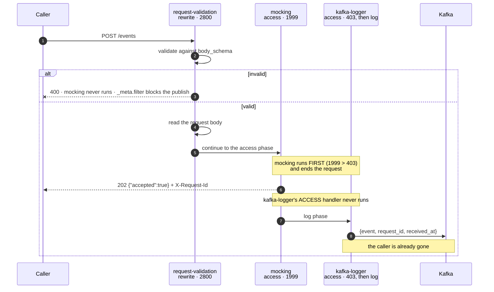
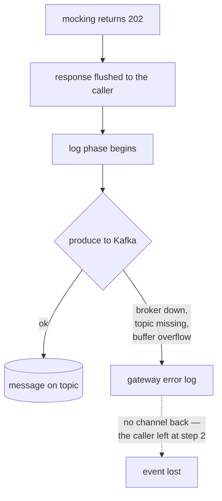

# Architecture — HTTP to Kafka at the edge

> [Overview](README.md) · [Business need](business-need.md) · **Architecture** · [Guides](guides.md) · [Agent prompt](helix-agent-prompt.md) · [Tests](tests.md) · [API reference](api-reference.md)

---

## What the gateway does here

The gateway takes the place of the ingest service. For every `POST /events` it:

1. checks the event against a JSON Schema, and rejects it if it doesn't fit,
2. answers the caller itself with `202 {"accepted":true}`, without contacting any
   backend, and
3. publishes the event to your Kafka topic, after the caller has been answered.

The design is entirely about **when each step runs**. Step 3 happening after the
answer is what makes the endpoint fast and independent of Kafka, and it is also
why a 202 is not a delivery receipt.

For the full list of fields on every plugin mentioned here, see
[docs.digitalapi.ai/api-gateway](https://docs.digitalapi.ai/api-gateway).

## The plugins

| Plugin | Phase | Priority | Job |
|---|---|---|---|
| `request-validation` | **rewrite** | 2800 | Reject malformed events. Also re-encodes the body (see below) |
| `mocking` | **access** | 1999 | Return `202 {"accepted":true}` and stop. No backend is contacted |
| `kafka-logger` | **access** (skipped) + **log** | 403 | Publish the event, after the response has gone |
| `request-id` | API-wide | — | A correlation id, on the response and in the Kafka message |

A request moves through phases in a fixed order — rewrite, then access, then
log. Priority only decides the order of plugins *within* one phase.

## How a request flows

`mocking` ends the access phase, so `kafka-logger`'s access-phase handler (the
one `include_req_body` uses to read the body) never runs. **That does not stop the
body being published.** `$request_body` in `log_format` resolves anyway. This was
tested on a deployed route: the `event` field was complete with
`request-validation` removed, and complete again with `include_req_body: false`.
An earlier version of this package said the opposite; testing showed it was wrong.

So `request-validation` is there for one reason: to reject malformed events.
Together with `kafka-logger`'s `_meta.filter` on `status == 202`, a rejected
event is neither acknowledged nor published.

It has one visible side effect. `request-validation` **re-encodes** the body
(`set_body_data`), as a defence against attacks that rely on two parsers reading
the same JSON differently. You can see it: the key order in the published `event`
is the re-encoded order, not the order your client sent. That is harmless here,
and it is the reason this plugin can't share a route with `hmac-auth` (see
[Where authentication would go](#where-authentication-would-go)).

## Delivery: at most once

The answer comes before the publish, so no publish result can ever reach the
caller. Three settings improve the odds without changing that:

| Setting | Default | Here | Effect |
|---|---|---|---|
| `producer_type` | `async` | `sync` | A real broker round trip, so a rejection is logged rather than disappearing into an in-memory buffer. Also removes the 1-second wait (`producer_time_linger`) from the publish |
| `required_acks` | `1` | `-1` | Wait for all in-sync replicas, not only the leader |
| `max_retry_count` | `0` | `3` | A failed batch is retried rather than dropped |

None of them creates a path back to the caller. If the data can't tolerate loss,
the answer is a different design, not different settings.

## Reading the result

| Condition | Caller sees | What actually happened |
|---|---|---|
| Valid event, broker healthy | **202** | Published |
| Event fails `body_schema` | **400** | Not published — `_meta.filter` requires status 202 |
| Broker unreachable | **202** | Lost. Only the gateway error log shows it |
| Topic does not exist, auto-create on | **202** | This message lost; the topic now exists for the next one |
| Producer buffer overflows | **202** | Dropped |
| Body larger than `max_req_body_bytes` (512 KB) | **202** | Published **truncated**, not rejected |
| `request-validation` removed | **202** | Published **in full** — and malformed events are published too |

Every row where the caller sees 202 and the event is lost is a row no retry,
alert or dashboard on the caller's side can help with.

## Correlation: matching a request to its message

| Variable | What it is | Matches the caller's `X-Request-Id`? |
|---|---|---|
| `$request_id` | the web server's own request id, 32 hex characters | **No** |
| `$apisix_request_id` | starts as `$request_id`, then the `request-id` plugin overwrites it with the UUID it returns to the caller | **Yes** |
| `$http_x_request_id` | the request header the plugin set | Yes, but tied to the plugin's `header_name` |

A `log_format` built on `$request_id` gives a correlation field that matches
nothing. The first version of this package shipped that way; logging all three
side by side against the returned header showed the difference.

## Why `mocking` rather than a backend

`mocking` answers before any backend is contacted, so **this route needs no
backend at all**. Two consequences:

- **A revision still needs an upstream bound before it will deploy**, even though
  this route never uses it. Bind anything.
- **`with_mock_header` defaults to `true`**, which adds an `x-mock-by` header
  naming the plugin and the gateway version to every response. For an endpoint
  that should look like a real ingest API, that is wrong, so the spec sets it to
  `false`.

## Where authentication would go

**The route ships unauthenticated.** That is deliberate — it is the smallest thing
that shows the mechanism — and it is not what you should run. Anyone who knows the
URL can put anything on your topic.

Adding [`hmac-auth`](../06-hmac-auth/) collides with the body re-encoding:

| Plugin | Phase | Priority |
|---|---|---|
| `request-validation` | rewrite | **2800** |
| `hmac-auth` | rewrite | **2530** |

`request-validation` runs first and re-encodes the JSON, so `hmac-auth` then
checks a signature over the *re-encoded* bytes while the client signed what it
sent. Key order and whitespace differ, and the result is **HTTP 401 (not
authenticated)** with `Invalid digest` in the log. **They can't share a route.**
Pick one:

| You want | The route carries | You give up |
|---|---|---|
| Signed, integrity-checked events | `hmac-auth` (`validate_request_body: true`) | Schema checks at the edge — do them in the consumer |
| Schema checks at the edge | `request-validation` | Proof the body wasn't changed |
| To know who is calling, plus schema checks | `helix-auth` validate + `request-validation` | Proof the body wasn't changed |

The third works because `helix-auth` doesn't touch the body. In all three, the
published `event` is complete.

## No custom code needed

No custom code and no deployable. What was deliberately not built:

- **A producer service.** That is the thing being avoided.
- **`service-callout` to a Kafka REST Proxy.** It runs in the access phase,
  before the answer, so it *can* tell the caller Kafka said no. It costs an extra
  HTTP hop, a REST-proxy deployment and added latency on every request. It is the
  first alternative below.
- **Choosing the Kafka partition from the event.** `kafka-logger`'s `key` is a
  fixed string, used as written, so you can't key by a field in the body. Without
  a key, records are spread round-robin.

## When to use this

Use it when:

- losing an occasional event is acceptable — analytics, audit trails, activity
  feeds, telemetry, click streams, anything where the total matters more than one
  record,
- you need an endpoint live this week and a durable path can follow, or
- you want a front door that checks and acknowledges, while something else does
  the durable write.

Do not use it when an event must not be lost. Three alternatives, cheapest first:

| Option | Shape | Cost |
|---|---|---|
| **`service-callout` → Kafka REST Proxy** | Runs in the *access* phase and waits for the answer, so `error_handling.policy: fail-close` returns **HTTP 503 (service unavailable)** to the caller when Kafka rejects | An HTTP hop and a REST-proxy deployment; adds latency to every request |
| **A producer service behind the gateway** | The gateway proxies to a real service that produces with `acks=all` and idempotence, and only then returns 202 | One more deployable — the thing you were avoiding — but a real acknowledgement |
| **Transactional outbox** | The ingest writes to its own store, and a relay publishes | Strongest guarantee, most moving parts |

The first keeps the same route shape and moves the publish to a phase that can
still answer the caller.

## What it does not do

- **Guarantee delivery.** At most once. No publish result reaches the caller.
- **Keep order.** `batch_max_size: 1` makes each event its own timer, and those
  timers race, so events land out of order even on one partition. Kafka offsets
  mean nothing about order here; order downstream on a timestamp inside the event.
- **Authenticate, as shipped.** Closing it is a documented change with a
  documented cost (above).
- **Push back.** The gateway accepts at HTTP speed whatever the broker can take;
  overflow in the producer buffer is dropped, not reported.
- **Keep failed events.** There is no dead-letter path. A message that can't be
  produced is a log line.
- **Check meaning.** `body_schema` checks shape only. It can't tell whether
  `event_id` is unique or `occurred_at` is plausible.
- **Remove duplicates.** `event_id` is carried so your *consumer* can deduplicate.
- **Behave like a dedicated producer by default.** `kafka-logger` is a logger
  used as a producer. Its defaults are chosen for logs (`max_retry_count: 0`,
  `required_acks: 1`, async), which is why this spec overrides three of them.

## What success looks like

- A partner can start sending a new event type without a new deployable.
- Malformed events are rejected at the edge and never reach the topic.
- Every 202 carries a correlation id that also appears in the published message.
- Topics are created explicitly at deploy time, not by auto-creation.
- Whoever owns the data has seen the broker-down test run, and has agreed in
  writing that at-most-once is acceptable for this event type.

## Prerequisites

- An org whose build includes `kafka-logger`, `mocking` and `request-validation`.
  Confirm with `GET /api/orgs/{orgId}/plugin-schemas?page=1&size=300`.
- A Kafka broker reachable **from the gateway**, not just from your laptop. A
  broker inside a private network needs the gateway inside it too.
- The topic created explicitly. Auto-creation drops the message that triggers it.
- A topic browser to check the result. The Kafka side can't be seen from the
  caller's side.
- An upstream bound to the API, even though this route never uses it.
