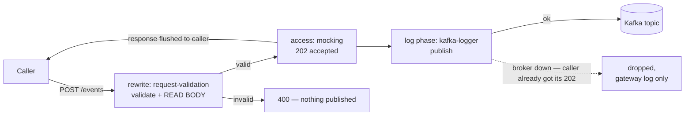
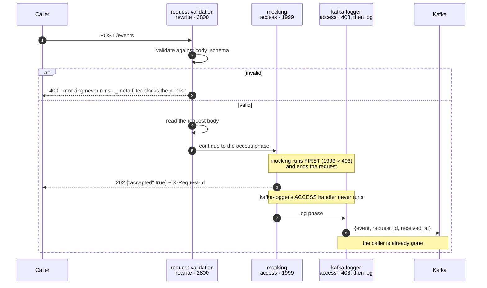
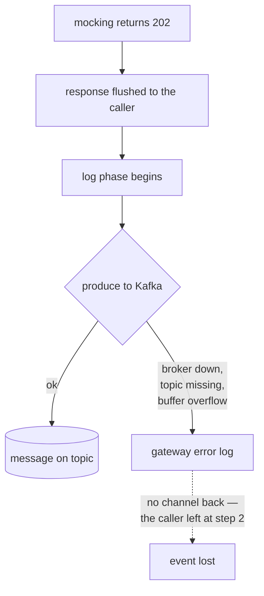

# How it works — Solution 07 — HTTP to Kafka: accept events at the edge, publish them without an ingest service

[Overview](readme.md) · [Business need](business-need.md) · **How it works** · [Install](install.md) · [Configuration](configuration.md) · [Test & verify](testing.md) · [Changelog](changelog.md)

---

## Read this before you build it

**A `202` means the gateway accepted the event. It does not mean Kafka has it.**

`kafka-logger` publishes from the **log phase** — after the response has already
been flushed to the caller. If the produce fails, there is nobody left to tell.
This is **at-most-once** delivery, and no configuration on this route changes
that.

Decide whether that is acceptable **for this data**, before anything else:

| If losing an occasional event is… | Then |
|---|---|
| Acceptable — analytics, audit trails, telemetry, activity feeds | This solution, as written |
| Not acceptable — payments, orders, anything a customer can notice | See *When not to use this* below. Three alternatives, each with its cost |

This is the honest limitation of the shape, and it is stated here rather than in
a footnote because it is the only thing that decides whether the rest applies.

## The chain

| Plugin | Phase | Priority | Does |
|---|---|---|---|
| `request-validation` | **rewrite** | 2800 | Validates against a JSON Schema, and re-encodes the body |
| `mocking` | **access** | 1999 | Returns `202 {"accepted":true}` and short-circuits |
| `kafka-logger` | **access** (skipped) + **log** | 403 | Publishes the body that was read |
| `request-id` | service-scoped | — | Correlation id, on the response and in the message |

Phases run in order — rewrite, then access, then log — and priority only orders
plugins *within* a phase.

## What the phase model does and does not decide

`mocking` short-circuits the access phase, so `kafka-logger`'s access handler —
where `include_req_body` calls `read_body()` — never runs. That much is real, and
readable in the plugin sources.

**It does not follow that the body goes unpublished, and it doesn't.**
`$request_body` in `log_format` resolves correctly anyway. Tested against a
deployed route, twice over: the `event` field is complete with
`request-validation` removed, and complete again with `include_req_body: false`.

An earlier version of this document argued the opposite and called
`request-validation` "load-bearing" for the body read. The argument was
mechanically plausible and empirically false. It is recorded here rather than
quietly deleted, because the shape of the mistake is instructive: every step was
read from source, and the conclusion still did not survive one request.

What `request-validation` actually contributes:

- **Rejection at the edge.** With `kafka-logger`'s `_meta.filter` on
  `status == 202`, a malformed event is neither acknowledged nor published.
- **A re-encoded body**, as a side effect. `set_body_data` re-serialises the
  parsed JSON as a defence against parser-differential attacks, and you can see it
  — the key order of the published `event` is the re-encoding's, not the caller's.
  Harmless here, and the reason this plugin cannot share a route with `hmac-auth`.

## Correlation: `$apisix_request_id`, not `$request_id`

| Variable | What it is | Matches the caller's `X-Request-Id`? |
|---|---|---|
| `$request_id` | nginx's own request id, 32 hex chars | **No** |
| `$apisix_request_id` | seeded from `$request_id`, then overwritten by the `request-id` plugin with the UUID it returns | **Yes** |
| `$http_x_request_id` | the request header the plugin set | Yes, but tied to `header_name` |

The `request-id` plugin sets the request header *and* overwrites
`$apisix_request_id`; it never touches `$request_id`. A `log_format` built on
`$request_id` therefore produces a correlation id that correlates with nothing,
which is what the first version of this package shipped. Confirmed by logging all
three and comparing against the returned header.

## Delivery semantics

**At most once.** The acknowledgement precedes the publish, so no publish outcome
can reach the caller. Three settings improve the odds without changing the
semantics:

| Setting | Default | Here | Effect |
|---|---|---|---|
| `producer_type` | `async` | `sync` | A real broker round trip, so a rejection is logged rather than disappearing into an in-process ring buffer. Also removes the 1-second `producer_time_linger` from the publish path |
| `required_acks` | `1` | `-1` | All in-sync replicas, rather than the leader alone |
| `max_retry_count` | `0` | `3` | A failed batch is retried rather than dropped |

None of them creates a path back to the caller. If the data cannot tolerate loss,
the answer is a different phase, not different settings — `service-callout` runs
in the *access* phase and can `fail-close`, which is the natural upgrade from this
design and keeps the same route shape.

## Why `mocking` rather than an upstream

`mocking` short-circuits before the upstream is consulted, so **this route needs
no backend at all**. That is the point of the solution.

Two consequences:

- **A revision still needs an upstream bound to deploy**, even though this route
  never reaches it. Bind anything.
- **`with_mock_header` defaults to `true`**, stamping responses with a header
  naming the plugin and the gateway version. For an endpoint whose whole job is to
  look like a real ingest API, that default is wrong; the spec sets it `false`.

## Where authentication would go

The route is unauthenticated as shipped — deliberately, as the smallest thing
that demonstrates the mechanism.

Adding [`hmac-auth`](../06-hmac-auth/) collides with the body read, and the
collision is worth understanding rather than working around:

| Plugin | Phase | Priority |
|---|---|---|
| `request-validation` | rewrite | **2800** |
| `hmac-auth` | rewrite | **2530** |

Both are rewrite-phase, and `request-validation` runs first. It re-encodes the
parsed JSON with `set_body_data` — deliberately, as a defence against
parser-differential attacks — so `hmac-auth` then hashes the *re-encoded* bytes
while the client hashed what it sent. Key order and whitespace differ; the
digests agree only by coincidence.

**They cannot share a route.** Pick one:

| You want | Route carries | You give up |
|---|---|---|
| Signed, integrity-checked ingest | `hmac-auth` (`validate_request_body: true`) | Edge schema validation — do it in the consumer |
| Edge schema validation | `request-validation` | Body integrity |
| Identity only, plus schema validation | `helix-auth` validate + `request-validation` | Proof the body was not modified |

The third row works because `helix-auth` does not touch the body. In all three the
published `event` is complete.

## Native vs custom

No custom code, and no deployable. What was deliberately not built:

- **A producer service.** That is the thing being avoided; see
  [business-need.md](business-need.md) for when you should build it anyway.
- **`service-callout` to a Kafka REST Proxy.** Access-phase and synchronous, so it
  *can* fail-close and tell the caller. It costs an HTTP hop, a REST-proxy
  deployment, and latency on every request. The right choice when loss is
  unacceptable, and listed in the README as the first upgrade.
- **Partitioning by event content.** `kafka-logger`'s `key` is a static string
  used verbatim, with no variable resolution, so keying by a body field is not
  possible. Without a key, records round-robin.

## Prerequisites

- An org whose build includes `kafka-logger`, `mocking` and `request-validation` —
  confirm with `GET /api/orgs/{orgId}/plugin-schemas?page=1&size=300`.
- A Kafka broker reachable **from the gateway**, not from your laptop. A broker
  inside a private network needs the gateway inside it too.
- The topic created explicitly. Auto-creation drops the message that triggers it.
- A topic browser to verify with — the Kafka leg is not observable from the
  caller's side.
- An upstream bound to the service, even though this route never uses one.

## Failure behaviour

| Condition | Caller sees | Reality |
|---|---|---|
| Valid event, broker healthy | 202 | Published |
| Event fails `body_schema` | 400 | Not published — `_meta.filter` requires status 202 |
| Broker unreachable | **202** | Lost. Gateway error log only |
| Topic does not exist, auto-create on | **202** | This message lost; the topic now exists for the next one |
| Producer buffer overflows | **202** | Dropped |
| Body larger than `max_req_body_bytes` (512 KB) | 202 | Published **truncated**, not rejected |
| `request-validation` removed | 202 | Published **in full** — and malformed events are published too |

Every row where the caller sees 202 and the reality is loss is a row where no
retry, alert or dashboard on the caller's side can help. That is the cost of the
shape, and it is why the package asks you to decide about the data first.

## The request path, step by step

### What each plugin is actually for

| Plugin | Phase | Priority | Job |
|---|---|---|---|
| `request-validation` | **rewrite** | 2800 | Reject malformed events before anything else runs |
| `mocking` | **access** | 1999 | Return the 202 and short-circuit — no upstream is contacted |
| `kafka-logger` | **access** (skipped) + **log** | 403 | Publish, after the response has been flushed |

`mocking` genuinely does short-circuit the access phase, so `kafka-logger`'s
access handler — the one `include_req_body` uses to read the body — never runs.

**It does not matter.** `$request_body` in `log_format` resolves correctly
regardless. This was tested directly against a deployed route: the event is
published in full with `request-validation` **removed**, and again with
`include_req_body` set to **false**. Neither is load-bearing for the body.

> An earlier version of this package claimed the opposite — that removing
> `request-validation` would silently empty every message. The reasoning was
> plausible and wrong, and running it disproved it. If you have seen that claim
> repeated elsewhere, this is the correction.

So `request-validation` earns its place for the ordinary reason: it rejects
malformed events at the edge. Paired with `kafka-logger`'s `_meta.filter` on
`status == 202`, a rejected event is neither acknowledged nor published.

One side effect is worth knowing, because it bites later: `request-validation`
**re-encodes** the body with `set_body_data` as a defence against
parser-differential attacks. You can see it — key order in the published `event`
is the re-encoded order, not the order your client sent. That is precisely why it
cannot share a route with `hmac-auth`. See *Adding authentication*.

### Correlating a request with its message — use the right variable

`log_format` must use **`$apisix_request_id`**, not `$request_id`. They are
different values and only one matches what the caller was given:

| Variable | Value | Matches `X-Request-Id`? |
|---|---|---|
| `$request_id` | nginx's own id — 32 hex chars, no dashes | **No. Never.** |
| `$apisix_request_id` | seeded from `$request_id`, then overwritten by the `request-id` plugin with the UUID it returns to the caller | **Yes** |
| `$http_x_request_id` | reads the request header the plugin set | Yes — but hard-codes the header name |

Confirmed by posting one event and comparing all three against the returned
header. The first version of this spec used `$request_id`, which meant the
correlation field did not correlate — the whole point of having it.
