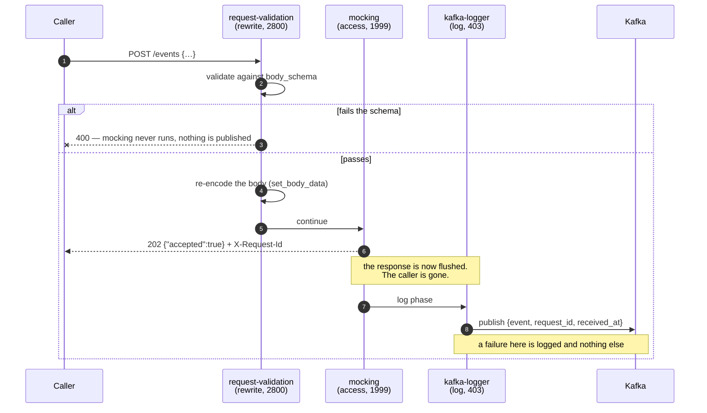

# Solution 07 — HTTP to Kafka: accept events at the edge, publish them without an ingest service

**Overview** · [Business need](business-need.md) · [How it works](how-it-works.md) · [Install](install.md) · [Configuration](configuration.md) · [Test & verify](testing.md) · [Changelog](changelog.md)

---

**The service you were going to write does three things: authenticate, validate,
produce. The gateway already does the first two. This solution has it do the
third — and is honest about what you give up.**

<!-- facts:begin -->

| | |
|---|---|
| **Setup time** | ~20 minutes, once you have a broker |
| **Difficulty** | Intermediate |
| **Needs** | An org whose build includes `kafka-logger`, `mocking` and `request-validation` · a Kafka broker · a topic browser to verify with. [Kafka quickstart](https://kafka.apache.org/quickstart) · [Kafka UI](https://github.com/provectus/kafka-ui) or [Redpanda Console](https://github.com/redpanda-data/console) |
| **Plugins** | `kafka-logger` · `mocking` · `request-id` · `request-validation` |
| **Build it with** | **[the Agent](install.md)** — recommended · or import [`gateway/api-spec.yaml`](gateway/api-spec.yaml) |

<!-- facts:end -->

## When not to use this

If an event must not be lost, do not paper over it with retries and hope. Three
alternatives, cheapest first:

| Option | Shape | Cost |
|---|---|---|
| **`service-callout` → Kafka REST Proxy** | Runs in the *access* phase, synchronously, so `error_handling.policy: fail-close` returns 503 to the caller when Kafka rejects | An HTTP hop and a REST-proxy deployment; adds latency to every request |
| **Producer service behind the gateway** | The gateway proxies to a real service that produces with `acks=all` and idempotence, and only then returns 202 | One more deployable — the thing you were trying to avoid — but a real acknowledgement |
| **Transactional outbox** | Ingest writes to its own store, a relay publishes | Strongest guarantee, most moving parts |

The first is the natural upgrade from this solution: the same route shape, with
the publish moved into a phase that can still answer the caller.

## The problem

> *"Our partners want to POST us events — order updates, delivery scans, device
> telemetry. Downstream everything is already Kafka. In between there is a
> service that has been on the roadmap for three quarters: it authenticates the
> caller, checks the payload isn't garbage, and calls `producer.send()`. That's
> it. That's the whole service. And it needs a repo, a pipeline, a Dockerfile, an
> on-call rotation, autoscaling, and a service owner."*

The service is almost entirely ceremony:

1. **Authenticate** — the gateway is already doing this for every other API.
2. **Validate** — a JSON Schema check the gateway can do from the same OpenAPI
   document that documents the endpoint.
3. **Produce** — three lines, wrapped in a deployable.

**Root cause:** an ingest endpoint with no business logic is being treated as a
service because "something has to call Kafka". It does — but the gateway is
already on the request path, already parsing the body, and already able to reach
the broker.

## Business need

Open an event-ingest endpoint to partners without adding a deployable to your
estate, and without the endpoint's availability becoming another service's
availability.

- **No new deployable.** No repo, pipeline, image, autoscaling policy, dashboard
  or on-call rotation for code that would have been a `producer.send()`.
- **Time-to-first-event is a config change.** A second event type is another
  route, not another sprint.
- **One fewer hop to be down.** The gateway is already on the path and already in
  someone's availability budget.
- **Malformed events stop at the edge**, so consumers are not each re-validating
  the same payload defensively.

Quantified in [business-need.md](business-need.md). No ROI figures are invented here.

## How a request flows

The full walkthrough is on **[How it works](how-it-works.md)**.

## Gotchas

- **A `202` is not a delivery guarantee.** The headline. Everything else here is
  a detail by comparison.
- **`request-validation` re-encodes the body.** Key order in the published
  `event` is the re-encoded order, not your client's. Harmless here; fatal if you
  add `hmac-auth`. (It is *not* required for the body to be published — that was
  tested, in both directions.)
- **`request-validation` and `hmac-auth`'s `validate_request_body` are mutually
  exclusive** on a route. See *Adding authentication*.
- **Create topics explicitly.** With `auto.create.topics.enable`, the message that
  triggers creation is dropped — the metadata request creates the topic and the
  message that prompted it is gone. The caller gets a 202. Every new topic costs
  exactly one event, and in production that is a real one.
- **Ordering is not preserved.** `batch_max_size: 1` makes each event its own
  zero-delay timer, and those timers race. Events posted in sequence land out of
  order, even on one partition. **Kafka offsets carry no ordering meaning here** —
  order downstream on a timestamp in the event itself.
- **`key` is a static string.** No variable resolution, so you cannot partition
  by a field in the body. Without a key, records round-robin — which is also why
  per-entity ordering is unavailable.
- **`body_schema` and the OpenAPI `requestBody` schema are two separate
  documents.** Nothing keeps them in step; the first enforces, the second
  documents. Change both.
- **The broker host must be reachable from the gateway**, not from your laptop.
  A private broker behind a VPC needs the gateway inside that network.
- **`max_req_body_bytes` defaults to 512 KB.** Larger bodies are truncated in the
  published message, not rejected.

## When to use it

**Use it when** losing an occasional event is acceptable — analytics, audit
trails, activity feeds, telemetry, click streams, anything where the aggregate
matters more than any single record. Also when you need an endpoint live this
week and a durable path can follow.

**Use it as a front door** even for durable pipelines: the same route can validate
and acknowledge while a different mechanism does the durable write.

## Limitations

- **At-most-once delivery.** No acknowledgement of the produce ever reaches the
  caller, because the response has already gone.
- **No ordering guarantee**, and no way to key partitions by event content.
- **No authentication as shipped.** Deliberate, and documented above with the
  exact cost of adding it.
- **No back-pressure.** The gateway accepts at HTTP speed regardless of what the
  broker can take; overflow is dropped in the producer buffer, not signalled.
- **No dead-letter path.** A message that cannot be produced is a log line.
- **Edge validation is structural only.** `body_schema` is JSON Schema — it
  cannot check that `event_id` is unique or that `occurred_at` is plausible.
- **Nothing deduplicates.** `event_id` exists so your *consumer* can, which is
  the only place at-least-once semantics can be recovered.
- **`kafka-logger` is a logger.** Using it as a producer is deliberate and works,
  but its defaults are chosen for logs — `max_retry_count: 0`, `required_acks: 1`,
  async — and this spec overrides three of them for that reason.

## Validation status

**Validated against a gateway and a real Kafka cluster — imported, dry-run,
deployed, `verify.sh` 4/4, and the Kafka leg confirmed on a topic.**

| Stage | Status | Provenance |
|---|---|---|
| Configuration generated | **YES** | [`gateway/api-spec.yaml`](gateway/api-spec.yaml) |
| Local validation | **PASS** | [`validation/local-validation.yaml`](validation/local-validation.yaml) |
| Gateway dry-run | **PASS** | `{"success":true,"message":"Dry-run validation successful"}` |
| Gateway deployed | **DEPLOYED** | Revision ACTIVE on a temporary test API, since torn down |
| Functional tests | **PASS (4/4 + 3 manual)** | `verify.sh` exit 0; message-on-topic, rejected-event-not-published and broker-down all confirmed against a real broker |
| Agent prompt | **PASS, with a documented limitation** | Run live 2026-09-21. Seven runs: the shipped prompt lands the route, all three plugins correctly keyed, `_meta.filter` nested, `$apisix_request_id`, and `request-id` at API level. A property-level `body_schema` fails 5/5 — see *Known failure modes* in the prompt |

Overall: **READY.** A valid event publishes with a complete `event` field, a
malformed one is rejected and not published, and with the broker unreachable the
caller still gets `202` while the event is lost — the headline limitation,
demonstrated. The run also corrected two things in this package, both fixed
above: the correlation field used `$request_id` (which never matches the caller's
`X-Request-Id`), and the claim that removing `request-validation` empties every
message is false. Topic auto-creation is the one case not run. Detail in
[`validation/gateway-validation.yaml`](validation/gateway-validation.yaml).

## Related solutions

- **[06 — Signed requests](../06-hmac-auth/)** — how to close this endpoint, and
  what it costs.
- **[01 — API Products](../01-api-products/)** — per-app quotas, once callers are
  authenticated. An open ingest endpoint cannot be metered per caller.
- **[03 — SOAP to REST](../03-soap-to-rest/)** — the other solution where the
  gateway mediates rather than proxies.
