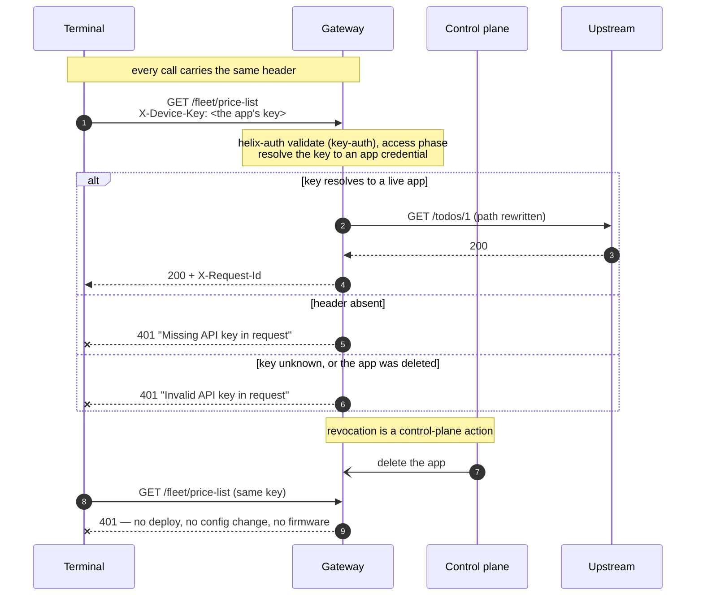

# Solution 08 — API keys for callers that can't run a token exchange

**Four thousand terminals, one header, and a revocation you can perform in
seconds. The credential travels on every request — so make it cheap to kill.**

| | |
|---|---|
| **Setup time** | ~15 minutes |
| **Difficulty** | 🟢 Beginner |
| **Needs** | A fresh org (its default **test** environment) · one product covering this API · one app per caller. The upstream is public jsonplaceholder, so no backend of your own. |
| **Plugins** | `helix-auth` (validate · key-auth) · `proxy-rewrite` · `request-id` |
| **Build it with** | 🤖 **[the Helix Agent](helix-agent-prompt.md)** — recommended · or import [`gateway/api-spec.yaml`](gateway/api-spec.yaml) |
| **Assets** | ✅ [Agent prompt](helix-agent-prompt.md) · ✅ [Architecture](architecture.md) · ✅ [Business need](business-need.md) · ✅ [Spec](gateway/) · ✅ [Tests](tests/) · ✅ [Validation](validation/) · ✅ [Manifest](solution.yaml) |

---

## The problem

> *"We have about four thousand payment terminals in service stations. Each one
> pulls its price list in the morning and pushes its takings at close. They can't
> do an OAuth exchange — there's no reliable clock, nowhere safe to keep a
> refresh loop, and changing the firmware is a quarter of work plus an engineer
> in a van. Right now the only thing protecting that endpoint is that the URL
> isn't published. Last month one terminal was stolen out of a forecourt and
> nobody could tell me whether it was still calling us."*

Three constraints hold at once:

1. **The caller cannot hold a token exchange.** Client credentials assumes a
   client that can keep a clock, cache a token, and refresh it before expiry.
   Not every caller can. Embedded devices, a partner's overnight cron job, a
   twenty-year-old middleware box — these can set one header and nothing more.
2. **The endpoint still has to know who is calling.** "Which terminal" is the
   first question asked in every incident, and an IP address does not answer it.
3. **A compromised caller has to be stoppable today.** Not at the next firmware
   release, and not at the next config deploy.

**Root cause:** the choice is being framed as *API key versus OAuth*, as if one
were the insecure version of the other. They answer the same question with
different assumptions about the caller. If the caller cannot hold a secret
*and* run an exchange, a token is not available to you at any security level —
and a key you can revoke in seconds beats a token nobody can issue.

## Business need

Full version: [`business-need.md`](business-need.md).

| Dimension | URL-is-the-secret today | With app-resolved API keys |
|---|---|---|
| **Who is calling** | Unanswerable — every terminal looks the same | Each call resolves to one app, before the upstream is touched |
| **Stopping one caller** | Change the URL, then re-deploy 4,000 terminals | Delete or rotate that app; the next request is rejected |
| **Blast radius of one stolen device** | The entire endpoint, indefinitely | One app, until someone deletes it |
| **Cost to the device** | Nothing | One header |
| **Backend change required** | — | None |

The mechanism that matters operationally: **revocation stops being a deployment
and becomes a control-plane action.** That is the whole trade this solution makes
— the credential is long-lived and travels on every request, and in exchange
killing it is instant and per-caller.

## Which credential shape fits your caller

This is the fork in the road, and it is decided by the caller, not by your
preference.

| Your caller | Use | Why |
|---|---|---|
| **Can set a header, nothing more** — embedded device, legacy middleware, a partner's cron job | **`helix-auth` validate · key-auth** — this solution | One header. The gateway resolves it to an app. Revocation is immediate. |
| **Can hold a secret and run an exchange** — a partner's backend, a server-side integration | **`helix-auth` generate + validate** — [solution 01](../01-oauth-jwt/) | The long-lived secret stops travelling; a leaked token expires on its own. |
| **Already gets tokens from your IdP** — Okta, Entra ID, Auth0, Keycloak | **`openid-connect`** — [solution 05](../05-okta-jwt/) | The gateway verifies somebody else's tokens; it must not mint its own. |
| **Can hold a secret and the payload's integrity matters** | **`hmac-auth`** — [solution 06](../06-hmac-auth/) | The credential never travels at all; the signature covers the body. |

All four answer "who is calling". You want exactly one of them on a route.

## How a request flows



Validation happens in the **access phase**, so a rejected request costs you
nothing downstream: your backend doesn't see it, your database doesn't see it,
and it doesn't take a connection from your pool.

## Build it with the Helix Agent

Recommended path, and it works on a **fresh org** — the agent *creates* the API
on a public upstream so you get real data immediately. Full prompt with all the
constraints: [`helix-agent-prompt.md`](helix-agent-prompt.md).

```text
Create a new REST API called "Terminal API" and protect every route with API-key
authentication. This is a fresh org — I have no existing API.

Upstream: https://jsonplaceholder.typicode.com (public, so it returns real data;
I'll swap in my own later). Deploy to the "test" environment.

Routes: GET /fleet/price-list and POST /fleet/takings. The upstream paths differ
from mine, so add proxy-rewrite: /fleet/price-list -> /todos/1 and
/fleet/takings -> /posts.

Use helix-auth with mode validate and validate_auth_type key-auth on both routes,
reading the key from the HEADER X-Device-Key. key-auth is a validate_auth_type of
helix-auth, not a standalone plugin. apikey with source is required for key-auth —
a dry-run rejects the config without it.

No secret goes in the spec: the key lives on the app credential, and the route
only names the header it arrives in. Do not set secret_validation.

Put request-id in the SERVICE spec so it applies API-wide, not on each route. Do not
add cors — these callers are devices, not browsers.

Check get_plugin_config for helix-auth before writing config.

We are editing a LIVE route object, not authoring an OpenAPI document — so do not
follow the spec-generator examples for plugin placement. Each route object in
routeSpec takes "plugins" as a TOP-LEVEL key, and inside it each plugin is
keyed by its own NAME:
  { "name": ..., "uri": ..., "methods": [...], "service_id": ...,
    "plugins": { "<plugin-name>": { <that plugin's own fields> } } }
Do not promote a plugin's fields into the plugins map: "plugins":
{"response_status": 202, "content_type": ...} is four broken plugins, not one
working one — the plugin name level is mandatory.
There must be no "x-helix-gateway" key anywhere in a route object: a live route
silently discards that wrapper, the write still reports success, and the route
deploys with no plugins at all.

Skip validate_route — use dry_run_deploy for validation. Show me the spec, run
dry_run_deploy, then call get_revision and show me the stored routeSpec so I can see
the plugins landed. Wait before deploying.
```

Then, in the same session:

```text
Create a product that contains this API with a generous quota, deploy the product
to the test environment, then create a developer with one app subscribed to it and
give me the app's API key so I can test.

Then give me curl commands that show, in order: no key -> 401; the key in
X-Device-Key -> 200; an unknown key -> 401; the right key in an "apikey" header
-> 401; and the right key as a query parameter -> 401. The last two prove the
header name and the header SOURCE are both part of the contract.
```

See [AGENT-GUIDE.md](../../AGENT-GUIDE.md) for why the prompt is shaped this way
and what to do when the agent takes a wrong turn.

## Install it directly

If you'd rather not go through the agent:

```bash
export ORG=<ORG_ID>
export TOKEN=<control-plane bearer token>      # short-lived
export BASE=https://<YOUR_GATEWAY_HOST>/api

# 1. Import gateway/api-spec.yaml (OpenAPI import in the portal, or Agent Mode).
#    There is nothing to fill in — this spec contains no secret and no key.

# 2. Bind your upstream to the service and deploy the revision to "test".

# 3. Create a PRODUCT containing this API, with a quota, and deploy the product to
#    the environment. Then create a DEVELOPER and one APP per caller, subscribed
#    to that product. The control plane issues each app's key and secret.

# 4. Prove it
GATEWAY=https://<YOUR_GATEWAY_HOST> \
DEVICE_KEY=<DEVICE_API_KEY> APP_SECRET=<APP_SECRET> \
./gateway/verify.sh
```

> An **ACTIVE** revision will not accept edits — you'll get `Only INACTIVE
> revisions can be updated`. Clone the revision (keeping the live one as a
> rollback target) or undeploy first.

## Configuration

Source of truth: [`gateway/api-spec.yaml`](gateway/api-spec.yaml). One block
carries the whole solution, and it is on every protected route:

```yaml
helix-auth:
  mode: validate
  validate_auth_type: key-auth
  apikey:
    source: header
    key: X-Device-Key
```

**Read what that block does not contain.** There is no key and no secret. The
route names the *header the key arrives in*; the key itself is issued on the app
credential by the control plane. Unlike the signing secret in
[solution 01](../01-oauth-jwt/), there is nothing here to fill in and nothing to
leak — the same property [solution 06](../06-hmac-auth/) has, for the same
structural reason.

**`apikey` with `source` is mandatory, whatever the schema says.** The published
JSON schema marks it optional. The plugin's own check does not, and a dry-run
rejects the configuration:

```text
property "apikey" with "source" is required when mode is validate
and validate_auth_type is key-auth
```

That is a dry-run catching a real error before deploy, which is the workflow
working — but it costs an hour if you are reading the schema and expecting a
default.

## `secret_validation` is not a second factor

The one field in this plugin whose name will mislead you. From the plugin's own
schema in your org:

> *Key-auth validate only. When true, the credential secret is accepted as an
> **alternative** credential if the api key is absent.*

It **widens** what is accepted. It does not require more. Turning it on so that
"the device must send both the key and the secret" produces the opposite of the
intent: a caller holding only the secret now authenticates too. This package
ships it off, and [`tests/test-plan.yaml`](tests/test-plan.yaml) carries the
manual case that demonstrates the behaviour if you want to see it for yourself.

If you want two independent factors on a route, this is not the plugin —
[solution 06](../06-hmac-auth/) is, because a signature proves possession of a
secret that never travels.

## Header or query parameter

`apikey.source` accepts `header` or `query`. Choose `header`, and treat `query`
as a compatibility escape hatch for a caller that genuinely cannot set one.

A key in a URL is copied into every access log, every proxy log, every referrer
header and every browser history the request passes through, and none of those
were designed to hold credentials. The test plan asserts that a key in the query
string is **rejected** by this configuration — that assertion is the difference
between "we chose headers" and "we assumed headers".

## Testing

```bash
GATEWAY=https://<YOUR_GATEWAY_HOST> \
DEVICE_KEY=<DEVICE_API_KEY> APP_SECRET=<APP_SECRET> ./gateway/verify.sh
```

Exit 0 means all seven cases held:

| # | Case | Expected |
|---|---|---|
| 1 | No key | `401` *Missing API key in request* |
| 2 | A live app's key | `200` + the upstream's payload |
| 3 | An unknown key | `401` *Invalid API key in request* |
| 4 | **The right key in an `apikey:` header** | `401` |
| 5 | **The right key as a query parameter** | `401` |
| 6 | **The app's secret sent as the key** | `401` |
| 7 | The key on the write route | `201` |

**Cases 4-6 are the ones not to skip.** Each proves the contract is narrower than
it looks — the header name is part of it, `source: header` means header and
nothing else, and the credential's secret is not a second accepted credential.
Case 3 matters in the other direction: if an unknown key returns 200, the route
isn't resolving anything — it's passing traffic through while looking configured.

Revocation, rotation and the `secret_validation` variant are manual cases in
[`tests/test-plan.yaml`](tests/test-plan.yaml): the first two mutate
control-plane state and the third needs a configuration this package
deliberately does not ship.

## Gotchas

- **`apikey.source` is required and the schema does not say so.** Dry-run catches
  it; reading the schema does not.
- **`secret_validation: true` widens the accepted credentials.** It is not a
  second factor. See § above.
- **A 403 is not a 401.** 401 means the key did not resolve to an app. 403 means
  it did, and the app's product does not cover this API — add the API to the
  product. People lose afternoons treating the second as a credential problem.
- **The key is the credential *key*, not the app id and not the secret.** The
  most common cause of "401 with a key I'm certain is right".
- **Revocation is not instant to the millisecond.** Credential state is cached at
  the gateway. Measure the interval in your own environment and publish *that* as
  your revocation SLA rather than quoting a number from a README.
- **There is no zero-downtime rotation of a single app's credential.** Rotating in
  place invalidates the old key the moment the new one is live. For a fleet that
  updates over weeks, run two apps and delete the old one after the overlap.
- **Don't add `limit-count` keyed on the caller to meter these apps.** Per-caller
  metering is the product quota, counted per app — [solution 03](../03-api-products/).
- **No `cors` block here, on purpose.** Devices are not browsers, and a wildcard
  CORS policy on a fleet API hands browser origins a path the fleet never needs.
  Add it only if a browser genuinely calls this API.

## When to use it

Use it when:

- Your callers can set a header and cannot run a token exchange — devices, legacy
  middleware, a partner's scheduled job.
- You need per-caller identity and per-caller revocation, and you need both
  without touching the backend or the caller's code.
- You are handing out one shared key today and want to split it per caller so a
  single compromise stops being an estate-wide event.
- You want identity now and metering later: this resolves the app that
  [solution 03](../03-api-products/) meters and [solution 04](../04-analytics/)
  attributes.

Don't use it when:

- **The caller can hold a secret and run an exchange.** Use
  [solution 01](../01-oauth-jwt/) — a credential that expires on its own is
  strictly better when it is available to you.
- **An identity provider already issues tokens to these callers.** Use
  [solution 05](../05-okta-jwt/).
- **The payload's integrity is the point** — payments, instructions, anything
  where a modified body is the attack. Use [solution 06](../06-hmac-auth/).
- **You need end-user identity.** A key identifies an app, not a person.
- **The credential cannot be stored safely on the caller at all** — a public
  single-page app or a mobile client. A key shipped in a client binary is a
  published key.

## Limitations

- **The credential travels on every request.** Anything that can observe the
  request — a proxy, a TLS-terminating middlebox, a log with headers turned on —
  can replay it. This is the design's central trade, and fast revocation is its
  mitigation, not a fix.
- **A key has no expiry.** It is valid until somebody removes the app. There is no
  equivalent of `token_ttl`, so time does not clean up after you.
- **This is authentication, not authorization.** The key proves which app is
  calling. What that app may do is a separate layer.
- **Identity is the app, never the end user.** No consent, no delegation.
- **Revocation latency is whatever your gateway's credential cache is.** Measure
  it; do not assume it.
- **Rotating one app's credential in place is a hard cutover.** Two apps is the
  only overlap available.
- **`apikey.source: query` is supported and is a bad idea.** See § *Header or
  query parameter*.
- **`secret_validation` does not do what its name suggests.** See § above.

Full list: [`solution.yaml`](solution.yaml) § `limitations`.

## Validation status

**Validated against a gateway — imported, dry-run, deployed, and exercised.**

| Stage | Status | Provenance |
|---|---|---|
| Configuration generated | **YES** | [`gateway/api-spec.yaml`](gateway/api-spec.yaml) |
| Local validation | **PASS** | [`validation/local-validation.yaml`](validation/local-validation.yaml) |
| Gateway dry-run | **PASS** | Non-destructive. An earlier draft without `apikey.source` was rejected here, before any deploy. |
| Gateway deployed | **DEPLOYED** | Revision ACTIVE in a test environment. |
| Functional tests | **PASS (7/7)** | All seven cases, including the wrong-header, query-string and secret-as-key rejections. |

Overall: **READY.** Full record, including the two schema findings this run
produced, is in
[`validation/gateway-validation.yaml`](validation/gateway-validation.yaml).

## Related solutions

- **[01 — OAuth 2.0 with JWT](../01-oauth-jwt/)** · **[05 — OAuth with Okta](../05-okta-jwt/)** ·
  **[06 — Signed requests](../06-hmac-auth/)** — the other three answers to "who
  is calling". Pick by what the caller can hold.
- **[03 — API Products](../03-api-products/)** — meter the apps this solution
  resolves. The quota is counted per app, which is the same object.
- **[04 — Analytics](../04-analytics/)** — per-app attribution, which only works
  because identity was resolved here.
