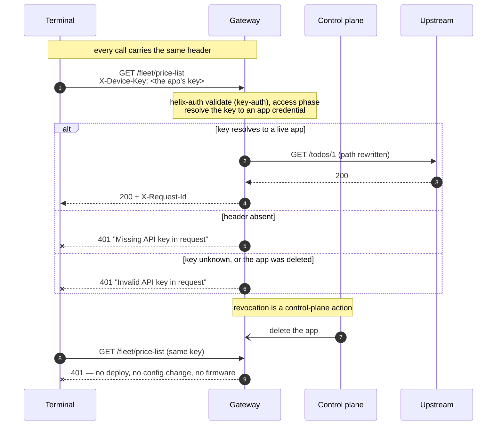

# Architecture — API-key identity at the edge

> [Overview](README.md) · [Business need](business-need.md) · **Architecture** · [Guides](guides.md) · [Agent prompt](helix-agent-prompt.md) · [Tests](tests.md) · [API reference](api-reference.md)

---

## What the gateway does here

The gateway becomes the place where every caller is identified. For every request
it answers one question: **which app does this key belong to?** A key that belongs
to a live app goes through, labelled with that app. Anything else is refused with
HTTP 401 (not authenticated) before your backend is contacted.

Your backend does not change. It never sees a request without a valid key.

**This solution identifies callers; it does not limit them.** It uses the same
`helix-auth` key check as [solution 01](../01-api-products/), but not 01's
`api-product-enforcer`, so no usage limit is enforced. Every app still needs a
product, because subscribing to a product is how an app gets its key. Add 01's
quota check when you want limits.

For the full list of fields on every plugin, see
[docs.digitalapi.ai/api-gateway](https://docs.digitalapi.ai/api-gateway).

## The model

| Word | What it means in Helix | Name used inside the platform |
|---|---|---|
| **Developer** | The company or team that owns the callers | a Consumer |
| **App** | One caller: one terminal, one partner job. It has its own key and secret. | a Credential |
| **Product** | A set of APIs an app subscribes to. Here it is how the app gets access; its quota is not enforced. | a product document |
| **Key** | The value the caller sends in `X-Device-Key`. It is the app's credential *key*, not its id and not its secret. | the credential key |

**One app per caller.** Fewer apps than callers gives away exactly the identity
this solution exists to create: you can no longer tell callers apart or switch
one off alone.

## Which credential fits your caller

This is decided by what the caller can do, not by preference.

| Your caller | Use | Why |
|---|---|---|
| **Can set a header, nothing more** — embedded device, old middleware, a partner's scheduled job | **`helix-auth` validate · key-auth** — this solution | One header. The gateway finds the app. Switch-off is immediate. |
| **Can keep a secret and run a token exchange** — a partner's backend, a server-side integration | **`helix-auth` generate + validate** — [solution 02](../02-oauth-jwt/) | The long-lived secret stops travelling; a leaked token expires on its own. |
| **Already gets tokens from your identity provider** — Okta, Entra ID, Auth0, Keycloak | **`openid-connect`** — [solution 05](../05-okta-jwt/) | The gateway checks somebody else's tokens; it must not issue its own. |
| **Can keep a secret, and the body's integrity matters** | **`hmac-auth`** — [solution 06](../06-hmac-auth/) | The secret never travels at all; the signature covers the body. |

All four answer "who is calling?". You want exactly one of them on a route.

## How a request flows



The key is checked in the **access phase**, so a refused request costs your
backend nothing: it never sees it, your database never sees it, and it takes no
connection from your pool.

The routes the terminals call (`/fleet/price-list`, `/fleet/takings`) are the
contract with a fleet that can't easily be updated. The upstream's paths
(`/todos/1`, `/posts` on the public test service) are not. `proxy-rewrite` maps
one to the other, so the published paths never have to follow the backend.

## Reading a rejection

| Status | What it means | Where to look |
|---|---|---|
| **401** *Missing API key in request* | Nothing arrived in `X-Device-Key` | The header name on the wire, or the key was sent in the URL instead |
| **401** *Invalid API key in request* | Something arrived but belongs to no app | Usually the app's id or secret was sent instead of its key, or the app was deleted |
| **403** | The key belongs to an app, but the app's product does not include this API | Add the API to the app's product. A product problem, not a key problem. |
| **Dry-run rejected**, naming `apikey` | `apikey.source` is missing from the config | See [Settings worth extra attention](#settings-worth-extra-attention) |

Unlike [solution 02](../02-oauth-jwt/)'s identical 401s, the two 401 messages here
are different, which helps an honest caller diagnose them. Treat the message as a
hint, not a contract.

## Execution order

Plugins run **phase first, then by priority within a phase**, not in the order
they appear in the file.

| Order | Plugin | Phase | Priority | What it does |
|---|---|---|---|---|
| — | `request-id` | — | — | API-wide; adds `X-Request-Id` for correlation |
| 1 | `proxy-rewrite` | rewrite | 1008 | Changes the upstream path. Takes no part in the key check. |
| 2 | `helix-auth` (validate · key-auth) | access | 2450 | Finds the app from the key; refuses anything else |

`helix-auth` has the higher priority number (2450 against 1008) and still runs
second, because its phase comes later. **Phase beats priority.** This is the most
common source of "the plugins are in the wrong order" confusion on this platform.

Once `helix-auth` has found the app, later plugins that need to know who is
calling (metering, analytics) read it from the request instead of working it out
again.

## Why the key is looked up, not compared

A config that compares the header to a fixed value written in the spec would also
"work", and would be much worse:

| | Fixed value in the config | Looked up on the app |
|---|---|---|
| Where the secret lives | In the spec, in git, in every revision | On the app, issued by the control plane |
| Switching off one caller | Edit and redeploy the API | Delete the app |
| Callers per key | One key, shared by everyone | One per caller |
| Who can see it | Anyone who can read the repo | Nobody; it is never in the document |
| Metering and analytics | Nothing to count against | The app is what both count against |

This is why the shipped spec has no key in it. The absence is the design.

## No custom code needed

Entirely built in. `helix-auth` in `validate` mode with
`validate_auth_type: key-auth` is the platform's own answer to API-key identity,
and it finds the same app object that products, quotas and analytics use.

Two alternatives were considered and rejected:

- **A standalone `key-auth` plugin.** It does not exist on this build. `key-auth`
  and `jwt-auth` are *values* of `helix-auth`'s `validate_auth_type`, not plugins.
  Reaching for a plugin by that name is the most common wrong turn here.
- **A custom policy checking a header against a list.** It would work and it would
  be wrong: the list has to live somewhere, switching a caller off becomes a config
  deploy again, and no other plugin could see who the caller is.

## When to use this

Use it when:

- your callers can set a header and can't run a token exchange,
- you need per-caller identity and per-caller switch-off without touching the
  backend or the caller's code,
- you hand out one shared key today and want one per caller, or
- you want identity now and metering later.

Do not use it when:

- **the caller can keep a secret and run an exchange.** Use
  [solution 02](../02-oauth-jwt/): a credential that expires on its own is better
  when it is available.
- **an identity provider already issues tokens to these callers.** Use
  [solution 05](../05-okta-jwt/).
- **the body's integrity is the point** (payments, instructions). Use
  [solution 06](../06-hmac-auth/).
- **you need end-user identity.** A key identifies an app, not a person.
- **the key can't be kept out of public reach**, as in a public web app or a
  mobile app. A key shipped in client code is a published key.

## Prerequisites

- The API is imported and deployed, with an upstream bound.
- `helix-auth` exists in your org with the fields in this spec. Its exact schema
  varies by build; confirm with `get_plugin_config` before deploying.
- A product that includes this API, **deployed to the environment**, with a quota
  (every product needs one, even though it isn't enforced here).
- A developer, and **one app per caller** subscribed to that product.

## Settings worth extra attention

**`apikey` with `source` is required, whatever the schema says.** The published
schema marks it optional. The plugin's own check does not, and a dry-run rejects
the config without it:

```text
property "apikey" with "source" is required when mode is validate
and validate_auth_type is key-auth
```

That is the dry-run catching a real error before deploy, which is the workflow
working. Don't expect a default.

**`secret_validation` is not a second factor.** From the plugin's own schema:

> *Key-auth validate only. When true, the credential secret is accepted as an
> **alternative** credential if the api key is absent.*

It **widens** what is accepted. Turning it on so that "the device must send both
the key and the secret" does the opposite: a caller holding only the secret is
then let in too. This package leaves it off. The behaviour above is quoted from
the schema; this package does not ship or run that variant. If you want two
independent factors, use [solution 06](../06-hmac-auth/).

**Header, not query string.** `apikey.source` accepts `header` or `query`. Choose
`header`. A key in a URL is copied into every access log, proxy log, referrer
header and browser history it passes through. The tests confirm that a key in the
query string is **refused** by this configuration.

**No `cors`, on purpose.** Devices are not browsers. A wildcard CORS policy on a
fleet API would give browser pages a way in that the fleet never needs.

## Limits worth knowing

- **The key travels on every request.** Anything that can see a request (a proxy,
  a middlebox that decrypts traffic, a log with headers turned on) can reuse it.
  Fast switch-off reduces the damage; it doesn't prevent it.
- **A key never expires.** It is valid until somebody removes the app. Nothing
  like a token lifetime cleans up after you; a regular review of live apps does.
- **Authentication, not authorization.** The key proves which app is calling, not
  what it may do.
- **The identity is the app, never a person.** No consent, no delegation.
- **Switch-off is not instant to the millisecond.** The gateway caches credential
  state. Measure that delay in your own environment and publish *that* as your
  revocation time, rather than quoting a number from here.
- **Rotating one app's key is a hard cutover.** The old key stops working the
  moment the new one is live. For a fleet that updates over weeks, run two apps and
  delete the old one after the overlap.
