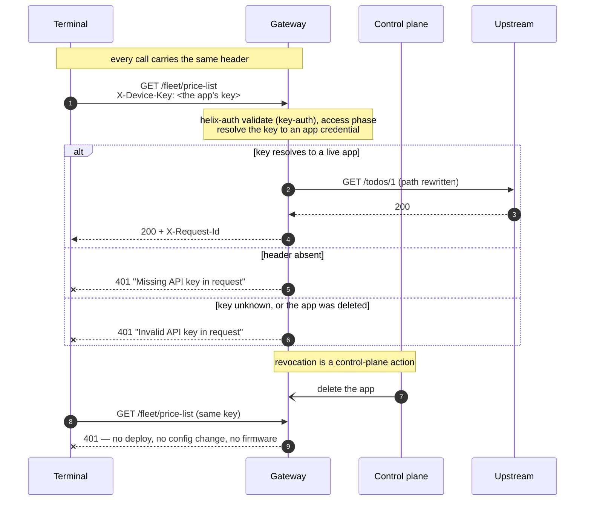

# Solution 08 — API keys for callers that can't run a token exchange

**Overview** · [Business need](business-need.md) · [How it works](how-it-works.md) · [Install](install.md) · [Configuration](configuration.md) · [Test & verify](testing.md) · [Changelog](changelog.md)

---

**Four thousand terminals, one header, and a revocation you can perform in
seconds. The credential travels on every request — so make it cheap to kill.**

<!-- facts:begin -->

| | |
|---|---|
| **Setup time** | ~15 minutes |
| **Difficulty** | Beginner |
| **Needs** | A fresh org (its default test environment) · one product covering this API · one app per caller. The upstream is public jsonplaceholder, so no backend of your own |
| **Plugins** | `helix-auth` · `proxy-rewrite` · `request-id` |
| **Build it with** | **[the Agent](install.md)** — recommended · or import [`gateway/api-spec.yaml`](gateway/api-spec.yaml) |

<!-- facts:end -->

## The problem

> *"We have about four thousand payment terminals in service stations. Each one
> pulls its price list in the morning and pushes its takings at close. They can't
> do an OAuth exchange — there's no reliable clock, nowhere safe to keep a
> refresh loop, and changing the firmware is a quarter of work plus an engineer
> in a van. Right now the only thing protecting that endpoint is that the URL
> isn't published. Last month one terminal was stolen out of a forecourt and
> nobody could tell me whether it was still calling us."*

Three constraints hold at once:

1. **The caller cannot hold a token exchange.** Client credentials assumes a
   client that can keep a clock, cache a token, and refresh it before expiry.
   Not every caller can. Embedded devices, a partner's overnight cron job, a
   twenty-year-old middleware box — these can set one header and nothing more.
2. **The endpoint still has to know who is calling.** "Which terminal" is the
   first question asked in every incident, and an IP address does not answer it.
3. **A compromised caller has to be stoppable today.** Not at the next firmware
   release, and not at the next config deploy.

**Root cause:** the choice is being framed as *API key versus OAuth*, as if one
were the insecure version of the other. They answer the same question with
different assumptions about the caller. If the caller cannot hold a secret
*and* run an exchange, a token is not available to you at any security level —
and a key you can revoke in seconds beats a token nobody can issue.

## Business need

Full version: [`business-need.md`](business-need.md).

| Dimension | URL-is-the-secret today | With app-resolved API keys |
|---|---|---|
| **Who is calling** | Unanswerable — every terminal looks the same | Each call resolves to one app, before the upstream is touched |
| **Stopping one caller** | Change the URL, then re-deploy 4,000 terminals | Delete or rotate that app; the next request is rejected |
| **Blast radius of one stolen device** | The entire endpoint, indefinitely | One app, until someone deletes it |
| **Cost to the device** | Nothing | One header |
| **Backend change required** | — | None |

The mechanism that matters operationally: **revocation stops being a deployment
and becomes a control-plane action.** That is the whole trade this solution makes
— the credential is long-lived and travels on every request, and in exchange
killing it is instant and per-caller.

## How a request flows

Validation happens in the **access phase**, so a rejected request costs you
nothing downstream: your backend doesn't see it, your database doesn't see it,
and it doesn't take a connection from your pool.

## Gotchas

- **`apikey.source` is required and the schema does not say so.** Dry-run catches
  it; reading the schema does not.
- **`secret_validation: true` widens the accepted credentials.** It is not a
  second factor. See § above.
- **A 403 is not a 401.** 401 means the key did not resolve to an app. 403 means
  it did, and the app's product does not cover this API — add the API to the
  product. People lose afternoons treating the second as a credential problem.
- **The key is the credential *key*, not the app id and not the secret.** The
  most common cause of "401 with a key I'm certain is right".
- **Revocation is not instant to the millisecond.** Credential state is cached at
  the gateway. Measure the interval in your own environment and publish *that* as
  your revocation SLA rather than quoting a number from a README.
- **There is no zero-downtime rotation of a single app's credential.** Rotating in
  place invalidates the old key the moment the new one is live. For a fleet that
  updates over weeks, run two apps and delete the old one after the overlap.
- **Don't add `limit-count` keyed on the caller to meter these apps.** Per-caller
  metering is the product quota, counted per app — [solution 01](../01-api-products/).
- **No `cors` block here, on purpose.** Devices are not browsers, and a wildcard
  CORS policy on a fleet API hands browser origins a path the fleet never needs.
  Add it only if a browser genuinely calls this API.

## When to use it

Use it when:

- Your callers can set a header and cannot run a token exchange — devices, legacy
  middleware, a partner's scheduled job.
- You need per-caller identity and per-caller revocation, and you need both
  without touching the backend or the caller's code.
- You are handing out one shared key today and want to split it per caller so a
  single compromise stops being an estate-wide event.
- You want identity now and metering later: this resolves the app that
  [solution 01](../01-api-products/) meters and [solution 04](../04-analytics/)
  attributes.

Don't use it when:

- **The caller can hold a secret and run an exchange.** Use
  [solution 02](../02-oauth-jwt/) — a credential that expires on its own is
  strictly better when it is available to you.
- **An identity provider already issues tokens to these callers.** Use
  [solution 05](../05-okta-jwt/).
- **The payload's integrity is the point** — payments, instructions, anything
  where a modified body is the attack. Use [solution 06](../06-hmac-auth/).
- **You need end-user identity.** A key identifies an app, not a person.
- **The credential cannot be stored safely on the caller at all** — a public
  single-page app or a mobile client. A key shipped in a client binary is a
  published key.

## Limitations

- **The credential travels on every request.** Anything that can observe the
  request — a proxy, a TLS-terminating middlebox, a log with headers turned on —
  can replay it. This is the design's central trade, and fast revocation is its
  mitigation, not a fix.
- **A key has no expiry.** It is valid until somebody removes the app. There is no
  equivalent of `token_ttl`, so time does not clean up after you.
- **This is authentication, not authorization.** The key proves which app is
  calling. What that app may do is a separate layer.
- **Identity is the app, never the end user.** No consent, no delegation.
- **Revocation latency is whatever your gateway's credential cache is.** Measure
  it; do not assume it.
- **Rotating one app's credential in place is a hard cutover.** Two apps is the
  only overlap available.
- **`apikey.source: query` is supported and is a bad idea.** See § *Header or
  query parameter*.
- **`secret_validation` does not do what its name suggests.** See § above.

Full list: [`solution.yaml`](solution.yaml) § `limitations`.

## Validation status

**Validated against a gateway — imported, dry-run, deployed, and exercised.**

| Stage | Status | Provenance |
|---|---|---|
| Configuration generated | **YES** | [`gateway/api-spec.yaml`](gateway/api-spec.yaml) |
| Local validation | **PASS** | [`validation/local-validation.yaml`](validation/local-validation.yaml) |
| Gateway dry-run | **PASS** | Non-destructive. An earlier draft without `apikey.source` was rejected here, before any deploy. |
| Gateway deployed | **DEPLOYED** | Revision ACTIVE in a test environment. |
| Functional tests | **PASS (7/7)** | All seven cases, including the wrong-header, query-string and secret-as-key rejections. |

Overall: **READY.** Full record, including the two schema findings this run
produced, is in
[`validation/gateway-validation.yaml`](validation/gateway-validation.yaml).

## Related solutions

- **[02 — OAuth 2.0 with JWT](../02-oauth-jwt/)** · **[05 — OAuth with Okta](../05-okta-jwt/)** ·
  **[06 — Signed requests](../06-hmac-auth/)** — the other three answers to "who
  is calling". Pick by what the caller can hold.
- **[01 — API Products](../01-api-products/)** — meter the apps this solution
  resolves. The quota is counted per app, which is the same object.
- **[04 — Analytics](../04-analytics/)** — per-app attribution, which only works
  because identity was resolved here.
