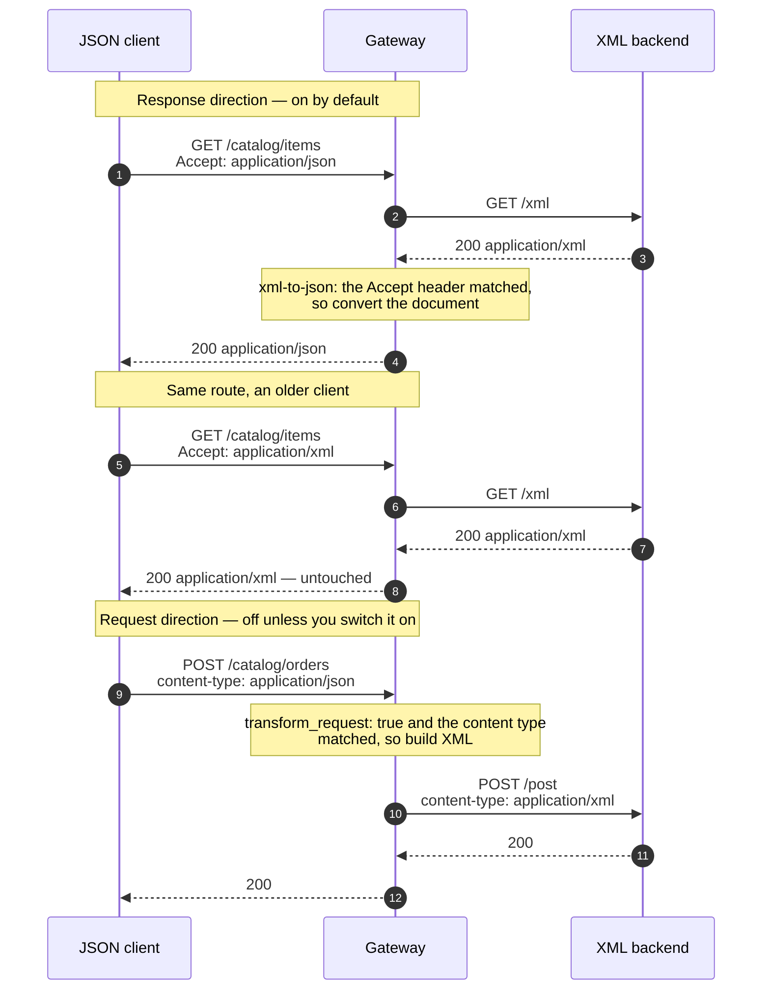

# Solution 09 — JSON in, JSON out, in front of a backend that only speaks XML

**No envelope, no WSDL, no SOAPAction. Just a REST backend from 2009 that answers
in XML, and four client teams who each wrote their own parser.**

| | |
|---|---|
| **Setup time** | ~15 minutes |
| **Difficulty** | 🟢 Beginner |
| **Needs** | A fresh org (its default **test** environment). The upstream is the public httpbin service, so no backend of your own — and because it echoes requests, you can *see* the XML your backend would have received. |
| **Plugins** | `xml-to-json` (both directions) · `proxy-rewrite` · `request-id` · `cors` |
| **Build it with** | 🤖 **[the Helix Agent](helix-agent-prompt.md)** — recommended · or import [`gateway/api-spec.yaml`](gateway/api-spec.yaml) |
| **Assets** | ✅ [Agent prompt](helix-agent-prompt.md) · ✅ [Architecture](architecture.md) · ✅ [Business need](business-need.md) · ✅ [Spec](gateway/) · ✅ [Tests](tests/) · ✅ [Validation](validation/) · ✅ [Manifest](solution.yaml) |

---

## This is not the SOAP solution

Worth settling in the first ten seconds, because two different people land here
from two different searches.

| | [Solution 02 — SOAP to REST](../02-soap-to-rest/) | **This one** |
|---|---|---|
| The backend | A SOAP service: envelope, `SOAPAction`, one handler path, a WSDL | Plain HTTP that happens to carry XML — an inventory API, a payments file feed, an industry schema |
| What the gateway must build | A whole envelope around your data | Nothing. Element for element, key for key |
| Route shape | Every operation collapses onto one upstream path | Ordinary REST paths |
| Reach for it when | There is a `<soap:Envelope>` anywhere in the conversation | There isn't |

If your backend has an envelope, stop reading and use 02 — this package will
convert your JSON into XML that the SOAP handler rejects. If it doesn't, 02 will
wrap your data in an envelope nothing is expecting. They are not variants of each
other.

## The problem

> *"Our stock system is REST. It's just REST that answers in XML, because it was
> written in 2009 and that was the house style. Every SOAP-to-REST guide we find
> starts by telling us to build an envelope we don't have. Meanwhile the web team
> wrote an XML parser, the iOS team wrote a different one, the Android team found
> a library, and the partner integration team gave up and asked for a nightly CSV.
> Four implementations of the same conversion, and the one that breaks is always
> the one nobody owns."*

The cost is not the format. It is that the conversion has been pushed to the
clients, so it exists four times, in four languages, with four sets of
assumptions about what an empty element means.

**Root cause:** a representation concern is being solved at the wrong layer.
Nothing about turning `<sku>` into `"sku"` requires knowledge of the client or
the domain, so nothing about it needs to live in either.

## Business need

Full version: [`business-need.md`](business-need.md).

| Dimension | Four client-side parsers | One conversion at the edge |
|---|---|---|
| **Implementations of the conversion** | One per client, in one language each | One, in configuration |
| **Cost of a new client** | Write parser number five | Call the endpoint |
| **Backend change required** | — | None. It keeps speaking XML |
| **When the XML changes** | Four teams, four releases, four timelines | One place to look first |
| **Existing XML consumers** | — | Unaffected — they keep getting XML from the same route |

That last row is the one that usually decides it: because conversion is
content-negotiated, the old clients do not have to be migrated to put the new
front door in place.

## How a request flows



## Two switches decide whether anything happens at all

Both defaults are reasonable and both surprise people, so they are the first
thing to check when "the plugin isn't doing anything".

**The response transform is content-negotiated.** It fires only when the client
sends `Accept: application/json`. A client that omits the header gets the
backend's XML and concludes the gateway is misconfigured. That behaviour is also
the feature in the table above — it is what lets existing XML consumers keep
working — but it has to be in your client documentation, in bold.

**The request transform is off by default.** `transform_request` defaults to
`false`, so an `xml-to-json: {}` block converts responses *only*. Worse, when it
is on, a body whose `Content-Type` is not in `request_content_types` is forwarded
**unchanged and without an error**. The gateway returns 200; your backend gets
JSON it cannot parse and complains in its own log. Alert on backend parse
failures, not on gateway status codes.

## Configuration

Source of truth: [`gateway/api-spec.yaml`](gateway/api-spec.yaml).

Response direction — the minimum useful block:

```yaml
xml-to-json:
  transform_response: true
  content_types: [application/xml, text/xml]
```

Both directions, on the write route:

```yaml
xml-to-json:
  transform_request: true
  transform_response: true
  request_content_types: [application/json]
  content_types: [application/xml, text/xml]
  request_root_name: order
  array_item_name: item
  root_attributes:
    xmlns: "urn:example:catalog"
  max_body_size: 1048576
```

`request_root_name` names the root element of the document you generate, and
`root_attributes` puts the namespace on it. A namespace-aware backend rejects an
otherwise-correct document without that declaration, usually with a message that
does not mention namespaces.

**Do not set `pretty: true`.** Verified on this build: a route with it enabled
returns **503** and the connection is terminated before headers. `root_name` and
`property_naming` are fine; `pretty` is not.

**Do not set `Content-Type` in `proxy-rewrite`.** `proxy-rewrite` (priority 1008)
runs before `xml-to-json` (997) in the rewrite phase, so an override there
changes the header the transform is about to match on, and the request direction
silently stops converting. This exact mistake is on the record against
[solution 02](../02-soap-to-rest/).

## What the conversion actually does to your document

XML and JSON do not have the same shape, so a converter has to make choices. Here
are the ones this plugin makes, observed against a real document rather than read
off a schema.

| XML | Becomes | Watch out for |
|---|---|---|
| A repeated element | A JSON array | **A single occurrence becomes an object, not a one-item array.** The classic intermittent client bug |
| Attributes on the **root** element | Ordinary keys next to the child elements | Indistinguishable from elements once converted |
| Attributes on **child** elements | **Were not present in the converted output** | If data lives in child attributes, check your own document before depending on it |
| An empty element | `null` | Not `""`, and not an absent key |
| Mixed content (`Why <em>X</em> is great`) | Reshaped into separate keys, with the text rejoined | Do not put meaning in mixed content |
| A hyphenated name | An underscored key | `order-id` → `order_id` |

And in the other direction, JSON → XML:

| JSON | Becomes | Watch out for |
|---|---|---|
| An array under a key | Repeated sibling elements named after the key | Not a wrapper element containing children |
| A top-level array | `request_root_name` wrapping `array_item_name` children | Both names are yours to choose |
| Object key order | **Not preserved** | A backend whose schema is an `xs:sequence` can reject a document containing every field it asked for |

That last row is the one to check before promising the request direction to
anyone. If your backend validates against a strict sequence, this plugin is not
the right tool for the request side — a template-based transform is.

## Build it with the Helix Agent

Full prompt with all the constraints: [`helix-agent-prompt.md`](helix-agent-prompt.md).

```text
Create a new REST API called "Catalog API" that puts a JSON front door on a
backend that speaks XML. This is a fresh org — I have no existing API.

Upstream: https://httpbin.org (public; its /xml returns an XML document and its
/post echoes whatever it received, so I can see both directions work). Deploy to
the "test" environment.

Routes: GET /catalog/items and POST /catalog/orders. Add proxy-rewrite on each:
/catalog/items -> /xml and /catalog/orders -> /post. Do NOT set a Content-Type in
proxy-rewrite — it runs before xml-to-json and would break the request transform.

Use the xml-to-json plugin. On the GET route, response conversion only. On the
POST route, set transform_request true as well — it defaults to false, so an empty
block converts responses only. Set request_content_types to application/json,
content_types to application/xml and text/xml, request_root_name "order",
array_item_name "item", and root_attributes xmlns "urn:example:catalog".

Do not set pretty — on this build it makes the route return 503.

Put request-id and cors in the SERVICE spec so they apply API-wide; cors must
allow the accept header, because the response conversion is content-negotiated.

Check get_plugin_config for xml-to-json before writing config. We are editing a LIVE route object, not authoring an OpenAPI document — so do not
follow the spec-generator examples for plugin placement. Each route object in
routeSpec takes "plugins" as a TOP-LEVEL key, and inside it each plugin is
keyed by its own NAME:
  { "name": ..., "uri": ..., "methods": [...], "service_id": ...,
    "plugins": { "<plugin-name>": { <that plugin's own fields> } } }
Do not promote a plugin's fields into the plugins map: "plugins":
{"response_status": 202, "content_type": ...} is four broken plugins, not one
working one — the plugin name level is mandatory.
There must be no "x-helix-gateway" key anywhere in a route object: a live route
silently discards that wrapper, the write still reports success, and the route
deploys with no plugins at all. Set only the plugin fields you actually need — an empty
headers {} or a regex_uri of nulls is rejected at dry-run. Skip validate_route —
use dry_run_deploy for validation. Show me the spec, run dry_run_deploy, then call
get_revision and show me the stored routeSpec so I can see the plugins landed.
Wait before deploying.
```

Then, in the same session:

```text
Now give me curl commands that show, in order: GET /catalog/items with
Accept: application/json returning JSON; the same call with
Accept: application/xml returning the backend's XML untouched; a JSON POST to
/catalog/orders whose echo shows the XML the backend received; and the same POST
sent as text/plain, which passes through unconverted with no error.
```

## Install it directly

```bash
export ORG=<ORG_ID>
export TOKEN=<control-plane bearer token>      # short-lived
export BASE=https://<YOUR_GATEWAY_HOST>/api

# 1. Import gateway/api-spec.yaml. Nothing in it needs filling in.
# 2. Bind your XML backend as the upstream and deploy the revision to "test".
# 3. Adjust the proxy-rewrite paths to your backend's, and content_types to the
#    Content-Type your backend actually sends (check it — text/html and
#    application/soap+xml do not match the defaults).
# 4. Prove it
GATEWAY=https://<YOUR_GATEWAY_HOST> ./gateway/verify.sh
#    Against your own backend (which probably does not echo requests):
GATEWAY=https://<YOUR_GATEWAY_HOST> ECHOES_REQUEST=0 ./gateway/verify.sh
```

## Testing

Exit 0 means all five cases held:

| # | Case | Expected |
|---|---|---|
| 1 | `Accept: application/json` on the read route | `200` JSON, no XML markup left |
| 2 | **`Accept: application/xml` on the same route** | `200` the backend's XML, untouched |
| 3 | A JSON order body | `200`, and the backend received `<order>` with the namespace |
| 4 | **The same body sent as `text/plain`** | `200`, forwarded **unchanged** |
| 5 | A malformed JSON body | `400` at the gateway |

**Cases 2 and 4 are the ones worth keeping.** Both assert what the plugin
deliberately does *not* do, and both are the behaviour people later mistake for a
bug. Case 4 in particular is the failure that reaches production: nothing in the
gateway's response indicates the transform was skipped.

The single-element-array and attribute-fidelity cases are manual, because the
answer depends on your document rather than on the configuration —
[`tests/test-plan.yaml`](tests/test-plan.yaml) has the procedure for both.

## Gotchas

- **No `Accept: application/json`, no conversion.** The first thing to check.
- **`transform_request` defaults to `false`.** An empty block converts responses
  only.
- **A content type outside `request_content_types` passes through silently.** So
  does a body over `max_body_size`. Neither produces an error.
- **`pretty: true` returns 503 on this build.** Verified. Leave it off.
- **Never set `Content-Type` in `proxy-rewrite` on a route that converts
  requests.** It runs first and breaks the match.
- **Check what your backend actually sends.** `content_types` defaults to
  `application/xml` and `text/xml`. A backend replying `text/html` or
  `application/soap+xml` matches neither.
- **A single occurrence of a repeatable element is an object, not an array.**
  Write clients that tolerate both, or normalise in your own layer.
- **JSON key order is not preserved on the way to XML.** Fatal with a strict
  `xs:sequence` schema, invisible otherwise.
- **Conversion failures are reported by the *backend*, not the gateway.** Which
  is why `request-id` is on every route here.

## When to use it

Use it when:

- Your backend speaks XML over ordinary HTTP and there is no envelope in sight.
- More than one client has written, or is about to write, its own parser.
- You need to add JSON clients without migrating the XML ones.
- The XML is well-formed and data lives in elements rather than attributes.

Don't use it when:

- **There is a SOAP envelope.** Use [solution 02](../02-soap-to-rest/).
- **Your backend validates against a strict `xs:sequence`** and you need the
  request direction. Key order is not preserved; use a template-based transform.
- **Meaning lives in attributes or mixed content.** The conversion is lossy there.
- **You need a stable, versioned JSON contract** that is independent of the XML.
  This mirrors the backend's structure, so a backend refactor is a client-visible
  change. Put a response template in front if that matters.
- **The documents are large.** Conversion buffers the body, and anything over
  `max_body_size` is passed through unconverted.

## Limitations

- **Content-negotiated in one direction, content-type-gated in the other.** Both
  gates fail open — the request passes through unconverted rather than erroring.
- **Attributes on child elements did not survive conversion** in this package's
  validation run. Root attributes did. Check your own document.
- **Single occurrence vs array is ambiguous** and resolved by what the document
  happens to contain.
- **Empty elements become `null`.**
- **Mixed content is reshaped, not preserved.**
- **Key order is not preserved on JSON → XML.**
- **`pretty: true` breaks the route on this build (503).**
- **The JSON contract is a mirror of the XML.** No independent versioning.
- **Bodies over `max_body_size` are forwarded unconverted, silently.**

Full list: [`solution.yaml`](solution.yaml) § `limitations`.

## Validation status

**Validated against a gateway — imported, dry-run, deployed, and exercised.**

| Stage | Status | Provenance |
|---|---|---|
| Configuration generated | **YES** | [`gateway/api-spec.yaml`](gateway/api-spec.yaml) |
| Local validation | **PASS** | [`validation/local-validation.yaml`](validation/local-validation.yaml) |
| Gateway dry-run | **PASS** | Non-destructive, against a temporary import. |
| Gateway deployed | **DEPLOYED** | Revision ACTIVE in a test environment. |
| Functional tests | **PASS (5/5)** | Both directions, both silent-passthrough assertions, and the malformed-body rejection. |

Overall: **READY.** The `pretty: true` defect and the conversion-fidelity
observations were both produced by this run and are recorded in
[`validation/gateway-validation.yaml`](validation/gateway-validation.yaml).

## Related solutions

- **[02 — SOAP to REST](../02-soap-to-rest/)** — the envelope case. Read the table
  at the top before choosing.
- **[08 — API keys](../08-api-key/)** · **[01 — OAuth 2.0 with JWT](../01-oauth-jwt/)** —
  this package ships unauthenticated so the mediation is the only thing being
  demonstrated. Put one of these in front before it carries anything real.
- **[10 — Data masking](../10-data-mask/)** — for when the converted response
  contains more than the client should see.
