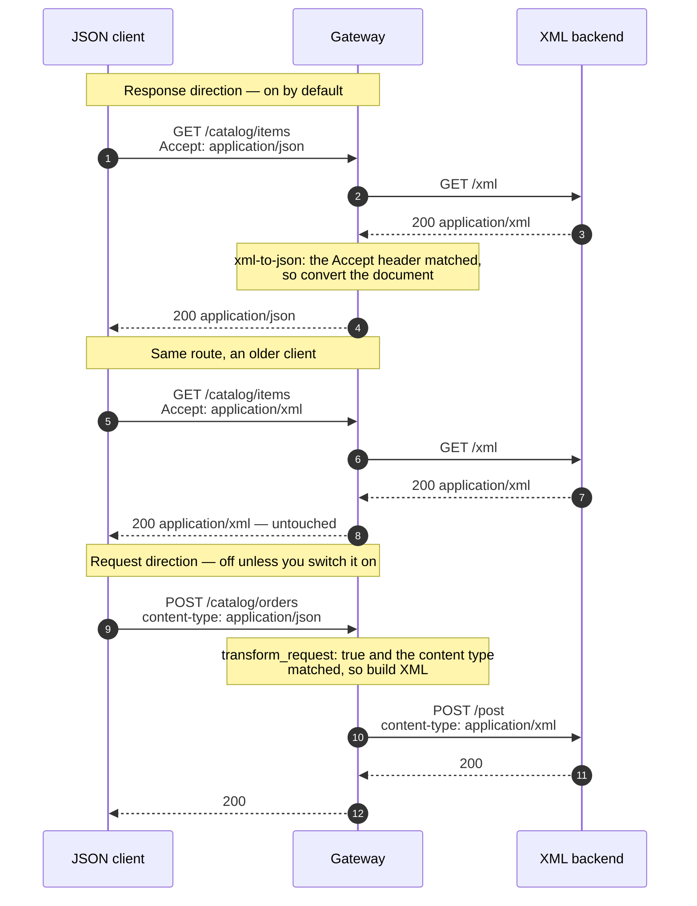

# Architecture — XML and JSON mediation at the edge

> [Overview](README.md) · [Business need](business-need.md) · **Architecture** · [Guides](guides.md) · [Agent prompt](helix-agent-prompt.md) · [Tests](tests.md) · [API reference](api-reference.md)

---

## What the gateway does here

The gateway sits between JSON clients and an XML backend and converts in both
directions with one plugin, `xml-to-json`:

- **Response direction** — XML from the backend becomes JSON for the client, but
  only when the client sends `Accept: application/json`.
- **Request direction** — a JSON body from the client becomes XML for the backend,
  but only when `transform_request` is switched on and the body's `Content-Type`
  is on the list.

The backend doesn't change. It keeps receiving and returning the XML it always
has.

For the full list of fields on every plugin mentioned here, see
[docs.digitalapi.ai/api-gateway](https://docs.digitalapi.ai/api-gateway).

## How a request flows

## Execution order

Plugins run in **priority order**, not in the order they appear in the file.

| Order | Plugin | Where it applies | What it does |
|---|---|---|---|
| 1 | `proxy-rewrite` (rewrite phase, 1008) | each route | Points the request at the backend's path. Path only |
| 2 | `xml-to-json` (997) | each route | Checks the request's `Content-Type`. If it matches `request_content_types` *and* `transform_request` is true, converts the JSON body to XML and sets the outgoing `Content-Type` to `application/xml`. Otherwise forwards the body unchanged |
| — | backend | — | Receives the document in the form it always has |
| 3 | `xml-to-json`, response side | each route | If the client sent `Accept: application/json` and the backend's `Content-Type` is in `content_types`, converts the XML to JSON. Otherwise passes it through as-is |
| — | `request-id`, `cors` | API-wide | A correlation id, and browser access (`accept` must be allowed) |

**The order of `proxy-rewrite` and `xml-to-json` matters.** Both run in the
rewrite phase and `proxy-rewrite` goes first. Changing the path there is safe.
Setting `Content-Type` there is not: the conversion would then see a header
`proxy-rewrite` has already changed, stop matching `request_content_types`, and
quietly skip the conversion. The same mistake is on record against
[solution 03](../03-soap-to-rest/).

## Two switches decide whether anything happens

Both defaults are reasonable and both surprise people, so check them first when
"the plugin isn't doing anything".

**The response conversion depends on what the client asks for.** It only fires
when the client sends `Accept: application/json`. A client that leaves the header
out gets the backend's XML and concludes the gateway is misconfigured. That
behaviour is also the feature that lets existing XML clients keep working — but it
has to be in your client documentation, in bold.

**The request conversion is off by default.** `transform_request` defaults to
`false`, so an `xml-to-json: {}` block converts responses *only*. And when it is
on, a body whose `Content-Type` isn't in `request_content_types` is forwarded
**unchanged and without an error**. The gateway returns **HTTP 200 (OK)**; your
backend gets JSON it can't read and complains in its own log.

Both gates **fail open**: if a condition isn't met, the request passes through
unconverted rather than producing an error. So alert on backend parse failures,
not on gateway status codes.

## Why the conversion is opt-in per request

It looks like an inconvenience. It is the feature that makes adoption possible.

| | Always convert | Convert only when asked |
|---|---|---|
| Existing XML clients | Break on the day you deploy | Unaffected — same route, same response |
| Rollout | A migration project across every client | A configuration change |
| New JSON clients | Work | Work, if they send `Accept: application/json` |
| Cost | A cutover | One line in your client documentation |

## What the conversion does to your document

XML and JSON don't have the same shape, so a converter has to make choices. These
are the ones this plugin makes, observed against a real document rather than read
off a schema.

| XML | Becomes | Watch out for |
|---|---|---|
| A repeated element | A JSON array | **A single occurrence becomes an object, not a one-item array.** The classic intermittent client bug |
| Attributes on the **root** element | Ordinary keys next to the child elements | Indistinguishable from elements once converted |
| Attributes on **child** elements | **Were not present in the converted output** | If data lives in child attributes, check your own document before relying on it |
| An empty element | `null` | Not `""`, and not a missing key |
| Mixed content (`Why <em>X</em> is great`) | Reshaped into separate keys, with the text rejoined | Don't put meaning in mixed content |
| A hyphenated name | An underscored key | `order-id` → `order_id` |

And the other direction, JSON → XML:

| JSON | Becomes | Watch out for |
|---|---|---|
| An array under a key | Repeated sibling elements named after the key | Not a wrapper element containing children |
| A top-level array | `request_root_name` wrapping `array_item_name` children | Both names are yours to choose |
| Object key order | **Not preserved** | A backend whose schema is an `xs:sequence` can reject a document containing every field it asked for |

Check that last row before promising the request direction to anyone. If your
backend validates a strict sequence, this plugin is the wrong tool for the request
side; a template-based transform is the right one.

## Reading the result

| Symptom | Cause |
|---|---|
| The response is still XML | The client didn't send `Accept: application/json`, or the backend's `Content-Type` isn't in `content_types` |
| The backend rejects the request body as "not XML" | `transform_request` is `false` (the default), or the client's `Content-Type` isn't in `request_content_types` |
| The backend rejected it, and the gateway returned 200 | Both gates fail open. Alert on backend parse errors, not gateway status |
| It worked yesterday, and today the client crashes on one field | A repeatable element occurred exactly once and became an object instead of an array |
| The backend complains about an unexpected element or namespace | `request_root_name` or `root_attributes.xmlns` doesn't match what its parser expects |
| **HTTP 503 (service unavailable)**, connection closed before any headers | `pretty: true` is set. Remove it |
| The request direction quietly stopped working after an edit | Something set `Content-Type` in `proxy-rewrite` |
| **HTTP 400 (bad request)** from the gateway on a POST | The JSON body couldn't be parsed. It is rejected before it reaches the backend |

## No custom code needed

Native, and deliberately the *simpler* of the two native options.

- **`xml-to-json`** — a structural converter. Element names become keys, repeated
  elements become arrays, and the document's shape is kept. No template to write
  or maintain, and it works on documents you haven't seen yet. The right trade
  when the backend's structure is acceptable as a JSON contract.
- **`body-transformer`** — template-based. You write the exact output document.
  Right when you need a JSON contract that is *independent* of the XML, when key
  order matters on the way back (a strict `xs:sequence`), or when meaning lives in
  attributes or mixed content. It costs a template per operation, and a template
  can go out of date.
- **`json-to-xml`** — despite the name, it solves the opposite problem. It turns a
  JSON *backend response* into XML for clients that want XML. It is not how you
  send XML to your backend; `transform_request` is.

This package uses the structural converter because the value is in removing four
client-side parsers, not in designing a new API. When you need a stable public
JSON contract, add a template on top rather than replacing this.

## When to use this

Use it when:

- your backend speaks XML over ordinary HTTP and there is no envelope in sight,
- more than one client has written, or is about to write, its own parser,
- you need to add JSON clients without migrating the XML ones, or
- the XML is well-formed and data lives in elements rather than attributes.

Do not use it when:

- **there is a SOAP envelope.** Use [solution 03](../03-soap-to-rest/).
- **your backend validates a strict `xs:sequence`** and you need the request
  direction. Key order isn't kept; use a template-based transform.
- **meaning lives in attributes or mixed content.** The conversion loses
  information there, and no setting fixes that.
- **you need a stable, versioned JSON contract** independent of the XML. This
  mirrors the backend's structure, so a backend refactor is a change clients see.
- **the documents are large.** Conversion holds the whole body in memory, and
  anything over `max_body_size` is passed through unconverted.

## What it does not do

- **Redesign the API.** The JSON mirrors the XML, element for element. Awkward XML
  becomes awkward JSON.
- **Convert without loss.** Child-element attributes, mixed content and the
  one-versus-many ambiguity are places where XML carries something JSON has no
  natural home for.
- **Report its own failures.** Both gates fail open, and a body over
  `max_body_size` is forwarded unconverted, silently. Conversion failures show up
  as **backend** errors, which is why `request-id` is on every route.
- **Authenticate anyone.** This package ships open so the conversion is the only
  thing being shown.
- **Guarantee XML element order.** JSON key order isn't kept on the way to XML.

## Prerequisites

- An org whose build includes `xml-to-json` and `proxy-rewrite`. Confirm with
  your org's plugin list before you design around them.
- An XML backend, or the public httpbin service the example uses. Check what
  `Content-Type` your backend actually sends: `content_types` defaults to
  `application/xml` and `text/xml`, and a backend replying `text/html` or
  `application/soap+xml` matches neither.
