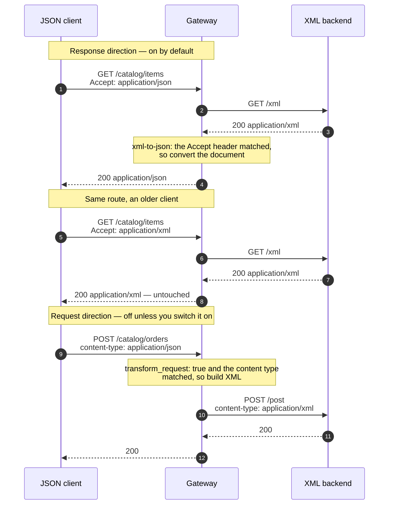

# Solution 09 — JSON in, JSON out, in front of a backend that only speaks XML

**Overview** · [Business need](business-need.md) · [How it works](how-it-works.md) · [Install](install.md) · [Configuration](configuration.md) · [Test & verify](testing.md) · [Changelog](changelog.md)

---

**No envelope, no WSDL, no SOAPAction. Just a REST backend from 2009 that answers
in XML, and four client teams who each wrote their own parser.**

<!-- facts:begin -->

| | |
|---|---|
| **Setup time** | ~15 minutes |
| **Difficulty** | Beginner |
| **Needs** | A fresh org (its default test environment). The upstream is the public httpbin service, so no backend of your own — and because it echoes requests, you can *see* the XML your backend would have received |
| **Plugins** | `cors` · `proxy-rewrite` · `request-id` · `xml-to-json` |
| **Build it with** | **[the Agent](install.md)** — recommended · or import [`gateway/api-spec.yaml`](gateway/api-spec.yaml) |

<!-- facts:end -->

## This is not the SOAP solution

Worth settling in the first ten seconds, because two different people land here
from two different searches.

| | [Solution 03 — SOAP to REST](../03-soap-to-rest/) | **This one** |
|---|---|---|
| The backend | A SOAP service: envelope, `SOAPAction`, one handler path, a WSDL | Plain HTTP that happens to carry XML — an inventory API, a payments file feed, an industry schema |
| What the gateway must build | A whole envelope around your data | Nothing. Element for element, key for key |
| Route shape | Every operation collapses onto one upstream path | Ordinary REST paths |
| Reach for it when | There is a `<soap:Envelope>` anywhere in the conversation | There isn't |

If your backend has an envelope, stop reading and use 03 — this package will
convert your JSON into XML that the SOAP handler rejects. If it doesn't, 03 will
wrap your data in an envelope nothing is expecting. They are not variants of each
other.

## The problem

> *"Our stock system is REST. It's just REST that answers in XML, because it was
> written in 2009 and that was the house style. Every SOAP-to-REST guide we find
> starts by telling us to build an envelope we don't have. Meanwhile the web team
> wrote an XML parser, the iOS team wrote a different one, the Android team found
> a library, and the partner integration team gave up and asked for a nightly CSV.
> Four implementations of the same conversion, and the one that breaks is always
> the one nobody owns."*

The cost is not the format. It is that the conversion has been pushed to the
clients, so it exists four times, in four languages, with four sets of
assumptions about what an empty element means.

**Root cause:** a representation concern is being solved at the wrong layer.
Nothing about turning `<sku>` into `"sku"` requires knowledge of the client or
the domain, so nothing about it needs to live in either.

## Business need

Full version: [`business-need.md`](business-need.md).

| Dimension | Four client-side parsers | One conversion at the edge |
|---|---|---|
| **Implementations of the conversion** | One per client, in one language each | One, in configuration |
| **Cost of a new client** | Write parser number five | Call the endpoint |
| **Backend change required** | — | None. It keeps speaking XML |
| **When the XML changes** | Four teams, four releases, four timelines | One place to look first |
| **Existing XML consumers** | — | Unaffected — they keep getting XML from the same route |

That last row is the one that usually decides it: because conversion is
content-negotiated, the old clients do not have to be migrated to put the new
front door in place.

## How a request flows

## Gotchas

- **No `Accept: application/json`, no conversion.** The first thing to check.
- **`transform_request` defaults to `false`.** An empty block converts responses
  only.
- **A content type outside `request_content_types` passes through silently.** So
  does a body over `max_body_size`. Neither produces an error.
- **`pretty: true` returns 503 on this build.** Verified. Leave it off.
- **Never set `Content-Type` in `proxy-rewrite` on a route that converts
  requests.** It runs first and breaks the match.
- **Check what your backend actually sends.** `content_types` defaults to
  `application/xml` and `text/xml`. A backend replying `text/html` or
  `application/soap+xml` matches neither.
- **A single occurrence of a repeatable element is an object, not an array.**
  Write clients that tolerate both, or normalise in your own layer.
- **JSON key order is not preserved on the way to XML.** Fatal with a strict
  `xs:sequence` schema, invisible otherwise.
- **Conversion failures are reported by the *backend*, not the gateway.** Which
  is why `request-id` is on every route here.

## When to use it

Use it when:

- Your backend speaks XML over ordinary HTTP and there is no envelope in sight.
- More than one client has written, or is about to write, its own parser.
- You need to add JSON clients without migrating the XML ones.
- The XML is well-formed and data lives in elements rather than attributes.

Don't use it when:

- **There is a SOAP envelope.** Use [solution 03](../03-soap-to-rest/).
- **Your backend validates against a strict `xs:sequence`** and you need the
  request direction. Key order is not preserved; use a template-based transform.
- **Meaning lives in attributes or mixed content.** The conversion is lossy there.
- **You need a stable, versioned JSON contract** that is independent of the XML.
  This mirrors the backend's structure, so a backend refactor is a client-visible
  change. Put a response template in front if that matters.
- **The documents are large.** Conversion buffers the body, and anything over
  `max_body_size` is passed through unconverted.

## Limitations

- **Content-negotiated in one direction, content-type-gated in the other.** Both
  gates fail open — the request passes through unconverted rather than erroring.
- **Attributes on child elements did not survive conversion** in this package's
  validation run. Root attributes did. Check your own document.
- **Single occurrence vs array is ambiguous** and resolved by what the document
  happens to contain.
- **Empty elements become `null`.**
- **Mixed content is reshaped, not preserved.**
- **Key order is not preserved on JSON → XML.**
- **`pretty: true` breaks the route on this build (503).**
- **The JSON contract is a mirror of the XML.** No independent versioning.
- **Bodies over `max_body_size` are forwarded unconverted, silently.**

Full list: [`solution.yaml`](solution.yaml) § `limitations`.

## Validation status

**Validated against a gateway — imported, dry-run, deployed, and exercised.**

| Stage | Status | Provenance |
|---|---|---|
| Configuration generated | **YES** | [`gateway/api-spec.yaml`](gateway/api-spec.yaml) |
| Local validation | **PASS** | [`validation/local-validation.yaml`](validation/local-validation.yaml) |
| Gateway dry-run | **PASS** | Non-destructive, against a temporary import. |
| Gateway deployed | **DEPLOYED** | Revision ACTIVE in a test environment. |
| Functional tests | **PASS (5/5)** | Both directions, both silent-passthrough assertions, and the malformed-body rejection. |

Overall: **READY.** The `pretty: true` defect and the conversion-fidelity
observations were both produced by this run and are recorded in
[`validation/gateway-validation.yaml`](validation/gateway-validation.yaml).

## Related solutions

- **[03 — SOAP to REST](../03-soap-to-rest/)** — the envelope case. Read the table
  at the top before choosing.
- **[08 — API keys](../08-api-key/)** · **[02 — OAuth 2.0 with JWT](../02-oauth-jwt/)** —
  this package ships unauthenticated so the mediation is the only thing being
  demonstrated. Put one of these in front before it carries anything real.
- **[10 — Data masking](../10-data-mask/)** — for when the converted response
  contains more than the client should see.
