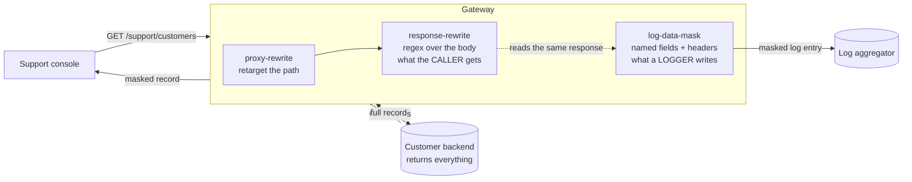

# Solution 10 — mask the values, not just the log line

**Two different masks, two different purposes. One changes what the support agent
reads; the other changes what the log aggregator keeps. Shipping the wrong one is
the standard way this project fails.**

| | |
|---|---|
| **Setup time** | ~15 minutes |
| **Difficulty** | 🟢 Beginner |
| **Needs** | A fresh org (its default **test** environment). The upstream is public jsonplaceholder, whose customer records carry email, phone and precise coordinates — so the masking is visible with no backend of your own. A logger plugin and a sink you can read, if you want to verify the log half too. |
| **Plugins** | `response-rewrite` · `log-data-mask` · `proxy-rewrite` · `request-id` |
| **Build it with** | 🤖 **[the Helix Agent](helix-agent-prompt.md)** — recommended · or import [`gateway/api-spec.yaml`](gateway/api-spec.yaml) |
| **Assets** | ✅ [Agent prompt](helix-agent-prompt.md) · ✅ [Architecture](architecture.md) · ✅ [Business need](business-need.md) · ✅ [Spec](gateway/) · ✅ [Tests](tests/) · ✅ [Validation](validation/) · ✅ [Manifest](solution.yaml) |

---

## The problem

> *"Audit flagged customer PII in our log aggregator, so we have a ticket to mask
> the logs. While we were reading the sample log lines it became obvious that the
> support console shows agents the same thing — every customer's full email,
> full phone number, and the coordinates of their house. Two hundred agents, a
> contact-centre with turnover, and none of them need any of it. The backend is a
> shared service on a quarterly release train, so 'return less' is not a change we
> can make this year."*

Two exposures, one root cause, and they are usually treated as one ticket:

1. **The screen.** Every agent sees every field the backend returns, because
   nobody scoped the response to the job.
2. **The logs.** The same payload is copied into a system with different access
   control, longer retention, and a much larger audience.

**Root cause:** the backend returns one representation and every consumer gets it
whole. Narrowing it per consumer is a backend change nobody can schedule — so it
does not happen, and the exposure is renewed every release.

## Two masks. Do not confuse them.

This is the whole solution, and getting it wrong is the standard failure.

| | `response-rewrite` | `log-data-mask` |
|---|---|---|
| **Changes** | What the **caller** receives | What a **logger** writes |
| **Effect on the response** | The point | **None** |
| **Effect on the logs** | Indirect — loggers usually record the rewritten body | The point |
| **Needs anything else on the route?** | No | **Yes — a logger plugin.** With none, it does nothing at all |
| **Affects analytics?** | No | No |
| **How it selects** | A regex over the body text | Named fields, parsed |
| **Stops a stolen screenshot** | Yes | No |
| **Stops PII in the log aggregator** | Usually, as a side effect | Yes, and headers too |

Verified live, on two routes that differed only in this: a route carrying
**only** `log-data-mask` returned the caller `Sincere@april.biz` and
`1-770-736-8031` in full, while its log entry carried `[redacted]` in both
places and no `Authorization` header at all. The same audit finding produces both
tickets, so the log control gets configured first — and the screen keeps showing
everything.

Ship both. This package does.

## How a request flows



The backend keeps returning everything. Nothing downstream of the gateway sees
the full record except the gateway itself.

## Configuration

Source of truth: [`gateway/api-spec.yaml`](gateway/api-spec.yaml).

What the caller sees:

```yaml
response-rewrite:
  filters:
    - regex: '("email"\s*:\s*")[^"@]+@'
      replace: '$1***@'
      scope: global
    - regex: '("phone"\s*:\s*")[^"]*"'
      replace: '$1[redacted]"'
      scope: global
```

What a logger writes:

```yaml
log-data-mask:
  response:
    - { type: body, name: email, action: replace, value: "[redacted]", body_format: json }
    - { type: body, name: phone, action: replace, value: "[redacted]", body_format: json }
  request:
    - { type: header, name: authorization, action: remove }
```

### `scope: global` is not optional

`scope` defaults to **`once`**. A filter without it masks the **first** match in
the body and leaves every other one.

On a ten-record list that is one masked record and nine in the clear. Verified
deliberately during this package's validation: with the default scope, **1 of 10**
records was masked. And because it is the *first* record, it is the one in every
screenshot, every demo and every code-review sample — the configuration looks
correct in exactly the view people check it in.

If you take one thing from this package, take that.

### The mask is a regex, not a parser

That is the strength — it needs no knowledge of your schema, and it works on a
response shape you have never seen. It is also the limit, and the limit is sharp:

- **A value under a different key is not masked.** The filter is anchored on
  `"email"`. A copy of the same address in `contactEmail`, or in a free-text note,
  or in an error message, passes straight through.
- **A value inside an encoded string is not masked.** Base64, URL-encoded,
  a nested JSON string — the regex sees text, not meaning.
- **A pattern that is too broad corrupts data silently.** Every filter here is
  anchored on its own field name for that reason, and one test asserts that
  unfiltered fields come back untouched.

Run the encoded-and-renamed-fields case in
[`tests/test-plan.yaml`](tests/test-plan.yaml) against **real** payloads before
you rely on this. Error messages and audit-trail fields are where copies hide.

### Why the email keeps its domain

`***@april.biz`, not `[redacted]`. Support uses the domain to tell which customer
organisation a person belongs to; the local part is the identifying half. A mask
that removes the whole address makes the console worse at its job, and a control
that makes the job harder without a visible benefit is a control that gets
switched off two sprints later.

Mask what is sensitive. Keep what is useful. They are usually different halves of
the same field.

## Build it with the Helix Agent

Full prompt with all the constraints: [`helix-agent-prompt.md`](helix-agent-prompt.md).

> **This one needs four small steps, not one big prompt — and the reason is
> measured, not stylistic.** `update_route_spec` is a *full replace*, so every
> incremental change resends the whole route spec. Past roughly a kilobyte the
> agent starts emitting malformed tool arguments (a stray bracket appended to the
> JSON), which surfaces as `stream closed with reason: error`. Four attempts at
> the one-prompt version failed the same way; the four-step version below is the
> shape that completed. The last step is the one that still tips it over, so it
> ships with a fallback.

**Step 1 — the API and the collection route**

```text
Create a new REST API called "Support Console API" with ONE route for now.

Upstream: https://jsonplaceholder.typicode.com (reuse it if it already exists in this
org as an upstream rather than creating another). Deploy to the "test" environment.

Route: GET /support/customers -> proxy-rewrite uri /users

Put request-id in the SERVICE spec so it applies API-wide.

We are editing a LIVE route object, not authoring an OpenAPI document — so do not
follow the spec-generator examples for plugin placement. Each route object in
routeSpec takes "plugins" as a TOP-LEVEL key, and inside it each plugin is
keyed by its own NAME:
  { "name": ..., "uri": ..., "methods": [...], "service_id": ...,
    "plugins": { "<plugin-name>": { <that plugin's own fields> } } }
Do not promote a plugin's fields into the plugins map: "plugins":
{"response_status": 202, "content_type": ...} is four broken plugins, not one
working one — the plugin name level is mandatory.
There must be no "x-helix-gateway" key anywhere in a route object: a live route
silently discards that wrapper, the write still reports success, and the route
deploys with no plugins at all. Set only the fields you need.

Skip validate_route — use dry_run_deploy. Bind the upstream, run dry_run_deploy, then
call get_revision and show me the stored routeSpec so I can see the plugins landed.
Wait before deploying.
```

**Step 2 — the single-record route**

```text
Now add a second route to the same revision, keeping the first exactly as it is:

  GET /support/customers/{customerId}

It needs proxy-rewrite with regex_uri, not uri, so the id reaches the backend:
regex_uri: ["^/support/customers/(.*)$", "/users/$1"]

Send the routeSpec as a JSON array of both route objects — update_route_spec replaces
the whole list. Then call get_revision and show me the stored routeSpec.
```

**Step 3 — the masking the caller sees**

```text
Give BOTH routes this response-rewrite block, verbatim — these are the exact patterns,
do not rewrite them:

filters:
  - regex: ("email"\s*:\s*")[^"@]+@
    replace: $1***@
    scope: global
  - regex: ("phone"\s*:\s*")[^"]*"
    replace: $1[redacted]"
    scope: global
  - regex: ("lat"\s*:\s*")[^"]*"
    replace: $1[redacted]"
    scope: global
  - regex: ("lng"\s*:\s*")[^"]*"
    replace: $1[redacted]"
    scope: global

Every filter keeps scope: global — the default is "once" and masks only the first match,
which on a list leaves every record but the first in the clear.

Send the routeSpec as a JSON array of both routes, then call get_revision and show me the
stored routeSpec.
```

**Step 4 — the masking the logs keep**

```text
Add log-data-mask to both routes, keeping everything else exactly as it is:
  response:
    - { type: body, name: email, action: replace, value: "[redacted]", body_format: json }
    - { type: body, name: phone, action: replace, value: "[redacted]", body_format: json }
  request:
    - { type: header, name: authorization, action: remove }
    - { type: header, name: x-api-key, action: remove }

Then call get_revision, show me the stored routeSpec, and tell me in one sentence what
log-data-mask does NOT do.
```

> **If step 4 ends in `stream closed with reason: error`, that is the defect above
> and not your prompt.** The route spec is now large enough to trigger it
> reliably. Import [`gateway/api-spec.yaml`](gateway/api-spec.yaml) instead — it
> is the same configuration, complete, and the agent has already done the parts
> that teach you anything.

## Install it directly

```bash
export ORG=<ORG_ID>
export TOKEN=<control-plane bearer token>      # short-lived
export BASE=https://<YOUR_GATEWAY_HOST>/api

# 1. Import gateway/api-spec.yaml. Nothing in it needs filling in.
# 2. Bind your upstream and deploy the revision to "test".
# 3. Adjust the field names in BOTH plugin blocks to your payload, and the
#    proxy-rewrite paths to your backend.
# 4. Prove it
GATEWAY=https://<YOUR_GATEWAY_HOST> ./gateway/verify.sh
```

## Testing

Exit 0 means all six response-side cases held:

| # | Case | Expected |
|---|---|---|
| 1 | **Every** record in the list | email local part masked — not just the first |
| 2 | The email domain | still readable |
| 3 | Every phone number | `[redacted]` |
| 4 | Every coordinate | `[redacted]` |
| 5 | A field the filters don't name | untouched |
| 6 | The single-record route | masked identically |

**Case 1 is the one that matters.** It is the `scope: once` trap, asserted rather
than hoped for. Case 5 is its mirror: proof the patterns are anchored and are not
quietly corrupting fields nobody asked to mask.

`verify.sh` cannot check the log half — no client-side assertion can see what a
logger wrote. [`tests/test-plan.yaml`](tests/test-plan.yaml) carries the
procedure, and this package's validation run executed it: a logger on the route,
a sink whose received body was read back, and the same route with `log-data-mask`
removed for comparison.

## Gotchas

- **`scope` defaults to `once`.** One record masked, the rest in the clear, and the
  masked one is the one you look at.
- **`log-data-mask` does nothing without a logger on the route.** It is read by the
  shared log helper the logger plugins use. It is not a response filter.
- **`log-data-mask` does not change the response.** Verified. A route with only
  that plugin sends the caller everything.
- **It does not affect analytics either.** Analytics does not go through the log
  helper.
- **Masking is not access control.** A caller who should not see the record at all
  must be stopped by identity — [solution 08](../08-api-key/) or
  [solution 02](../02-oauth-jwt/). This package ships unauthenticated so the
  masking is the only thing under test; do not deploy it that way.
- **The regex sees text, not meaning.** Renamed keys, encoded strings and free-text
  copies are not masked.
- **A broad pattern corrupts data.** Anchor every filter on its own field name.
- **If you also convert formats on this route** ([solution 09](../09-xml-to-json/)),
  the converter runs first — write the patterns against the *converted* body.
- **A masked response is harder to support.** The agent cannot read back the value
  they are asking about. `request-id` is on every route here for that reason.

## When to use it

Use it when:

- A response carries more than its consumer needs, and narrowing it at the backend
  is not schedulable.
- An audit finding names PII in logs — and while you are there, on screens.
- You need the same rule applied consistently across many consumers, which is
  exactly what a single point of egress is for.
- You want a control you can demonstrate to an auditor in a single response.

Don't use it when:

- **The caller should not see the record at all.** That is authentication and
  authorization, not masking.
- **Meaning is carried in free text or encoded fields.** Regex masking cannot find
  what it was not given the name of.
- **You need format-preserving tokenisation** — a masked value that is still a
  valid, reversible identifier. Different tool entirely.
- **The data must never be in the response even transiently.** The backend still
  returns it and the gateway still holds it in memory. If that is unacceptable, the
  fix is at the backend.

## Limitations

- **`scope` defaults to `once`.** The most dangerous default here.
- **Regex, not parsing.** Renamed keys, encoded strings and free-text copies are
  missed; over-broad patterns corrupt data silently.
- **`log-data-mask` requires a logger on the route** and affects nothing else.
- **The two controls are independent.** Neither implies the other.
- **Masking is not access control.**
- **Not format-preserving and not reversible.** There is no token to map back.
- **The upstream still returns the sensitive data** and the gateway holds it in
  memory to rewrite it.
- **Body rewriting buffers the response**, which costs memory on large payloads.

Full list: [`solution.yaml`](solution.yaml) § `limitations`.

## Validation status

**Validated against a gateway — imported, dry-run, deployed, and exercised.**

| Stage | Status | Provenance |
|---|---|---|
| Configuration generated | **YES** | [`gateway/api-spec.yaml`](gateway/api-spec.yaml) |
| Local validation | **PASS** | [`validation/local-validation.yaml`](validation/local-validation.yaml) |
| Gateway dry-run | **PASS** | Non-destructive, against a temporary import. |
| Gateway deployed | **DEPLOYED** | Revision ACTIVE in a test environment. |
| Functional tests | **PASS (6/6)** | Response side by `verify.sh`; the log side verified separately against a real logger and a readable sink. |

Overall: **READY.** The `scope: once` behaviour and the independence of the two
masks were both reproduced deliberately and are recorded in
[`validation/gateway-validation.yaml`](validation/gateway-validation.yaml).

## Related solutions

- **[08 — API keys](../08-api-key/)** · **[02 — OAuth 2.0 with JWT](../02-oauth-jwt/)** —
  masking is not access control. Put one of these in front.
- **[09 — XML to JSON](../09-xml-to-json/)** — if you convert on the same route,
  the converter runs first and your patterns must match the converted body.
- **[04 — Analytics](../04-analytics/)** — analytics does not pass through the log
  helper, so `log-data-mask` does not touch it.
