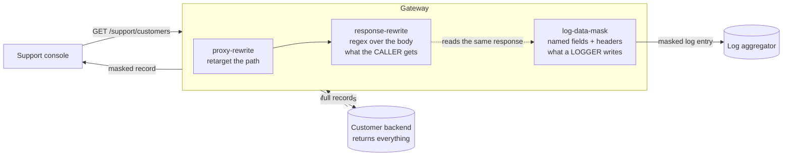

# Architecture — two masks, two audiences

> [Overview](README.md) · [Business need](business-need.md) · **Architecture** · [Guides](guides.md) · [Agent prompt](helix-agent-prompt.md) · [Tests](tests.md) · [API reference](api-reference.md)

---

## What the gateway does here

The backend keeps returning the full customer record. The gateway is the only
thing downstream of it that ever sees the whole record, and it changes two
copies:

1. **The caller's copy** — `response-rewrite` rewrites the response body before
   it leaves the gateway.
2. **A logger's copy** — `log-data-mask` tells any logger plugin on the route
   what to mask before it writes the entry.

Nothing about this design asks the backend to change.

For the full list of fields on every plugin mentioned here, see
[docs.digitalapi.ai/api-gateway](https://docs.digitalapi.ai/api-gateway).

## How a request flows

## Execution order

| Order | Step | What it does |
|---|---|---|
| 1 | `proxy-rewrite` (rewrite phase) | Points the request at the backend's path. The list route uses a fixed `uri`; the single-record route uses `regex_uri` so the customer id is carried through |
| — | backend | Returns its full record |
| 2 | `response-rewrite` (priority 899, response) | Applies its filters to the body. This is the copy the caller receives |
| 3 | `log-data-mask` (priority 999, log phase) | Publishes its rules for the request. The shared log helper that every logger plugin uses reads them and masks the entry it is about to write |
| — | `request-id` (API-wide) | A correlation id. A masked response is harder to support — the agent can't read back the value they're asking about — so this is what they quote |

If you also convert formats on the same route ([solution 09](../09-xml-to-json/)),
the converter runs at 997 — higher, so first — and your patterns must match the
*converted* body.

## The two masks are not alternatives

They act on different things, at different times, for different audiences, and
neither implies the other.

| | `response-rewrite` | `log-data-mask` |
|---|---|---|
| Acts on | The response body | The log entry a logger is about to write |
| Selects by | A regex over the body text | Named fields and headers, parsed |
| Needs a logger on the route | No | **Yes.** With none, it has no effect at all |
| Changes the response | Yes | **No** |
| Changes analytics | No | No — analytics doesn't use the log helper |
| Can mask request headers | No | Yes, and that is where the credential is |

This was checked on two routes that differed only in this. A route with **only**
`log-data-mask` returned the caller `Sincere@april.biz` and `1-770-736-8031` in
full, while its log entry carried `[redacted]` in both places and no
`Authorization` header at all. A route with only `response-rewrite` does the
reverse.

## The `scope` setting

Each `response-rewrite` filter has a `scope`, and it defaults to **`once`**: the
filter replaces the **first** match and stops.

On a single record that is invisible. On a list it masks one record and leaves
the rest — and the one it masks is the first, the record in every screenshot,
every demo and every code-review sample. Checked deliberately: with the default,
**1 of 10** records was masked. The configuration looks correct in exactly the
view people check it in.

Every filter in this package sets `scope: global`. Treat a filter without it as a
review finding.

## Why a regex, and where that stops

A regex needs no knowledge of your data's structure, and it works on a response
shape you've never seen. It also has no idea what a field *means*; it matches
text. Three consequences:

- **Renamed copies are missed.** `"email"` is matched; `"contactEmail"` is not.
  Neither is a copy in a free-text note or an error message.
- **Encoded copies are missed.** A value inside a base64 or URL-encoded string, or
  a nested JSON string, is invisible to the pattern.
- **Broad patterns damage data.** A pattern not tied to its field name will match
  somewhere else eventually, and the damage is silent.

Every filter in this package is tied to its own field name, and one test checks
that fields outside the filter list come back untouched.

## Why the email keeps its domain

`***@april.biz`, not `[redacted]`. Support uses the domain to tell which customer
organisation a person belongs to; the part before the `@` is the identifying
half. A mask that removes the whole address makes the console worse at its job,
and a control that makes the job harder without a visible benefit tends to get
switched off. Mask what is sensitive; keep what is useful. They are usually
different halves of the same field.

## Reading the result

| Symptom | Cause |
|---|---|
| The first record is masked, the rest are not | A filter is missing `scope: global` |
| Nothing is masked at all | The pattern doesn't match the body as sent — check whitespace, key spelling, and whether something on the route converted the format first |
| A field nobody asked to mask is damaged | An over-broad pattern; tie it to its key |
| The logs are still full of personal data | There's no logger on the route, so `log-data-mask` has nothing to act on; or the logger was added to a different route |
| The response is still full of personal data | Only `log-data-mask` was configured. It doesn't touch the response |
| Analytics still shows the values | Expected. Analytics doesn't pass through the log helper |
| The single-record route returns **HTTP 404 (not found)** | `proxy-rewrite`'s `regex_uri` isn't carrying the id — a routing fault, not a masking one |

## No custom code needed

Native, and the choice between the native options matters.

- **`response-rewrite` filters** — a regex substitution over the body. No schema
  knowledge, any shape, one line per rule. The right tool when the fields can be
  found by name in the body as sent, which is the common case.
- **`body-transformer`** — a template that rebuilds the document. The right tool
  when you need to *restructure* rather than redact, when the same value appears
  under several keys, or when the masked output must stay schema-valid in a way a
  substitution can't promise. It costs a template per operation.
- **A custom policy** — rejected. Redaction rules that live in code need a release
  to change, and the whole value here is that they don't.

## When to use this

Use it when:

- a response carries more than its consumer needs, and narrowing it at the
  backend can't be scheduled,
- an audit finding names personal data in logs — and, while you're there, on
  screens,
- you need the same rule applied across many consumers, or
- you want a control you can show an auditor in a single response.

Do not use it when:

- **the caller shouldn't see the record at all.** That is authentication and
  authorization, not masking.
- **meaning is carried in free text or encoded fields.** Regex masking can't find
  what it wasn't given the name of.
- **you need format-preserving tokenisation** — a masked value that is still a
  valid, reversible identifier. That is a different tool.
- **the data must never be in the response, even briefly.** The backend still
  returns it and the gateway still holds it in memory. If that's unacceptable,
  the fix is at the backend.
- **payloads are very large.** Rewriting the body holds the whole response in
  memory.

## What it does not do

- **Control access.** A caller who shouldn't see the record at all must be stopped
  by identity — [solution 08](../08-api-key/) or [solution 02](../02-oauth-jwt/).
  This package ships unauthenticated so masking is the only thing being shown; don't
  deploy it that way.
- **Tokenise.** The masked value isn't reversible and isn't a valid identifier.
  There is no token a downstream system can correlate on.
- **Remove the data from the backend.** The backend still returns it, and the
  gateway holds it in memory to rewrite it.
- **Find what it wasn't told about.** Renamed keys, encoded strings and free-text
  copies are not masked. Test against real payloads.
- **Mask logs on its own.** `log-data-mask` needs a logger on the route, and it
  never affects the response or analytics.

## Prerequisites

- An org whose build includes `response-rewrite`, `log-data-mask` and
  `proxy-rewrite`. Confirm with your org's plugin list before you design around
  them.
- The sensitive fields have known names in the response body (`email`, `phone`,
  `lat`, `lng` in the example).
- For the log side: a logger plugin on the route (for example `http-logger`,
  `kafka-logger`, `file-logger` or `clickhouse-logger`). The spec carries the
  mask, not the logger.
