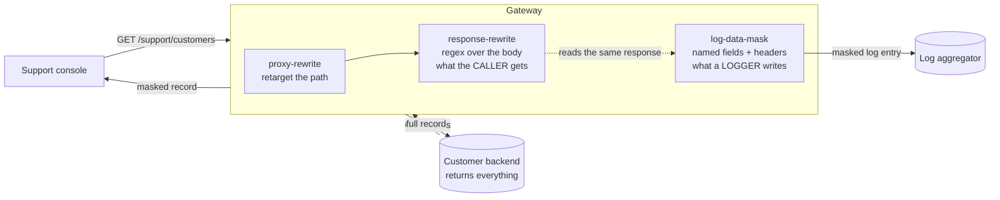

# Solution 10 — mask the values, not just the log line

**Overview** · [Business need](business-need.md) · [How it works](how-it-works.md) · [Install](install.md) · [Configuration](configuration.md) · [Test & verify](testing.md) · [Changelog](changelog.md)

---

**Two different masks, two different purposes. One changes what the support agent
reads; the other changes what the log aggregator keeps. Shipping the wrong one is
the standard way this project fails.**

<!-- facts:begin -->

| | |
|---|---|
| **Setup time** | ~15 minutes |
| **Difficulty** | Beginner |
| **Needs** | A fresh org (its default test environment). The upstream is public jsonplaceholder, whose customer records carry email, phone and precise coordinates — so the masking is visible with no backend of your own. A logger plugin and a sink you can read, if you want to verify the log half too |
| **Plugins** | `log-data-mask` · `proxy-rewrite` · `request-id` · `response-rewrite` |
| **Build it with** | **[the Agent](install.md)** — recommended · or import [`gateway/api-spec.yaml`](gateway/api-spec.yaml) |

<!-- facts:end -->

## The problem

> *"Audit flagged customer PII in our log aggregator, so we have a ticket to mask
> the logs. While we were reading the sample log lines it became obvious that the
> support console shows agents the same thing — every customer's full email,
> full phone number, and the coordinates of their house. Two hundred agents, a
> contact-centre with turnover, and none of them need any of it. The backend is a
> shared service on a quarterly release train, so 'return less' is not a change we
> can make this year."*

Two exposures, one root cause, and they are usually treated as one ticket:

1. **The screen.** Every agent sees every field the backend returns, because
   nobody scoped the response to the job.
2. **The logs.** The same payload is copied into a system with different access
   control, longer retention, and a much larger audience.

**Root cause:** the backend returns one representation and every consumer gets it
whole. Narrowing it per consumer is a backend change nobody can schedule — so it
does not happen, and the exposure is renewed every release.

## How a request flows

The backend keeps returning everything. Nothing downstream of the gateway sees
the full record except the gateway itself.

## Gotchas

- **`scope` defaults to `once`.** One record masked, the rest in the clear, and the
  masked one is the one you look at.
- **`log-data-mask` does nothing without a logger on the route.** It is read by the
  shared log helper the logger plugins use. It is not a response filter.
- **`log-data-mask` does not change the response.** Verified. A route with only
  that plugin sends the caller everything.
- **It does not affect analytics either.** Analytics does not go through the log
  helper.
- **Masking is not access control.** A caller who should not see the record at all
  must be stopped by identity — [solution 08](../08-api-key/) or
  [solution 02](../02-oauth-jwt/). This package ships unauthenticated so the
  masking is the only thing under test; do not deploy it that way.
- **The regex sees text, not meaning.** Renamed keys, encoded strings and free-text
  copies are not masked.
- **A broad pattern corrupts data.** Anchor every filter on its own field name.
- **If you also convert formats on this route** ([solution 09](../09-xml-to-json/)),
  the converter runs first — write the patterns against the *converted* body.
- **A masked response is harder to support.** The agent cannot read back the value
  they are asking about. `request-id` is on every route here for that reason.

## When to use it

Use it when:

- A response carries more than its consumer needs, and narrowing it at the backend
  is not schedulable.
- An audit finding names PII in logs — and while you are there, on screens.
- You need the same rule applied consistently across many consumers, which is
  exactly what a single point of egress is for.
- You want a control you can demonstrate to an auditor in a single response.

Don't use it when:

- **The caller should not see the record at all.** That is authentication and
  authorization, not masking.
- **Meaning is carried in free text or encoded fields.** Regex masking cannot find
  what it was not given the name of.
- **You need format-preserving tokenisation** — a masked value that is still a
  valid, reversible identifier. Different tool entirely.
- **The data must never be in the response even transiently.** The backend still
  returns it and the gateway still holds it in memory. If that is unacceptable, the
  fix is at the backend.

## Limitations

- **`scope` defaults to `once`.** The most dangerous default here.
- **Regex, not parsing.** Renamed keys, encoded strings and free-text copies are
  missed; over-broad patterns corrupt data silently.
- **`log-data-mask` requires a logger on the route** and affects nothing else.
- **The two controls are independent.** Neither implies the other.
- **Masking is not access control.**
- **Not format-preserving and not reversible.** There is no token to map back.
- **The upstream still returns the sensitive data** and the gateway holds it in
  memory to rewrite it.
- **Body rewriting buffers the response**, which costs memory on large payloads.

Full list: [`solution.yaml`](solution.yaml) § `limitations`.

## Validation status

**Validated against a gateway — imported, dry-run, deployed, and exercised.**

| Stage | Status | Provenance |
|---|---|---|
| Configuration generated | **YES** | [`gateway/api-spec.yaml`](gateway/api-spec.yaml) |
| Local validation | **PASS** | [`validation/local-validation.yaml`](validation/local-validation.yaml) |
| Gateway dry-run | **PASS** | Non-destructive, against a temporary import. |
| Gateway deployed | **DEPLOYED** | Revision ACTIVE in a test environment. |
| Functional tests | **PASS (6/6)** | Response side by `verify.sh`; the log side verified separately against a real logger and a readable sink. |

Overall: **READY.** The `scope: once` behaviour and the independence of the two
masks were both reproduced deliberately and are recorded in
[`validation/gateway-validation.yaml`](validation/gateway-validation.yaml).

## Related solutions

- **[08 — API keys](../08-api-key/)** · **[02 — OAuth 2.0 with JWT](../02-oauth-jwt/)** —
  masking is not access control. Put one of these in front.
- **[09 — XML to JSON](../09-xml-to-json/)** — if you convert on the same route,
  the converter runs first and your patterns must match the converted body.
- **[04 — Analytics](../04-analytics/)** — analytics does not pass through the log
  helper, so `log-data-mask` does not touch it.
