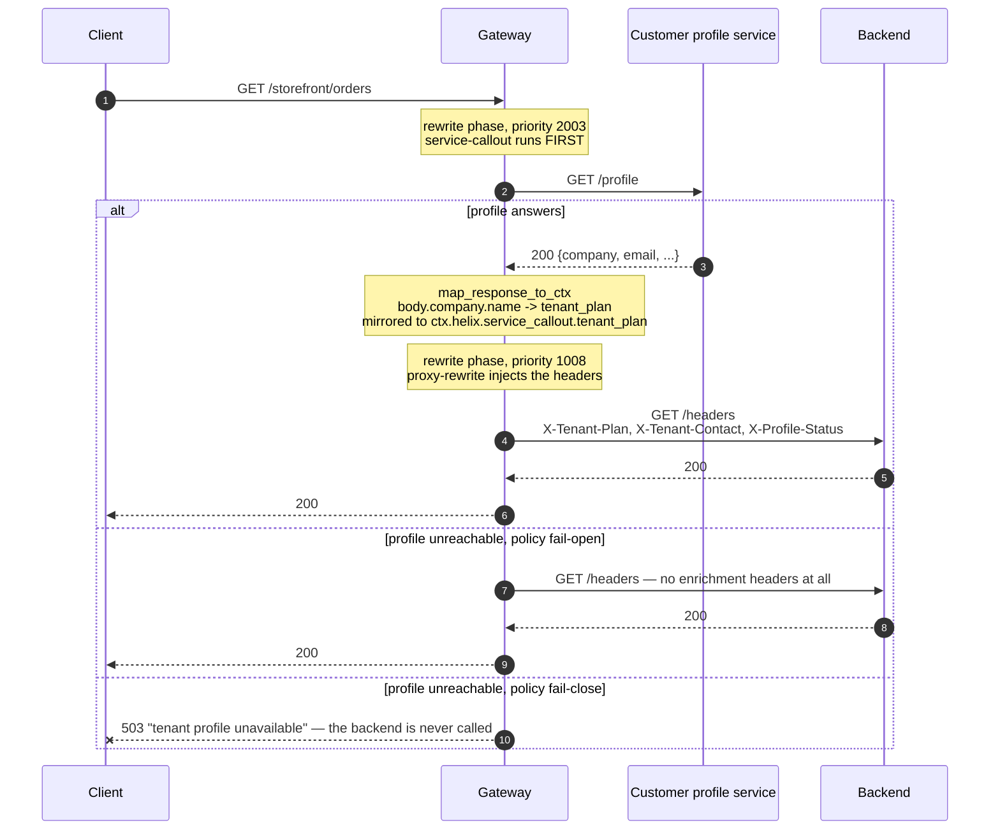

# Solution 11 — the lookup every service re-implements, done once at the edge

**Three teams cache the same tenant-profile call three different ways, and one of
them is wrong. Make the call once, before the request is proxied, and hand the
answer to the backend as a header.**

| | |
|---|---|
| **Setup time** | ~15 minutes |
| **Difficulty** | 🟢 Beginner |
| **Needs** | A fresh org (its default **test** environment). Nothing to fill in — the upstream echoes request headers so you can see what the backend received, and the callout target is a public sample service standing in for your own. |
| **Plugins** | `service-callout` · `proxy-rewrite` · `request-id` |
| **Build it with** | 🤖 **[the Helix Agent](helix-agent-prompt.md)** — recommended · or import [`gateway/api-spec.yaml`](gateway/api-spec.yaml) |
| **Assets** | ✅ [Agent prompt](helix-agent-prompt.md) · ✅ [Architecture](architecture.md) · ✅ [Business need](business-need.md) · ✅ [Spec](gateway/) · ✅ [Tests](tests/) · ✅ [Validation](validation/) · ✅ [Manifest](solution.yaml) |

---

## The problem

> *"Every service we own starts the same way: call the customer-profile service,
> find out what plan this tenant is on and whether the account is in arrears, then
> get on with the actual work. Orders caches it for five minutes. Billing caches it
> for an hour. Notifications doesn't cache it at all and is the reason profile
> gets paged. When profile is slow, all three are slow in three different ways, and
> when we changed the field name last quarter we found the seventh copy of that
> call in a service nobody had touched since 2023."*

The lookup is not hard. Having it in N places is:

1. **N caching strategies**, of which at most one is right.
2. **N failure behaviours** — one retries, one fails open, one fails the request.
3. **N places to change** when the profile service's contract moves.
4. **N × traffic** on the profile service, because nothing is shared.

**Root cause:** a cross-cutting lookup is being treated as application logic. Every
caller needs the same answer, before it does anything else — which is a property of
the *path*, not of any one service.

## Business need

Full version: [`business-need.md`](business-need.md).

| Dimension | The lookup in every service | One callout at the edge |
|---|---|---|
| **Implementations** | One per service, each with its own cache and timeout | One, in configuration |
| **Changing the contract** | Find every copy; coordinate N releases | One place |
| **Failure behaviour** | Whatever each team chose, undocumented | An explicit policy per route |
| **Load on the profile service** | One call per service per request | One call per request |
| **A new service** | Implements the lookup before it starts | Reads a header |

## How a request flows



## The two things that make this work

Both were established against a running gateway, and both are the reason a
configuration that looks right can do nothing at all.

### 1. `phase: rewrite`, not `access`

`proxy-rewrite` runs in the **rewrite** phase. A callout configured for the
**access** phase runs *after* it — so the values exist, and the injection has
already happened without them.

Reproduced deliberately: an access-phase callout returned **200 with no enrichment
headers at the backend**. Nothing errored. Within the rewrite phase,
`service-callout` (priority 2003) runs before `proxy-rewrite` (1008), which is the
order this needs.

**Phase beats priority; priority only orders within a phase.** That sentence
explains most "the plugins are in the wrong order" confusion on this platform.

### 2. The bridge is a variable named after the namespace

Every field in `map_response_to_ctx` is mirrored into a gateway variable whose
name is literally `ctx.helix.<ctx_namespace>.<field>` — dots included. So:

```yaml
service-callout:
  ctx_namespace: service_callout          # the default
  map_response_to_ctx:
    tenant_plan: body.company.name

proxy-rewrite:
  headers:
    set:
      X-Tenant-Plan: "${ctx.helix.service_callout.tenant_plan}"
```

Change `ctx_namespace` and every reference changes with it. A path that resolves
to nothing yields no value and **no error** — so a typo in `body.company.name` is
invisible until a backend notices the header is missing.

## `set`, never `add`

```yaml
headers:
  set:
    X-Tenant-Plan: "${ctx.helix.service_callout.tenant_plan}"
```

`set` **replaces** a header the client sent. `add` would leave the client's value
in place alongside the gateway's.

Verified: a client sending `X-Tenant-Plan: Enterprise-Unlimited` had it overwritten
with the callout's real value. With `add`, that caller would have asserted its own
plan — and this solution would have become a privilege-escalation path rather than
an enrichment one. `verify.sh` asserts it for exactly that reason.

## Failure policy is a decision, per route

The shipped spec makes opposite choices on the two routes, on purpose:

| Route | Policy | Why |
|---|---|---|
| `GET /storefront/orders` | `fail-open` | A read that proceeds without the tenant's plan is survivable. Verified: 200, and the headers absent. |
| `POST /storefront/checkout` | `fail-close` | Taking money without knowing the account's status is worse than failing. Verified: 503 with the configured message, and the backend never called. |

**Under `fail-open` the headers are absent, not empty.** Your backend must treat
them as optional and decide explicitly what to do when they are missing. A backend
that assumes the header is always present fails in a way that looks like a gateway
bug.

`log-only` is the third policy: log and continue, without even recording the error
in the context.

## Build it with the Helix Agent

Full prompt with all the constraints: [`helix-agent-prompt.md`](helix-agent-prompt.md).

```text
Create a new REST API called "Storefront API" whose backend needs the calling
tenant's profile on every request. This is a fresh org — I have no existing API.

Upstream: https://httpbin.org (public; its /headers endpoint echoes request
headers back, so I can see what the backend received). Deploy to the "test"
environment.

Route: GET /storefront/orders -> proxy-rewrite uri /headers

Add service-callout on that route:
  uri https://jsonplaceholder.typicode.com/users/1
  method GET, phase rewrite, timeout 3000
  map_response_to_ctx: tenant_plan from body.company.name, tenant_contact from
  body.email, profile_status from status
  error_handling policy fail-open

phase MUST be rewrite. proxy-rewrite runs in the rewrite phase, so an access-phase
callout produces its values after the injection has already happened and the
headers arrive empty.

Then have proxy-rewrite SET these headers — set, not add, so a client cannot send
its own:
  X-Tenant-Plan: ${ctx.helix.service_callout.tenant_plan}
  X-Tenant-Contact: ${ctx.helix.service_callout.tenant_contact}
  X-Profile-Status: ${ctx.helix.service_callout.profile_status}
Those variable names are literal — the dots are part of the name.

Put request-id in the SERVICE spec so it applies API-wide.

We are editing a LIVE route object, not authoring an OpenAPI document — so do not
follow the spec-generator examples for plugin placement. Each route object in
routeSpec takes "plugins" as a TOP-LEVEL key, like this:
  { "name": ..., "uri": ..., "methods": [...], "service_id": ..., "plugins": { ... } }
There must be no "x-helix-gateway" key anywhere in a route object: a live route
silently discards that wrapper, the write still reports success, and the route
deploys with no plugins at all. Set only the fields you need.
Skip validate_route — use dry_run_deploy. Bind the upstream, run dry_run_deploy,
then call get_revision and show me the stored routeSpec. Wait before deploying.
```

Then, in the same session:

```text
Now add a second route, POST /storefront/checkout -> proxy-rewrite uri /post, with
the same callout but error_handling policy fail-close and the message "tenant
profile unavailable" — on a write path we would rather fail than act without the
answer. Send the routeSpec as a JSON array of both routes, then show me the stored
routeSpec and a curl that proves a client cannot spoof X-Tenant-Plan.
```

## Install it directly

```bash
export ORG=<ORG_ID>
export TOKEN=<control-plane bearer token>      # short-lived
export BASE=https://<YOUR_GATEWAY_HOST>/api

# 1. Import gateway/api-spec.yaml. Nothing in it needs filling in.
# 2. Bind your backend as the upstream and deploy the revision to "test".
# 3. Point the callout `uri` at your own profile service and adjust the
#    map_response_to_ctx paths to its response shape.
# 4. Prove it
GATEWAY=https://<YOUR_GATEWAY_HOST> ./gateway/verify.sh
#    Against a backend that does not echo headers:
GATEWAY=https://<YOUR_GATEWAY_HOST> ECHOES_HEADERS=0 ./gateway/verify.sh
```

## Testing

Exit 0 means all five cases held:

| # | Case | Expected |
|---|---|---|
| 1 | The read route | `200`, and the backend received `X-Tenant-Plan` |
| 2 | The second mapped field | present at the backend |
| 3 | `X-Profile-Status` | `200` — the **callout's** status, not the route's |
| 4 | **A client sending its own `X-Tenant-Plan`** | overwritten by the gateway |
| 5 | The write route | `200`, body forwarded, and enriched too |

**Case 4 is the one not to skip**, and case 3 is quietly useful: mapping the
callout's own status lets a backend tell a real answer from a fail-open miss.

The failure-policy and phase-ordering cases are manual — each needs a route
deliberately pointed at an unreachable callout. All three were reproduced during
validation; the procedures are in [`tests/test-plan.yaml`](tests/test-plan.yaml).

## Gotchas

- **`phase: access` silently does nothing.** It must be `rewrite`. 200, no headers,
  no error.
- **The variable name is literal**, dots and all:
  `${ctx.helix.<ctx_namespace>.<field>}`. Change `ctx_namespace` and every
  reference changes.
- **A mapped path that matches nothing is not an error.** A typo is invisible until
  a backend notices.
- **`set`, not `add`** — or callers can assert their own values.
- **Under `fail-open` the headers are absent, not empty.** Backends must handle
  that explicitly.
- **The callout is synchronous and its `timeout` is added to your worst case.**
  Choose the number; don't inherit it.
- **Keep `keepalive` on.** Without it every request pays a fresh TCP and TLS
  handshake to the profile service.
- **It is per route, not per API.** A route added later gets no enrichment, and the
  symptom is a missing header rather than an error.
- **This is not an authorization decision.** `service-callout` stores a response; it
  does not act on it. To *reject* based on the answer, use `forward-auth` or `opa`.
- **Anything you inject is visible to the backend and to anything between.** Map
  what the backend needs, not the whole profile.

## When to use it

Use it when:

- Several services make the same lookup before doing their own work.
- The answer depends on the caller or the request, so it cannot be baked into
  configuration.
- You want one cache, one timeout and one failure policy instead of N.
- You are onboarding services that would otherwise implement the lookup first.

Don't use it when:

- **The answer decides whether the request is allowed.** That is `forward-auth` or
  `opa` — plugins designed to return a verdict.
- **The data is static enough to be configuration.** A callout per request to fetch
  something that changes monthly is a cost with no benefit.
- **The profile service cannot absorb the traffic.** This consolidates N calls into
  one, but it is still one call per request.
- **The backend needs the whole profile document.** Headers are the wrong shape for
  that; let the backend make its own call.
- **Latency is already at budget.** A synchronous callout adds a network round trip
  to every request on the route.

## Limitations

- **Synchronous by default**: the request waits, and `timeout` bounds the worst
  case. `async: true` exists and makes the response unavailable to the request.
- **Not an authorization decision.** No verdict is acted on.
- **Per route.** New routes are not enriched until configured.
- **Mapped values are strings**, injected as headers. Structured data has to be
  flattened.
- **A path that does not resolve fails silently** — no value, no error.
- **`fail-open` means absent headers**, which the backend must handle.
- **No per-callout response cache in this plugin.** Every request makes the call;
  `proxy-cache` is a separate consideration.
- **Injected headers are visible downstream.** Do not map anything the backend
  should not hold.

Full list: [`solution.yaml`](solution.yaml) § `limitations`.

## Validation status

**Validated against a gateway — imported, dry-run, deployed, and exercised.**

| Stage | Status | Provenance |
|---|---|---|
| Configuration generated | **YES** | [`gateway/api-spec.yaml`](gateway/api-spec.yaml) |
| Local validation | **PASS** | [`validation/local-validation.yaml`](validation/local-validation.yaml) |
| Gateway dry-run | **PASS** | Non-destructive, against a temporary import. |
| Gateway deployed | **DEPLOYED** | Revision ACTIVE in a test environment. |
| Functional tests | **PASS (5/5)** | Plus all three failure cases reproduced on a temporary lab API. |

Overall: **READY.** The phase-ordering and failure-policy behaviours were
reproduced rather than inferred — see
[`validation/gateway-validation.yaml`](validation/gateway-validation.yaml).

## Related solutions

- **[12 — Key-value map](../12-key-value-map/)** — the other way to get per-request
  data into a route, when the value is key material rather than a service's answer.
- **[08 — API keys](../08-api-key/)** — identify the caller first; this package
  ships unauthenticated so the callout is the only behaviour under test.
- **[10 — Data masking](../10-data-mask/)** — if the profile response contains more
  than the backend should hold, map fewer fields rather than masking later.
