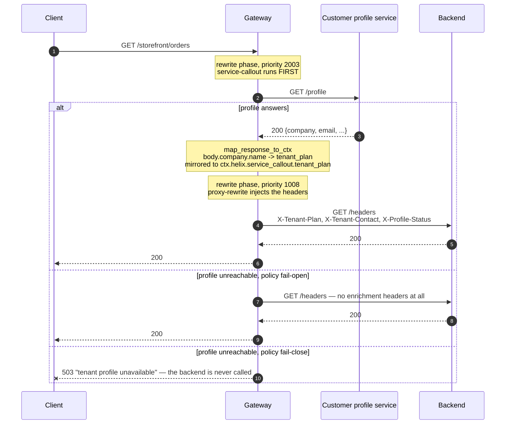

# Architecture — one outbound call, then injection

> [Overview](README.md) · [Business need](business-need.md) · **Architecture** · [Guides](guides.md) · [Agent prompt](helix-agent-prompt.md) · [Tests](tests.md) · [API reference](api-reference.md)

---

## What the gateway does here

For every request on an enriched route, the gateway:

1. makes **one** outbound HTTP call to the customer-profile service, and waits for
   it,
2. copies chosen fields from that answer into the request's context, and
3. sets them as headers on the request it forwards to your backend.

The backend reads a header instead of making the lookup. It never needs to know
the profile service exists.

For the full list of fields on every plugin mentioned here, see
[docs.digitalapi.ai/api-gateway](https://docs.digitalapi.ai/api-gateway).

## How a request flows



## Execution order

| Order | Step | What it produces | What it needs |
|---|---|---|---|
| 1 | `service-callout` (**rewrite** phase, priority 2003) | the profile service's answer, mapped into `ctx.helix.service_callout.<field>` and mirrored into a gateway variable of that exact name | the callout `uri` to be reachable from the gateway |
| 2 | `proxy-rewrite` (**rewrite** phase, priority 1008) | the backend path, and the `X-Tenant-*` headers set from `${ctx.helix.service_callout.<field>}` | step 1's variables, already in place |
| — | backend | the request, carrying the answer | — |
| — | `request-id` (API-wide) | an `X-Request-Id` header | — |

## The two settings that make this work

Both were checked against a running gateway, and both are reasons a configuration
that looks right can do nothing at all.

### 1. `phase: rewrite`, not `access`

A request passes through phases in a fixed order — rewrite, then access — and
priority only orders plugins *within* one phase. `proxy-rewrite` runs in the
**rewrite** phase. A callout set to the **access** phase therefore runs *after* it:
the headers have already been set, with nothing to put in them.

Checked deliberately: an access-phase callout returned **HTTP 200 (OK)** with **no
enrichment headers at the backend**, and no error anywhere. Within the rewrite
phase, `service-callout` (2003) runs before `proxy-rewrite` (1008), which is the
order this needs.

**Phase beats priority.** That one sentence explains most "the plugins are in the
wrong order" confusion on this platform.

### 2. The bridge is a variable named after the namespace

Every field in `map_response_to_ctx` is copied into a gateway variable whose name
is literally `ctx.helix.<ctx_namespace>.<field>` — dots included. It is one name,
not a path to look up. So:

```yaml
service-callout:
  ctx_namespace: service_callout          # the default
  map_response_to_ctx:
    tenant_plan: body.company.name

proxy-rewrite:
  headers:
    set:
      X-Tenant-Plan: "${ctx.helix.service_callout.tenant_plan}"
```

Change `ctx_namespace` and every reference changes with it. A mapped path that
matches nothing gives no value and **no error**, so a typo in `body.company.name`
is invisible until a backend notices the header is missing.

## `set`, never `add`

`headers.set` **replaces** a header the client sent. `headers.add` leaves the
client's value in place alongside the gateway's.

For an enrichment header this is a security property, not a style choice. Checked:
a client sending `X-Tenant-Plan: Enterprise-Unlimited` had it overwritten with the
callout's real value. With `add`, any caller could assert its own plan and the
backend would believe it.

## Failure policy is a decision, per route

| Policy | Behaviour | Fits |
|---|---|---|
| `fail-open` | The request carries on; the enrichment headers are **absent**; the error is recorded in the request's context | A read path where a missing answer is survivable |
| `fail-close` | **HTTP 503 (service unavailable)** with the configured message; the backend is never called | A write path where acting without the answer is worse than failing |
| `log-only` | Log and carry on, without even recording the error in the context | Diagnostics; rarely what you want in production |

The example makes opposite choices on its two routes, on purpose:

| Route | Policy | Why |
|---|---|---|
| `GET /storefront/orders` | `fail-open` | A read without the tenant's plan is survivable. Checked: 200, and the headers absent. |
| `POST /storefront/checkout` | `fail-close` | Taking money without knowing the account's status is worse than failing. Checked: 503 with the configured message, and the backend never called. |

**Under `fail-open` the headers are absent, not empty.** Every backend must decide
explicitly what a missing header means. One that assumes it is always there fails
in a way that looks like a gateway bug. Mapping the callout's own status
(`X-Profile-Status`) lets a backend tell a real answer from a fail-open miss.

## Why headers

The mapped values leave the gateway as request headers. That keeps them to plain
strings, and makes them visible to anything on the path to the backend.

| | Headers | A rewritten request body |
|---|---|---|
| Backend change needed | Read a header | Parse a changed body |
| Works for GET | Yes | No |
| Structured data | Must be flattened | Natural |
| Visible along the way | Yes | Yes, but less obviously |
| Interacts with body transforms | No | Yes, and the ordering is subtle |

Headers are the right default: they work on every method and cost the backend
almost nothing to adopt. Map what the backend needs, not the whole profile.

## Reading the result

| Symptom | Cause |
|---|---|
| 200, and no enrichment headers at all | `phase: access` instead of `rewrite`; or the callout failed under `fail-open` |
| One header missing, the others present | That mapped path didn't match anything. No value, no error |
| The header is there but wrong, or empty | The variable name doesn't match `ctx.helix.<ctx_namespace>.<field>` exactly — usually after `ctx_namespace` was changed |
| A caller's own value reaches the backend | `headers.add` where `headers.set` belongs |
| 503 with the callout's message | `fail-close` doing its job; the profile service can't be reached from the gateway |
| The route got slower by exactly the timeout | The callout is timing out on every request, and the request waits for it |
| A new route isn't enriched | `service-callout` is set per route |

## No custom code needed

Native. Three plugins were considered:

- **`service-callout`** — this solution. Fetches, maps, and leaves the result for
  another plugin to use. The right shape when the answer is *data the backend
  needs*.
- **`forward-auth`** — calls an external service and acts on its verdict, allowing
  or rejecting the request. The right shape when the answer decides whether the
  request goes ahead.
- **`opa`** — policy evaluation against a decision service, for the same kind of
  problem as `forward-auth`, with a richer policy language.

All three make an HTTP call. The difference is what happens to the answer:
`service-callout` stores it; the other two act on it.

## When to use this

Use it when:

- several services make the same lookup before doing their own work,
- the answer depends on the caller or the request, so it can't be fixed
  configuration,
- you want one cache, one timeout and one failure policy instead of many, or
- you're adding services that would otherwise build the lookup first.

Do not use it when:

- **the answer decides whether the request is allowed.** Use `forward-auth` or
  `opa`, which are built to return a verdict.
- **the data is static enough to be configuration.** A call per request to fetch
  something that changes monthly is cost with no benefit.
- **the profile service can't take one call per request.** This consolidates the
  calls; it doesn't remove them.
- **the backend needs the whole profile document.** Headers are the wrong shape;
  let the backend make its own call.
- **latency is already at budget.** The callout adds a network round trip to every
  request on the route.

## What it does not do

- **Decide access.** The answer is stored, never acted on.
- **Remove the dependency.** There is still one call in the request path, and its
  `timeout` is now part of your worst-case latency. The request waits for it
  (`async: true` exists, but then the answer isn't available to the request, which
  defeats the purpose here).
- **Cache by itself.** The plugin has no response cache; every request makes the
  call. `proxy-cache` is a separate consideration.
- **Cover new routes automatically.** It is configured per route.
- **Carry structured data.** Mapped values become string headers.
- **Hide what it injects.** Injected headers are visible downstream; don't map
  anything the backend shouldn't hold.

## Prerequisites

- An org whose build includes `service-callout` and `proxy-rewrite`. Confirm with
  your org's plugin list before you design around them.
- A profile service the **gateway** can reach (the example uses a public sample
  service).
- A backend willing to read the headers and to handle them being absent under
  `fail-open`.
