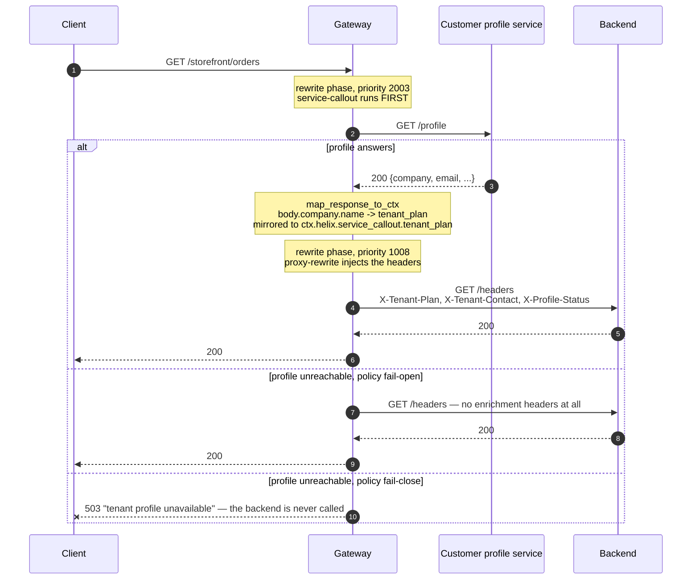

# Solution 11 — the lookup every service re-implements, done once at the edge

**Overview** · [Business need](business-need.md) · [How it works](how-it-works.md) · [Install](install.md) · [Configuration](configuration.md) · [Test & verify](testing.md) · [Changelog](changelog.md)

---

**Three teams cache the same tenant-profile call three different ways, and one of
them is wrong. Make the call once, before the request is proxied, and hand the
answer to the backend as a header.**

<!-- facts:begin -->

| | |
|---|---|
| **Setup time** | ~15 minutes |
| **Difficulty** | Beginner |
| **Needs** | A fresh org (its default test environment). Nothing to fill in — the upstream echoes request headers so you can see what the backend received, and the callout target is a public sample service standing in for your own |
| **Plugins** | `proxy-rewrite` · `request-id` · `service-callout` |
| **Build it with** | **[the Agent](install.md)** — recommended · or import [`gateway/api-spec.yaml`](gateway/api-spec.yaml) |

<!-- facts:end -->

## The problem

> *"Every service we own starts the same way: call the customer-profile service,
> find out what plan this tenant is on and whether the account is in arrears, then
> get on with the actual work. Orders caches it for five minutes. Billing caches it
> for an hour. Notifications doesn't cache it at all and is the reason profile
> gets paged. When profile is slow, all three are slow in three different ways, and
> when we changed the field name last quarter we found the seventh copy of that
> call in a service nobody had touched since 2023."*

The lookup is not hard. Having it in N places is:

1. **N caching strategies**, of which at most one is right.
2. **N failure behaviours** — one retries, one fails open, one fails the request.
3. **N places to change** when the profile service's contract moves.
4. **N × traffic** on the profile service, because nothing is shared.

**Root cause:** a cross-cutting lookup is being treated as application logic. Every
caller needs the same answer, before it does anything else — which is a property of
the *path*, not of any one service.

## Business need

Full version: [`business-need.md`](business-need.md).

| Dimension | The lookup in every service | One callout at the edge |
|---|---|---|
| **Implementations** | One per service, each with its own cache and timeout | One, in configuration |
| **Changing the contract** | Find every copy; coordinate N releases | One place |
| **Failure behaviour** | Whatever each team chose, undocumented | An explicit policy per route |
| **Load on the profile service** | One call per service per request | One call per request |
| **A new service** | Implements the lookup before it starts | Reads a header |

## How a request flows

## Gotchas

- **`phase: access` silently does nothing.** It must be `rewrite`. 200, no headers,
  no error.
- **The variable name is literal**, dots and all:
  `${ctx.helix.<ctx_namespace>.<field>}`. Change `ctx_namespace` and every
  reference changes.
- **A mapped path that matches nothing is not an error.** A typo is invisible until
  a backend notices.
- **`set`, not `add`** — or callers can assert their own values.
- **Under `fail-open` the headers are absent, not empty.** Backends must handle
  that explicitly.
- **The callout is synchronous and its `timeout` is added to your worst case.**
  Choose the number; don't inherit it.
- **Keep `keepalive` on.** Without it every request pays a fresh TCP and TLS
  handshake to the profile service.
- **It is per route, not per API.** A route added later gets no enrichment, and the
  symptom is a missing header rather than an error.
- **This is not an authorization decision.** `service-callout` stores a response; it
  does not act on it. To *reject* based on the answer, use `forward-auth` or `opa`.
- **Anything you inject is visible to the backend and to anything between.** Map
  what the backend needs, not the whole profile.

## When to use it

Use it when:

- Several services make the same lookup before doing their own work.
- The answer depends on the caller or the request, so it cannot be baked into
  configuration.
- You want one cache, one timeout and one failure policy instead of N.
- You are onboarding services that would otherwise implement the lookup first.

Don't use it when:

- **The answer decides whether the request is allowed.** That is `forward-auth` or
  `opa` — plugins designed to return a verdict.
- **The data is static enough to be configuration.** A callout per request to fetch
  something that changes monthly is a cost with no benefit.
- **The profile service cannot absorb the traffic.** This consolidates N calls into
  one, but it is still one call per request.
- **The backend needs the whole profile document.** Headers are the wrong shape for
  that; let the backend make its own call.
- **Latency is already at budget.** A synchronous callout adds a network round trip
  to every request on the route.

## Limitations

- **Synchronous by default**: the request waits, and `timeout` bounds the worst
  case. `async: true` exists and makes the response unavailable to the request.
- **Not an authorization decision.** No verdict is acted on.
- **Per route.** New routes are not enriched until configured.
- **Mapped values are strings**, injected as headers. Structured data has to be
  flattened.
- **A path that does not resolve fails silently** — no value, no error.
- **`fail-open` means absent headers**, which the backend must handle.
- **No per-callout response cache in this plugin.** Every request makes the call;
  `proxy-cache` is a separate consideration.
- **Injected headers are visible downstream.** Do not map anything the backend
  should not hold.

Full list: [`solution.yaml`](solution.yaml) § `limitations`.

## Validation status

**Validated against a gateway — imported, dry-run, deployed, and exercised.**

| Stage | Status | Provenance |
|---|---|---|
| Configuration generated | **YES** | [`gateway/api-spec.yaml`](gateway/api-spec.yaml) |
| Local validation | **PASS** | [`validation/local-validation.yaml`](validation/local-validation.yaml) |
| Gateway dry-run | **PASS** | Non-destructive, against a temporary import. |
| Gateway deployed | **DEPLOYED** | Revision ACTIVE in a test environment. |
| Functional tests | **PASS (5/5)** | Plus all three failure cases reproduced on a temporary lab API. |

Overall: **READY.** The phase-ordering and failure-policy behaviours were
reproduced rather than inferred — see
[`validation/gateway-validation.yaml`](validation/gateway-validation.yaml).

## Related solutions

- **[12 — Key-value map](../12-key-value-map/)** — the other way to get per-request
  data into a route, when the value is key material rather than a service's answer.
- **[08 — API keys](../08-api-key/)** — identify the caller first; this package
  ships unauthenticated so the callout is the only behaviour under test.
- **[10 — Data masking](../10-data-mask/)** — if the profile response contains more
  than the backend should hold, map fewer fields rather than masking later.
