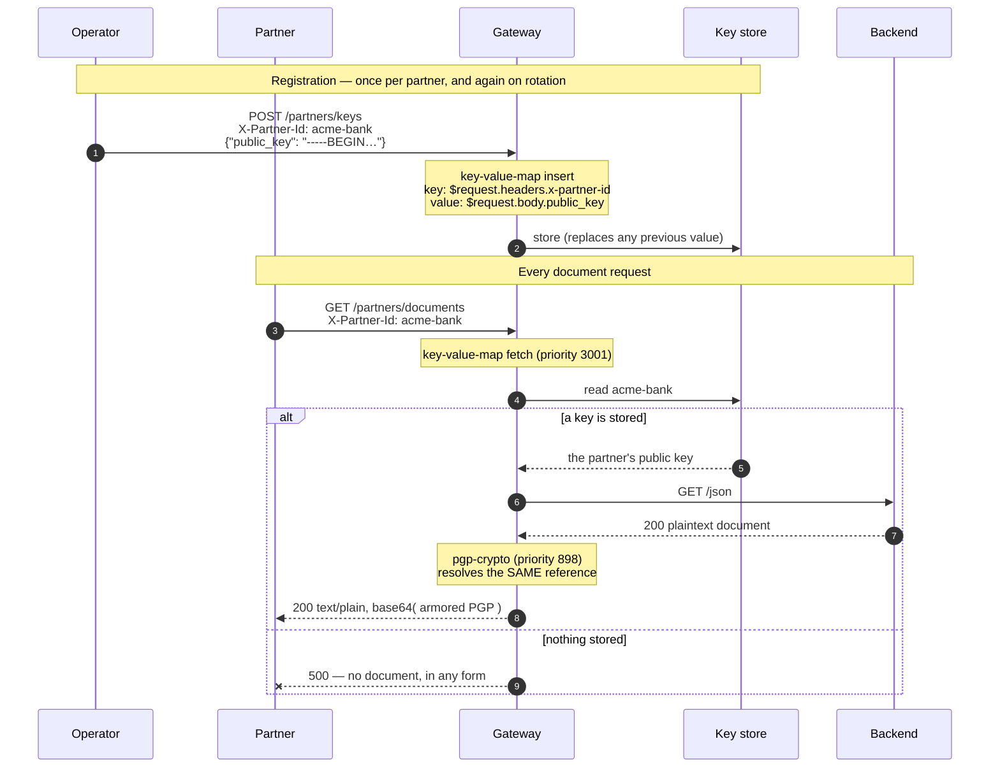

# Solution 12 — one route, fourteen partners, and rotation without a deploy

**Key material in a route is fine until the second counterparty. This fetches the
key per request instead, so adding a partner is a write and rotating one is a
write — neither is a release.**

| | |
|---|---|
| **Setup time** | ~20 minutes |
| **Difficulty** | 🟡 Intermediate — two plugins, and a write path you have to protect |
| **Needs** | A fresh org (its default **test** environment) and an OpenPGP public key to register. **Nothing to fill in** — no key material appears in this spec, which is the point. |
| **Plugins** | `key-value-map` (insert + fetch) · `pgp-crypto` · `proxy-rewrite` · `request-id` |
| **Build it with** | 🤖 **[the Helix Agent](helix-agent-prompt.md)** — recommended · or import [`gateway/api-spec.yaml`](gateway/api-spec.yaml) |
| **Assets** | ✅ [Agent prompt](helix-agent-prompt.md) · ✅ [Architecture](architecture.md) · ✅ [Business need](business-need.md) · ✅ [Spec](gateway/) · ✅ [Tests](tests/) · ✅ [Validation](validation/) · ✅ [Manifest](solution.yaml) |

---

## What this package is about

**The store.** Seeding a per-caller value, resolving it from something on the
request, and replacing it without a deploy. That is the whole subject, and it is
the part that transfers to any value you want to keep out of your configuration.

The crypto is machinery, not the lesson. A stored value has to be *consumed* by
something for you to see it work, and the choice of consumer turns on one
distinction: **observing** a stored value and **using** one are different jobs.

`mocking` can *observe* a stored value — it reads `ctx.helix.key_value_map`
directly, needs no crypto and no Enterprise plan. That is
[solution 14](../14-dynamic-mock/), and it is the shortest way to see the store
work. But `mocking` short-circuits the request, so it can never put a stored value
into a call that reaches your backend.

This package *uses* one, on a real proxied response, and for that the consumer set
is narrower: `pgp-crypto` and `lua-callout` are the only plugins that resolve a KVM
reference themselves. `lua-callout` is **Enterprise-only** — the single plan-gated
plugin of the 96 in the catalogue, refused at import on a free trial with a 403 —
which leaves `pgp-crypto`. If you want to understand the crypto itself, that is
[solution 13](../13-pgp-encryption/) — read it if you need it, skip it if you
don't. Everything below is about the store.

The one difference from 13, in a line: **13 writes the key into the route; this
fetches it per request.**

| | [13 — PGP encryption](../13-pgp-encryption/) | **This one** |
|---|---|---|
| Key location | A literal in the route configuration | An entry in a store, fetched per request |
| Adding a counterparty | A new route, a new key in a document | A write |
| Rotating a key | Edit the route, deploy a revision, hard cutover | A write |
| Key material in git | Possible, and the package warns about it | Nothing to leak — no key is in the spec |
| Complexity | One plugin | Two, plus a registration path you must protect |

Use 13 for one long-lived integration. Come here at the second one — and ideally
before, because migrating N routes later is worse than starting here.

## The problem

> *"We started with one settlement partner, so the key went in the route. We're at
> fourteen now. That's fourteen routes that are identical except for a key, every
> one of those keys is in a configuration document somebody could commit, and when
> a partner rotates — which they do, on their schedule, not ours — it's a change
> request, a review and a deploy. Last month one of them rotated on a Friday
> afternoon and we found out because their file started failing."*

Three costs, and they all scale with the number of counterparties:

1. **N routes that differ by one field**, so any change to the *shape* is N edits.
2. **N keys inside configuration**, each one a thing that can end up in a
   repository.
3. **Rotation is a release**, on the counterparty's timetable rather than yours —
   and on a single route the old and new keys cannot both be live, so it is a hard
   cutover that has to be coordinated.

## How a request flows



## The reference grammar is the whole mechanism

`key-value-map` resolves templates, and `pgp-crypto` resolves the *same* templates
against the namespace it wrote:

```
$request.headers.<name>    $request.query.<name>    $request.body.<dotted.path>
$response.headers.<name>   $response.body.<dotted.path>
$consumer.<suffix>         →  "<consumer_name>.<suffix>"
$ctx.<path>                walks the request context
```

Two things to know before you write one:

- **It is `headers`, plural.** `$request.header.x-partner-id` resolves to nothing,
  silently. The only symptom is the consuming plugin failing — which looks
  identical to "no key registered".
- **The fetch and the consumer must use the same template.** On the read route
  below, `$request.headers.x-partner-id` appears twice: once to decide what to
  fetch, once to decide what to read. They agree because they are the same string.

## Configuration

Source of truth: [`gateway/api-spec.yaml`](gateway/api-spec.yaml).

Registration — the value comes from the **request body**, never from this file:

```yaml
key-value-map:
  fail_action: close
  inserts:
    - key: "$request.headers.x-partner-id"
      value: "$request.body.public_key"
```

Use — fetch, then let the crypto plugin resolve the same reference:

```yaml
key-value-map:
  fail_action: close
  fetch:
    keys:
      - key: "$request.headers.x-partner-id"

pgp-crypto:
  keys_ctx_namespace: key_value_map
  encrypt:
    target: response
    source: body
    public_key: "$request.headers.x-partner-id"
    fail_policy: fail-close
    fail_close_status: 500
```

**A missing entry is not an error to `key-value-map`.** It does not know whether
the value mattered. The failure is raised by the *consuming* plugin — so
`fail_policy` on `pgp-crypto` is the control that decides what an unregistered
partner gets, and `fail-open` there would return the backend's document **in the
clear**. One of the tests asserts the 500 for exactly that reason.

## Four things this does not fix

Stated up front, because two of them are load-bearing.

**There is no control-plane API for these entries on this build.** The only write
path is the plugin's own `inserts`, which is why a registration route exists at
all. That is a real constraint, not a design preference.

**You cannot swap the consumer for an *injecting* one on a free-trial org.**
`lua-callout` — the obvious choice if you wanted to inject a stored value as an
upstream header and skip crypto entirely — is the one plan-gated plugin on this
build. Import returns `403 Plugin 'lua-callout' is available on Enterprise plans
only`. On Enterprise that route opens up and this package's store half is
unchanged; on free trial, `pgp-crypto` is what you have.

This is narrower than it sounds, and the boundary is worth knowing: **reading** a
stored value needs neither. `mocking` resolves `$ctx.helix.key_value_map.<key>`
on any plan — see [solution 14](../14-dynamic-mock/) — it simply short-circuits
the request, so what it cannot do is hand the value to your backend.

**The registration route is administrative, and ships unauthenticated.** Every
package in this library ships with the behaviour under test and nothing else — so
as it stands, anybody who can reach that route can register *their* key under
*any* partner id, and that partner's documents are then encrypted to them. Put
[solution 08](../08-api-key/) in front of it and restrict it to operators before
this exists anywhere real. The test plan carries that as a written case rather
than a warning, because tests get read.

**The partner id comes from a header the caller controls.** As shipped, any caller
can ask for any partner's document — they receive something encrypted to that
partner's key and cannot read it, which is a reason not to panic and *not* a reason
to call it access control. Bind the id to an authenticated identity: `helix-auth`
resolves the calling app, and `$consumer.<suffix>` exists in the grammar precisely
so the key can be keyed on that instead of on a header.

## Build it with the Helix Agent

Full prompt with all the constraints: [`helix-agent-prompt.md`](helix-agent-prompt.md).

**Step 1 — the registration route**

```text
Create a new REST API called "Partner Documents API" with ONE route for now.

Upstream: https://httpbin.org (reuse it if it already exists in this org as an
upstream). Deploy to the "test" environment.

Route: POST /partners/keys -> proxy-rewrite uri /post

On that route add key-value-map. The route object must look exactly like this:

{
  "name": "partners-keys",
  "uri": "/partners/keys",
  "methods": ["POST"],
  "service_id": "<the api id>",
  "plugins": {
    "proxy-rewrite": { "uri": "/post" },
    "key-value-map": {
      "fail_action": "close",
      "inserts": [
        { "key": "$request.headers.x-partner-id", "value": "$request.body.public_key" }
      ]
    }
  }
}

Those $ references are key-value-map templates, not shell variables — leave them
exactly as written. It is "headers" plural; the singular resolves to nothing.

Put request-id in the SERVICE spec so it applies API-wide.

There must be no "x-helix-gateway" key anywhere in a route object: a live route
silently discards that wrapper and deploys with no plugins. Skip validate_route —
use dry_run_deploy. Bind the upstream, run dry_run_deploy, then call get_revision
and show me the stored routeSpec. Wait before deploying.
```

**Step 2 — the document route**

```text
Add a second route, keeping the first exactly as it is:

  GET /partners/documents -> proxy-rewrite uri /json

with two plugins. key-value-map FETCHES the same reference the other route writes,
and pgp-crypto resolves that same reference against what it fetched:

  "key-value-map": {
    "fail_action": "close",
    "fetch": { "keys": [ { "key": "$request.headers.x-partner-id" } ] }
  },
  "pgp-crypto": {
    "keys_ctx_namespace": "key_value_map",
    "encrypt": {
      "target": "response",
      "source": "body",
      "public_key": "$request.headers.x-partner-id",
      "fail_policy": "fail-close",
      "fail_close_status": 500,
      "fail_close_message": "no usable key is registered for this partner"
    }
  }

The crypto config is NESTED under "encrypt" — it is not flat. Send the routeSpec as
a JSON array of both routes, then call get_revision, show me the stored routeSpec,
and run dry_run_deploy.
```

> If a step ends in `stream closed with reason: error`, nothing was written — that
> is a tool-argument defect in the agent, not your prompt. Retry once, then import
> [`gateway/api-spec.yaml`](gateway/api-spec.yaml) for the remaining step.

## Install it directly

```bash
export ORG=<ORG_ID>
export TOKEN=<control-plane bearer token>      # short-lived
export BASE=https://<YOUR_GATEWAY_HOST>/api

# 1. Import gateway/api-spec.yaml. Nothing in it needs filling in — that is the point.
# 2. Bind your backend as the upstream and deploy the revision to "test".
# 3. Put authentication in front of /partners/keys before anyone else can reach it.
# 4. Register a partner's key, then prove it:
GATEWAY=https://<YOUR_GATEWAY_HOST> \
PUBLIC_KEY_FILE=./partner-a-public.asc GNUPGHOME=~/.gnupg-partner-a \
SECOND_PUBLIC_KEY_FILE=./partner-a-rotated.asc SECOND_GNUPGHOME=~/.gnupg-partner-a2 \
./gateway/verify.sh
```

## Testing

Exit 0 means all of these held:

| # | Case | Expected |
|---|---|---|
| 1 | **A partner with no registered key** | `500` — and **no document**, in any form |
| 2 | Registering a key | `200` — **but read it back**; see the gotchas |
| 3 | That partner's document | `200`, base64 of armor |
| 4 | **A different, unregistered partner** | still `500` — entries are per partner |
| 5 | Decrypting with that partner's key | succeeds |
| 6 | **Re-registering, then fetching again** | the **new** key decrypts it; the old one cannot |

**Case 1 is the security case** — a 200 there means the document went out in the
clear. **Case 6 is the whole solution**: rotation with no revision, no route change
and no deploy, asserted rather than claimed.

Cases 1-4 need only bash, curl, base64 and a public key, so they run in a pipeline
that holds no private key material.

## A registered key can be unusable, and the status will not tell you

The sharpest edge in this package, found by running it.

| Partner id | Status | Body |
|---|---|---|
| never registered | **500** | `{"message":"no usable key is registered for this partner"}` |
| registered with a **sign-only** key | **200** | *identical body* |
| registered with a usable key | **200** | base64 PGP |

`fail_close_status` fires only on a store **miss**. When the store returns a value
the crypto cannot use, the failure goes out as a **success**, with the error
message in the body. Neither the status nor the message distinguishes "wrong kind
of key" from "no key".

**This is the ordinary case, not an edge case.** `gpg --quick-generate-key` — what
almost everyone reaches for — produces a primary key with **no encryption
subkey**, and adding `default never` does not change that. A partner following the
obvious path sends you a signing key, and you store it happily.

Check before you register, and put this in the note you send them:

```bash
gpg --list-keys --with-colons "$UID" | awk -F: '/^(pub|sub)/{print $1, $12}'
# want:  pub scESC        e = encrypt, s = sign, c = certify
#        sub e            no `sub e` row means the route cannot encrypt to it
```

Repair an existing key rather than regenerating it:

```bash
FPR=$(gpg --list-keys --with-colons "$UID" | awk -F: '/^fpr/{print $10; exit}')
gpg --quick-add-key "$FPR" rsa3072 encr never
```

Then **re-register** — the stored copy is still the broken one until you overwrite
it.

**For your tests: assert on the body, never on the status.** A check for `200`
passes while the caller receives no document at all.

## Gotchas

- **`headers` is plural.** `$request.header.x` resolves to nothing, silently.
- **The fetch and the consumer must use the same template**, or the crypto plugin
  looks for an entry the fetch never stored.
- **`keys_ctx_namespace` must match `key-value-map`'s `ctx_namespace`.** Both are
  left at the default here so they agree by construction; change one and you must
  change the other.
- **A KVM miss is not an error.** The consuming plugin's `fail_policy` decides what
  happens, and `fail-open` there returns the document in the clear.
- **There is no management API for entries.** The registration route is the write
  path, and it is yours to protect.
- **Do not put a literal key in `inserts`.** That puts key material straight back
  into the configuration document, which is the thing this package exists to avoid.
- **Registration replaces, it does not append.** Which is what makes rotation work —
  and means a bad write destroys the previous value.
- **Storing the wrong key is invisible from the gateway.** Only a round-trip
  decrypt finds it.
- **A registered-but-unusable key returns 200 with the error body.** See the
  section above. Assert on the body.
- **The registration route's status reflects the upstream echo, not the store
  write.** The insert happens in the access phase, before proxying — a 502 from the
  echo backend can accompany a successful write. Read the value back to confirm it.
- **Everything in [solution 13's](../13-pgp-encryption/) gotcha list still
  applies** — the wire format especially.

## When to use it

Use it when:

- You have more than one counterparty, or expect to.
- Key material must not live in configuration documents.
- Counterparties rotate on their own schedule and you do not want a release each
  time.
- Per-caller values other than keys need the same treatment — the store is generic;
  crypto keys are simply the case where getting it wrong is most expensive.

Don't use it when:

- **You have exactly one long-lived counterparty.** [Solution 13](../13-pgp-encryption/)
  is one plugin instead of two and there is less to protect.
- **The value is static configuration.** A per-request lookup of something that
  changes yearly is cost without benefit.
- **You cannot protect the registration path.** An unauthenticated write to your key
  store is worse than a key in a configuration document.
- **You need the answer from another service rather than a store** —
  [solution 11](../11-service-callout/).

## Limitations

- **No control-plane API for entries.** The plugin's `inserts` is the only write
  path on this build.
- **The registration route is administrative and ships unauthenticated.**
- **The partner id comes from a caller-controlled header** unless you bind it to an
  authenticated identity.
- **A miss is silent** at the store; the consumer decides what it means.
- **Registration replaces the entry**, so a bad write destroys the previous value
  and there is no history.
- **No versioning and no staged rollout** — the new key is live on the next request.
- **Storing the wrong key is undetectable** without a round-trip decrypt.
- **`$request.body.<path>` requires a JSON body** and reads it at request time.
- **A registered-but-unusable key returns 200 carrying the fail-close error body.**
  The configured `fail_close_status` applies only to a store miss, so status-only
  assertions pass while no document is returned.
- **The registration route's status reflects the upstream echo, not the store
  write**, so neither a 2xx nor a 5xx there is evidence about the value.
- **The *injecting* consumer cannot be swapped on a free-trial org.** `lua-callout`
  is the one plan-gated plugin on this build, which leaves `pgp-crypto` as the only
  way to put a stored value into a proxied call. Reading one back is unrestricted —
  `mocking` does it on any plan ([solution 14](../14-dynamic-mock/)).
- **Entries are stored encrypted at rest and scoped per environment**, which says
  nothing about how the value reached the gateway.
- **Everything in [solution 13's](../13-pgp-encryption/) limitations still applies.**

Full list: [`solution.yaml`](solution.yaml) § `limitations`.

## Validation status

**Validated against a gateway — imported, dry-run, deployed, and exercised.**

| Stage | Status | Provenance |
|---|---|---|
| Configuration generated | **YES** | [`gateway/api-spec.yaml`](gateway/api-spec.yaml) |
| Local validation | **PASS** | [`validation/local-validation.yaml`](validation/local-validation.yaml) |
| Gateway dry-run | **PASS** | Non-destructive, against a temporary import. |
| Gateway deployed | **DEPLOYED** | Revision ACTIVE in a test environment. |
| Functional tests | **PASS (7/7)** | Including rotation: re-registering changed which key the document was encrypted to, with no deploy, and the old key could no longer read it. |

Overall: **READY.** The store, the reference grammar and the rotation claim were
all exercised against a live gateway —
[`validation/gateway-validation.yaml`](validation/gateway-validation.yaml).

## Related solutions

- **[13 — PGP encryption](../13-pgp-encryption/)** — the same crypto with the key
  written into the route. Go there if you want the crypto itself, or if you have
  exactly one counterparty.
- **[11 — Service callout](../11-service-callout/)** — when the per-request value
  comes from another service rather than a store.
- **[08 — API keys](../08-api-key/)** — what belongs in front of the registration
  route, and how to key entries on an authenticated identity instead of a header.
