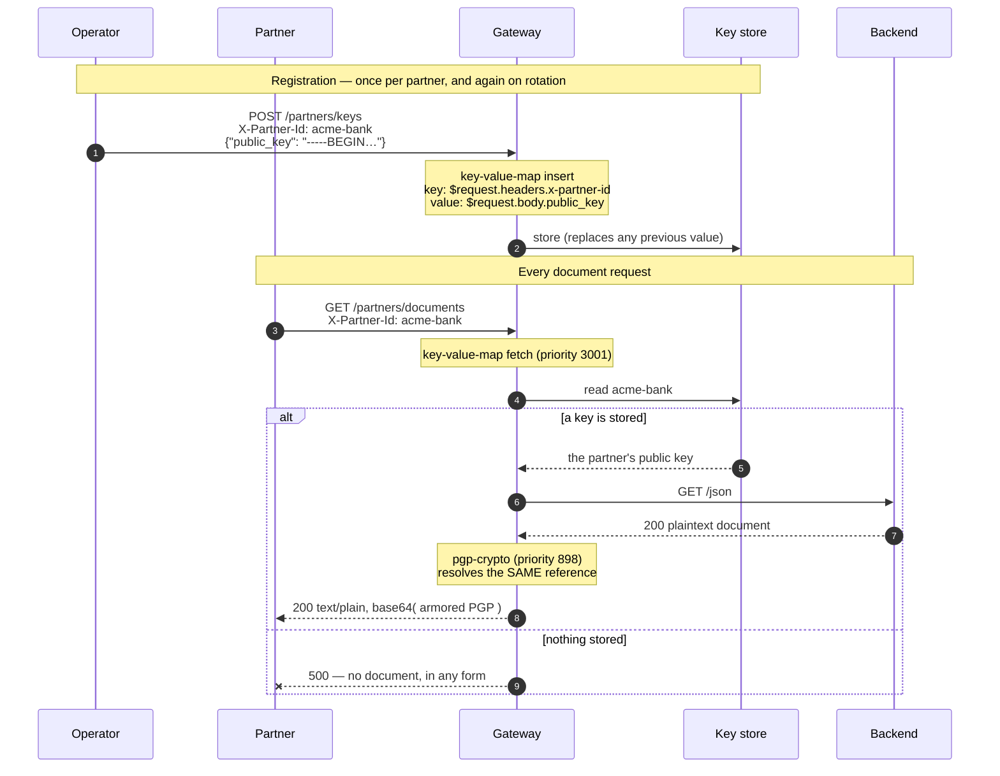

# Architecture — key material as data, not configuration

> [Overview](README.md) · [Business need](business-need.md) · **Architecture** · [Guides](guides.md) · [Agent prompt](helix-agent-prompt.md) · [Tests](tests.md) · [API reference](api-reference.md)

---

## What the gateway does here

The gateway keeps a small store of values, one per partner, and reads the right one
on every request. In this package the value is the partner's public encryption
key, and the gateway uses it to encrypt the backend's response to that partner.

There are two routes:

1. **A registration route** (`POST /partners/keys`). An operator sends a partner id
   and a public key. The gateway stores the key under that id.
2. **A document route** (`GET /partners/documents`). A partner asks for a document.
   The gateway looks up the key stored under the partner's id and encrypts the
   backend's response to it.

Your backend does not change. It returns plain documents, as it always has.

For the full list of fields on every plugin mentioned here, see
[docs.digitalapi.ai/api-gateway](https://docs.digitalapi.ai/api-gateway).

## The model

| Word | What it means here |
|---|---|
| **Partner id** | The value in the `X-Partner-Id` header. It decides which entry is written or read. |
| **Entry** | One stored value, under one key. Here: one partner's armored public key. |
| **Reference** | A template such as `$request.headers.x-partner-id` that the gateway fills in from the request at the moment it runs. |
| **Namespace** | Where fetched values are kept for the rest of the request: `ctx.helix.key_value_map` by default. |

## How a request flows



**The two plugins agree because they use the identical reference.** On the
document route, `$request.headers.x-partner-id` appears twice: once to tell
`key-value-map` which entry to fetch, and once to tell `pgp-crypto` which entry to
read. That shared string is the whole connection between them, and it is also the
thing that breaks with no error if one copy is edited.

## The reference grammar

References are filled in from the request (or response) at run time:

| Reference | Resolves to |
|---|---|
| `$request.headers.<name>` | the value of that request header |
| `$request.query.<name>` | the value of that query parameter |
| `$request.body.<dotted.path>` | a value from the JSON request body |
| `$response.headers.<name>` · `$response.body.<path>` | the same, on the response |
| `$consumer.<suffix>` | `"<consumer_name>.<suffix>"` — the authenticated caller |
| `$ctx.<path>` | a walk of the request context itself |

**It is `headers`, plural.** `$request.header.x-partner-id` resolves to nothing,
with no error. The only symptom is the encryption failing, which looks exactly like
"no key registered".

`$consumer.<suffix>` is the one to use once authentication is in front of this. It
keys entries on the authenticated caller rather than on a header the caller
chooses. See [Guides → Variations](guides.md#variations).

## Where stored values land

When `key-value-map` runs, it publishes values into the namespace for later
plugins to read:

```
fetched   ->  ctx.helix.<ctx_namespace>.<key>            flat
inserted  ->  ctx.helix.<ctx_namespace>.inserted.<key>   one level down
```

`alias` on a fetched key renames the published field, which is how a value fetched
under a changing key (a partner id) gets a fixed name a template can refer to.
[Solution 14](../14-dynamic-mock/) relies on that; this package does not need it,
because `pgp-crypto` resolves the same reference itself.

## Reading a response

| Request | Status | Body | What it means |
|---|---|---|---|
| Document, partner never registered | **500** | `{"message":"no usable key is registered for this partner"}` | No entry. Nothing is sent in the clear. |
| Document, partner registered with a key that has **no encryption subkey** | **200** | *the same error body* | The key is stored but cannot encrypt. See below. |
| Document, partner registered with a usable key | **200** | base64 of an armored PGP message, `text/plain` | Working as designed. |
| Registration | **200** | the upstream's echo of what was posted | Not proof the value was stored. See below. |
| Registration | **503** | — | The store could not be written. `fail_action: close` means nothing was saved. |

**A registered key can be unusable, and the status will not tell you.** The
configured error status (500) is used only when the store has **no** entry. When
the store returns a key the encryption cannot use, the failure goes out as a 200
with the error message in the body. This is the ordinary case, not a rare one:
`gpg --quick-generate-key`, the command most people reach for, makes a key with no
encryption subkey. So **in your own checks, look at the body, never only the
status.** How to check and repair a key: [Guides → See it work](guides.md#see-it-work).

**A registration's status belongs to the upstream, not the store.** The value is
written before the request is passed on, so a 2xx does not prove it landed and a
5xx does not prove it failed. Read the value back by fetching a document.

## Execution order

Plugins run in **priority order**, not the order they appear in the file:

| Order | Plugin | Route | What it does |
|---|---|---|---|
| 1 | `key-value-map` (3001) | both | Registration: writes the key from the request body. Document: fetches the partner's key into the namespace. |
| 2 | `pgp-crypto` (898) | document | Resolves the same reference against the namespace and encrypts the response to that key. |
| — | `proxy-rewrite` | both | Rewrites the path to the backend's (`/post`, `/json`). |
| — | `request-id` | API-wide | Adds `X-Request-Id`, the handle for a disputed failure, since crypto errors are deliberately vague. |

## Where a missing value is decided

`key-value-map` treats a miss as an ordinary outcome: it cannot know whether the
caller needed that value. Its `fail_action` covers failures of the **store** (it
could not be reached, or a write failed), not a missing key.

So "what does an unregistered partner get?" is answered by the **consuming**
plugin, `pgp-crypto`, through its `fail_policy`. It must be `fail-close`.
`fail-open` would return the backend's document **unencrypted** to a caller who
was meant to receive ciphertext. One of the automated tests checks the error status
for exactly that reason.

## Which plugins can use a stored value

Seeing a stored value and using it on a real request are different jobs.

- **To see one**, `mocking` reads `ctx.helix.key_value_map` directly, on any plan,
  with no encryption. That is [solution 14](../14-dynamic-mock/). But `mocking`
  answers the request itself, so it can never pass a stored value on to your
  backend.
- **To use one on a proxied call**, the consumers are `pgp-crypto` and
  `lua-callout`. `lua-callout` is refused at import **on a free-trial
  organisation**, which is why this package uses `pgp-crypto` and runs anywhere.
  On an organisation that is not on a free trial, `lua-callout` imports and deploys
  and becomes a second option. Test the import rather than the catalogue flag,
  which does not change between plans.

## No custom code needed

| | Key in the route ([13](../13-pgp-encryption/)) | Key in the store (this) |
|---|---|---|
| Plugins | One | Two |
| Partners per route | One | Many |
| Rotation | Edit, review, deploy, hard cutover | A write |
| Key material in the document | Yes | No |
| Write path to protect | None | One, and it is administrative |
| Ways it can fail | Encryption only | Encryption, plus a reference that silently resolves to nothing |

A third option, calling an external secret manager on every request, is
[solution 11](../11-service-callout/)'s shape. It swaps a store for a network call
in the request path.

## When to use this

Use this solution when:

- you have more than one partner, or expect to,
- key material must not live in configuration documents,
- partners rotate keys on their own schedule and you do not want a release each
  time, or
- you need the same treatment for other per-caller values. The store is generic;
  keys are simply the case where a mistake costs most.

Do not use it when:

- **you have exactly one long-lived partner.** [Solution 13](../13-pgp-encryption/)
  is one plugin instead of two, with nothing extra to protect.
- **the value is static configuration.** A per-request lookup of something that
  changes yearly is cost without benefit.
- **you cannot protect the registration route.** An open write path to your key
  store is worse than a key in a configuration document.
- **the answer belongs to another service** rather than a store —
  [solution 11](../11-service-callout/).

## Prerequisites

- An environment where the gateway's key-value store is available.
- An upstream bound to the revision. The spec uses the public `httpbin.org`, whose
  `/post` echoes what it receives.
- An armored OpenPGP public key **with an encryption subkey** to register.
- Before real use: authentication on the registration route
  ([solution 08](../08-api-key/)).

## What this does not do

- **There is no control-plane API for these entries** on this build. The plugin's
  own `inserts` is the only write path, which is why a registration route exists.
- **The registration route ships unauthenticated.** Anybody who can reach it can
  register *their* key under *any* partner id, and that partner's documents are
  then encrypted to them. Protect it before this exists anywhere real.
- **It is not access control.** The partner id comes from a header the caller
  controls, so any caller can ask for any partner's document. They receive
  something encrypted to that partner's key and cannot read it, but that is not
  the same as being refused. Bind the id to an authenticated identity.
- **It does not keep history.** Registration replaces the entry, so a bad write
  destroys the previous value, and a new key is live on the next request.
- **It does not check what you store.** A wrong key is accepted and only found when
  a partner cannot read a document.
- **`$request.body.<path>` needs a JSON body**, read at request time.
- **Entries are encrypted at rest and scoped per environment.** That protects the
  store; it says nothing about how a value reached the gateway.
- **Everything about the encryption itself** — the wire format, the vague errors,
  the body-size limit — is the same as in [solution 13](../13-pgp-encryption/).
