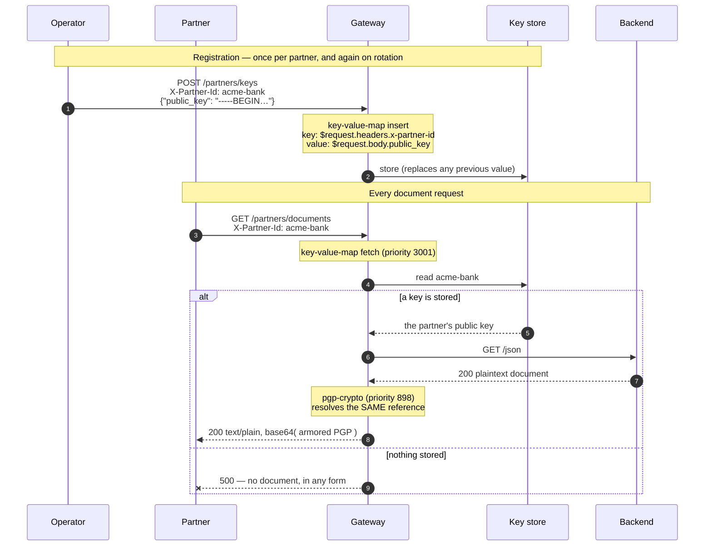

# Solution 12 — one route, fourteen partners, and rotation without a deploy

**Overview** · [Business need](business-need.md) · [How it works](how-it-works.md) · [Install](install.md) · [Configuration](configuration.md) · [Test & verify](testing.md) · [Changelog](changelog.md)

---

**Key material in a route is fine until the second counterparty. This fetches the
key per request instead, so adding a partner is a write and rotating one is a
write — neither is a release.**

<!-- facts:begin -->

| | |
|---|---|
| **Setup time** | ~20 minutes |
| **Difficulty** | Intermediate |
| **Needs** | A fresh org (its default test environment) and an OpenPGP public key to register. Nothing to fill in — no key material appears in this spec, which is the point |
| **Plugins** | `key-value-map` · `pgp-crypto` · `proxy-rewrite` · `request-id` |
| **Build it with** | **[the Agent](install.md)** — recommended · or import [`gateway/api-spec.yaml`](gateway/api-spec.yaml) |

<!-- facts:end -->

## Four things this does not fix

Stated up front, because two of them are load-bearing.

**There is no control-plane API for these entries on this build.** The only write
path is the plugin's own `inserts`, which is why a registration route exists at
all. That is a real constraint, not a design preference.

**On a free-trial organisation you cannot swap the consumer for an *injecting*
one.** `lua-callout` — the obvious choice if you wanted to inject a stored value
as an upstream header and skip crypto entirely — is the one gated plugin on this
build, and import returns `403 Plugin 'lua-callout' is available on Enterprise
plans only ... cannot be attached on a free trial organization`. Off free trial
it imports and deploys, and the store half of this package is unchanged either
way. If you try it, note its priority is **0**: put it on a route with a
short-circuiting plugin such as `mocking` (1999) and it never runs, returning an
empty value with no error. Raise it with `_meta.priority`.

This is narrower than it sounds, and the boundary is worth knowing: **reading** a
stored value needs neither. `mocking` resolves `$ctx.helix.key_value_map.<key>`
on any plan — see [solution 14](../14-dynamic-mock/) — it simply short-circuits
the request, so what it cannot do is hand the value to your backend.

**The registration route is administrative, and ships unauthenticated.** Every
package in this library ships with the behaviour under test and nothing else — so
as it stands, anybody who can reach that route can register *their* key under
*any* partner id, and that partner's documents are then encrypted to them. Put
[solution 08](../08-api-key/) in front of it and restrict it to operators before
this exists anywhere real. The test plan carries that as a written case rather
than a warning, because tests get read.

**The partner id comes from a header the caller controls.** As shipped, any caller
can ask for any partner's document — they receive something encrypted to that
partner's key and cannot read it, which is a reason not to panic and *not* a reason
to call it access control. Bind the id to an authenticated identity: `helix-auth`
resolves the calling app, and `$consumer.<suffix>` exists in the grammar precisely
so the key can be keyed on that instead of on a header.

## The problem

> *"We started with one settlement partner, so the key went in the route. We're at
> fourteen now. That's fourteen routes that are identical except for a key, every
> one of those keys is in a configuration document somebody could commit, and when
> a partner rotates — which they do, on their schedule, not ours — it's a change
> request, a review and a deploy. Last month one of them rotated on a Friday
> afternoon and we found out because their file started failing."*

Three costs, and they all scale with the number of counterparties:

1. **N routes that differ by one field**, so any change to the *shape* is N edits.
2. **N keys inside configuration**, each one a thing that can end up in a
   repository.
3. **Rotation is a release**, on the counterparty's timetable rather than yours —
   and on a single route the old and new keys cannot both be live, so it is a hard
   cutover that has to be coordinated.

## How a request flows

## Gotchas

- **`headers` is plural.** `$request.header.x` resolves to nothing, silently.
- **The fetch and the consumer must use the same template**, or the crypto plugin
  looks for an entry the fetch never stored.
- **`keys_ctx_namespace` must match `key-value-map`'s `ctx_namespace`.** Both are
  left at the default here so they agree by construction; change one and you must
  change the other.
- **A KVM miss is not an error.** The consuming plugin's `fail_policy` decides what
  happens, and `fail-open` there returns the document in the clear.
- **There is no management API for entries.** The registration route is the write
  path, and it is yours to protect.
- **Do not put a literal key in `inserts`.** That puts key material straight back
  into the configuration document, which is the thing this package exists to avoid.
- **Registration replaces, it does not append.** Which is what makes rotation work —
  and means a bad write destroys the previous value.
- **Storing the wrong key is invisible from the gateway.** Only a round-trip
  decrypt finds it.
- **A registered-but-unusable key returns 200 with the error body.** See the
  section above. Assert on the body.
- **The registration route's status reflects the upstream echo, not the store
  write.** The insert happens in the access phase, before proxying — a 502 from the
  echo backend can accompany a successful write. Read the value back to confirm it.
- **Everything in [solution 13's](../13-pgp-encryption/) gotcha list still
  applies** — the wire format especially.

## When to use it

Use it when:

- You have more than one counterparty, or expect to.
- Key material must not live in configuration documents.
- Counterparties rotate on their own schedule and you do not want a release each
  time.
- Per-caller values other than keys need the same treatment — the store is generic;
  crypto keys are simply the case where getting it wrong is most expensive.

Don't use it when:

- **You have exactly one long-lived counterparty.** [Solution 13](../13-pgp-encryption/)
  is one plugin instead of two and there is less to protect.
- **The value is static configuration.** A per-request lookup of something that
  changes yearly is cost without benefit.
- **You cannot protect the registration path.** An unauthenticated write to your key
  store is worse than a key in a configuration document.
- **You need the answer from another service rather than a store** —
  [solution 11](../11-service-callout/).

## Limitations

- **No control-plane API for entries.** The plugin's `inserts` is the only write
  path on this build.
- **The registration route is administrative and ships unauthenticated.**
- **The partner id comes from a caller-controlled header** unless you bind it to an
  authenticated identity.
- **A miss is silent** at the store; the consumer decides what it means.
- **Registration replaces the entry**, so a bad write destroys the previous value
  and there is no history.
- **No versioning and no staged rollout** — the new key is live on the next request.
- **Storing the wrong key is undetectable** without a round-trip decrypt.
- **`$request.body.<path>` requires a JSON body** and reads it at request time.
- **A registered-but-unusable key returns 200 carrying the fail-close error body.**
  The configured `fail_close_status` applies only to a store miss, so status-only
  assertions pass while no document is returned.
- **The registration route's status reflects the upstream echo, not the store
  write**, so neither a 2xx nor a 5xx there is evidence about the value.
- **The *injecting* consumer cannot be swapped on a free-trial org.** `lua-callout`
  is the one plan-gated plugin on this build, which leaves `pgp-crypto` as the only
  way to put a stored value into a proxied call. Reading one back is unrestricted —
  `mocking` does it on any plan ([solution 14](../14-dynamic-mock/)).
- **Entries are stored encrypted at rest and scoped per environment**, which says
  nothing about how the value reached the gateway.
- **Everything in [solution 13's](../13-pgp-encryption/) limitations still applies.**

Full list: [`solution.yaml`](solution.yaml) § `limitations`.

## Validation status

**Validated against a gateway — imported, dry-run, deployed, and exercised.**

| Stage | Status | Provenance |
|---|---|---|
| Configuration generated | **YES** | [`gateway/api-spec.yaml`](gateway/api-spec.yaml) |
| Local validation | **PASS** | [`validation/local-validation.yaml`](validation/local-validation.yaml) |
| Gateway dry-run | **PASS** | Non-destructive, against a temporary import. |
| Gateway deployed | **DEPLOYED** | Revision ACTIVE in a test environment. |
| Functional tests | **PASS (7/7)** | Including rotation: re-registering changed which key the document was encrypted to, with no deploy, and the old key could no longer read it. |

Overall: **READY.** The store, the reference grammar and the rotation claim were
all exercised against a live gateway —
[`validation/gateway-validation.yaml`](validation/gateway-validation.yaml).

## Related solutions

- **[13 — PGP encryption](../13-pgp-encryption/)** — the same crypto with the key
  written into the route. Go there if you want the crypto itself, or if you have
  exactly one counterparty.
- **[11 — Service callout](../11-service-callout/)** — when the per-request value
  comes from another service rather than a store.
- **[08 — API keys](../08-api-key/)** — what belongs in front of the registration
  route, and how to key entries on an authenticated identity instead of a header.
