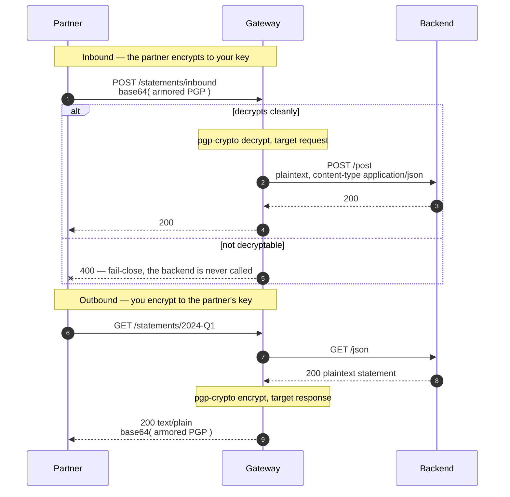

# Solution 13 — PGP at the edge, so the keyring script can go

**The partner will only accept encrypted payloads and only sends encrypted ones
back. Today that is a Python script with a keyring on a VM, and it is the thing
that breaks at 2am.**

| | |
|---|---|
| **Setup time** | ~20 minutes |
| **Difficulty** | 🟡 Intermediate — you supply a key pair |
| **Needs** | A fresh org (its default **test** environment) · an OpenPGP key pair. The upstream echoes requests, so the decrypted plaintext is visible without a backend of your own. |
| **Plugins** | `pgp-crypto` (encrypt + decrypt) · `proxy-rewrite` · `request-id` |
| **Build it with** | 🤖 **[the Helix Agent](helix-agent-prompt.md)** — recommended · or import [`gateway/api-spec.yaml`](gateway/api-spec.yaml) |
| **Assets** | ✅ [Agent prompt](helix-agent-prompt.md) · ✅ [Architecture](architecture.md) · ✅ [Business need](business-need.md) · ✅ [Spec](gateway/) · ✅ [Tests](tests/) · ✅ [Validation](validation/) · ✅ [Manifest](solution.yaml) |

---

## The problem

> *"Our settlement partner is a bank. They will only accept PGP-encrypted
> instruction files, and everything they send us comes back encrypted. So between
> their endpoint and our service there is a Python script on a VM with a keyring on
> it, written by someone who left in 2022. It decrypts, forwards, re-encrypts. It
> is not in our deployment pipeline, it is not in our monitoring, and it is the
> thing that pages us at two in the morning on the last working day of the month."*

The crypto is not the problem. Nobody is arguing about OpenPGP. The problem is
*where* it lives:

1. **It is a service nobody owns.** It exists because two systems could not talk,
   not because anyone decided to build it.
2. **It holds the keys.** A VM with a keyring is the most sensitive asset in the
   integration and usually the least governed one.
3. **It is not in any of your controls.** No pipeline, no dashboard, no runbook —
   and the month-end batch is when you find that out.

**Root cause:** a wire-format concern is being solved by an application. Nothing
about decrypting a payload needs to know what the payload means, so nothing about
it needs to live in something that does.

## Business need

Full version: [`business-need.md`](business-need.md).

| Dimension | A keyring script on a VM | Crypto at the edge |
|---|---|---|
| **Who owns it** | Nobody — it was a workaround | The platform team, with everything else on the path |
| **Where the keys live** | On a VM, in a home directory | In the gateway's configuration, encrypted at rest by the control plane |
| **In the deployment pipeline** | No | Yes — it is a revision |
| **In monitoring** | No | Yes — the same telemetry as every other route |
| **Backend change to adopt** | — | None. The backend handles plaintext, as it always did |
| **What breaks at 2am** | A VM nobody has logged into for a year | The same thing that would break for any route |

## How a request flows



The backend never handles ciphertext. The partner never handles plaintext. Neither
side changes.

## Which key goes where — the two sides of the exchange

The two directions are not a round trip, and the single most common way to
misconfigure this is to treat them as one. **Encryption is always *to the
recipient***, so each direction uses a different key — and in a real integration,
a different key *pair*, held by a different party.

| | Your side — this package | Their side |
|---|---|---|
| **Sending** them a statement | `encrypt.public_key` = **their** public key | they decrypt with their private key |
| **Receiving** their instruction | `decrypt.private_key` = **your** private key | they encrypt to your public key |

Four key halves across two parties. You generate one pair and publish its public
half to them; they generate one and publish theirs to you. **You never hold their
private half, and they never hold yours** — which is the whole point of the
scheme, and why the two placeholders in the spec are not a pair:

```yaml
decrypt:
  private_key: "<PGP_PRIVATE_KEY>"   # YOURS.   They encrypt to its public half.
encrypt:
  public_key:  "<PGP_PUBLIC_KEY>"    # THEIRS.  You never see its private half.
```

If your counterparty's integration guide reads like the mirror image of yours,
you have it right.

### What their side looks like

This is the part most write-ups leave out, and it splits by whether your
counterparty runs a gateway too.

**If they do**, their spec is this one with the keys swapped and the directions
reversed — their outbound is your inbound:

```yaml
# THEIR gateway, mirroring yours
decrypt:                                 # they receive what you sent
  target: request
  private_key: "<THEIR_PRIVATE_KEY>"     # the pair whose public half you hold
encrypt:                                 # they send to you
  target: response
  public_key: "<YOUR_PUBLIC_KEY>"        # the public half of your decrypt key
```

**If they don't** — which is the common case, and usually means a scheduled job
with `gpg` on it — then "their config" is two commands and one file from you:

```bash
# once: import the public key YOU published to them
gpg --import your-org-public.asc

# sending you an instruction — encrypt to YOUR key, then base64 the armor
gpg --armor --encrypt -r ops@your-org.example -o msg.asc instruction.json
base64 -i msg.asc | tr -d '\n' > msg.b64        # the wire format, see below

# reading a statement you sent them — decrypt with THEIR private key
curl -s "$GW/statements/2024-Q1" | base64 -d | gpg --decrypt
```

Note the asymmetry that catches people: they encrypt with **your** public key and
decrypt with **their** private key, in the same integration, minutes apart. The
key they reach for depends on the direction, not on who they are.

### The note to send them

Copy this, fill in the two blanks, and it is a complete integration brief:

> **Endpoint** `POST <your host>/statements/inbound`
>
> **Encrypt to:** the public key attached (`ops@your-org.example`). Send us your
> own public key and we will encrypt statements to it.
>
> **Wire format:** base64 **of** the ASCII-armored message — not the armor. Armor
> is already a text encoding; we need another layer on top. `gpg --armor --encrypt`
> then `base64` the result. **A raw armored body is rejected with 400**, and the
> error does not mention base64.
>
> **Key requirements:** your key must carry an **encryption subkey**. Check with
> `gpg --list-keys --with-colons <uid> | awk -F: '/^(pub|sub)/{print $1, $12}'` —
> you need a `sub` row containing `e`. `gpg --quick-generate-key` does **not**
> produce one; use `gpg --quick-add-key <fpr> rsa3072 encr never` to add it.
>
> **On failure** you will get a 400 with a generic message — the reason is in our
> logs, not your response. Quote the `X-Request-Id` header and we will look.

### What happens if you fill both from one pair

You get a loop — and it is genuinely useful, as long as you know what it is not.

With one pair in both fields, the outbound route encrypts to a key the inbound
route can decrypt, so the GET's own output feeds straight into the POST:

```bash
# encrypt direction — the gateway encrypts the backend's statement
curl -s "$GW/statements/2024-Q1" > out.b64

# decrypt direction — the gateway decrypts it again
curl -s -X POST "$GW/statements/inbound" \
  -H 'content-type: text/plain' --data-binary @out.b64
```

Two calls, no `gpg`, nothing to import, and it exercises both plugin directions.
The echoed `Content-Type: application/json` on the POST is the tell that
decryption actually happened rather than the body passing through.

Two things it cannot do, both worth knowing before you rely on it:

- **It cannot catch a key mismatch.** With one pair the two fields can never
  disagree, so the loop passes by construction. To exercise that path, put a
  different public key in the encrypt block: the GET still returns a well-formed
  200 and the POST then fails closed with 400. That is the failure mode that is
  invisible from the gateway's side in a real two-party setup.
- **It is not how production behaves.** Piping a statement you sent into your own
  inbound route is a single-party demo. In a real integration that POST would be
  rejected, because the statement was encrypted to *their* key and your inbound
  route holds *yours*.

## The wire format will cost you an afternoon

**Both directions use base64 of the ASCII-armored message — not the armor
itself.**

```
encrypt (response) : body becomes base64("-----BEGIN PGP MESSAGE-----…"), content-type text/plain
decrypt (request)  : body must ARRIVE base64-encoded
```

Every PGP tool on earth emits armor. Your counterparty will send armor. Verified
against a gateway: a raw armored body was **rejected**; the same message
base64-encoded decrypted cleanly and the plaintext reached the backend with
`content-type: application/json` — which the plugin sets.

The rejection message says nothing about base64, so put the extra step in the
integration guide you hand the partner, in bold, with an example. The test suite
asserts the rejection precisely so this stays documented.

## Two more behaviours worth knowing before you design around them

**`field` on an encrypt block selects what is *returned*, not just what is
encrypted.** Verified: encrypting with `field: slideshow.author` returned **only
the ciphertext of that value** as the entire response body — not the document with
one field replaced. If you want the surrounding document intact, encrypt the whole
body and let the partner decrypt the lot.

**Errors are generic on purpose.** The caller sees `failed to encrypt response` or
your `fail_close_message`, and nothing else. Unparseable key, wrong recipient, body
too large — all one message. That is correct (an error that describes your key
material is an error that helps an attacker) and it means a partner cannot
self-diagnose. Give them `X-Request-Id` and a support path.

## Configuration

Source of truth: [`gateway/api-spec.yaml`](gateway/api-spec.yaml).

Inbound:

```yaml
pgp-crypto:
  decrypt:
    target: request
    source: body
    private_key: "<PGP_PRIVATE_KEY>"
    fail_policy: fail-close
    fail_close_status: 400
```

Outbound:

```yaml
pgp-crypto:
  encrypt:
    target: response
    source: body
    public_key: "<PGP_PUBLIC_KEY>"
    fail_policy: fail-close
    fail_close_status: 500
```

**`fail-close` on both, and the reasons differ.** Inbound, forwarding a body the
gateway could not decrypt gives the backend ciphertext it cannot read — or, with
`fail-open`, whatever arrived. Outbound, the failure mode of `fail-open` is
**returning the statement in the clear**, which is the incident this whole
solution exists to prevent. One of the tests asserts that no readable plaintext
survives in the response, and that is the test that catches someone switching the
policy "so it stops breaking".

### The key material is a literal, and that is the catch

> **⚠️ `private_key` and `public_key` are used verbatim.** The gateway does not
> resolve `<ENV:...>` or `${...}`. Replace the placeholders with real armored
> blocks before deploying, and keep the filled-in spec out of version control. The
> control plane stores these fields encrypted once supplied, but they still travel
> in the document you import and still sit in the revision you can read back.

This is the same class of footgun as `signing_secret` in
[solution 02](../02-oauth-jwt/), and worse: a private key outlives a signing
secret and is usually shared with a counterparty.

**If you have more than one counterparty, do not copy this route N times with N
key pairs.** Fourteen partners becomes fourteen routes, fourteen keys in the
document, and a deploy every time one of them rotates. Fetch the key per request
instead — [solution 12](../12-key-value-map/) does exactly that and keeps key
material out of the spec entirely.

## Build it with the Helix Agent

Three steps, and expect to retry one. Full prompt with the reasoning, tweak knobs
and failure modes: [`helix-agent-prompt.md`](helix-agent-prompt.md).

> **Don't paste key material into the agent** — the prompts ask for placeholders,
> and you put the real armored blocks in yourself. And any route write has a real
> chance of ending in `stream closed with reason: error`, a tool-argument defect in
> the agent rather than anything about your prompt; nothing is written when it
> happens. Retry once, then import [`gateway/api-spec.yaml`](gateway/api-spec.yaml).

**Step 1 — the API and the inbound (decrypt) route**

```text
Create a REST API "Statements API" with ONE route for now. Upstream
https://httpbin.org — reuse it if it already exists as an upstream in this org.
Its /post echoes what it received, which is the only way to be sure the request
direction worked. Environment test.

Route: POST /statements/inbound -> proxy-rewrite uri /post, with pgp-crypto. Its
crypto configuration is NESTED under a "decrypt" key, not flat. The route object
must look exactly like this:

{
  "name": "statements-inbound",
  "uri": "/statements/inbound",
  "methods": ["POST"],
  "service_id": "<the api id>",
  "plugins": {
    "proxy-rewrite": { "uri": "/post" },
    "pgp-crypto": {
      "decrypt": {
        "target": "request",
        "source": "body",
        "private_key": "<PGP_PRIVATE_KEY>",
        "fail_policy": "fail-close",
        "fail_close_status": 400,
        "fail_close_message": "request body is not a PGP message this gateway can decrypt"
      }
    }
  }
}

Leave <PGP_PRIVATE_KEY> as that literal placeholder — I'll supply the real armored
key myself. Don't generate a key and don't ask me to paste one here.

Put request-id in the SERVICE spec so it applies API-wide. No "x-helix-gateway"
key anywhere in a route object — a live route discards it silently and deploys
with no crypto at all.

Bind the upstream, run dry_run_deploy, then read the revision back. Wait before
deploying.
```

**Step 2 — the outbound (encrypt) route**

```text
Add a second route, keeping the first exactly as it is:

  GET /statements/{statementId} -> proxy-rewrite uri /json

with pgp-crypto nested under an "encrypt" key:

  "pgp-crypto": {
    "encrypt": {
      "target": "response",
      "source": "body",
      "public_key": "<PGP_PUBLIC_KEY>",
      "fail_policy": "fail-close",
      "fail_close_status": 500
    }
  }

Do NOT set "field" on the encrypt block — it makes the response only that field's
ciphertext and discards the rest of the document.

Send routeSpec as a JSON array of both route objects, then read the revision back
and run dry_run_deploy.
```

**Step 3 — the integration note for the counterparty**

```text
Now write me the integration note to send the partner. It must say that both
directions use BASE64 of the ASCII-armored message, not the armor itself — a raw
armored body is rejected — and include a worked example of encrypting a file and
base64-encoding it before the POST.
```

## Install it directly

```bash
export ORG=<ORG_ID>
export TOKEN=<control-plane bearer token>      # short-lived
export BASE=https://<YOUR_GATEWAY_HOST>/api

# 1. Replace <PGP_PRIVATE_KEY> and <PGP_PUBLIC_KEY> with real armored blocks.
#    Do NOT commit the filled-in file.
# 2. Import gateway/api-spec.yaml, bind your backend, deploy the revision to "test".
# 3. Prove it — cases 1-4 need only bash, curl and base64:
GATEWAY=https://<YOUR_GATEWAY_HOST> ./gateway/verify.sh
#    Add the round trip when you have keys to hand:
GATEWAY=https://<YOUR_GATEWAY_HOST> \
GNUPGHOME=/path/to/keyring RECIPIENT=partner@example.com ./gateway/verify.sh
```

## Testing

Exit 0 means all of these held:

| # | Case | Expected |
|---|---|---|
| 1 | The statement route | `200`, `text/plain`, body is **base64 of armor** |
| 2 | **No readable plaintext in the response** | nothing of the document survives |
| 3 | **A raw armored request body** | `400` — the wire format is base64 of armor |
| 4 | A plaintext request body | `400`, and the backend never called |
| 5 | base64(armored) inbound | `200`, and the backend received the plaintext |
| 6 | The statement, decrypted | round-trips to the backend's document |

**Cases 1-4 need nothing but bash, curl and base64**, which is deliberate — they
are the ones worth running in a pipeline that holds no key material. Case 2 is the
one that catches a `fail-open` policy quietly returning the statement in the clear.
Case 6 is the only one that proves the *right* recipient key was used: encrypting
to the wrong public key passes every other check and produces a document the
partner cannot read.

## Gotchas

- **base64 of armor, both directions.** Not armor. The error message does not say
  so.
- **`field` on an encrypt block discards the rest of the document.** Verified.
- **Errors are generic.** Unparseable key, wrong recipient and oversized body all
  look identical to the caller.
- **The key material is a literal in the document.** No `<ENV:...>` resolution.
- **Encrypting to the wrong public key is invisible from the gateway's side.** Only
  a round-trip test catches it.
- **`fail-open` on the response direction returns the plaintext.** Do not.
- **Rotation is a hard cutover.** Old and new keys cannot both be live on one
  route. [Solution 12](../12-key-value-map/) turns this into a data change.
- **Crypto buffers the whole body.** `max_body_size` rejects rather than streams;
  month-end batch files are how people discover this.
- **Encryption is not authentication.** Anyone who can reach the route gets a
  document they cannot read — which is not the same as being refused. Put
  [solution 08](../08-api-key/) in front.
- **Encryption is not signing.** This gives confidentiality. It does not prove who
  sent the message; for that see [solution 06](../06-hmac-auth/).

## When to use it

Use it when:

- A counterparty's contract specifies PGP and the backend cannot or should not
  handle it.
- There is already a script doing this, owned by nobody.
- Payloads must be encrypted at rest beyond the gateway, or in a queue.
- You want the crypto inside the same pipeline, telemetry and review process as the
  rest of the path.

Don't use it when:

- **TLS is enough.** If the requirement is confidentiality in transit and nothing
  more, this adds key management for no gain.
- **You need to prove who sent it.** That is a signature —
  [solution 06](../06-hmac-auth/).
- **You have many counterparties.** Use [solution 12](../12-key-value-map/) rather
  than N routes with N key pairs.
- **The payloads are large.** Crypto buffers the body and costs CPU per request.
- **The backend must never see plaintext.** This decrypts *for* the backend. If the
  backend is the thing you are protecting the data from, the crypto belongs
  further in.

## Limitations

- **base64-of-armor in both directions**, which no standard PGP tool produces by
  default.
- **`field` on encrypt returns only that field's ciphertext.**
- **Key material is a literal in the document**, with no environment indirection.
- **Rotation is a hard cutover** on a route.
- **One key pair per route**, hence [solution 12](../12-key-value-map/).
- **Generic errors** to the caller, by design.
- **A wrong recipient key is undetectable at the gateway.**
- **Whole-body buffering**, bounded by `max_body_size`.
- **Confidentiality only** — no sender authentication, no signing, no
  non-repudiation.
- **Not authentication.** Reaching the route is not the same as being entitled to.

Full list: [`solution.yaml`](solution.yaml) § `limitations`.

## Validation status

**Validated against a gateway — imported, dry-run, deployed, and exercised.**

| Stage | Status | Provenance |
|---|---|---|
| Configuration generated | **YES** | [`gateway/api-spec.yaml`](gateway/api-spec.yaml) |
| Local validation | **PASS** | [`validation/local-validation.yaml`](validation/local-validation.yaml) |
| Gateway dry-run | **PASS** | Non-destructive, against a temporary import. |
| Gateway deployed | **DEPLOYED** | Revision ACTIVE in a test environment, with a throwaway RSA-3072 key pair. |
| Functional tests | **PASS (7/7)** | Both directions, both rejection cases, and the full round trip. |

Overall: **READY.** The wire format and the `field` behaviour were established by
running them, not by reading the schema —
[`validation/gateway-validation.yaml`](validation/gateway-validation.yaml).

## Related solutions

- **[12 — Key-value map](../12-key-value-map/)** — the same crypto with the key
  fetched per request. Go there the moment you have a second counterparty.
- **[06 — Signed requests](../06-hmac-auth/)** — confidentiality is not
  authenticity. If you need to know who sent it, you need a signature.
- **[08 — API keys](../08-api-key/)** — this package ships unauthenticated so the
  crypto is the only behaviour under test.
