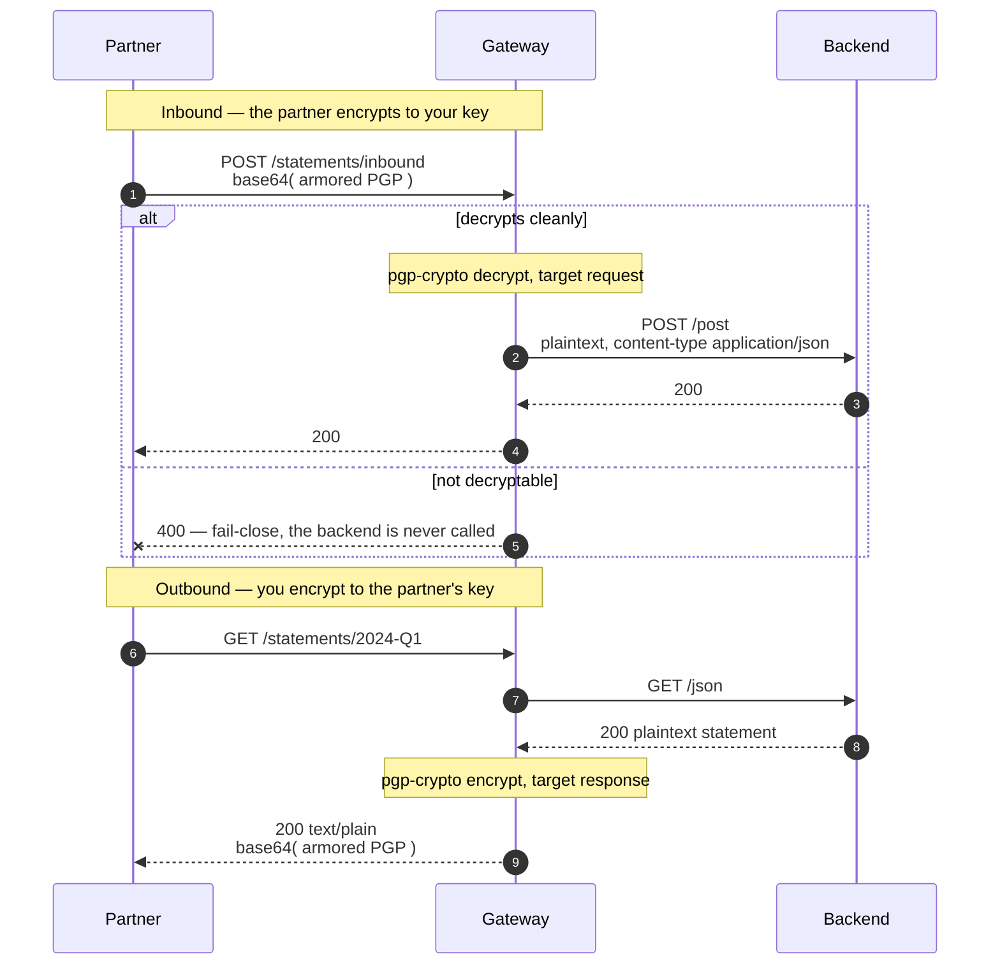

# Architecture — encryption as a property of the path

> [Overview](README.md) · [Business need](business-need.md) · **Architecture** · [Guides](guides.md) · [Agent prompt](helix-agent-prompt.md) · [Tests](tests.md) · [API reference](api-reference.md)

---

## What the gateway does here

The gateway sits between your partner and your backend and handles the PGP in
both directions:

1. **Inbound** (`POST /statements/inbound`). The partner sends an encrypted
   instruction. The gateway decrypts it, replaces the request body with the plain
   content, sets `content-type: application/json`, and passes it to your backend.
2. **Outbound** (`GET /statements/{statementId}`). Your backend returns an ordinary
   JSON statement. The gateway encrypts it to the partner's public key and replaces
   the response body with the encrypted file, setting `content-type: text/plain`.

The backend never handles ciphertext. The partner never handles plaintext. Neither
side changes.

For the full list of fields on every plugin mentioned here, see
[docs.digitalapi.ai/api-gateway](https://docs.digitalapi.ai/api-gateway).

## The model

| Word | What it means here |
|---|---|
| **Key pair** | A public key (handed out) and its private key (kept secret), generated together. |
| **Encrypt to** | Encrypt with the *recipient's* public key, so only the recipient's private key can decrypt. |
| **Armor** | The text form of a PGP message: `-----BEGIN PGP MESSAGE-----` … |
| **Wire format** | What travels over HTTP here: **base64 of the armor**, in both directions. |

## How a request flows



## Two parties, four key halves

The two directions are not a round trip, and treating them as one is the most
common way to misconfigure this. **Encryption is always *to the recipient***, so
each direction uses a different key — and in a real integration, a different key
*pair*, held by a different party.

```
        YOU                                   THEM
   ┌──────────────┐                     ┌──────────────┐
   │ your private │◀──they encrypt──────│ your public  │
   │ (decrypt in) │                     │ (they hold)  │
   ├──────────────┤                     ├──────────────┤
   │ their public │──you encrypt───────▶│ their private│
   │ (encrypt out)│                     │ (they hold)  │
   └──────────────┘                     └──────────────┘
```

| | Your side — this package | Their side |
|---|---|---|
| **Sending** them a statement | `encrypt.public_key` = **their** public key | they decrypt with their private key |
| **Receiving** their instruction | `decrypt.private_key` = **your** private key | they encrypt to your public key |

So the two fields on this route belong to **different** pairs:

```yaml
decrypt:
  private_key: "<PGP_PRIVATE_KEY>"   # YOURS.   They encrypt to its public half.
encrypt:
  public_key:  "<PGP_PUBLIC_KEY>"    # THEIRS.  You never see its private half.
```

You never hold their private half, and they never hold yours. Filling both fields
from one pair deploys and round-trips, which makes a convenient single-party test
(see [Guides → See it work](guides.md#see-it-work)) and is not what production
looks like. The key a party reaches for depends on the direction, not on who they
are: your partner encrypts with **your** public key and decrypts with **their**
private key, in the same integration, minutes apart.

## The wire format is base64 of the armor

Both directions use **base64 of the ASCII-armored message**, not the armor. Armor
is already a text encoding; base64 on top of it is a second one.

```
encrypt (response) : body becomes base64("-----BEGIN PGP MESSAGE-----…"), content-type text/plain
decrypt (request)  : body must ARRIVE base64-encoded
```

Every PGP tool produces armor by default, so a partner following the standard
correctly is rejected: a raw armored body gets a 400, and the same message
base64-encoded decrypts cleanly. There is no setting that accepts bare armor, so
this is an integration-guide problem, not a configuration one. The note you send
the partner is part of the work: [Guides → The note to send your partner](guides.md#the-note-to-send-your-partner).

## Reading a response

| Route | Status | What it means |
|---|---|---|
| Inbound | **200** | Decrypted; the backend received plain content. |
| Inbound | **400** | Not a PGP message this gateway can decrypt — raw armor, plain text, or a message encrypted to a different key. The backend was not called. |
| Outbound | **200**, `text/plain` | The statement, encrypted to the partner's key. |
| Outbound | **500** | The response could not be encrypted, usually because the public key cannot be read. |

**Errors are vague on purpose.** The caller sees `failed to encrypt response` or
your `fail_close_message`, and nothing else. An unreadable key, a wrong recipient
and an oversized body all look the same. That is correct — an error that describes
your key material helps an attacker — but it means a partner cannot work out the
cause alone. Give them the `X-Request-Id` header value to quote, and a support path.

## Why `fail-close` in both directions

| Direction | `fail-open` would | Which is |
|---|---|---|
| Inbound | Forward whatever arrived — ciphertext the backend cannot read, or an unencrypted body an attacker chose | A backend processing input it was never meant to see |
| Outbound | **Return the statement unencrypted** | Exactly what this solution exists to prevent |

The outbound case matters most, because `fail-open` is what somebody reaches for
when the route starts failing. It stops failing by publishing plaintext. One of the
automated tests checks that no readable plaintext survives in the response, for
exactly that reason.

## The plugins

| Plugin | Where | What it does |
|---|---|---|
| `pgp-crypto` (priority 898) | inbound: `decrypt`, target request · outbound: `encrypt`, target response | The crypto. |
| `proxy-rewrite` | both routes | Rewrites the path to the backend's (`/post`, `/json`). Path only. |
| `request-id` | API-wide | Adds `X-Request-Id`, the handle a partner quotes, since errors are vague. |

The crypto runs inside the gateway, with a `gpg` binary as a fallback for material
the in-process path does not cover. It uses the gateway's own CPU, and is bounded by
`max_body_size` and `gpg_timeout_ms` rather than by a separate service's capacity.

## One key pair per route

`private_key` and `public_key` are fields on the route's plugin configuration, so:

- **Two partners with different keys need two routes.** One route serves one
  partner, in both directions, using two different pairs.
- **Rotating a key is a configuration change and a deploy**, and the old and new
  keys cannot both be live on one route — a hard cutover that has to be agreed with
  the partner.
- **Every key is a literal in a document** that somebody could commit.

For one long-lived partner that is acceptable and simple. Past the first partner it
is the main cost of the design, which is why [solution 12](../12-key-value-map/)
exists: the same plugin, with the key fetched from a store per request.

## No custom code needed

| | A keyring service | `pgp-crypto` at the edge |
|---|---|---|
| Ownership | Whoever wrote it, usually gone | The team that owns the path |
| Key storage | A filesystem on a server | Control-plane configuration, encrypted at rest |
| Change process | Manual | A revision: reviewed, dry-run, can be rolled back |
| Monitoring | Its own, if any | The same telemetry as every other route |
| Failure mode | A box that is down | A route that returns a status code |
| Per-partner keys | A config file it reads | One key pair per route — see above |

The one place a custom service wins is many partners, because it can look a key up
per request. That exists here too: [solution 12](../12-key-value-map/).

## When to use this

Use this solution when:

- a partner's contract specifies PGP and your backend cannot or should not handle
  it,
- there is already a script doing this, owned by nobody,
- payloads must stay encrypted beyond the gateway, for example at rest or in a
  queue, or
- you want the crypto inside the same pipeline, telemetry and review process as the
  rest of the path.

Do not use it when:

- **TLS is enough.** If you only need confidentiality in transit, this adds key
  management for no gain.
- **you need to prove who sent it.** That is a signature —
  [solution 06](../06-hmac-auth/).
- **you have many partners.** Use [solution 12](../12-key-value-map/) rather than
  many routes with many key pairs.
- **the payloads are large.** The crypto buffers the whole body and costs CPU per
  request.
- **the backend must never see plaintext.** This decrypts *for* the backend. If the
  backend is what you are protecting the data from, the crypto belongs further in.

## Prerequisites

- An OpenPGP key pair of your own (for inbound), and your partner's public key (for
  outbound). For a single-party test, one pair can fill both fields.
- Keys with an **encryption subkey**. `gpg --quick-generate-key` does not make one;
  see [Guides → Troubleshooting](guides.md#troubleshooting).
- An upstream bound to the revision. The spec uses the public `httpbin.org`, whose
  `/post` echoes what it receives, so you can see the decrypted text.

## What this does not do

- **It uses base64 of the armor in both directions**, which no standard PGP tool
  produces by default, so every partner needs an explicit note.
- **`field` on an encrypt block returns only that field's ciphertext** as the whole
  response body and discards the rest of the document. It is not a way to encrypt
  one field of a document you otherwise keep.
- **Key material is a literal** in the document, with no environment-variable
  lookup. The gateway does not resolve `<ENV:...>` or `${...}`.
- **Rotation is a hard cutover** on a route, and there is **one key pair per
  route**.
- **A wrong recipient key cannot be detected at the gateway.** The response is well
  formed and the partner simply cannot read it. Only a round-trip test finds it.
- **The whole body is buffered**, bounded by `max_body_size`, which rejects rather
  than streams. Batch files are how people find this limit.
- **Confidentiality only** — no sender authentication, no signature, no
  non-repudiation.
- **It is not authentication.** Anyone who can reach the route gets a document they
  cannot read, which is not the same as being refused. Put
  [solution 08](../08-api-key/) in front.
- **Whether your own key material parses is not something a dry-run checks.** A key
  that does not parse is a runtime failure, not a configuration error.
