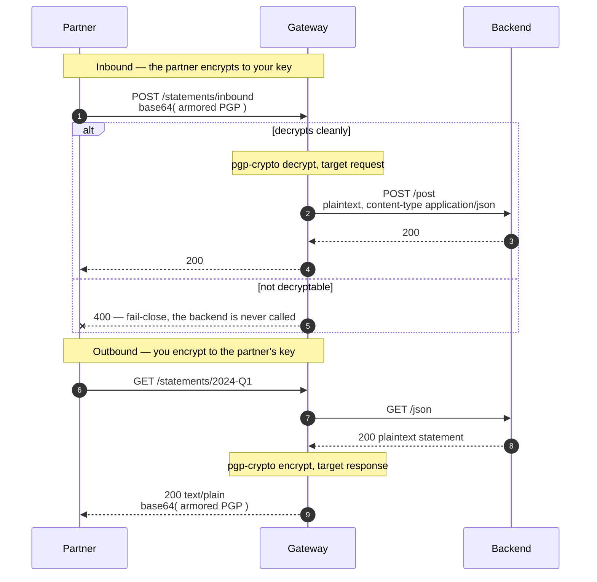

# Solution 13 — PGP at the edge, so the keyring script can go

**Overview** · [Business need](business-need.md) · [How it works](how-it-works.md) · [Install](install.md) · [Configuration](configuration.md) · [Test & verify](testing.md) · [Changelog](changelog.md)

---

**The partner will only accept encrypted payloads and only sends encrypted ones
back. Today that is a Python script with a keyring on a VM, and it is the thing
that breaks at 2am.**

<!-- facts:begin -->

| | |
|---|---|
| **Setup time** | ~20 minutes |
| **Difficulty** | Intermediate |
| **Needs** | A fresh org (its default test environment) · an OpenPGP key pair. The upstream echoes requests, so the decrypted plaintext is visible without a backend of your own |
| **Plugins** | `pgp-crypto` · `proxy-rewrite` · `request-id` |
| **Build it with** | **[the Agent](install.md)** — recommended · or import [`gateway/api-spec.yaml`](gateway/api-spec.yaml) |

<!-- facts:end -->

## The problem

> *"Our settlement partner is a bank. They will only accept PGP-encrypted
> instruction files, and everything they send us comes back encrypted. So between
> their endpoint and our service there is a Python script on a VM with a keyring on
> it, written by someone who left in 2022. It decrypts, forwards, re-encrypts. It
> is not in our deployment pipeline, it is not in our monitoring, and it is the
> thing that pages us at two in the morning on the last working day of the month."*

The crypto is not the problem. Nobody is arguing about OpenPGP. The problem is
*where* it lives:

1. **It is a service nobody owns.** It exists because two systems could not talk,
   not because anyone decided to build it.
2. **It holds the keys.** A VM with a keyring is the most sensitive asset in the
   integration and usually the least governed one.
3. **It is not in any of your controls.** No pipeline, no dashboard, no runbook —
   and the month-end batch is when you find that out.

**Root cause:** a wire-format concern is being solved by an application. Nothing
about decrypting a payload needs to know what the payload means, so nothing about
it needs to live in something that does.

## Business need

Full version: [`business-need.md`](business-need.md).

| Dimension | A keyring script on a VM | Crypto at the edge |
|---|---|---|
| **Who owns it** | Nobody — it was a workaround | The platform team, with everything else on the path |
| **Where the keys live** | On a VM, in a home directory | In the gateway's configuration, encrypted at rest by the control plane |
| **In the deployment pipeline** | No | Yes — it is a revision |
| **In monitoring** | No | Yes — the same telemetry as every other route |
| **Backend change to adopt** | — | None. The backend handles plaintext, as it always did |
| **What breaks at 2am** | A VM nobody has logged into for a year | The same thing that would break for any route |

## How a request flows

The backend never handles ciphertext. The partner never handles plaintext. Neither
side changes.

## Gotchas

- **base64 of armor, both directions.** Not armor. The error message does not say
  so.
- **`field` on an encrypt block discards the rest of the document.** Verified.
- **Errors are generic.** Unparseable key, wrong recipient and oversized body all
  look identical to the caller.
- **The key material is a literal in the document.** No `<ENV:...>` resolution.
- **Encrypting to the wrong public key is invisible from the gateway's side.** Only
  a round-trip test catches it.
- **`fail-open` on the response direction returns the plaintext.** Do not.
- **Rotation is a hard cutover.** Old and new keys cannot both be live on one
  route. [Solution 12](../12-key-value-map/) turns this into a data change.
- **Crypto buffers the whole body.** `max_body_size` rejects rather than streams;
  month-end batch files are how people discover this.
- **Encryption is not authentication.** Anyone who can reach the route gets a
  document they cannot read — which is not the same as being refused. Put
  [solution 08](../08-api-key/) in front.
- **Encryption is not signing.** This gives confidentiality. It does not prove who
  sent the message; for that see [solution 06](../06-hmac-auth/).

## When to use it

Use it when:

- A counterparty's contract specifies PGP and the backend cannot or should not
  handle it.
- There is already a script doing this, owned by nobody.
- Payloads must be encrypted at rest beyond the gateway, or in a queue.
- You want the crypto inside the same pipeline, telemetry and review process as the
  rest of the path.

Don't use it when:

- **TLS is enough.** If the requirement is confidentiality in transit and nothing
  more, this adds key management for no gain.
- **You need to prove who sent it.** That is a signature —
  [solution 06](../06-hmac-auth/).
- **You have many counterparties.** Use [solution 12](../12-key-value-map/) rather
  than N routes with N key pairs.
- **The payloads are large.** Crypto buffers the body and costs CPU per request.
- **The backend must never see plaintext.** This decrypts *for* the backend. If the
  backend is the thing you are protecting the data from, the crypto belongs
  further in.

## Limitations

- **base64-of-armor in both directions**, which no standard PGP tool produces by
  default.
- **`field` on encrypt returns only that field's ciphertext.**
- **Key material is a literal in the document**, with no environment indirection.
- **Rotation is a hard cutover** on a route.
- **One key pair per route**, hence [solution 12](../12-key-value-map/).
- **Generic errors** to the caller, by design.
- **A wrong recipient key is undetectable at the gateway.**
- **Whole-body buffering**, bounded by `max_body_size`.
- **Confidentiality only** — no sender authentication, no signing, no
  non-repudiation.
- **Not authentication.** Reaching the route is not the same as being entitled to.

Full list: [`solution.yaml`](solution.yaml) § `limitations`.

## Validation status

**Validated against a gateway — imported, dry-run, deployed, and exercised.**

| Stage | Status | Provenance |
|---|---|---|
| Configuration generated | **YES** | [`gateway/api-spec.yaml`](gateway/api-spec.yaml) |
| Local validation | **PASS** | [`validation/local-validation.yaml`](validation/local-validation.yaml) |
| Gateway dry-run | **PASS** | Non-destructive, against a temporary import. |
| Gateway deployed | **DEPLOYED** | Revision ACTIVE in a test environment, with a throwaway RSA-3072 key pair. |
| Functional tests | **PASS (7/7)** | Both directions, both rejection cases, and the full round trip. |

Overall: **READY.** The wire format and the `field` behaviour were established by
running them, not by reading the schema —
[`validation/gateway-validation.yaml`](validation/gateway-validation.yaml).

## Related solutions

- **[12 — Key-value map](../12-key-value-map/)** — the same crypto with the key
  fetched per request. Go there the moment you have a second counterparty.
- **[06 — Signed requests](../06-hmac-auth/)** — confidentiality is not
  authenticity. If you need to know who sent it, you need a signature.
- **[08 — API keys](../08-api-key/)** — this package ships unauthenticated so the
  crypto is the only behaviour under test.
