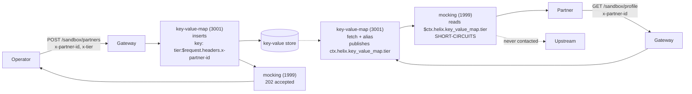

# Solution 14 — A sandbox that answers every partner with that partner's own values

**One route, no backend, and a different answer for every caller. Onboarding a
partner is a request; changing their data is a request. Neither is a deploy.**

| | |
|---|---|
| **Problem** | *"Every partner gets the same canned response from our sandbox, so nobody catches an integration bug until production."* |
| **Business need** | A sandbox that differs per partner, changed by a write rather than a release |
| **Plugins** | `key-value-map` (inserts · fetch · alias) · `mocking` · `request-id` · `cors` |
| **Needs** | A gateway environment with the key-value store provisioned. No backend service, no crypto, no Enterprise plan |
| **Changes to your backend** | **None.** There is no backend. `mocking` short-circuits every route here |
| **Setup** | 🟢 single API, ~15 min |

---

## The problem

A partner sandbox that returns the same fixture to everyone is a sandbox that
only tests your happy path. The partner on a legacy settlement account, the one
on a tier with different limits, the one whose id has an unusual shape — none of
them finds out until production, because the sandbox told all three the same
thing.

The usual fix is to make the sandbox dynamic, which means standing up a service:
a small app, a datastore, a deploy pipeline, a place for it to break at 2am. For
something that exists only so partners can integrate against it, that is a lot of
operational surface. So most teams do the other thing — they keep the canned
response and absorb the integration bugs.

## What this does instead

Values live in the gateway's key-value store. An administrative route writes
them, keyed by the partner's own id. A read route fetches whatever the calling
partner's id points at and answers with it. `mocking` composes the response, so
nothing is proxied anywhere.

Adding a partner is a POST. Changing a partner's data is the same POST again.
Neither touches a revision, a route, or a deploy.



The store outranks the mock — `key-value-map` is priority 3001 and `mocking` is
1999, both in the access phase — so by the time the mock builds its response the
values are already in the request context. Reverse that and every value is empty,
with nothing to tell you why.

## The one thing to get right: there are two substitution grammars

This is the whole solution, and getting it wrong fails **silently** — a 200, an
empty string, and nothing in any log.

| Form | What it does | Reads a stored value? |
|---|---|---|
| `${ctx.helix.<ns>.<field>}` | Looks the **whole dotted string** up as one variable *name* in a flat table. Only `service-callout` ever writes to that table. | **No.** Always empty here. |
| `$ctx.<dotted.path>` | Bare `$`, no braces. **Walks the request context** segment by segment, so it reaches anything actually present. | **Yes.** |

`key-value-map` publishes into `ctx.helix.key_value_map` all along. The second
form reaches it; the first cannot. On this build **only `mocking` resolves the
second form** — in `response_example` *and* `response_headers`.

The package ships a `/sandbox/diagnostics` route that prints the same value in
both grammars, so a team learning this can see the difference rather than read
about it:

```
bare_form   = platinum
brace_form  =
namespace   = {"tier":"platinum"}
```

`gateway/verify.sh` asserts that the brace form stays empty. If it ever starts
resolving, this package's explanation is wrong and its guidance should change.

### Where values land

```
fetched   ->  ctx.helix.<ctx_namespace>.<key>           flat
inserted  ->  ctx.helix.<ctx_namespace>.inserted.<key>  one level down
```

The default `ctx_namespace` is `key_value_map`. That asymmetry between fetched
and inserted is real, and it is why the registration route and the read route
reference their values differently.

## Why `alias` is load-bearing

The fetch key here is **dynamic** — `tier:$request.headers.x-partner-id`. Without
an alias, the value would publish under a field named after whatever the caller
sent (`tier:acme-42`), and no static template could name it.

`alias` **renames the published field** to a name you choose:

```yaml
key-value-map:
  fetch:
    keys:
      - key: "tier:$request.headers.x-partner-id"
        alias: tier          # -> $ctx.helix.key_value_map.tier
```

That single line is what turns "a store" into "a per-caller store". It is the
difference between this solution and a slightly fancier static mock.

## Build it with the Helix Agent

One bounded step at a time. See [helix-agent-prompt.md](helix-agent-prompt.md)
for why it is shaped this way and what to do when a step misbehaves.

```text
Create an API called "Partner Sandbox API" in my organisation. Don't add any
routes or plugins yet — just create the API and tell me its id.
```

```text
On the Partner Sandbox API, add a route POST /sandbox/partners. Give it exactly
two plugins, and keep the plugin-name level explicit — a "plugins" object whose
keys are "key-value-map" and "mocking".

key-value-map:
  fail_action: close
  inserts:
    - key: "tier:$request.headers.x-partner-id"
      value: "$request.headers.x-tier"
      ttl: 86400

mocking:
  response_status: 202
  content_type: application/json
  response_example: {"registered":true}
```

```text
On the same API, add a route GET /sandbox/profile with exactly two plugins,
"key-value-map" and "mocking":

key-value-map:
  fail_action: close
  fetch:
    keys:
      - key: "tier:$request.headers.x-partner-id"
        alias: tier

mocking:
  content_type: application/json
  response_example: {"tier":"$ctx.helix.key_value_map.tier"}

The $ctx reference is literal text — do not rewrite it, do not add braces around
it, and do not "correct" it to ${ctx...}. The braces break it.
```

```text
Read back the current revision of the Partner Sandbox API and show me the plugins
stored on each route, so I can confirm both routes carry key-value-map AND
mocking under their own plugin names.
```

The last step is not optional. Three of the four known agent-mode defects report
success at every step the agent shows you, and the only way to catch them is to
read the revision back.

## Install it directly

```bash
# import the spec (multipart — a raw application/yaml body is rejected with 415)
curl -X POST "$CP/api/orgs/$ORG/apis/from-spec" \
  -H "authorization: Bearer $TOKEN" \
  -F "file=@gateway/api-spec.yaml"

# bind an upstream and deploy. The upstream is never contacted — mocking
# short-circuits — but the binding is required for the revision to deploy.
```

Then prove it:

```bash
GATEWAY=https://<YOUR_GATEWAY_HOST> ./gateway/verify.sh
```

## What the caller sees

```bash
# register two partners
curl -X POST "$GW/sandbox/partners" \
  -H 'x-partner-id: acme-42' -H 'x-tier: gold' -H 'x-settlement-account: GB29-SANDBOX-0001'
# {"registered":true,"stored":{"tier:acme-42":"gold","settlement:acme-42":"GB29-SANDBOX-0001"}}

# each one reads its own
curl "$GW/sandbox/profile" -H 'x-partner-id: acme-42'
# {"partner":"acme-42","tier":"gold","settlement":"GB29-SANDBOX-0001"}

curl "$GW/sandbox/profile" -H 'x-partner-id: globex-7'
# {"partner":"globex-7","tier":"bronze","settlement":"GB29-SANDBOX-0002"}

# change one, with no deploy
curl -X POST "$GW/sandbox/partners" \
  -H 'x-partner-id: acme-42' -H 'x-tier: platinum' -H 'x-settlement-account: GB29-SANDBOX-0009'
curl "$GW/sandbox/profile" -H 'x-partner-id: acme-42'
# {"partner":"acme-42","tier":"platinum","settlement":"GB29-SANDBOX-0009"}
```

## Gotchas

These are the four that cost time when this package was built and tested. Each is
silent — every one of them returns a 200.

**`$request.headers.<name>` does not work inside `mocking`.** It is
`key-value-map`'s key/value grammar. Put it in a `response_example` and you get
mangled output rather than an error — testing produced the literal `-partner-id`.
Inside `mocking`, the forms that resolve are `$ctx.<path>` and ordinary gateway
variables such as `$http_x_partner_id`.

**A ctx reference to a table expands to a JSON object.** So it must not sit
inside quotes in a JSON body. `"stored":"$ctx.helix.key_value_map.inserted"`
produces structurally invalid JSON, returned with a 200.

**You cannot suffix a reference with a dot.** Everything after `headers.` is
taken as the header name, so `$request.headers.x-partner-id.tier` looks up a
header literally named `x-partner-id.tier` and finds nothing. Put the
discriminator in front — `tier:$request.headers.x-partner-id` — separated by a
character outside `[A-Za-z0-9_-]`.

**Hyphens end a `$ctx` reference.** Its segments are `[A-Za-z0-9_]` only, so
`$ctx.helix.key_value_map.partner-tier` resolves the part before the hyphen and
passes `-tier` through as a literal. Note this differs from `key-value-map`'s own
key grammar, which *does* accept hyphens. Underscores only in `$ctx` paths.

## When to use this, and when not to

**Use it** for partner and developer sandboxes, per-tenant demo environments,
contract-test doubles that must differ per consumer, and any stub whose data
changes more often than your release train.

**Don't use it** when the stored value has to reach a real backend. `mocking`
short-circuits, so it can show a value but never forward one. That job needs
`pgp-crypto` or `lua-callout` — see
[solution 12](../12-key-value-map/). And don't use it for anything confidential:
every value is readable by anyone who can send the right partner id, which is a
header.

## Limitations

- **The registration route ships unauthenticated.** Anyone who can reach it can
  rewrite any partner's values. Protect it before exposing it.
- **A miss and a stored empty string are indistinguishable.** Both render as `""`.
  Store a sentinel if you need to tell them apart.
- **`fail_action: close` governs store errors, not misses.** An unknown partner
  gets a 200 with empty values; nothing here fails closed.
- **The 202 is not proof of a write.** It acknowledges that the insert was
  configured. Read the value back to confirm one.
- **Values expire.** A partner left alone past the TTL silently reverts to the
  unregistered response.
- **No schema, no audit trail.** This is a sandbox pattern, not a data store.

Full list: [`solution.yaml`](solution.yaml) § `limitations`.

## Validation status

- **Locally validated** — structure, plugin fields against the live schema,
  reference and alias agreement, ordering. See
  [`validation/local-validation.yaml`](validation/local-validation.yaml).
- **Gateway dry-run passed** — the spec imports and dry-runs clean.
- **Gateway deployed** — deployed ACTIVE to a test environment to run the tests.
- **Functional test passed** — `gateway/verify.sh` 6/6, including partner
  isolation, a store miss, a change with no deploy, and the grammar guard. See
  [`validation/gateway-validation.yaml`](validation/gateway-validation.yaml).
