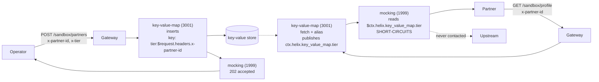

# Architecture — per-caller values composed at the edge

> [Overview](README.md) · [Business need](business-need.md) · **Architecture** · [Guides](guides.md) · [Agent prompt](helix-agent-prompt.md) · [Tests](tests.md) · [API reference](api-reference.md)

---

## What the gateway does here

The gateway keeps per-partner values in its key-value store and answers sandbox
calls from them. No request is passed on to a backend.

There are three routes:

1. **`POST /sandbox/partners`** — administrative. An operator sends a partner id
   and that partner's values in headers. The gateway stores them under that id and
   answers `202`.
2. **`GET /sandbox/profile`** — what partners call. The gateway fetches the calling
   partner's values and returns them as JSON.
3. **`GET /sandbox/diagnostics`** — a teaching aid. It shows the same stored value
   written in the two template syntaxes side by side, so you can see which one
   works. Drop it before production.

For the full list of fields on every plugin mentioned here, see
[docs.digitalapi.ai/api-gateway](https://docs.digitalapi.ai/api-gateway).

## The model

| Word | What it means here |
|---|---|
| **Partner id** | The `x-partner-id` header. It is part of the storage key. |
| **Entry** | One stored value, such as `tier:acme-42 → gold`. |
| **Namespace** | Where fetched values are kept for the rest of the request: `ctx.helix.key_value_map` by default. |
| **Alias** | A fixed name given to a fetched value, so a template can refer to it. |
| **Short-circuit** | The mock answers the request itself, so nothing after it runs and no upstream is called. |

## How a request flows



## Execution order

Both plugins run in the **access** phase, and priority orders them within it:

| Plugin | Priority | Produces | Reads |
|---|---|---|---|
| `key-value-map` | 3001 | values in `ctx.helix.key_value_map` | the request headers |
| `mocking` | 1999 | the response | `ctx.helix.key_value_map` |

**The store outranks the mock, and that is the only reason this works.** A plugin
can only read a value produced by a higher-priority plugin on the same route. If
the order were reversed, every value would come back empty, with no error anywhere.

`request-id` and `cors` sit at the document root and apply API-wide.

## The two template syntaxes

This is the one thing to get right, and getting it wrong fails **silently**: a 200,
an empty string, and nothing in any log.

| Form | What it does | Reads a stored value? |
|---|---|---|
| `${ctx.helix.<ns>.<field>}` | Looks the **whole dotted string** up as one variable *name* in a flat table. Only `service-callout` ever writes to that table. | **No.** Always empty here. |
| `$ctx.<dotted.path>` | Bare `$`, no braces. **Walks the request context** one segment at a time, so it reaches anything actually present. | **Yes.** |

`key-value-map` publishes into `ctx.helix.key_value_map`. Only the bare form
reaches it, and on this build **only `mocking` understands the bare form** — in
`response_example` *and* `response_headers`.

The diagnostics route prints the same value both ways:

```
bare_form   = platinum
brace_form  =
namespace   = {"tier":"platinum"}
```

`example/verify.sh` checks that the brace form stays empty. If it ever starts
working, this page's explanation is wrong and the guidance should change.

Three more rules about the bare form:

- **Segments are letters, digits and underscores only.** A hyphen **ends the
  reference**, and the rest passes through as literal text. So a value stored as
  `partner-tier` can never be referred to. `key-value-map`'s own key syntax *does*
  accept hyphens, so the two are not interchangeable. Use underscores.
- **A reference to a table becomes a JSON object**, not a string. Inside a JSON
  body, write it without quotes.
- **`$request.headers.<name>` does not work inside `mocking`.** That is
  `key-value-map`'s syntax. Inside `mocking`, use `$ctx.<path>` or an ordinary
  gateway variable such as `$http_x_partner_id`.

## Where values land, and why the two routes differ

```
fetched   ->  ctx.helix.key_value_map.<key>            flat
inserted  ->  ctx.helix.key_value_map.inserted.<key>   one level down
```

The registration route reads `.inserted`; the profile route reads the flat
namespace. That difference comes from the plugin, not from a choice this package
made.

## Why `alias` matters

The fetch key is built from the caller — `tier:$request.headers.x-partner-id` — so
without an alias the value would be published under a field named after whatever
the caller sent (`tier:acme-42`). That name changes with every caller, and no fixed
template can refer to it.

`alias: tier` renames the published field to `tier`. One template then serves every
caller. That single line is the difference between a per-partner sandbox and a
static mock.

## The key shape

The key template is `tier:$request.headers.x-partner-id`, with the label **in
front**.

The obvious alternative, `$request.headers.x-partner-id.tier`, does not work.
Everything after `headers.` is taken as the header name, dots included, so it looks
up a header literally called `x-partner-id.tier` and finds nothing. Put the label
in front, separated by a character outside letters, digits, `_` and `-` (here a
colon). This assumes partner ids contain no colon.

## Reading a response

| Situation | What happens |
|---|---|
| Registered partner | 200 with their values, and an `X-Partner-Tier` response header. |
| Unregistered partner | 200 with empty values. A miss is not an error to the store. |
| Value past its expiry (TTL) | The same as unregistered. No signal. |
| Registration | 202 with the stored values echoed. It confirms the insert was configured, not that a value was written — read it back. |
| Store unreachable | `fail_action: close` applies to store *errors*. Not simulated in this package; check it on your own store before relying on it. |
| Wrong syntax in a template | 200, empty string, nothing logged. This is why the diagnostics route exists. |

## No custom code needed

Nothing is built. Two configured plugins do the whole job.

The alternative, a small mock service with a datastore, gives you schema
validation, an audit trail, and the ability to pass values to a real backend. It
costs a deployable, a pipeline and an on-call rotation, for a system whose only
purpose is to let other people test. For sandbox data that trade is usually wrong.
Where a value must reach your own services, the trade flips, and this pattern
cannot do that job at all — see [solution 12](../12-key-value-map/).

## Where the values live

In the gateway's key-value store, encrypted at rest. There is **no control-plane
API for these entries** on this build, so the plugin's own `inserts` is the only
write path. That is why an administrative route exists, and why protecting it is
part of adopting this package.

## When to use this

Use it for:

- partner and developer sandboxes,
- per-tenant demo environments,
- contract-test doubles that must differ per consumer, and
- any stub whose data changes more often than your release train.

Do not use it when:

- **the stored value has to reach a real backend.** `mocking` answers the request
  itself, so it can show a value but never forward one. That needs `pgp-crypto` or
  `lua-callout` — see [solution 12](../12-key-value-map/).
- **the data is confidential.** Every value is readable by anyone who can send the
  right partner id, which is a header.

## Prerequisites

- An environment with the gateway's key-value store available. It is
  infrastructure this spec uses, not something it creates.
- An upstream bound to the revision. It is never contacted, but the binding is
  required to deploy.
- Nothing else: no backend, no encryption, no paid plan.

## What this does not do

- **The registration route ships unauthenticated.** Anyone who can reach it can
  rewrite any partner's values. Protect it before exposing it.
- **A miss and a stored empty string look the same** — both come back as `""`.
  Store a marker value if you need to tell them apart.
- **Nothing fails closed on an unknown partner.** `fail_action: close` covers store
  errors, not misses.
- **The 202 is not proof of a write.** Read the value back to confirm one.
- **Values expire.** They are stored with a 24-hour TTL (86400 seconds); a partner
  left alone past it silently reverts to the unregistered response.
- **It does not check what partners send.** It changes what the sandbox *answers*,
  not what it accepts. Pair it with `request-validation` if you need that.
- **No schema, no versioning, no audit trail** of who changed a value.
- **Not established here:** whether the store is shared across environments or
  kept per environment, behaviour when the store itself is unreachable, and any
  throughput or latency figure for a fetch per request.
