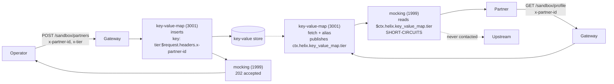

# Solution 14 — A sandbox that answers every partner with that partner's own values

**Overview** · [Business need](business-need.md) · [How it works](how-it-works.md) · [Install](install.md) · [Configuration](configuration.md) · [Test & verify](testing.md) · [Changelog](changelog.md)

---

**One route, no backend, and a different answer for every caller. Onboarding a
partner is a request; changing their data is a request. Neither is a deploy.**

<!-- facts:begin -->

| | |
|---|---|
| **Setup time** | ~20 minutes |
| **Difficulty** | Intermediate |
| **Needs** | A gateway environment with the key-value store provisioned. No backend service, no crypto, no Enterprise plan |
| **Plugins** | `cors` · `key-value-map` · `mocking` · `request-id` |
| **Build it with** | **[the Agent](install.md)** — recommended · or import [`gateway/api-spec.yaml`](gateway/api-spec.yaml) |

<!-- facts:end -->

## What this does instead

Values live in the gateway's key-value store. An administrative route writes
them, keyed by the partner's own id. A read route fetches whatever the calling
partner's id points at and answers with it. `mocking` composes the response, so
nothing is proxied anywhere.

Adding a partner is a POST. Changing a partner's data is the same POST again.
Neither touches a revision, a route, or a deploy.

The store outranks the mock — `key-value-map` is priority 3001 and `mocking` is
1999, both in the access phase — so by the time the mock builds its response the
values are already in the request context. Reverse that and every value is empty,
with nothing to tell you why.

## When to use this, and when not to

**Use it** for partner and developer sandboxes, per-tenant demo environments,
contract-test doubles that must differ per consumer, and any stub whose data
changes more often than your release train.

**Don't use it** when the stored value has to reach a real backend. `mocking`
short-circuits, so it can show a value but never forward one. That job needs
`pgp-crypto` or `lua-callout` — see
[solution 12](../12-key-value-map/). And don't use it for anything confidential:
every value is readable by anyone who can send the right partner id, which is a
header.

## The problem

A partner sandbox that returns the same fixture to everyone is a sandbox that
only tests your happy path. The partner on a legacy settlement account, the one
on a tier with different limits, the one whose id has an unusual shape — none of
them finds out until production, because the sandbox told all three the same
thing.

The usual fix is to make the sandbox dynamic, which means standing up a service:
a small app, a datastore, a deploy pipeline, a place for it to break at 2am. For
something that exists only so partners can integrate against it, that is a lot of
operational surface. So most teams do the other thing — they keep the canned
response and absorb the integration bugs.

## Gotchas

These are the four that cost time when this package was built and tested. Each is
silent — every one of them returns a 200.

**`$request.headers.<name>` does not work inside `mocking`.** It is
`key-value-map`'s key/value grammar. Put it in a `response_example` and you get
mangled output rather than an error — testing produced the literal `-partner-id`.
Inside `mocking`, the forms that resolve are `$ctx.<path>` and ordinary gateway
variables such as `$http_x_partner_id`.

**A ctx reference to a table expands to a JSON object.** So it must not sit
inside quotes in a JSON body. `"stored":"$ctx.helix.key_value_map.inserted"`
produces structurally invalid JSON, returned with a 200.

**You cannot suffix a reference with a dot.** Everything after `headers.` is
taken as the header name, so `$request.headers.x-partner-id.tier` looks up a
header literally named `x-partner-id.tier` and finds nothing. Put the
discriminator in front — `tier:$request.headers.x-partner-id` — separated by a
character outside `[A-Za-z0-9_-]`.

**Hyphens end a `$ctx` reference.** Its segments are `[A-Za-z0-9_]` only, so
`$ctx.helix.key_value_map.partner-tier` resolves the part before the hyphen and
passes `-tier` through as a literal. Note this differs from `key-value-map`'s own
key grammar, which *does* accept hyphens. Underscores only in `$ctx` paths.

## Limitations

- **The registration route ships unauthenticated.** Anyone who can reach it can
  rewrite any partner's values. Protect it before exposing it.
- **A miss and a stored empty string are indistinguishable.** Both render as `""`.
  Store a sentinel if you need to tell them apart.
- **`fail_action: close` governs store errors, not misses.** An unknown partner
  gets a 200 with empty values; nothing here fails closed.
- **The 202 is not proof of a write.** It acknowledges that the insert was
  configured. Read the value back to confirm one.
- **Values expire.** A partner left alone past the TTL silently reverts to the
  unregistered response.
- **No schema, no audit trail.** This is a sandbox pattern, not a data store.

Full list: [`solution.yaml`](solution.yaml) § `limitations`.

## Validation status

- **Locally validated** — structure, plugin fields against the live schema,
  reference and alias agreement, ordering. See
  [`validation/local-validation.yaml`](validation/local-validation.yaml).
- **Gateway dry-run passed** — the spec imports and dry-runs clean.
- **Gateway deployed** — deployed ACTIVE to a test environment to run the tests.
- **Functional test passed** — `gateway/verify.sh` 6/6, including partner
  isolation, a store miss, a change with no deploy, and the grammar guard. See
  [`validation/gateway-validation.yaml`](validation/gateway-validation.yaml).
