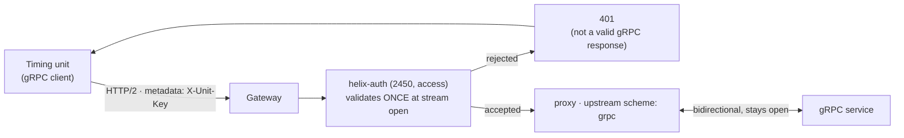

# Solution 15 — A bidirectional gRPC stream, authenticated at the edge

**Put the gateway in front of a streaming gRPC service and it authenticates every
connection as it opens, without the service implementing auth at all. The stream
stays bidirectional, stays open, and the client still gets its trailers.**

| | |
|---|---|
| **Problem** | *"Our units hold a gRPC stream open for hours. Anything that wants to authenticate or count them has to be built into the service."* |
| **Business need** | Identity and control at the edge for long-lived connections, without a service change |
| **Plugins** | `helix-auth` (validate · key-auth) · `request-id` · an upstream with `scheme: grpc` |
| **Needs** | A gRPC backend, **and a path with no HTTP/1.1 hop in front of the data plane** — see below |
| **Changes to your service** | **None** |
| **Setup** | 🔴 the upstream is a separate control-plane object, and the path has to be checked first |

---

## Check your path first

**Do this before anything else. It takes one command and it decides whether this
solution can work for you at all.**

```bash
curl -sI https://<your-gateway-host>/anything | grep -i '^via:'
```

If that prints something like `via: 1.1 google`, an HTTP/1.1 proxy sits in front
of your data plane, and **gRPC will not work through it** — not because of the
gateway, and not because of anything in this package.

Here is what that failure looks like, and why it is so easy to misread:

```
$ grpcurl ... BidiHello
{ "reply": "hello one" }      <-- the payload arrives
{ "reply": "hello two" }      <-- all of it
ERROR:
  Code: Internal
  Message: server closed the stream without sending trailers
```

Every byte is delivered and the call still fails. `grpc-status` — the field that
tells a client whether the call succeeded — travels in **HTTP/2 trailers**, and
HTTP/1.1 has no way to carry them. The body survives the downgrade; the status
does not.

The fix is infrastructure, not configuration: the backend service in front of the
data plane has to speak HTTP/2. No spec, plugin or control-plane setting can work
around it. `gateway/verify.sh` case 4 fails loudly and names this cause.

**Verified both ways.** This package passes 5/5 on a deployment with no such hop,
and fails cases 4 and 5 on one that has a load balancer in front — same config,
same spec.

## The problem

A timing unit, a trading feed, a telemetry agent — anything that holds a gRPC
stream open for hours — is a connection your platform cannot see. Authentication,
identity, connection counts and per-caller limits all have to be built into the
service, because nothing in front of it can participate in a stream it does not
understand.

So every team that owns such a service builds its own auth, and every one of them
builds it slightly differently.

## What this does

The gateway terminates the client's HTTP/2 connection, authenticates the stream
as it opens, and proxies it to the backend over gRPC. The stream stays
bidirectional throughout. The service sees an ordinary gRPC connection and
implements nothing.



## The upstream is not in the spec

This package is shaped differently from every other one in the library, and it is
worth saying plainly: **`gateway/api-spec.yaml` is only half the configuration.**

OpenAPI has no way to express "this upstream speaks gRPC". That lives on the
upstream object in the control plane:

```bash
POST /api/orgs/{orgId}/envs/{envId}/upstreams
{
  "name": "timing-grpc",
  "specification": {
    "scheme": "grpc",                       # grpcs for a TLS backend
    "type": "roundrobin",
    "pass_host": "node",
    "nodes": [{"host": "<GRPC_UPSTREAM_HOST>", "port": <GRPC_UPSTREAM_PORT>,
               "weight": 1, "priority": 1}]
  }
}
```

Then bind that upstream to the revision and deploy. Import the document on its
own and you get routes that proxy over HTTP to a gRPC port, which fails in a way
that looks like a backend problem.

**A scheme change does not propagate to a deployed revision.** Editing the
upstream and redeploying is not enough — you must **undeploy and deploy again**.
Nothing warns you; the route simply keeps its old behaviour.

## One stream is one request

This is the single most important thing to understand before building on it.

Every access-phase plugin evaluates **exactly once, at stream initiation**. That
is precisely what makes "authenticate the connection" work — there is one
decision point, at the moment the unit connects.

It also means something that usually surprises people:

> **A product quota counts streams, not messages.** One connection carrying a
> million messages consumes **one** unit of quota.

Measured, not assumed: with a limit of 1, five messages on a single stream all
went through, and the *next* stream was rejected. If your commercial model
assumes per-message metering, it does not work here, and no configuration changes
that.

The same property has a security consequence: **a credential revoked while a
stream is open stays effective until that stream ends.** Nothing re-authenticates
mid-stream.

## Route paths are gRPC method paths

```yaml
paths:
  /timing.TimingUnit/Ping:      # /<package>.<Service>/<Method>
    post:                        # always POST
```

Not a convention — that is literally what a gRPC client puts on the wire.

Note that the gateway does **not** proxy the gRPC reflection service unless you
route it. Clients talking to the gateway cannot discover your schema, so ship
them a proto or a protoset.

## What a rejection looks like

Authentication works. The *error surface* does not, and your integrators will hit
it on day one:

```
no key    -> HTTP 401, content-type text/plain, {"message":"Missing API key in request"}
bad key   -> HTTP 401, {"message":"Invalid API key in request"}
```

A gateway rejection is an HTTP response with **no `grpc-status` trailer**, so a
gRPC client cannot render it as an auth failure. Depending on the library it
surfaces as `Unauthenticated` wrapped in a complaint about content-type, or as
the same `Internal: server closed the stream without sending trailers` you would
get from a broken path — which means **a misconfigured client and a broken
network path look identical to the caller.**

Tell your integrators to check the HTTP status directly when a stream will not
open. That is why this package's two negative tests are plain `curl` calls.

## Build it with the Helix Agent

```text
Create an upstream in my environment called "timing-grpc" whose specification has
scheme "grpc", type "roundrobin", pass_host "node", and one node with host
<<GRPC_UPSTREAM_HOST>> and port <<GRPC_UPSTREAM_PORT>>. Tell me its id.
```

```text
Create an API called "Timing Unit Stream API". Don't add routes or plugins yet —
just create it and tell me its id.
```

```text
On the Timing Unit Stream API, add a route POST /timing.TimingUnit/Ping with
exactly one plugin, keeping the plugin-name level explicit — a "plugins" object
whose key is "helix-auth":

helix-auth:
  mode: validate
  validate_auth_type: key-auth
  apikey:
    source: header
    key: X-Unit-Key

The path contains a dot and a slash and is the gRPC method path — do not
normalise it, do not strip the dot, and do not add a leading segment.
```

```text
Bind upstream <<UPSTREAM_ID>> to the current revision of the Timing Unit Stream
API in my environment, then deploy that revision. Then read the revision back and
show me the plugins stored on each route.
```

The read-back is not optional — three of the four known agent-mode defects report
success at every step the agent shows you.

## Testing

```bash
GATEWAY=<your-gateway-host> \
UNIT_KEY=<app credential key> \
./gateway/verify.sh
```

No `.proto` file is needed — this package routes reflection, so the schema is
discovered over the connection.

Six checks: unauthenticated refused, invalid key refused, authenticated unary,
authenticated bidirectional **with trailers**, a held-open stream that still
closes cleanly, and reflection resolving.

`HOLD_SECONDS` defaults to 20. Raise it past the longest idle gap you expect in
production and run it again before you commit to hours-long connections.

## Gotchas

**Route both reflection versions.** A client asks for `grpc.reflection.v1` first
and falls back to `v1alpha` — but only if the v1 attempt gets a clean gRPC
answer. Route v1alpha alone and the v1 call lands on no route, returns an HTTP
404 that is not valid gRPC, and the client stops there instead of falling back.
Both routes ship in the spec for exactly this reason.

**Never put a body-touching plugin on these routes.** `response-rewrite`,
`xml-to-json`, `request-validation`, `pgp-crypto` and `mocking` all assume a
request that ends. A stream does not.

**Unary first when debugging.** If unary succeeds and streaming fails, the problem
is trailers or an intermediary — not routing, not the upstream, not auth.

## Measuring connections

Because one stream is one request, the analytics you already have answers both
questions people ask about long-lived connections — **how many, and for how
long** — with no extra configuration.

```
POST /api/orgs/{orgId}/analytics/metrics/requests-count
POST /api/orgs/{orgId}/analytics/metrics/response-time     # aggregation: MAX
{ "dimensions": ["api_path"],                              # or ["app_name"]
  "filters": [{"column":"api_name","operator":"EQ","value":["<your api>"]}],
  "excludeTimeUnit": true }
```

**`requests-count` is your connection count** — one row per stream, broken down
by method or by app:

```
/timing.TimingUnit/Commands        1
/timing.TimingUnit/Status          2
/timing.TimingUnit/Ping            5
```

**`response-time` is the connection lifetime.** A stream held open for 25 seconds
reports ~24,000 ms. Grouped by `app_name` it tells you how long each caller held
its connections:

```
/timing.TimingUnit/Commands   24235      <- the held stream
/timing.TimingUnit/Ping           9      <- a unary call
```

The dimensions are the same ones every other API has: `app_name`, `developer`,
`product_name`, `api_path`, `route_name`, `response_status_code`. A streaming API
is a first-class citizen in the analytics you already run.

Read it at the moment it matters: a stream's row appears when the stream
**closes**, because that is when its duration becomes a fact. For counts of
connections open *right now*, `requests-count` over a recent window answers it
for every practical purpose.

## Limitations

- **The path decides whether this works.** An HTTP/1.1 hop in front of the data
  plane strips trailers and there is no configuration-level workaround.
- **The spec is half the configuration** — the gRPC upstream is a separate object.
- **Quota counts streams, not messages.**
- **Auth is evaluated once**, so revocation does not reach an open stream.
- **Gateway rejections are not valid gRPC responses.**
- **Route reflection explicitly** if you want clients to discover the schema —
  both versions.
- **A stream's telemetry lands when it closes**, which is when its duration is
  known.

Full list: [`solution.yaml`](solution.yaml) § `limitations`.

## Validation status

- **Locally validated** — structure, plugin fields against the live schema, route
  paths, both reflection versions, and the absence of body-touching plugins. See
  [`validation/local-validation.yaml`](validation/local-validation.yaml).
- **Gateway dry-run passed** — the spec imports and dry-runs clean.
- **Gateway deployed** — deployed ACTIVE against a real bidirectional gRPC service.
- **Functional test passed** — `gateway/verify.sh` **6/6**: unauthenticated and
  invalid credentials refused at stream initiation, an authenticated unary call,
  an authenticated bidirectional stream **with trailers intact**, a held-open
  stream that closes cleanly, and reflection resolving with no descriptor file.
- **Connection telemetry confirmed** — `requests-count` returned one row per
  stream and `response-time` returned 24,235 ms for a stream held open ~25s,
  grouped by method and by app. See
  [`validation/gateway-validation.yaml`](validation/gateway-validation.yaml).
