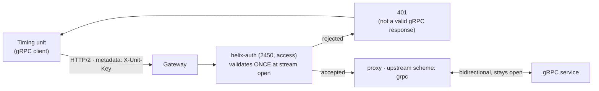

# Architecture — policy at stream initiation

> [Overview](README.md) · [Business need](business-need.md) · **Architecture** · [Guides](guides.md) · [Agent prompt](helix-agent-prompt.md) · [Tests](tests.md) · [API reference](api-reference.md)

---

## What the gateway does here

The gateway accepts the client's HTTP/2 connection, checks its key as the stream
opens, and proxies the stream on to your service over gRPC. The stream stays
two-way for as long as it is open. Your service sees an ordinary gRPC connection
and implements nothing.

For the full list of fields on every plugin mentioned here, see
[docs.digitalapi.ai/api-gateway](https://docs.digitalapi.ai/api-gateway).

## The model

| Word | What it means here |
|---|---|
| **Method path** | What a gRPC client puts on the wire: `/<package>.<Service>/<Method>`, always `POST`. Each route is one. |
| **Unary call** | A one-off request and response, like `Ping`. |
| **Bidirectional stream** | One connection, held open, with messages flowing both ways, like `Status` and `Commands`. |
| **Metadata** | gRPC's headers. They travel as HTTP/2 headers, which is why a header-based key works. |
| **Reflection** | A built-in gRPC service that lets a client ask the server for its schema. |
| **Upstream scheme** | `grpc` (plain) or `grpcs` (TLS) on the upstream object — the setting that makes this a gRPC proxy. |

## How a request flows



## Where the gRPC setting lives

Not in the OpenAPI document — it cannot be. OpenAPI has no way to say "this
upstream speaks gRPC". That lives on the **upstream object** in the control plane:

```
upstream.specification.scheme = grpc | grpcs
```

bound to the revision per environment. The spec contributes the route paths and the
plugins; the upstream contributes the protocol. **Both halves are required.** Import
the spec alone and you get routes that proxy over plain HTTP to a gRPC port, which
fails in a way that looks like a backend problem.

**A scheme change does not reach a deployed revision.** Editing the upstream and
redeploying is not enough — you must **undeploy and deploy again**. Nothing warns
you; the route simply keeps its old behaviour.

## Route paths are gRPC method paths

```yaml
paths:
  /timing.TimingUnit/Ping:      # /<package>.<Service>/<Method>
    post:                        # always POST
```

This is not a convention: it is literally what a gRPC client sends. A path that has
been "tidied" (for example to `/timing/TimingUnit/Ping`) never matches.

## One stream is one request

This is the most important thing to understand before building on it.

The gateway treats an HTTP/2 stream as a single request. Every access-phase plugin
runs **exactly once**, when the stream opens. The log phase runs when the stream
closes. Nothing runs in between.

Three consequences:

1. **Authenticating the connection works**, which is the whole point. There is one
   decision, at the moment the unit connects.
2. **A product quota counts streams, not messages.** One connection carrying a
   million messages uses **one** unit. With a limit of 1, five messages on one
   stream all went through and the *next* stream was rejected. If your commercial
   model assumes per-message metering, it does not work here, and no setting
   changes that.
3. **A credential revoked while a stream is open stays effective until that stream
   ends.** Nothing re-authenticates mid-stream.

## Reflection: route both versions

The gateway only proxies methods you have routed, and reflection is itself a gRPC
method, so it needs routes. **Route both versions:**

```
/grpc.reflection.v1.ServerReflection/ServerReflectionInfo
/grpc.reflection.v1alpha.ServerReflection/ServerReflectionInfo
```

A client asks for `v1` first and falls back to `v1alpha` only if the `v1` call gets
a clean gRPC answer. Route `v1alpha` alone and the `v1` attempt lands on no route,
gets an HTTP 404 that is not valid gRPC, and the client stops there instead of
falling back. Both routes ship in the spec, and both carry the same key check, so
discovering your schema needs a credential.

## What a rejection looks like

Authentication works. The *error* a client sees does not read well:

```
no key    -> HTTP 401, content-type text/plain, {"message":"Missing API key in request"}
bad key   -> HTTP 401, {"message":"Invalid API key in request"}
```

A gateway rejection is an ordinary HTTP response, not a gRPC one, so a client
cannot show it as an authentication failure. Depending on the library it appears as
`Unauthenticated` wrapped in a complaint about the content type, or as an opaque
transport error — either way the caller does not see "your key is missing". The
gateway's logs tell a missing key from an invalid one; the caller cannot.

Tell integrators to check the HTTP status directly when a stream will not open.
That is why this package's two negative tests are plain `curl` calls.

## Plugins on these routes

| Plugin | Priority | Phase | Runs |
|---|---|---|---|
| `helix-auth` (validate · key-auth, key from `X-Unit-Key`) | 2450 | access | **once**, at stream initiation |
| `request-id` | — | API-wide | once per stream |

There is deliberately nothing else. **No plugin that reads or rewrites a body can
sit on these routes** — `response-rewrite`, `xml-to-json`, `request-validation`,
`pgp-crypto` and `mocking` all assume a request that ends, and a stream does not.
There is no CORS block either: a gRPC client is not a browser.

## Idle streams and timeouts

An idle stream is governed by the **route-level `timeout.read`**, and each message
from the upstream starts that timer again. So if your service sends heartbeats, the
interval must be shorter than the read timeout. `connect`, `read` and `send` are
three separate timers, not one budget.

## Measuring connections

Because one stream is one request, the analytics you already run answer both
questions people ask about long-lived connections — **how many, and for how long** —
with no extra configuration:

| Question | Metric | Reads as |
|---|---|---|
| How many connections? | `requests-count` | one row per stream, by `api_path` or `app_name` |
| How long were they open? | `response-time`, aggregation `MAX` | the stream's lifetime in milliseconds |

Against a stream held open for about 25 seconds:

```
requests-count   /timing.TimingUnit/Commands        1
response-time    /timing.TimingUnit/Commands    24235 ms
                 /timing.TimingUnit/Ping            9 ms
```

Grouped by `app_name`, the same traffic showed 26 requests from one app with a
24,521 ms maximum: several streams from one caller add up under their app. The
dimensions are the ones every other API has — `app_name`, `developer`,
`product_name`, `api_path`, `route_name`, `response_status_code`.

A stream's row appears when the stream **closes**, because that is when its
duration is known. For "how many are open right now", a count over a recent window
answers it for every practical purpose. The calls are in
[Guides → See it work](guides.md#see-it-work).

## No custom code needed

Nothing is built. One configured plugin and an upstream do the whole job.

The alternative is what teams do today: put the credential check inside each
streaming service. That gives you mid-stream revocation and message-level rules,
which the gateway genuinely cannot offer. It costs a separate implementation per
service and keeps connections invisible to the platform. The trade favours the
gateway for identity and admission, and the service for anything that must act on
a connection already open.

## When to use this

Use this solution when:

- you run a gRPC service whose clients hold streams open, and it has no
  authentication or each team built its own,
- you want connections counted and attributed per app without changing the
  service, or
- you want clients to discover the schema without being handed `.proto` files.

Do not use it when:

- **you need to meter per message.** Quota counts streams.
- **you must cut off a client mid-stream.** Revocation only reaches the next stream.
- **you need rules that read the messages inside a stream.** The gateway does not
  look inside, and anything that tried would break the stream.
- **you need client-certificate (mTLS) identity.** That is out of scope here.

## Prerequisites

- A gRPC backend reachable from the gateway.
- An upstream with `scheme: grpc` (or `grpcs` for a TLS backend), bound per
  environment.
- HTTP/2 all the way to the gateway, which every gRPC client speaks by default. Run
  `example/verify.sh` and read check 4: a stream that delivers every byte but ends
  without a gRPC status means something on the path is dropping HTTP/2 trailers.
- A product, a developer and an app, so callers have a key to present.
- Nothing on the client side beyond a gRPC client — the reflection routes let it
  discover the schema.

## Failure behaviour

| Situation | What happens |
|---|---|
| No credential | 401 when the stream opens; the upstream is never contacted. Not a valid gRPC response. |
| Invalid credential | 401, same shape. Logs tell it apart from a missing key; the caller cannot. |
| Credential revoked mid-stream | **Nothing.** The open stream continues until it ends. |
| Body-touching plugin on the route | The stream breaks. Do not add one. |
| Upstream scheme changed | No effect until the revision is undeployed and deployed again. |
| Only `v1alpha` reflection routed | Schema discovery fails; the `v1` attempt gets an HTTP 404. |

## What this does not do

- **The spec is half the configuration.** The gRPC upstream is a separate object.
- **Quota counts streams, not messages.**
- **Authentication is checked once**, so revocation does not reach an open stream.
- **Gateway rejections are not valid gRPC responses.**
- **Schema discovery needs both reflection versions routed.**
- **A stream's telemetry lands when it closes**, which is when its duration is
  known.
- **It does not inspect messages** inside a stream.
- **mTLS and client-certificate identity are out of scope.**
