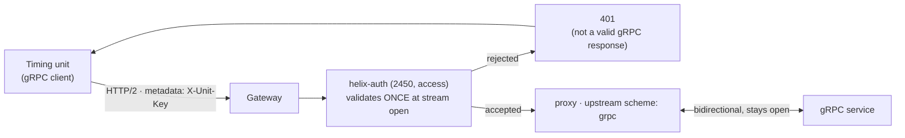

# Solution 15 — A bidirectional gRPC stream, authenticated at the edge

**Overview** · [Business need](business-need.md) · [How it works](how-it-works.md) · [Install](install.md) · [Configuration](configuration.md) · [Test & verify](testing.md) · [Changelog](changelog.md)

---

**Put the gateway in front of a streaming gRPC service and it authenticates every
connection as it opens, without the service implementing auth at all. The stream
stays bidirectional and stays open.**

<!-- facts:begin -->

| | |
|---|---|
| **Setup time** | ~20 minutes |
| **Difficulty** | Intermediate |
| **Needs** | A gRPC backend reachable from the gateway |
| **Plugins** | `helix-auth` · `request-id` |
| **Build it with** | **[the Agent](install.md)** — recommended · or import [`gateway/api-spec.yaml`](gateway/api-spec.yaml) |

<!-- facts:end -->

## What this does

The gateway terminates the client's HTTP/2 connection, authenticates the stream
as it opens, and proxies it to the backend over gRPC. The stream stays
bidirectional throughout. The service sees an ordinary gRPC connection and
implements nothing.

## The problem

A timing unit, a trading feed, a telemetry agent — anything that holds a gRPC
stream open for hours — is a connection your platform cannot see. Authentication,
identity, connection counts and per-caller limits all have to be built into the
service, because nothing in front of it can participate in a stream it does not
understand.

So every team that owns such a service builds its own auth, and every one of them
builds it slightly differently.

## Gotchas

**Route both reflection versions.** A client asks for `grpc.reflection.v1` first
and falls back to `v1alpha` — but only if the v1 attempt gets a clean gRPC
answer. Route v1alpha alone and the v1 call lands on no route, returns an HTTP
404 that is not valid gRPC, and the client stops there instead of falling back.
Both routes ship in the spec for exactly this reason.

**Never put a body-touching plugin on these routes.** `response-rewrite`,
`xml-to-json`, `request-validation`, `pgp-crypto` and `mocking` all assume a
request that ends. A stream does not.

**Unary first when debugging.** `Ping` is the cheapest proof that routing, the
`scheme: grpc` upstream and auth are all correct. Once it returns, anything still
failing is specific to streaming.

## Limitations

- **The spec is half the configuration** — the gRPC upstream is a separate object.
- **Quota counts streams, not messages.**
- **Auth is evaluated once**, so revocation does not reach an open stream.
- **Gateway rejections are not valid gRPC responses.**
- **Route reflection explicitly** if you want clients to discover the schema —
  both versions.
- **A stream's telemetry lands when it closes**, which is when its duration is
  known.

Full list: [`solution.yaml`](solution.yaml) § `limitations`.

## Validation status

- **Locally validated** — structure, plugin fields against the live schema, route
  paths, both reflection versions, and the absence of body-touching plugins. See
  [`validation/local-validation.yaml`](validation/local-validation.yaml).
- **Gateway dry-run passed** — the spec imports and dry-runs clean.
- **Gateway deployed** — deployed ACTIVE against a real bidirectional gRPC service.
- **Functional test passed** — `gateway/verify.sh` **6/6**: unauthenticated and
  invalid credentials refused at stream initiation, an authenticated unary call,
  an authenticated bidirectional stream, a held-open stream that closes cleanly,
  and reflection resolving with no descriptor file. Verified on two environments.
- **Connection telemetry confirmed** — `requests-count` returned one row per
  stream and `response-time` returned 24,235 ms for a stream held open ~25s,
  grouped by method and by app. See
  [`validation/gateway-validation.yaml`](validation/gateway-validation.yaml).
